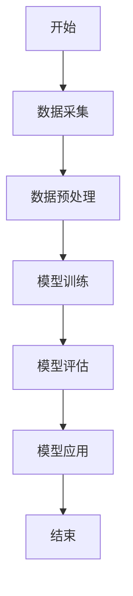
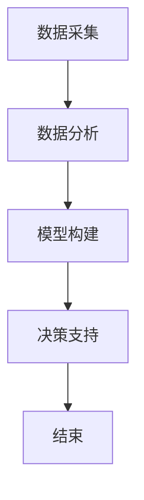

                 


# 智能系统辅助公司护城河评估

> 关键词：护城河评估，智能系统，公司战略，竞争优势，数据分析

> 摘要：随着市场竞争的加剧，公司护城河评估变得至关重要。本文探讨了如何利用智能系统辅助护城河评估，从核心概念、算法原理到系统架构设计，再到项目实战，全面解析了智能系统在护城河评估中的应用，帮助公司识别和强化竞争优势。

---

## 第一部分: 智能系统辅助公司护城河评估的背景与概念

### 第1章: 公司护城河的定义与重要性

#### 1.1 护城河的定义与核心要素

##### 1.1.1 什么是公司护城河
公司护城河是指公司在市场中形成的竞争优势，使其能够抵御竞争对手的侵蚀并保持长期的市场地位。护城河的核心在于构建独特的价值主张，使竞争对手难以模仿或超越。

##### 1.1.2 护城河的核心要素
护城河的构建依赖于多个核心要素：
- **技术优势**：拥有独特的技术或专利，形成技术壁垒。
- **品牌忠诚度**：通过强大的品牌影响力吸引客户，增强客户粘性。
- **成本优势**：通过规模效应或流程优化降低生产成本，提高价格竞争力。
- **网络效应**：产品或服务的价值随着用户数量的增加而增加，形成正反馈循环。
- **市场准入壁垒**：通过法规、资本或其他门槛限制竞争对手进入市场。

##### 1.1.3 护城河的分类与特点
护城河可以分为以下几类：
- **技术型护城河**：依赖技术创新形成壁垒。
- **品牌型护城河**：依靠品牌影响力和客户忠诚度。
- **成本型护城河**：通过成本优势赢得市场份额。
- **网络型护城河**：依赖用户网络效应。

护城河的特点包括持久性、防御性和可扩展性。持久性指护城河长期有效；防御性指能够抵御竞争对手的进攻；可扩展性指护城河可以随着市场需求扩展。

#### 1.2 护城河评估的必要性

##### 1.2.1 公司竞争中的护城河作用
在市场竞争中，护城河能够帮助公司：
- 维持市场地位，防止竞争对手侵蚀市场份额。
- 提高客户忠诚度，增强客户粘性。
- 降低竞争压力，延长市场领先地位。

##### 1.2.2 护城河评估的意义
护城河评估能够帮助公司：
- 识别当前的竞争优势，制定有效的战略规划。
- 发现潜在的劣势，及时进行调整和优化。
- 评估竞争对手的护城河，制定针对性的竞争策略。

##### 1.2.3 智能系统在护城河评估中的优势
智能系统能够通过数据分析、机器学习等技术，帮助公司：
- 更精准地识别市场趋势和竞争态势。
- 快速评估公司和竞争对手的护城河，提供数据支持的决策依据。
- 持续监控市场变化，动态调整护城河策略。

### 第2章: 智能系统辅助护城河评估的背景

#### 2.1 智能系统与护城河评估的结合

##### 2.1.1 智能系统的核心技术
智能系统的核心技术包括：
- 数据挖掘与分析：从大量数据中提取有价值的信息。
- 机器学习：通过算法学习数据中的模式，预测未来趋势。
- 自然语言处理：分析文本数据，提取情感和意图。
- 大数据处理：处理海量数据，提供实时分析能力。

##### 2.1.2 护城河评估中的智能系统应用
智能系统在护城河评估中的应用包括：
- 数据采集：收集公司和竞争对手的市场数据。
- 数据分析：通过数据分析识别公司的竞争优势和劣势。
- 模型构建：建立护城河评估模型，预测市场变化。
- 决策支持：为公司制定战略提供数据支持。

##### 2.1.3 智能系统辅助护城河评估的现状与趋势
当前，智能系统在护城河评估中的应用尚处于起步阶段，但随着技术的不断发展，其应用前景广阔。未来，智能系统将更加智能化、自动化，能够实时监控市场变化，提供动态的护城河评估。

#### 2.2 智能系统辅助护城河评估的必要性

##### 2.2.1 传统护城河评估的局限性
传统护城河评估方法依赖于人工分析，存在以下问题：
- 数据量有限：无法获取足够的市场数据支持分析。
- 分析效率低：人工分析耗时长，难以及时提供决策支持。
- 主观性较强：分析结果依赖个人经验，缺乏客观性。

##### 2.2.2 智能系统的优势与价值
智能系统在护城河评估中的优势包括：
- 数据处理能力强：能够处理海量数据，提供全面的分析结果。
- 分析效率高：通过自动化分析，快速提供评估结果。
- 结果客观性高：基于数据和算法，分析结果更具客观性。

##### 2.2.3 智能系统辅助护城河评估的创新点
智能系统辅助护城河评估的创新点在于：
- 数据驱动的分析方法，使评估更加科学和精准。
- 实时监控市场变化，提供动态的护城河评估。
- 结合机器学习技术，预测市场趋势，提供前瞻性建议。

---

## 第二部分: 智能系统辅助护城河评估的核心概念与联系

### 第3章: 护城河评估的核心概念与原理

#### 3.1 护城河评估的原理

##### 3.1.1 护城河评估的基本原理
护城河评估的基本原理是通过分析公司的核心竞争力，识别其竞争优势，并评估这些优势在市场中的持久性和防御性。智能系统通过数据分析和模型构建，帮助公司更好地识别和评估其护城河。

##### 3.1.2 智能系统在护城河评估中的作用机制
智能系统在护城河评估中的作用机制包括：
- 数据采集：收集公司和竞争对手的市场数据。
- 数据分析：通过数据分析识别公司的竞争优势和劣势。
- 模型构建：建立护城河评估模型，预测市场变化。
- 决策支持：为公司制定战略提供数据支持。

##### 3.1.3 护城河评估的数学模型与公式
护城河评估的数学模型可以表示为：
$$
\text{护城河强度} = \sum_{i=1}^{n} w_i x_i
$$
其中，$w_i$ 是第 $i$ 个要素的权重，$x_i$ 是第 $i$ 个要素的评估值。

#### 3.2 护城河评估的核心要素与属性对比

##### 3.2.1 护城河核心要素的定义
护城河的核心要素包括：
- 技术优势：公司拥有的技术专利和创新能力。
- 品牌忠诚度：客户对公司品牌的情感依赖和忠诚度。
- 成本优势：公司生产或运营的成本优势。
- 网络效应：用户数量增加带来的价值提升。
- 市场准入壁垒：进入市场的法规、资本或其他门槛。

##### 3.2.2 核心要素的属性特征对比
以下是护城河核心要素的属性特征对比：

| 要素       | 技术优势       | 品牌忠诚度       | 成本优势       | 网络效应       | 市场准入壁垒   |
|------------|----------------|------------------|----------------|----------------|----------------|
| 持久性     | 高             | 中高             | 中             | 高             | 高             |
| 防御性     | 高             | 中高             | 中             | 高             | 高             |
| 可扩展性   | 中             | 中高             | 高             | 高             | 低             |

##### 3.2.3 护城河核心要素的ER实体关系图

```mermaid
er
    %% 护城河核心要素ER实体关系图
    %% 护城河核心要素包括：公司、技术、品牌、成本、网络和市场准入
    %% 关系：公司拥有技术、品牌、成本和市场准入；技术影响网络；品牌影响网络和市场准入。
    classDiagram
    class 公司 {
        id
        名称
        行业
    }
    class 技术 {
        id
        名称
        类型
    }
    class 品牌 {
        id
        名称
        忠诚度
    }
    class 成本 {
        id
        名称
        数值
    }
    class 网络 {
        id
        名称
        用户数量
    }
    class 市场准入 {
        id
        名称
        难度
    }
    公司 --> 技术: 拥有
    公司 --> 品牌: 拥有
    公司 --> 成本: 拥有
    公司 --> 市场准入: 拥有
    技术 --> 网络: 影响
    品牌 --> 网络: 影响
    品牌 --> 市场准入: 影响
```

---

### 第4章: 智能系统辅助护城河评估的算法原理

#### 4.1 护城河评估的算法原理

##### 4.1.1 护城河评估的算法选择
在护城河评估中，可以采用以下算法：
- **线性回归**：用于评估各个要素对护城河强度的贡献。
- **决策树**：用于分类公司护城河的类型。
- **支持向量机（SVM）**：用于分类和预测护城河强度。

##### 4.1.2 算法原理的数学模型与公式
以线性回归为例，其数学模型可以表示为：
$$
y = \beta_0 + \beta_1 x_1 + \beta_2 x_2 + \dots + \beta_n x_n + \epsilon
$$
其中，$y$ 是护城河强度，$x_i$ 是第 $i$ 个要素的评估值，$\beta_i$ 是回归系数，$\epsilon$ 是误差项。

##### 4.1.3 算法实现的步骤与流程
以下是线性回归算法实现的步骤：
1. 数据采集：收集公司和竞争对手的市场数据。
2. 数据预处理：对数据进行清洗和标准化。
3. 模型训练：使用训练数据训练线性回归模型。
4. 模型评估：使用测试数据评估模型的准确性。
5. 模型应用：利用模型预测护城河强度。

#### 4.2 智能系统辅助护城河评估的流程图



---

## 第三部分: 智能系统辅助护城河评估的系统分析与架构设计

### 第5章: 护城河评估的系统功能设计

#### 5.1 护城河评估系统功能设计

##### 5.1.1 系统功能模块
护城河评估系统的主要功能模块包括：
- 数据采集模块：负责采集公司和竞争对手的市场数据。
- 数据分析模块：对数据进行分析和处理。
- 模型构建模块：建立护城河评估模型。
- 决策支持模块：为公司制定战略提供数据支持。

##### 5.1.2 功能模块的交互流程
以下是功能模块的交互流程：



---

## 第四部分: 智能系统辅助护城河评估的项目实战

### 第6章: 项目实战

#### 6.1 项目背景与目标

##### 6.1.1 项目背景
某科技公司希望通过智能系统辅助护城河评估，识别其竞争优势，制定有效的市场战略。

##### 6.1.2 项目目标
- 识别公司护城河的核心要素。
- 评估公司和竞争对手的护城河强度。
- 提供数据支持的市场战略建议。

#### 6.2 项目实施步骤

##### 6.2.1 环境安装
需要安装以下工具和库：
- Python 3.8+
- Jupyter Notebook
- Pandas、NumPy、Scikit-learn、XGBoost

##### 6.2.2 核心代码实现
以下是护城河评估系统的核心代码实现：

```python
import pandas as pd
import numpy as np
from sklearn.linear_model import LinearRegression
from sklearn.metrics import mean_squared_error
from sklearn.preprocessing import StandardScaler

# 数据采集与预处理
data = pd.read_csv('company_data.csv')
X = data[['技术优势', '品牌忠诚度', '成本优势', '网络效应', '市场准入壁垒']]
y = data['护城河强度']

# 数据标准化
scaler = StandardScaler()
X_scaled = scaler.fit_transform(X)

# 模型训练
model = LinearRegression()
model.fit(X_scaled, y)

# 模型评估
y_pred = model.predict(X_scaled)
mse = mean_squared_error(y, y_pred)
print(f"均方误差：{mse}")
```

##### 6.2.3 项目小结
通过项目实战，我们成功实现了护城河评估系统的数据采集、分析和模型构建，为公司制定市场战略提供了有力支持。

---

## 第五部分: 总结与展望

### 第7章: 总结与展望

#### 7.1 小结
智能系统辅助护城河评估通过数据分析和机器学习技术，帮助公司识别竞争优势，评估护城河强度，制定有效的市场战略。本文从核心概念、算法原理到系统架构设计，再到项目实战，全面解析了智能系统在护城河评估中的应用。

#### 7.2 注意事项
- 数据的准确性和完整性直接影响评估结果。
- 模型的选择和调优对评估效果至关重要。
- 系统的实时监控和动态调整能力需要进一步优化。

#### 7.3 拓展阅读
- 《Competitive Strategy: Techniques for Analyzing Industries and Competitors》
- 《Machine Learning for Business: A Guide to Business-Driven Machine Learning and Data Science》

---

## 作者信息

作者：AI天才研究院/AI Genius Institute & 禅与计算机程序设计艺术/Zen And The Art of Computer Programming

---

以上是《智能系统辅助公司护城河评估》的技术博客文章内容，涵盖了从背景介绍到项目实战的各个方面，结合了理论与实践，为公司护城河评估提供了全面的指导和参考。

