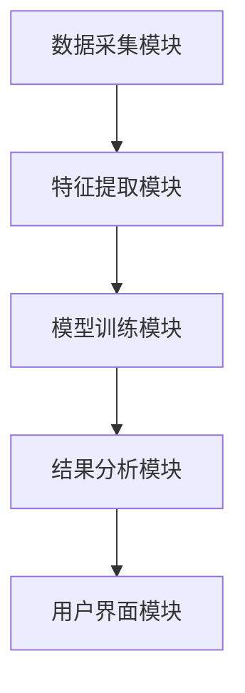
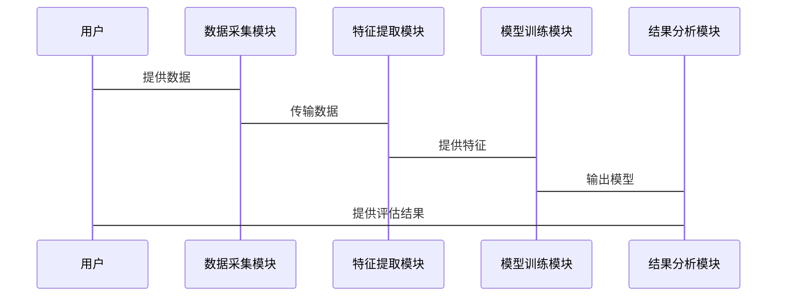

                 


# 《智能系统辅助公司文化影响评估》

## 关键词：智能系统、公司文化、影响评估、机器学习、系统架构

## 摘要：  
本文探讨了智能系统如何辅助公司文化影响评估，结合技术原理和实际应用，分析了文化评估的核心要素、智能系统的算法原理及系统架构设计，提供了具体的实战案例和优化建议。

---

## 目录大纲

### 第4章: 系统分析与架构设计

#### 4.1 系统分析与功能设计
- 4.1.1 系统目标与范围
- 4.1.2 核心功能模块（数据采集、特征提取、模型训练、结果分析）
- 4.1.3 功能需求分析与设计

#### 4.2 系统架构设计
- 4.2.1 模块化架构设计
- 4.2.2 系统架构图（Mermaid）


#### 4.3 接口设计与交互流程
- 4.3.1 接口设计
- 4.3.2 交互流程图（Mermaid）


#### 4.4 本章小结

---

### 第5章: 项目实战与案例分析

#### 5.1 项目背景与目标
- 5.1.1 项目背景
- 5.1.2 项目目标
- 5.1.3 数据来源与预处理

#### 5.2 项目实现
- 5.2.1 环境搭建与工具安装
  - Python 3.8+
  - Scikit-learn、Pandas、Numpy
  - Jupyter Notebook

- 5.2.2 核心代码实现
```python
import pandas as pd
from sklearn.model_selection import train_test_split
from sklearn.linear_model import LinearRegression
from sklearn.metrics import mean_squared_error

# 数据加载与预处理
data = pd.read_csv('company_culture.csv')
X = data.drop('culture_score', axis=1)
y = data['culture_score']

# 数据分割
X_train, X_test, y_train, y_test = train_test_split(X, y, test_size=0.2, random_state=42)

# 模型训练
model = LinearRegression()
model.fit(X_train, y_train)

# 模型评估
y_pred = model.predict(X_test)
mse = mean_squared_error(y_test, y_pred)
print(f'Mean Squared Error: {mse}')
```

- 5.2.3 代码实现与解读

#### 5.3 案例分析与结果解读
- 案例背景
- 数据分析与结果展示
- 结果解读与优化建议

#### 5.4 本章小结

---

### 第6章: 总结与展望

#### 6.1 核心内容总结
- 智能系统辅助公司文化影响评估的核心概念
- 算法原理与系统架构设计
- 项目实战与优化建议

#### 6.2 优化建议与未来展望
- 技术优化方向
- 数据来源与模型优化
- 应用场景扩展

#### 6.3 小结与注意事项
- 注意事项与实施建议
- 未来研究方向

---

### 第7章: 附录与参考文献

#### 7.1 工具安装与代码实现
- 环境搭建步骤
- 代码实现细节

#### 7.2 参考文献与拓展阅读
- 相关文献推荐
- 进一步阅读资料

---

## 作者：AI天才研究院 & 禅与计算机程序设计艺术

---

通过以上目录大纲和部分章节内容的展示，可以看出本文系统地探讨了智能系统在公司文化影响评估中的应用，结合理论分析与实践案例，为读者提供了全面的技术指导和实践参考。

