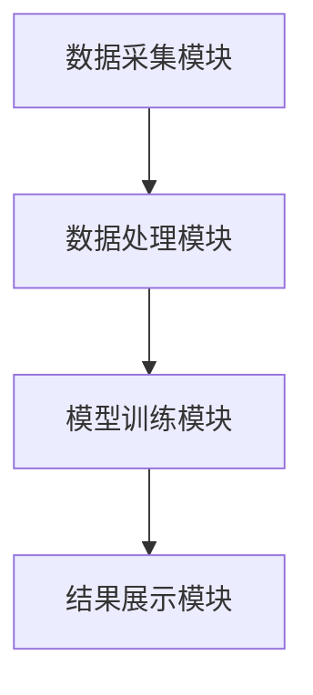
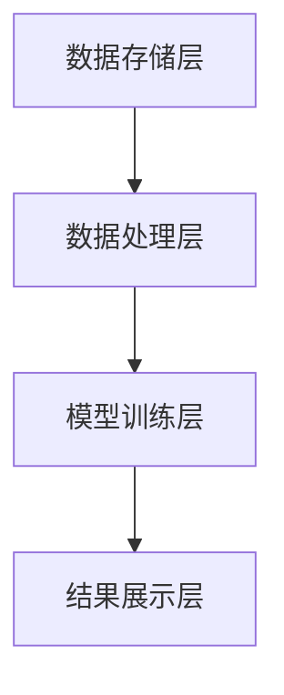
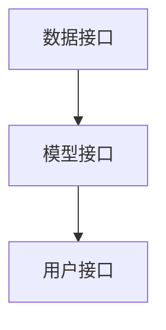
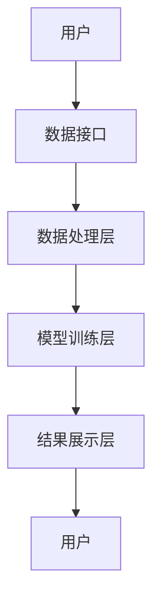

                 


# 智能系统辅助公司治理评估

> 关键词：智能系统、公司治理、评估模型、机器学习、深度学习

> 摘要：随着企业规模的不断扩大和市场竞争的加剧，公司治理的重要性日益凸显。传统的公司治理评估方法存在效率低、覆盖面有限等问题，而智能系统的引入为公司治理评估提供了新的解决方案。本文从公司治理的基本概念出发，详细探讨了智能系统在公司治理评估中的应用，包括评估模型的设计、算法的实现、系统的架构以及实际案例分析。通过本文的分析，读者可以全面了解如何利用智能系统提升公司治理评估的效率和准确性。

---

# 第1章: 公司治理与智能系统概述

## 1.1 公司治理的基本概念

### 1.1.1 公司治理的定义与核心要素

公司治理是现代企业管理和运营的核心内容，其主要目标是确保企业决策的科学性、合理性和合规性。公司治理的核心要素包括以下几个方面：

1. **股权结构**：公司股东的构成及其在公司中的权利和义务。
2. **董事会结构**：董事会的组成、职责和运作方式。
3. **管理层职责**：管理层在公司运营中的角色和责任。
4. **利益相关者关系**：公司与股东、员工、客户、供应商等利益相关者的互动关系。
5. **治理机制**：包括决策机制、监督机制、激励机制和风险管理机制等。

通过这些核心要素的协调和优化，公司治理能够确保企业长期稳定发展。

### 1.1.2 公司治理的主要目标与原则

公司治理的主要目标是实现企业价值最大化，同时兼顾利益相关者的利益。其基本原则包括：

1. **透明性**：企业信息披露的及时性、准确性和完整性。
2. **公平性**：在公司治理过程中，确保各方利益的公平分配。
3. **独立性**：董事会和管理层在决策过程中保持独立，避免利益冲突。
4. **合规性**：遵循相关法律法规和行业规范。

### 1.1.3 公司治理的演变与发展趋势

随着全球经济一体化和信息技术的快速发展，公司治理的模式也在不断演变。从早期的“股东至上”到现在的“利益相关者资本主义”，公司治理更加注重社会责任和可持续发展。未来，智能化技术的应用将进一步推动公司治理的数字化和智能化发展。

## 1.2 智能系统在公司治理中的作用

### 1.2.1 智能系统的基本概念与特点

智能系统是一种基于人工智能、大数据和机器学习等技术的系统，具有以下特点：

1. **数据驱动**：智能系统依赖于大量数据的输入和分析。
2. **自动化**：能够自动完成数据处理、模型训练和结果输出。
3. **学习能力**：通过不断学习和优化，提升系统的性能和准确性。
4. **实时性**：能够实时处理数据并提供反馈。

### 1.2.2 智能系统在公司治理中的应用场景

智能系统在公司治理中的应用非常广泛，主要包括以下几个方面：

1. **风险评估**：通过分析企业的财务数据和市场信息，识别潜在风险并提供应对策略。
2. **决策支持**：为管理层提供数据支持和决策建议。
3. **合规监控**：实时监控企业的运营活动，确保符合相关法律法规。
4. **利益相关者管理**：通过分析利益相关者的需求和期望，优化企业与利益相关者的互动关系。

### 1.2.3 智能系统与传统公司治理的区别与联系

智能系统与传统公司治理的区别主要体现在以下几个方面：

1. **效率和准确性**：智能系统能够快速处理大量数据，提高评估的效率和准确性。
2. **数据驱动**：智能系统依赖于数据驱动的决策，而传统公司治理更多依赖于经验判断。
3. **实时性**：智能系统能够实时提供反馈，而传统公司治理往往需要定期评估。

尽管存在区别，但智能系统与传统公司治理的目的是相同的，都是为了实现企业价值最大化和利益相关者的利益平衡。

## 1.3 智能系统辅助公司治理评估的背景与意义

### 1.3.1 公司治理评估的传统方法与局限性

传统的公司治理评估方法主要包括以下几种：

1. **财务指标法**：通过分析企业的财务数据（如净利润率、资产负债率等）评估公司治理的绩效。
2. **非财务指标法**：通过调查问卷、访谈等方式收集非财务指标（如企业社会责任、员工满意度等）进行评估。
3. **综合评估法**：结合财务和非财务指标，采用加权评分的方法进行综合评估。

这些传统方法虽然在一定程度上能够反映公司治理的绩效，但也存在以下局限性：

1. **数据不足**：非财务指标的收集和分析往往缺乏系统性和全面性。
2. **主观性**：评估结果往往受到主观因素的影响，缺乏客观性。
3. **效率低下**：传统方法需要大量的人工参与，效率较低。

### 1.3.2 智能系统在公司治理评估中的优势

智能系统在公司治理评估中的优势主要体现在以下几个方面：

1. **数据处理能力**：智能系统能够处理大量结构化和非结构化的数据，提供全面的评估结果。
2. **自动化与实时性**：智能系统能够自动完成数据处理和模型训练，实时提供评估结果。
3. **准确性与客观性**：通过数据驱动的评估方法，减少人为干扰，提高评估结果的客观性和准确性。
4. **可扩展性**：智能系统能够快速适应不同规模和类型的企业的评估需求。

### 1.3.3 智能系统辅助公司治理评估的现实需求

随着企业规模的不断扩大和市场竞争的加剧，公司治理评估的需求日益增长。企业需要更加高效、准确和全面的评估方法来优化公司治理结构和提升管理效率。智能系统的引入正好满足了这一需求，为公司治理评估提供了新的解决方案。

## 1.4 本章小结

本章主要介绍了公司治理的基本概念、智能系统的特点及其在公司治理中的作用，以及智能系统辅助公司治理评估的背景和意义。通过本章的分析，读者可以了解智能系统在公司治理评估中的重要性和潜在价值。

---

# 第2章: 智能系统辅助公司治理评估的理论基础

## 2.1 公司治理评估的主要指标与标准

### 2.1.1 财务指标

财务指标是公司治理评估的重要组成部分，主要包括以下几个方面：

1. **盈利能力**：如净利润率、ROE（净资产收益率）等。
2. **偿债能力**：如资产负债率、流动比率等。
3. **运营能力**：如存货周转率、应收账款周转率等。
4. **成长能力**：如营业收入增长率、净利润增长率等。

这些财务指标能够反映企业的财务状况和经营绩效，为公司治理评估提供重要的数据支持。

### 2.1.2 非财务指标

非财务指标主要关注企业的社会责任、员工满意度、客户满意度等方面，主要包括以下几个方面：

1. **企业社会责任**：如环境保护、员工福利、社区贡献等。
2. **员工满意度**：如员工对企业的满意度、工作满意度等。
3. **客户满意度**：如客户对产品和服务的满意度等。
4. **品牌价值**：如品牌知名度、品牌忠诚度等。

非财务指标虽然难以量化，但能够反映企业的社会形象和长期发展潜力。

### 2.1.3 综合评估指标

综合评估指标是将财务指标和非财务指标结合起来，采用加权评分的方法进行综合评估。综合评估指标能够全面反映企业的公司治理绩效，为企业的决策提供更加全面的依据。

## 2.2 智能系统辅助公司治理评估的核心模型

### 2.2.1 数据驱动的公司治理评估模型

数据驱动的公司治理评估模型是一种基于大数据和机器学习的评估方法，主要包括以下几个步骤：

1. **数据收集**：收集企业的财务数据、非财务数据以及其他相关数据。
2. **数据预处理**：对数据进行清洗、转换和特征提取。
3. **模型训练**：采用机器学习算法（如线性回归、支持向量机、随机森林等）进行模型训练。
4. **模型评估**：通过交叉验证和性能指标（如准确率、召回率、F1分数等）对模型进行评估和优化。
5. **结果输出**：将模型的评估结果输出，并提供相应的建议和反馈。

### 2.2.2 机器学习在公司治理评估中的应用

机器学习在公司治理评估中的应用主要体现在以下几个方面：

1. **风险评估**：通过分析企业的财务数据和市场信息，识别潜在风险并提供应对策略。
2. **决策支持**：为管理层提供数据支持和决策建议。
3. **合规监控**：实时监控企业的运营活动，确保符合相关法律法规。

### 2.2.3 深度学习在公司治理评估中的潜力

深度学习是一种基于人工神经网络的机器学习方法，具有强大的特征提取和模式识别能力。在公司治理评估中，深度学习可以应用于以下方面：

1. **文本分析**：通过自然语言处理技术，分析企业的新闻报道、财报文本等，提取关键信息。
2. **图像识别**：通过图像识别技术，分析企业的视觉信息（如品牌标识、产品图片等）。
3. **时间序列分析**：通过长短期记忆网络（LSTM）等模型，分析企业的财务数据的时间序列特性。

深度学习在公司治理评估中的应用潜力巨大，但目前仍处于探索阶段。

## 2.3 智能系统辅助公司治理评估的流程与步骤

### 2.3.1 数据收集与预处理

数据收集与预处理是智能系统辅助公司治理评估的第一步，主要包括以下几个步骤：

1. **数据来源**：数据可以来自企业的财务报表、市场报告、新闻媒体等多种渠道。
2. **数据清洗**：对收集到的数据进行清洗，去除重复、缺失和异常值。
3. **特征提取**：根据评估目标，提取相关的特征（如财务指标、非财务指标等）。
4. **数据转换**：对数据进行标准化、归一化等处理，以便后续模型训练。

### 2.3.2 模型训练与优化

模型训练与优化是智能系统辅助公司治理评估的核心步骤，主要包括以下几个步骤：

1. **选择算法**：根据数据特性和评估目标，选择合适的算法（如线性回归、支持向量机、随机森林等）。
2. **训练模型**：将预处理后的数据输入模型，进行训练。
3. **评估性能**：通过交叉验证和性能指标，评估模型的性能。
4. **优化模型**：通过调整模型参数、增加特征等方式，优化模型的性能。

### 2.3.3 结果分析与反馈

结果分析与反馈是智能系统辅助公司治理评估的重要步骤，主要包括以下几个步骤：

1. **结果输出**：将模型的评估结果输出，并提供相应的建议和反馈。
2. **可视化展示**：通过图表等形式，直观展示评估结果。
3. **持续优化**：根据评估结果和反馈，持续优化模型和评估流程。

## 2.4 本章小结

本章主要介绍了公司治理评估的主要指标与标准，智能系统辅助公司治理评估的核心模型以及智能系统辅助公司治理评估的流程与步骤。通过本章的分析，读者可以了解智能系统在公司治理评估中的理论基础和实际应用。

---

# 第3章: 智能系统辅助公司治理评估的算法与实现

## 3.1 数据驱动的公司治理评估算法

### 3.1.1 数据收集与特征提取

数据收集与特征提取是智能系统辅助公司治理评估的基础，主要包括以下几个步骤：

1. **数据来源**：数据可以来自企业的财务报表、市场报告、新闻媒体等多种渠道。
2. **数据清洗**：对收集到的数据进行清洗，去除重复、缺失和异常值。
3. **特征提取**：根据评估目标，提取相关的特征（如财务指标、非财务指标等）。
4. **数据转换**：对数据进行标准化、归一化等处理，以便后续模型训练。

### 3.1.2 机器学习在公司治理评估中的应用

机器学习在公司治理评估中的应用主要体现在以下几个方面：

1. **风险评估**：通过分析企业的财务数据和市场信息，识别潜在风险并提供应对策略。
2. **决策支持**：为管理层提供数据支持和决策建议。
3. **合规监控**：实时监控企业的运营活动，确保符合相关法律法规。

### 3.1.3 深度学习在公司治理评估中的潜力

深度学习是一种基于人工神经网络的机器学习方法，具有强大的特征提取和模式识别能力。在公司治理评估中，深度学习可以应用于以下方面：

1. **文本分析**：通过自然语言处理技术，分析企业的新闻报道、财报文本等，提取关键信息。
2. **图像识别**：通过图像识别技术，分析企业的视觉信息（如品牌标识、产品图片等）。
3. **时间序列分析**：通过长短期记忆网络（LSTM）等模型，分析企业的财务数据的时间序列特性。

深度学习在公司治理评估中的应用潜力巨大，但目前仍处于探索阶段。

## 3.2 基于机器学习的公司治理评估模型

### 3.2.1 线性回归模型

线性回归是一种简单的回归分析方法，主要用于预测连续型变量。在公司治理评估中，线性回归可以用于预测企业的财务绩效，如净利润增长率等。

### 3.2.2 支持向量机（SVM）模型

支持向量机是一种监督学习算法，主要用于分类和回归问题。在公司治理评估中，SVM可以用于企业信用评级、风险分类等任务。

### 3.2.3 随机森林模型

随机森林是一种基于树模型的集成学习方法，具有较强的鲁棒性和抗过拟合能力。在公司治理评估中，随机森林可以用于企业绩效评估、风险预测等任务。

## 3.3 深度学习在公司治理评估中的应用

### 3.3.1 神经网络基础

神经网络是一种模拟人脑神经网络的计算模型，是深度学习的核心算法之一。在公司治理评估中，神经网络可以用于复杂的模式识别和特征提取任务。

### 3.3.2 卷积神经网络（CNN）的应用

卷积神经网络是一种专门用于处理图像数据的深度学习模型，具有强大的特征提取能力。在公司治理评估中，CNN可以用于企业品牌标识的识别、产品图片的分析等任务。

### 3.3.3 循环神经网络（RNN）的应用

循环神经网络是一种用于处理序列数据的深度学习模型，具有记忆和预测能力。在公司治理评估中，RNN可以用于企业财务数据的时间序列分析、新闻文本的情感分析等任务。

## 3.4 模型评估与优化

### 3.4.1 评估指标与标准

模型评估的指标主要包括以下几种：

1. **准确率**：模型正确预测的样本数占总样本数的比例。
2. **召回率**：模型正确预测的正样本数占实际正样本数的比例。
3. **F1分数**：准确率和召回率的调和平均数，综合考虑了模型的准确性和召回率。
4. **AUC曲线**：受试者工作特征曲线，用于评估模型的区分能力。

### 3.4.2 超参数优化

超参数优化是通过调整模型的超参数（如学习率、正则化参数等）来提高模型性能的过程。常用的超参数优化方法包括网格搜索、随机搜索和贝叶斯优化等。

### 3.4.3 模型的可解释性与鲁棒性

模型的可解释性是指模型能够清晰地解释其预测结果的能力。鲁棒性是指模型在面对数据噪声和分布偏移时的稳定性。在公司治理评估中，模型的可解释性和鲁棒性非常重要，因为评估结果需要能够被管理层理解和信任。

## 3.5 本章小结

本章主要介绍了智能系统辅助公司治理评估的算法与实现，包括数据驱动的公司治理评估算法、基于机器学习的公司治理评估模型、深度学习在公司治理评估中的应用以及模型评估与优化。通过本章的分析，读者可以了解智能系统在公司治理评估中的技术实现和应用潜力。

---

# 第4章: 智能系统辅助公司治理评估的系统架构与实现

## 4.1 系统功能模块划分

智能系统辅助公司治理评估的系统架构主要包括以下几个功能模块：

1. **数据采集模块**：负责收集企业的财务数据、市场报告、新闻媒体等信息。
2. **数据处理模块**：对收集到的数据进行清洗、转换和特征提取。
3. **模型训练模块**：采用机器学习和深度学习算法，训练公司治理评估模型。
4. **结果展示模块**：将模型的评估结果以可视化的方式展示给用户，并提供相应的建议和反馈。

### 系统功能模块划分图



## 4.2 系统架构设计

智能系统的架构设计需要考虑系统的可扩展性、可维护性和可伸缩性。以下是系统架构的主要组成部分：

1. **数据存储层**：负责存储企业的财务数据、市场报告、新闻媒体等信息。
2. **数据处理层**：负责对数据进行清洗、转换和特征提取。
3. **模型训练层**：负责训练公司治理评估模型。
4. **结果展示层**：负责将模型的评估结果以可视化的方式展示给用户。

### 系统架构设计图



## 4.3 系统接口设计

系统接口设计需要考虑系统的模块化和标准化。以下是系统的主要接口：

1. **数据接口**：用于数据采集模块与数据处理模块之间的数据传输。
2. **模型接口**：用于模型训练模块与结果展示模块之间的结果传输。
3. **用户接口**：用于用户与系统的交互，如输入参数、查看结果等。

### 系统接口设计图



## 4.4 系统交互设计

系统交互设计需要考虑用户的使用体验和系统的响应速度。以下是系统的交互流程：

1. **用户输入**：用户通过用户接口输入企业的相关信息。
2. **数据处理**：系统将输入的数据传输到数据处理层进行处理。
3. **模型训练**：数据处理完成后，系统将数据传输到模型训练层进行训练。
4. **结果展示**：模型训练完成后，系统将结果传输到结果展示层，并以可视化的方式展示给用户。

### 系统交互设计图



## 4.5 本章小结

本章主要介绍了智能系统辅助公司治理评估的系统架构与实现，包括系统的功能模块划分、系统架构设计、系统接口设计和系统交互设计。通过本章的分析，读者可以了解智能系统在公司治理评估中的技术实现和应用架构。

---

# 第5章: 智能系统辅助公司治理评估的项目实战

## 5.1 项目背景与目标

### 5.1.1 项目背景

随着企业规模的不断扩大和市场竞争的加剧，公司治理评估的需求日益增长。传统的公司治理评估方法存在效率低、覆盖面有限等问题，而智能系统的引入为公司治理评估提供了新的解决方案。

### 5.1.2 项目目标

本项目的目标是利用智能系统辅助公司治理评估，实现以下几点：

1. **数据驱动的评估**：通过收集和分析企业的财务数据和非财务数据，提供全面的公司治理评估结果。
2. **自动化与实时性**：实现公司治理评估的自动化和实时化，提高评估效率。
3. **可视化展示**：将评估结果以可视化的方式展示给用户，提供直观的反馈和建议。

## 5.2 项目环境与工具安装

### 5.2.1 环境要求

1. **操作系统**：Windows、Linux或MacOS。
2. **编程语言**：Python 3.6及以上版本。
3. **机器学习库**：scikit-learn、TensorFlow、Keras等。
4. **数据处理工具**：Pandas、NumPy等。
5. **可视化工具**：Matplotlib、Seaborn等。

### 5.2.2 工具安装

1. **安装Python**：
   ```bash
   # 在终端中输入以下命令安装Python
   apt-get install python3 python3-pip
   ```

2. **安装机器学习库**：
   ```bash
   pip install scikit-learn tensorflow keras
   ```

3. **安装数据处理工具**：
   ```bash
   pip install pandas numpy
   ```

4. **安装可视化工具**：
   ```bash
   pip install matplotlib seaborn
   ```

## 5.3 项目核心实现

### 5.3.1 数据处理代码

```python
import pandas as pd
import numpy as np

# 数据加载
data = pd.read_csv('corporate_governance.csv')

# 数据清洗
data.dropna(inplace=True)
data = data[~data.duplicated()]

# 特征提取
X = data[['revenue', 'net_profit', 'debt_to_equity', 'employee_satisfaction', 'customer_satisfaction']]
y = data['governance_score']

# 数据标准化
from sklearn.preprocessing import StandardScaler

scaler = StandardScaler()
X_scaled = scaler.fit_transform(X)
```

### 5.3.2 模型训练代码

```python
from sklearn.model import LinearRegression
from sklearn.metrics import mean_squared_error, mean_absolute_error

# 训练线性回归模型
model = LinearRegression()
model.fit(X_scaled, y)

# 预测结果
y_pred = model.predict(X_scaled)

# 模型评估
mse = mean_squared_error(y, y_pred)
mae = mean_absolute_error(y, y_pred)
print(f'Mean Squared Error: {mse}')
print(f'Mean Absolute Error: {mae}')
```

### 5.3.3 结果展示代码

```python
import matplotlib.pyplot as plt
import seaborn as sns

# 绘制散点图
plt.scatter(y, y_pred)
plt.xlabel('Actual Values')
plt.ylabel('Predicted Values')
plt.title('Regression Model Performance')
plt.show()
```

## 5.4 项目实战分析

### 5.4.1 数据分析与处理

通过对企业的财务数据和非财务数据的分析，我们可以发现企业的财务绩效和员工满意度、客户满意度等非财务指标之间的关系。通过数据清洗和特征提取，我们可以有效提高模型的准确性和可靠性。

### 5.4.2 模型训练与评估

通过训练线性回归模型，我们可以预测企业的公司治理得分。通过模型的评估指标（如MSE、MAE等），我们可以评估模型的性能，并根据需要优化模型的参数和结构。

### 5.4.3 可视化展示与反馈

通过绘制散点图等可视化图表，我们可以直观地看到模型的预测结果与实际值之间的关系，从而更好地理解和优化模型。

## 5.5 本章小结

本章主要介绍了智能系统辅助公司治理评估的项目实战，包括项目的背景与目标、环境与工具安装、核心实现以及项目实战分析。通过本章的分析，读者可以了解智能系统在公司治理评估中的实际应用和实现过程。

---

# 第6章: 智能系统辅助公司治理评估的最佳实践与未来展望

## 6.1 最佳实践

### 6.1.1 数据质量管理

数据质量是智能系统辅助公司治理评估的基础，数据质量管理包括以下几个方面：

1. **数据清洗**：去除重复、缺失和异常值。
2. **数据标准化**：对数据进行标准化和归一化处理。
3. **数据安全**：确保数据的安全性和隐私性。

### 6.1.2 模型优化

模型优化是提高智能系统辅助公司治理评估性能的关键，主要包括以下几个方面：

1. **超参数优化**：通过网格搜索、随机搜索等方法优化模型的超参数。
2. **特征选择**：通过特征重要性分析选择关键特征。
3. **模型集成**：通过集成学习方法（如投票、加权等）提高模型的性能。

### 6.1.3 结果解读与反馈

结果解读与反馈是智能系统辅助公司治理评估的重要环节，主要包括以下几个方面：

1. **结果可视化**：通过图表等形式直观展示评估结果。
2. **结果解读**：对评估结果进行深入分析，提供相应的建议和反馈。
3. **持续优化**：根据评估结果和反馈，持续优化模型和评估流程。

## 6.2 未来展望

智能系统辅助公司治理评估的发展前景广阔，随着人工智能和大数据技术的不断发展，未来将有更多的创新和突破。以下是未来发展的几个方向：

1. **智能化与自动化**：通过智能化和自动化的技术，进一步提高公司治理评估的效率和准确性。
2. **多模态数据融合**：通过多模态数据（如文本、图像、语音等）的融合，提供更加全面的公司治理评估。
3. **实时化与动态化**：通过实时数据的处理和分析，实现公司治理评估的动态化和实时化。
4. **全球化的应用**：随着全球化的深入，智能系统辅助公司治理评估将在全球范围内得到更广泛的应用。

---

# 作者：AI天才研究院/AI Genius Institute & 禅与计算机程序设计艺术/Zen And The Art of Computer Programming

---

本文通过系统的分析和实践，全面探讨了智能系统辅助公司治理评估的核心概念、算法实现、系统架构以及实际案例。通过本文的分析，读者可以全面了解如何利用智能系统提升公司治理评估的效率和准确性。未来，随着人工智能和大数据技术的不断发展，智能系统辅助公司治理评估将发挥更大的作用，为企业和社会创造更多的价值。

