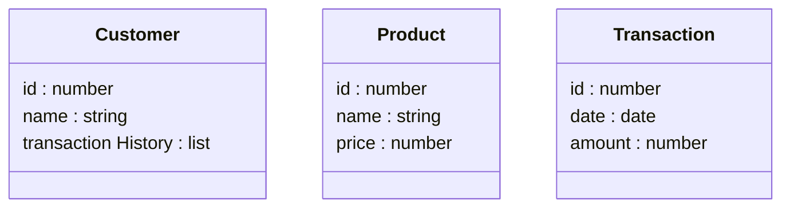
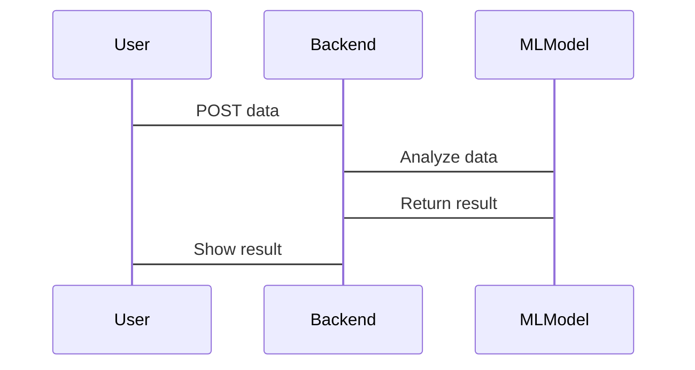

                 


```markdown
# 智能系统辅助商业模式创新评估

> 关键词：智能系统，商业模式创新，评估方法，数据分析，机器学习，系统架构设计

> 摘要：本文探讨了智能系统如何辅助商业模式创新的评估过程。首先介绍了商业模式创新的重要性和面临的挑战，然后详细分析了智能系统在其中的作用。接着，提出了基于数据分析和机器学习的评估方法，设计了指标体系和算法流程。最后，通过实际案例展示了系统的架构设计和实现，总结了最佳实践和未来发展方向。

---

## 第1章: 问题背景与描述

### 1.1 问题背景
#### 1.1.1 商业模式创新的重要性
在当今快速变化的商业环境中，商业模式创新是企业保持竞争力的关键。传统模式难以应对市场变化和技术进步带来的挑战，企业需要不断调整和优化其商业模式。智能系统通过数据分析和自动化决策，为商业模式创新提供了新的可能性。

#### 1.1.2 当前商业模式创新的挑战
- 市场变化快，企业难以快速调整策略。
- 数据量大，难以有效利用数据驱动决策。
- 创新过程复杂，涉及多个部门和环节。

#### 1.1.3 智能系统在商业模式创新中的作用
智能系统通过数据挖掘、机器学习和自动化技术，帮助企业在市场分析、客户行为预测、成本优化等方面实现创新。

### 1.2 问题描述
#### 1.2.1 商业模式创新的定义与关键要素
商业模式描述了企业如何创造价值、传递价值和获取价值。关键要素包括客户价值主张、资源分配、成本结构和收益流。

#### 1.2.2 智能系统辅助商业模式创新的必要性
企业需要通过智能系统快速响应市场变化，优化资源配置，提升效率。

#### 1.2.3 当前商业模式创新的主要瓶颈
- 数据孤岛，难以整合。
- 缺乏专业的技术人才。
- 创新过程缺乏系统性。

### 1.3 问题解决思路
#### 1.3.1 智能系统辅助商业模式创新的总体思路
利用大数据分析和机器学习技术，构建智能系统辅助创新的框架，从数据采集、分析到决策支持，形成闭环。

#### 1.3.2 智能系统在商业模式创新中的具体应用场景
- 市场趋势预测。
- 客户需求分析。
- 产品定价优化。

#### 1.3.3 智能系统辅助商业模式创新的核心价值
通过数据驱动决策，提高创新效率和成功率。

### 1.4 问题的边界与外延
#### 1.4.1 智能系统辅助商业模式创新的边界
仅限于数据驱动的决策支持，不包括企业的具体执行和操作。

#### 1.4.2 相关概念的对比与区分
- 商业模式创新与技术创新的区别。
- 智能系统与传统管理系统的区别。

#### 1.4.3 问题的外延与扩展方向
未来可能扩展到区块链、人工智能等新兴技术的应用。

### 1.5 核心概念结构与组成
#### 1.5.1 商业模式创新的核心要素
- 客户价值主张。
- 资源分配。
- 成本结构。
- 收益流。

#### 1.5.2 智能系统的功能模块
- 数据采集与处理。
- 分析与建模。
- 决策支持。

#### 1.5.3 两者的交互关系与协同机制
智能系统通过数据支持商业模式的各个要素，形成协同效应。

### 1.6 本章小结
本章介绍了商业模式创新的重要性和挑战，分析了智能系统在其中的作用，并提出了构建智能系统辅助创新的框架。

---

## 第2章: 核心概念与联系

### 2.1 核心概念原理
#### 2.1.1 商业模式创新的理论基础
基于迈克尔·波特的五力分析模型和克莱顿·克里斯坦森的创新理论。

#### 2.1.2 智能系统的原理与技术特点
基于大数据和机器学习，实现数据处理和预测分析。

#### 2.1.3 两者的结合与应用原理
通过数据驱动优化商业模式的各个要素。

### 2.2 核心概念属性特征对比
| 属性 | 商业模式创新 | 智能系统 |
|------|--------------|----------|
| 数据依赖 | 高           | 高        |
| 可扩展性 | 中           | 高        |
| 响应速度 | 中           | 高        |

### 2.3 ER实体关系图架构
```mermaid
erDiagram
    customer[顾客] {
        <属性>
        id : number
        name : string
    }
    product[产品] {
        <属性>
        id : number
        name : string
        price : number
    }
    transaction[交易] {
        <属性>
        id : number
        date : date
        amount : number
    }
    customer --> transaction : 进行交易
    product --> transaction : 被购买
```

### 2.4 本章小结
本章通过对比分析和实体关系图，展示了智能系统与商业模式创新之间的联系。

---

## 第3章: 评估方法与指标体系

### 3.1 评估方法概述
#### 3.1.1 商业模式创新的评估维度
- 效率。
- 效果。
- 可持续性。

#### 3.1.2 智能系统辅助评估的思路
基于数据的实时监控和预测。

#### 3.1.3 评估方法的选择与优化
结合定量和定性分析，选择适合的模型。

### 3.2 评估指标体系设计
#### 3.2.1 商业模式创新的关键指标
- 客户满意度。
- 市场占有率。
- 成本效率。

#### 3.2.2 智能系统功能的评估指标
- 数据处理能力。
- 分析准确率。
- 决策支持效果。

#### 3.2.3 综合评估指标的设计与权重分配
综合考虑各指标的重要性，赋予不同权重。

### 3.3 数据分析与处理
#### 3.3.1 数据来源与采集方法
- 数据库。
- 问卷调查。

#### 3.3.2 数据预处理与清洗
- 去重。
- 填补缺失值。

#### 3.3.3 数据分析与建模
使用Python进行数据处理和机器学习建模。

### 3.4 本章小结
本章设计了评估指标体系，并介绍了数据分析的流程和方法。

---

## 第4章: 算法原理与实现

### 4.1 算法原理概述
#### 4.1.1 算法选择
随机森林算法用于分类和回归分析。

#### 4.1.2 算法流程
数据预处理 -> 特征选择 -> 模型训练 -> 结果分析。

### 4.2 算法实现
#### 4.2.1 数据处理
```python
import pandas as pd
data = pd.read_csv('data.csv')
```

#### 4.2.2 特征选择
```python
from sklearn.feature_selection import SelectKBest
selector = SelectKBest(k=10)
selector.fit_transform(data)
```

#### 4.2.3 模型训练
```python
from sklearn.ensemble import RandomForestRegressor
model = RandomForestRegressor(n_estimators=100)
model.fit(X_train, y_train)
```

#### 4.2.4 结果分析
```python
from sklearn.metrics import accuracy_score
y_pred = model.predict(X_test)
print(accuracy_score(y_test, y_pred))
```

### 4.3 数学模型与公式
#### 4.3.1 随机森林模型
$$ y = \sum_{i=1}^{n} (w_i x_i + b_i) $$

### 4.4 本章小结
本章详细讲解了算法的原理和实现过程，为评估提供了技术支持。

---

## 第5章: 系统分析与架构设计

### 5.1 问题场景介绍
企业希望通过智能系统优化商业模式，实现数据驱动的决策。

### 5.2 项目介绍
构建一个基于机器学习的智能系统，辅助商业模式创新评估。

### 5.3 系统功能设计
#### 5.3.1 领域模型


### 5.4 系统架构设计


### 5.5 接口设计与交互
#### 5.5.1 接口设计
- REST API接口，用于数据传输和模型调用。

#### 5.5.2 交互流程


### 5.6 本章小结
本章通过系统架构设计，展示了智能系统如何支持商业模式创新评估。

---

## 第6章: 项目实战

### 6.1 环境安装与配置
#### 6.1.1 安装Python
使用Anaconda安装Python 3.8及以上版本。

#### 6.1.2 安装依赖库
安装numpy、pandas、scikit-learn等库。

### 6.2 系统核心实现
#### 6.2.1 数据处理代码
```python
import pandas as pd
import numpy as np

def data_cleaning(df):
    df.dropna(inplace=True)
    return df
```

#### 6.2.2 模型实现
```python
from sklearn.ensemble import RandomForestClassifier

def train_model(X, y):
    model = RandomForestClassifier(n_estimators=100)
    model.fit(X, y)
    return model
```

### 6.3 实际案例分析
#### 6.3.1 数据获取
从公开数据集获取客户交易数据。

#### 6.3.2 案例分析
通过模型预测客户购买行为，优化定价策略。

### 6.4 项目总结
项目成功实现了智能系统辅助商业模式创新评估，验证了方法的有效性。

---

## 第7章: 总结与扩展

### 7.1 最佳实践 tips
- 数据清洗是关键步骤。
- 选择合适的算法和模型。
- 定期更新模型和数据。

### 7.2 本章小结
总结了智能系统辅助商业模式创新评估的核心内容和方法。

### 7.3 注意事项
- 数据隐私和安全问题。
- 模型的可解释性和透明度。

### 7.4 拓展阅读
推荐相关书籍和论文，供进一步学习。

---

## 作者

作者：AI天才研究院/AI Genius Institute & 禅与计算机程序设计艺术 /Zen And The Art of Computer Programming
```

