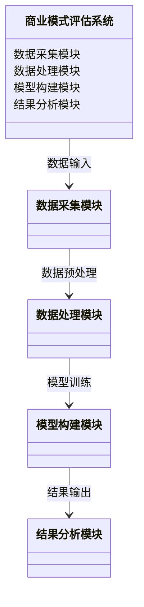

                 


# 智能系统辅助商业模式评估

> 关键词：智能系统、商业模式评估、人工智能、数据分析、算法原理、系统架构

> 摘要：随着数字化转型的加速，商业模式评估在企业决策中的重要性日益凸显。传统的商业模式评估方法依赖于人工分析，效率低下且容易受主观因素影响。智能系统通过整合大数据分析和机器学习算法，能够高效、准确地辅助商业模式评估。本文将详细探讨智能系统在商业模式评估中的应用，涵盖核心概念、算法原理、系统架构设计以及实际案例分析，旨在为企业提供科学的决策支持。

---

# 第1章: 智能系统辅助商业模式评估的背景与意义

## 1.1 问题背景与描述
### 1.1.1 商业模式评估的重要性
商业模式是企业生存和发展的核心，决定了企业的价值创造、传递和获取方式。传统的商业模式评估方法依赖于经验和主观判断，存在以下问题：
- 数据量大，人工分析效率低。
- 评估结果受主观因素影响，缺乏客观性。
- 竞争环境变化快，需要实时调整评估策略。

### 1.1.2 智能系统在商业模式评估中的作用
智能系统通过数据驱动和算法优化，能够高效解决上述问题。其主要作用包括：
- 自动化数据采集与处理，提高评估效率。
- 基于机器学习的预测模型，提供科学决策支持。
- 实时监控市场变化，动态优化商业模式。

## 1.2 问题解决方法
### 1.2.1 数据驱动的评估方法
- 数据采集：通过爬虫、API接口等方式获取市场数据、用户行为数据等。
- 数据预处理：清洗、标准化、特征提取。
- 数据分析：使用统计分析和机器学习算法对数据进行建模和预测。

### 1.2.2 算法优化策略
- 使用分类算法（如决策树、随机森林）进行商业模式分类。
- 使用回归算法（如线性回归、神经网络）预测商业模式的财务表现。
- 使用聚类算法（如K-means）发现市场中的潜在机会。

### 1.2.3 系统化评估框架
- 构建商业模式评估指标体系。
- 设计评估流程，确保数据输入、处理、分析和输出的闭环。

## 1.3 概念结构与核心要素
### 1.3.1 商业模式的核心要素
- 价值主张：企业提供的产品或服务的核心价值。
- 客户关系：企业与客户之间的互动方式。
- 渠道通路：产品或服务的分销渠道。
- 核心资源：企业运营所需的关键资源。
- 关键活动：企业为实现价值主张所需的关键活动。
- 关键合作伙伴：企业生态系统中的合作伙伴。

### 1.3.2 智能系统的核心要素
- 数据采集模块：负责数据的获取与预处理。
- 模型构建模块：基于机器学习算法构建评估模型。
- 结果分析模块：对模型输出进行解读和优化建议。

---

# 第2章: 商业模式评估的核心概念与联系

## 2.1 核心概念的原理与属性
### 2.1.1 价值主张
- 价值主张是商业模式的核心，决定了企业的市场定位。
- 智能系统通过分析市场数据，帮助企业发现潜在的市场机会和用户需求。

### 2.1.2 客户关系
- 客户关系是商业模式的重要组成部分，决定了企业的客户满意度和忠诚度。
- 智能系统可以通过用户行为分析，优化客户关系管理。

### 2.1.3 渠道通路
- 渠道通路是产品或服务到达客户的路径。
- 智能系统可以通过数据分析，优化渠道选择和管理。

## 2.2 核心概念的联系
### 2.2.1 价值主张与客户关系的关系
- 价值主张决定了客户关系的类型和强度。
- 智能系统可以通过分析客户反馈，优化价值主张以满足客户需求。

### 2.2.2 渠道通路与核心资源的关系
- 渠道通路的选择依赖于企业的核心资源。
- 智能系统可以通过数据分析，帮助企业选择最优的渠道通路。

### 2.2.3 关键活动与关键合作伙伴的关系
- 关键活动是商业模式的核心，决定了企业的竞争优势。
- 关键合作伙伴是商业模式的外部支持，共同实现商业模式的价值。

## 2.3 ER实体关系图
```mermaid
er
    actor(用户)
    actor(系统)
    actor(数据源)
    actor(评估结果)
    user --> system: 输入数据
    system --> data_source: 数据采集
    system --> system: 数据处理
    system --> system: 模型计算
    system --> result: 输出结果
```

---

# 第3章: 算法原理与数学模型

## 3.1 算法原理讲解
### 3.1.1 数据预处理
- 数据清洗：去除噪声数据，处理缺失值。
- 数据标准化：将数据归一化，便于模型训练。

### 3.1.2 模型选择
- 分类算法：用于商业模式的分类。
- 回归算法：用于商业模式的财务表现预测。
- 聚类算法：用于发现市场中的潜在机会。

### 3.1.3 模型训练
- 使用机器学习框架（如TensorFlow、PyTorch）进行模型训练。
- 通过交叉验证优化模型参数。

## 3.2 数学模型与公式
### 3.2.1 分类模型
- 使用决策树分类器进行商业模式分类：
$$
\text{分类结果} = \text{决策树模型}(\text{输入特征})
$$

### 3.2.2 回归模型
- 使用线性回归模型预测商业模式的财务表现：
$$
y = \beta_0 + \beta_1x_1 + \beta_2x_2 + \dots + \beta_nx_n
$$

### 3.2.3 聚类模型
- 使用K-means算法进行商业模式聚类：
$$
\text{聚类中心} = \text{K-means}(\text{输入数据}, k)
$$

---

# 第4章: 系统分析与架构设计

## 4.1 问题场景介绍
### 4.1.1 企业需求分析
- 企业需要实时评估商业模式的可行性。
- 企业需要动态调整商业模式以适应市场变化。

## 4.2 系统功能设计
### 4.2.1 领域模型


### 4.2.2 系统架构


---

# 第5章: 项目实战与案例分析

## 5.1 环境安装
### 5.1.1 安装Python
- 使用Anaconda安装Python 3.8以上版本。

### 5.1.2 安装机器学习库
- 安装scikit-learn、TensorFlow、Pandas等库。

## 5.2 核心代码实现
### 5.2.1 数据预处理代码
```python
import pandas as pd
from sklearn.preprocessing import StandardScaler

# 读取数据
data = pd.read_csv('business_model.csv')

# 删除缺失值
data = data.dropna()

# 标准化数据
scaler = StandardScaler()
scaled_data = scaler.fit_transform(data)
```

### 5.2.2 模型训练代码
```python
from sklearn.tree import DecisionTreeClassifier

# 训练分类模型
model = DecisionTreeClassifier()
model.fit(scaled_data, target)
```

## 5.3 案例分析
### 5.3.1 案例背景
- 某公司希望优化其商业模式，提升客户满意度。

### 5.3.2 模型应用
- 使用决策树分类器对商业模式进行分类，发现潜在客户群体。

## 5.4 项目总结
- 通过智能系统辅助商业模式评估，企业能够高效、准确地优化商业模式。
- 智能系统结合大数据分析和机器学习算法，为企业提供科学的决策支持。

---

# 第6章: 最佳实践与拓展阅读

## 6.1 最佳实践
### 6.1.1 数据质量管理
- 确保数据的准确性和完整性。
- 定期更新数据源，保持数据的时效性。

### 6.1.2 模型优化
- 定期重新训练模型，适应市场变化。
- 使用超参数优化技术提升模型性能。

## 6.2 小结
智能系统通过数据驱动和算法优化，能够高效辅助商业模式评估。本文详细探讨了智能系统在商业模式评估中的核心概念、算法原理、系统架构设计以及实际案例分析，为企业提供科学的决策支持。

## 6.3 注意事项
- 数据隐私和安全问题需要高度重视。
- 模型的可解释性是实际应用中的重要考量因素。

## 6.4 拓展阅读
- 推荐阅读《机器学习实战》和《商业模式创新》等书籍。
- 关注人工智能领域的最新研究，提升智能系统的评估能力。

---

作者：AI天才研究院/AI Genius Institute & 禅与计算机程序设计艺术 /Zen And The Art of Computer Programming

