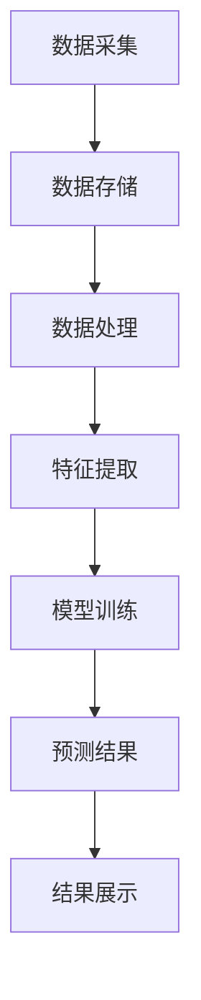

                 


# 智能系统辅助识别隐藏冠军股

> 关键词：智能系统，隐藏冠军股，机器学习，股票预测，数据分析

> 摘要：本文将介绍如何利用智能系统辅助识别隐藏冠军股。通过结合机器学习和深度学习技术，分析股票的市场表现、财务指标和新闻舆情等多维度数据，构建一个智能股票分析系统。系统将帮助投资者识别那些具有潜在增长潜力但尚未被市场充分发现的股票，从而实现超额收益。本文将从隐藏冠军股的定义和特征、智能系统的核心技术、系统架构设计、项目实战和最佳实践等方面展开详细讲解。

---

## 第1章: 智能系统辅助识别隐藏冠军股的背景与核心概念

### 1.1 隐藏冠军股的定义与特征

隐藏冠军股是指那些在某个细分市场中具有强大竞争优势，但尚未被广泛认知的优质股票。这类股票通常具有以下特征：

- **市场地位**：在特定领域内占据领先地位，但市场关注度低。
- **财务健康**：盈利能力强，资产负债率低，现金流稳定。
- **成长潜力**：未来增长空间大，但市场预期较低。
- **估值优势**：市盈率、市净率等估值指标低于行业平均水平。

### 1.2 智能系统的核心技术

智能系统的核心技术包括机器学习、自然语言处理和大数据分析等。以下是主要技术的简要介绍：

#### 1.2.1 机器学习

机器学习是一种人工智能技术，通过训练模型从数据中学习规律，并用于预测或分类。在股票分析中，可以使用监督学习（如随机森林、支持向量机）和无监督学习（如聚类分析）来识别隐藏冠军股。

#### 1.2.2 自然语言处理

自然语言处理（NLP）技术可以分析财经新闻、公司公告等文本数据，提取情感倾向和关键词，帮助识别市场情绪对公司股价的影响。

---

## 第2章: 隐藏冠军股的特征分析

### 2.1 隐藏冠军股的市场表现特征

隐藏冠军股在市场表现上通常具有以下特征：

- **低波动性**：股价波动较小，但长期趋势向上。
- **低关注度**：市场成交量低，但股价稳步增长。
- **反转潜力**：在特定触发因素下，股价可能迅速上涨。

### 2.2 隐藏冠军股的财务指标特征

以下是隐藏冠军股的关键财务指标：

| 财务指标       | 特征描述                                                                 |
|----------------|--------------------------------------------------------------------------|
| 净利润率       | 盈利能力稳定，高于行业平均水平                                           |
| 资产负债率     | 低负债率，财务风险小                                                     |
| 现金流         | 自由现金流充裕，能够支持业务扩展                                       |
| 市盈率（P/E）   | 市盈率低于行业平均水平，具有估值优势                                   |

### 2.3 隐藏冠军股的技术分析特征

技术分析是通过分析股票价格和成交量的变化来预测未来价格走势。以下是隐藏冠军股的技术分析特征：

- **趋势线支撑**：股价在趋势线附近多次反弹，显示支撑力度强。
- **成交量配合**：在股价稳步上升过程中，成交量逐步放大，显示买方力量增强。
- **形态突破**：股价突破长期整理形态（如三角形、矩形），显示潜在上涨动能。

---

## 第3章: 智能系统的核心技术与实现

### 3.1 机器学习算法的选择与实现

#### 3.1.1 算法选择

在股票预测中，常用的机器学习算法包括：

- **线性回归**：用于预测股票价格的线性趋势。
- **支持向量机（SVM）**：用于股票分类（如上涨、下跌）。
- **随机森林**：用于特征重要性分析和预测。

#### 3.1.2 算法实现

以下是使用随机森林算法进行股票分类的Python代码示例：

```python
import pandas as pd
from sklearn.ensemble import RandomForestClassifier
from sklearn.model_selection import train_test_split
from sklearn.metrics import accuracy_score

# 加载数据
data = pd.read_csv('stock_data.csv')

# 特征工程
features = ['open', 'high', 'low', 'close', 'volume']
target = 'label'  # 1表示上涨，0表示下跌

# 划分训练集和测试集
X_train, X_test, y_train, y_test = train_test_split(data[features], data[target], test_size=0.2, random_state=42)

# 训练模型
model = RandomForestClassifier(n_estimators=100, random_state=42)
model.fit(X_train, y_train)

# 预测与评估
y_pred = model.predict(X_test)
print("准确率:", accuracy_score(y_test, y_pred))
```

### 3.2 自然语言处理技术的应用

#### 3.2.1 文本数据获取

使用Twitter API获取财经新闻和市场评论：

```python
import tweepy

# 初始化API客户端
auth = tweepy.OAuthHandler(consumer_key, consumer_secret)
api = tweepy.API(auth)

# 获取tweets
tweets = api.search(q="finance", count=100)

# 提取文本内容
texts = [tweet.text for tweet in tweets]
```

#### 3.2.2 情感分析

使用自然语言处理库（如NLTK）进行情感分析：

```python
import nltk
from nltk.sentiment import SentimentIntensityAnalyzer

analyzer = SentimentIntensityAnalyzer()

# 分析情感倾向
sentiments = []
for text in texts:
    sentiment = analyzer.polarity_scores(text)
    sentiments.append(sentiment['compound'])

# 统计情感倾向分布
import matplotlib.pyplot as plt

plt.hist(sentiments, bins=10)
plt.xlabel('Sentiment Score')
plt.ylabel('Frequency')
plt.show()
```

---

## 第4章: 系统架构设计与实现

### 4.1 系统功能设计

系统功能模块包括：

- **数据采集**：从股票市场API获取实时数据。
- **数据处理**：清洗、转换和特征提取。
- **模型训练**：训练机器学习模型并进行预测。
- **结果展示**：将预测结果可视化并提供投资建议。

### 4.2 系统架构设计

以下是系统架构的Mermaid图：



### 4.3 接口设计与交互流程

系统接口设计：

- **API接口**：提供RESTful API供其他系统调用。
- **交互界面**：用户可以通过Web界面输入参数并查看结果。

---

## 第5章: 项目实战与案例分析

### 5.1 项目环境安装

安装所需的库：

```bash
pip install pandas numpy scikit-learn matplotlib tweepy
```

### 5.2 核心代码实现

以下是核心代码示例：

```python
import pandas as pd
import numpy as np
from sklearn.ensemble import RandomForestClassifier
from sklearn.metrics import accuracy_score
import matplotlib.pyplot as plt

# 加载数据
data = pd.read_csv('stock_data.csv')

# 特征工程
features = ['open', 'high', 'low', 'close', 'volume']
target = 'label'

# 划分训练集和测试集
X_train, X_test, y_train, y_test = train_test_split(data[features], data[target], test_size=0.2, random_state=42)

# 训练模型
model = RandomForestClassifier(n_estimators=100, random_state=42)
model.fit(X_train, y_train)

# 预测与评估
y_pred = model.predict(X_test)
print("准确率:", accuracy_score(y_test, y_pred))

# 特征重要性分析
importances = model.feature_importances_
indices = np.argsort(importances)[::-1]

# 绘制特征重要性图表
plt.figure()
plt.title('Feature Importances')
plt.bar(range(X_train.shape[1]), importances[indices], align='center')
plt.xticks(range(X_train.shape[1]), features[indices], rotation=45)
plt.xlabel('Feature')
plt.ylabel('Importance')
plt.show()
```

### 5.3 案例分析

假设我们有一个包含以下数据的股票数据集：

| 开盘价 | 收盘价 | 最高价 | 最低价 | 成交量 | 标签 |
|-------|-------|--------|--------|--------|------|
| 100   | 105   | 107    | 103    | 1000   | 1    |
| 98    | 95    | 97     | 93     | 800    | 0    |
| 95    | 100   | 98     | 92     | 900    | 1    |

通过上述代码，我们可以训练模型并预测新的股票价格走势。例如，对于以下输入：

| 开盘价 | 收盘价 | 最高价 | 最低价 | 成交量 |
|-------|-------|--------|--------|--------|
| 97    | 99    | 98     | 96     | 950    |

模型预测的标签为1，表示股票价格将上涨。

---

## 第6章: 最佳实践与注意事项

### 6.1 最佳实践

- **数据质量**：确保数据来源可靠，清洗数据以避免偏差。
- **模型选择**：根据具体问题选择合适的算法，避免过度拟合。
- **实时监控**：定期更新模型和数据，确保系统的实时性和准确性。

### 6.2 小结

通过本文的介绍，我们了解了如何利用智能系统辅助识别隐藏冠军股。从数据采集、特征提取到模型训练和结果展示，整个过程需要综合运用机器学习、自然语言处理和大数据分析等技术。

### 6.3 注意事项

- **风险管理**：投资有风险，需谨慎操作。
- **法律合规**：确保数据使用和模型部署符合相关法律法规。

---

## 作者信息

作者：AI天才研究院/AI Genius Institute & 禅与计算机程序设计艺术/Zen And The Art of Computer Programming

---

通过本文的详细讲解，读者可以掌握利用智能系统辅助识别隐藏冠军股的核心技术和实现方法。希望本文对投资者和相关技术人员有所帮助！

