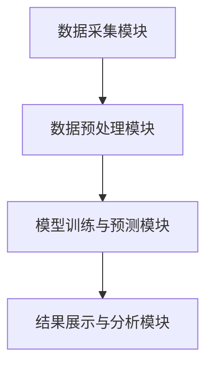
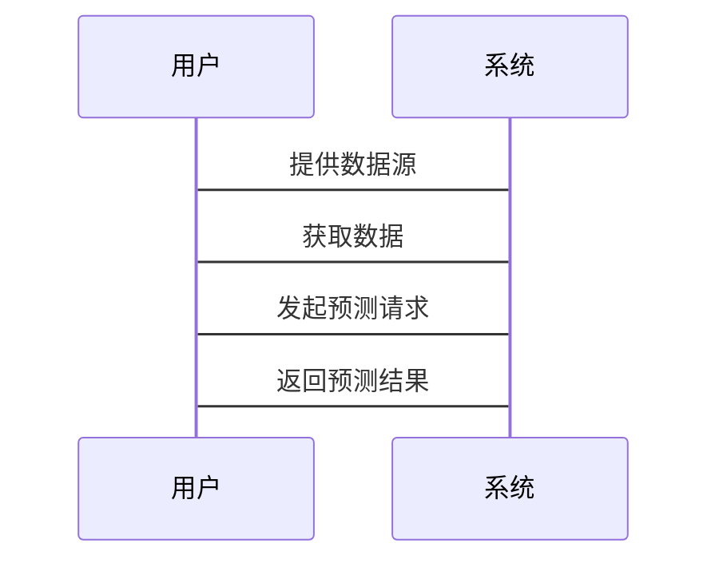

                 


# 智能经济指标预测系统

---

## 关键词  
智能经济预测、机器学习、时间序列分析、深度学习、经济指标预测系统、大数据分析

---

## 摘要  
智能经济指标预测系统是一种基于人工智能技术的经济预测系统，旨在通过大数据分析、机器学习和深度学习等技术手段，实现对经济指标的智能预测。本文将从系统背景、核心概念、算法原理、系统架构到项目实战，全面解析智能经济指标预测系统的构建与实现。通过详细的技术分析和案例解读，帮助读者理解如何利用人工智能技术提升经济预测的准确性和效率。

---

## 第一部分：智能经济指标预测系统概述

### 第1章：智能经济指标预测系统背景与概念

#### 1.1 经济指标预测的背景与意义  
经济指标是反映经济发展状况的重要数据，包括GDP、失业率、通胀率、工业产值等。传统的经济预测方法依赖于统计学和经济学模型，但随着数据量的激增和复杂性增加，传统方法在精度和实时性方面存在局限性。智能经济指标预测系统通过引入人工智能技术，能够更高效地处理海量数据，提高预测的准确性和实时性。  

#### 1.2 智能经济指标预测系统的定义与特点  
智能经济指标预测系统是一种基于人工智能技术的预测系统，通过整合大数据分析、机器学习和深度学习等技术，实现对经济指标的智能预测。其特点包括：  
1. **数据驱动**：基于大量历史数据进行建模和预测。  
2. **实时性**：能够实时获取最新数据并快速生成预测结果。  
3. **高精度**：通过复杂的算法模型提升预测的准确性。  
4. **可扩展性**：支持多种经济指标的预测和多场景应用。  

#### 1.3 系统的核心概念与联系  
智能经济指标预测系统的核心概念包括：  
- **经济指标**：需要预测的具体经济指标，如GDP、通胀率等。  
- **数据源**：包括政府统计数据、金融市场数据、新闻数据等。  
- **模型**：用于预测的算法，如时间序列模型、机器学习模型、深度学习模型等。  
- **预测结果**：模型输出的预测值及其置信度。  

核心概念对比表格：  

| 概念       | 描述                                                                 |
|------------|----------------------------------------------------------------------|
| 经济指标     | 反映经济状况的具体数据，如GDP、失业率等。                             |
| 数据源       | 数据的来源，包括政府统计、金融市场数据、新闻数据等。                 |
| 模型         | 用于预测的算法，如ARIMA、LSTM、随机森林等。                           |
| 预测结果     | 模型输出的预测值及其置信度。                                           |

ER实体关系图（Mermaid流程图）：  
```mermaid
er
actor 经济指标预测系统 {
  id 经济指标预测系统ID
  经济指标 经济指标
  数据源 数据源
  模型 模型
  预测结果 预测结果
}

经济指标预测系统 --> 经济指标: 预测目标  
经济指标预测系统 --> 数据源: 数据输入  
经济指标预测系统 --> 模型: 模型训练  
经济指标预测系统 --> 预测结果: 预测输出
```

---

## 第二部分：智能经济指标预测系统的算法原理

### 第2章：经济指标预测的算法基础

#### 2.1 时间序列分析  
时间序列分析是一种基于历史数据预测未来趋势的方法。常见的模型包括ARIMA（自回归积分滑动平均模型）和LSTM（长短期记忆网络）。  

##### 2.1.1 时间序列的基本概念  
时间序列是指按照时间顺序排列的数据，通常用于分析数据的变化趋势。  

##### 2.1.2 时间序列的分解方法  
时间序列可以分解为趋势、周期性、季节性和平稳性四个部分。  

##### 2.1.3 时间序列模型  
- **ARIMA模型**：适用于线性时间序列数据。  
- **LSTM模型**：适用于非线性时间序列数据。  

LSTM模型的数学公式（嵌入Latex）：  
$$
\text{LSTM}(t) = \text{f}(\text{h}(t-1), \text{x}(t))
$$  
其中，$\text{h}(t-1)$ 是前一时刻的隐藏状态，$\text{x}(t)$ 是当前输入。  

#### 2.2 机器学习算法在经济预测中的应用  
机器学习算法通过学习数据中的模式来预测未来趋势。常用的算法包括线性回归、支持向量机（SVM）和随机森林。  

##### 2.2.1 线性回归模型  
线性回归模型是最简单的回归模型，适用于线性关系的预测。  
$$
y = \beta_0 + \beta_1x + \epsilon
$$  
其中，$\beta_0$ 是截距，$\beta_1$ 是回归系数，$\epsilon$ 是误差项。  

##### 2.2.2 随机森林模型  
随机森林是一种基于决策树的集成学习算法，具有较高的准确性和鲁棒性。  

#### 2.3 深度学习模型  
深度学习模型在处理复杂数据模式方面具有显著优势，常用的模型包括RNN、LSTM和Transformer。  

##### 2.3.1 RNN与LSTM网络  
RNN（循环神经网络）适用于处理序列数据，LSTM（长短期记忆网络）是对RNN的改进，能够更好地捕捉长期依赖关系。  

##### 2.3.2 Transformer模型  
Transformer模型通过自注意力机制，能够捕捉数据中的全局关系。  

---

## 第三部分：系统架构与设计

### 第3章：智能经济指标预测系统的架构设计

#### 3.1 系统功能模块划分  
智能经济指标预测系统的主要功能模块包括：  
1. **数据采集模块**：从多种数据源获取经济数据。  
2. **数据预处理模块**：清洗和转换数据，确保数据质量。  
3. **模型训练与预测模块**：训练模型并生成预测结果。  
4. **结果展示与分析模块**：展示预测结果并提供可视化分析。  

#### 3.2 系统架构设计（Mermaid架构图）  


#### 3.3 系统接口设计  
系统接口设计包括：  
1. **数据接口**：定义数据输入格式和数据源接口。  
2. **模型接口**：定义模型训练和预测的API接口。  
3. **结果接口**：定义结果输出的格式和展示方式。  

#### 3.4 系统交互序列图（Mermaid流程图）  


---

## 第四部分：项目实战与实现

### 第4章：智能经济指标预测系统的实现

#### 4.1 环境搭建与数据准备  
1. **环境搭建**：安装Python、TensorFlow、Pandas、Scikit-learn等库。  
2. **数据准备**：获取经济指标数据集，清洗数据并划分训练集和测试集。  

#### 4.2 系统核心实现  
1. **时间序列预测模型实现**：基于LSTM实现GDP预测。  
2. **机器学习模型实现**：基于随机森林实现通胀率预测。  
3. **深度学习模型实现**：基于Transformer实现 unemployment rate预测。  

#### 4.3 实际案例分析  
以GDP预测为例，详细解读模型训练、调参和预测过程。  

#### 4.4 项目小结  
通过项目实战，验证了智能经济指标预测系统的可行性和有效性。  

---

## 第五部分：最佳实践与总结

### 第5章：最佳实践与总结

#### 5.1 最佳实践 tips  
- 数据预处理是关键，确保数据质量和完整性。  
- 模型选择要结合实际问题和数据特性。  
- 系统部署要考虑计算资源和实时性要求。  

#### 5.2 小结  
智能经济指标预测系统通过人工智能技术，能够显著提高经济预测的准确性和效率。本文详细介绍了系统的构建过程和实现方法，为读者提供了理论和实践的双重指导。  

#### 5.3 注意事项  
- 数据隐私和安全问题需要特别注意。  
- 模型的可解释性和透明度是实际应用中的重要考量。  

#### 5.4 拓展阅读  
- 《时间序列分析与应用》  
- 《深度学习实战》  

---

## 作者  
作者：AI天才研究院 & 禅与计算机程序设计艺术

