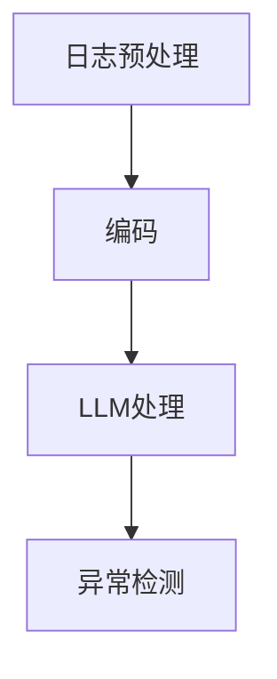
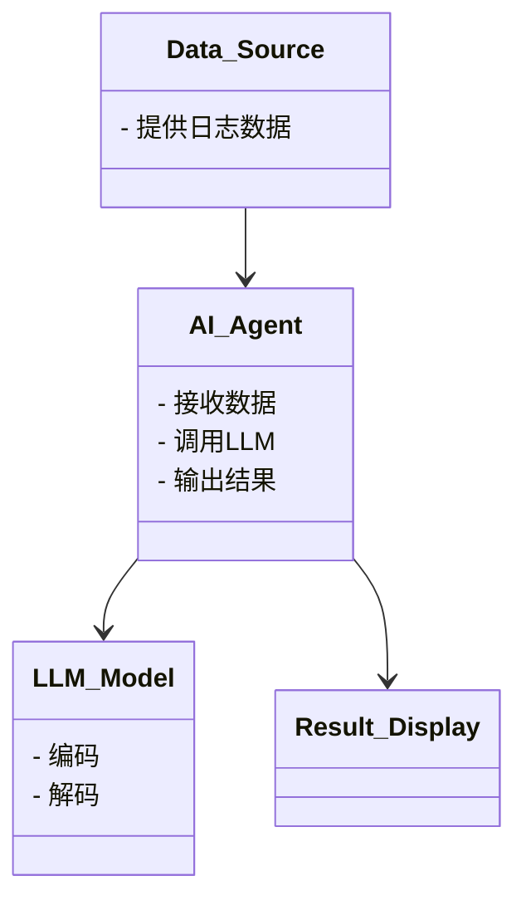

                 


# 智能网络安全分析 AI Agent：LLM 在网络防御中的应用

> 关键词：智能网络安全分析，AI Agent，LLM，网络防御，大语言模型

> 摘要：随着网络安全威胁的日益复杂化和智能化，传统的基于规则的安全分析方法逐渐显现出其局限性。本文探讨了如何利用大语言模型（Large Language Models, LLMs）构建智能网络安全分析 AI Agent，通过自然语言处理和深度学习技术，提升网络防御能力。文章从LLM的基本概念、AI Agent在网络安全中的作用、LLM驱动的AI Agent工作原理、网络安全分析系统的设计与实现等多个方面展开讨论，详细分析了LLM在网络安全中的核心原理、系统架构及实际应用案例。

---

# 第一部分: 智能网络安全分析与LLM概述

## 第1章: 智能网络安全分析的背景与挑战

### 1.1 网络安全的现状与挑战

#### 1.1.1 当前网络安全的主要威胁

网络安全威胁正变得越来越复杂，攻击者利用高级持续性威胁（Advanced Persistent Threats, APT）、零日漏洞（Zero-day Vulnerabilities）和人工智能（AI）驱动的攻击手段，对企业和个人造成巨大损失。传统的基于规则的网络安全分析方法难以应对这些新型威胁，尤其是在处理非结构化数据（如日志、文本）和复杂攻击模式时表现有限。

#### 1.1.2 传统网络安全分析的局限性

- **规则的局限性**：基于规则的检测方法依赖于预定义的规则，难以应对未知威胁和变种攻击。
- **数据类型单一**：传统方法主要依赖结构化数据（如IP地址、端口号），难以处理文本、日志等非结构化数据。
- **效率问题**：面对海量数据，传统方法的处理速度和分析深度有限，容易遗漏关键威胁。

#### 1.1.3 智能化网络安全分析的需求

为了应对日益复杂的威胁，智能化的网络安全分析需求日益迫切。智能化分析需要结合自然语言处理（NLP）、机器学习（ML）和深度学习（DL）等技术，从非结构化数据中提取有价值的信息，并实时检测和预测威胁。

---

### 1.2 大语言模型（LLM）的崛起

#### 1.2.1 LLM的基本概念与特点

大语言模型（LLM）是指经过大量文本数据训练的大型神经网络模型，具有以下特点：
- **大规模训练数据**：通常基于数百万甚至数十亿的文本数据进行训练。
- **深度学习架构**：采用Transformer架构，具备强大的上下文理解和生成能力。
- **多任务通用性**：可以在多种NLP任务（如文本分类、命名实体识别、问答系统等）中表现出色。

#### 1.2.2 LLM在自然语言处理中的优势

- **上下文理解**：LLM能够理解文本的上下文关系，适用于复杂语境下的威胁分析。
- **生成能力**：LLM可以生成符合语境的文本，适用于异常行为的模拟和预测。
- **可扩展性**：LLM可以轻松扩展到新的任务和领域，适应不断变化的网络安全威胁。

#### 1.2.3 LLM在网络安全中的潜在应用

- **威胁情报分析**：通过LLM分析威胁情报报告，提取关键信息并生成威胁描述。
- **异常检测**：利用LLM分析日志数据，识别异常行为模式。
- **漏洞挖掘**：通过LLM生成潜在漏洞的描述并协助验证。

---

## 第2章: AI Agent在网络安全中的作用

### 2.1 AI Agent的基本概念

#### 2.1.1 AI Agent的定义与分类

AI Agent是一种智能体，能够感知环境、执行任务并做出决策。在网络安全领域，AI Agent可以分为以下几类：
- **被动型AI Agent**：根据用户指令执行任务，如日志分析。
- **主动型AI Agent**：能够自主决策，如实时威胁检测和防御。

#### 2.1.2 AI Agent在网络安全中的角色

AI Agent在网络安全中的角色包括：
- **监控与检测**：实时监控网络流量，检测异常行为。
- **威胁分析**：分析威胁情报，预测潜在攻击。
- **响应与修复**：根据检测结果采取相应的防御措施。

#### 2.1.3 AI Agent与传统安全工具的对比

| 特性                | AI Agent                          | 传统安全工具                     |
|---------------------|-----------------------------------|----------------------------------|
| 数据处理能力        | 强大的非结构化数据处理能力        | 以结构化数据为主                  |
| 自主决策能力        | 具备自主决策能力                  | 依赖人工或固定规则               |
| 学习能力            | 可通过反馈不断优化                | 难以自动优化                     |

---

### 2.2 LLM驱动的AI Agent

#### 2.2.1 LLM如何赋能AI Agent

LLM通过以下方式赋能AI Agent：
- **自然语言理解**：LLM能够理解复杂的网络日志和威胁情报。
- **智能决策**：LLM为AI Agent提供决策支持，如异常行为的判断。
- **自适应能力**：LLM能够根据最新的威胁信息不断优化AI Agent的行为。

#### 2.2.2 基于LLM的AI Agent的优势

- **高效性**：LLM能够快速处理大量数据，提升分析效率。
- **准确性**：通过深度学习模型，提高威胁检测的准确性。
- **可扩展性**：LLM可以轻松扩展到新的安全场景。

#### 2.2.3 LLM在AI Agent中的具体应用

- **日志分析**：通过LLM分析网络日志，识别异常行为。
- **威胁情报生成**：利用LLM生成结构化的威胁情报报告。
- **漏洞预测**：基于历史数据，预测潜在的漏洞和攻击。

---

# 第二部分: LLM在网络安全分析中的核心原理

## 第3章: LLM的文本分析原理

### 3.1 LLM的文本处理流程

#### 3.1.1 输入数据的预处理

- **数据清洗**：去除噪声数据，如多余空格、特殊字符。
- **分词**：将文本分割成有意义的片段，如单词或短语。
- **编码**：将文本转换为模型可以处理的向量形式，如词嵌入。

#### 3.1.2 模型的编码与解码过程

1. **编码阶段**：将输入文本转换为上下文表示。
2. **解码阶段**：根据编码结果生成输出文本。

#### 3.1.3 输出结果的后处理

- **解码**：将模型生成的向量转换回人类可读的文本。
- **格式化**：将输出结果格式化为结构化数据，便于后续分析。

### 3.2 LLM在文本分析中的关键算法

#### 3.2.1 注意力机制（Attention）

注意力机制是一种用于模型在处理序列数据时关注重要部分的技术。在LLM中，注意力机制帮助模型聚焦于与当前任务相关的文本部分。

**公式**：
$$
\text{Attention}(Q, K, V) = \text{softmax}\left(\frac{QK^T}{\sqrt{d_k}}\right)V
$$

其中：
- \( Q \) 是查询向量。
- \( K \) 是键向量。
- \( V \) 是值向量。
- \( d_k \) 是键的维度。

#### 3.2.2 解码器中的自适应策略

解码器中的自适应策略通过调整生成策略来优化输出。例如，根据上下文动态调整生成概率。

#### 3.2.3 模型的训练与优化

模型的训练通常采用交叉熵损失函数，并通过反向传播优化参数。

**公式**：
$$
\text{Loss} = -\sum_{i=1}^{n} \text{log}(p(y_i|x))
$$

---

## 第4章: 基于LLM的AI Agent算法原理

### 4.1 基于LLM的异常检测算法

#### 4.1.1 算法概述

该算法通过LLM分析网络日志，识别异常行为。具体步骤如下：

1. **日志预处理**：清洗和分词日志数据。
2. **编码**：将日志转换为向量表示。
3. **异常检测**：通过LLM生成异常日志的描述，并与正常日志进行对比。

#### 4.1.2 算法流程图



---

## 第5章: 网络安全分析系统的设计与实现

### 5.1 项目介绍

本项目旨在开发一个基于LLM的网络安全分析系统，利用AI Agent实时监控和分析网络流量，检测异常行为。

---

## 第6章: 系统架构设计

### 6.1 系统功能设计

系统主要功能包括：
- **数据采集**：采集网络日志和流量数据。
- **特征提取**：提取日志中的关键特征。
- **模型推理**：利用LLM进行威胁分析。
- **结果展示**：将分析结果可视化展示。

### 6.2 系统架构图



---

## 第7章: 项目实战

### 7.1 环境安装

```bash
pip install transformers torch
```

### 7.2 核心实现代码

```python
from transformers import AutoTokenizer, AutoModelForCausalLM

model_name = "gpt2"
tokenizer = AutoTokenizer.from_pretrained(model_name)
model = AutoModelForCausalLM.from_pretrained(model_name)

def preprocess_log(log):
    # 分词和清洗
    return tokenizer(log, return_tensors="np")

def detect_anomaly(processed_log):
    # 调用LLM进行异常检测
    outputs = model.generate(**processed_log, max_length=50)
    return outputs

# 示例
log = "Unusual login attempt from unknown IP"
processed_log = preprocess_log(log)
result = detect_anomaly(processed_log)
print(tokenizer.decode(result.logits[0], skip_special_tokens=True))
```

### 7.3 实际案例分析

通过上述代码，我们可以实现对网络日志的异常检测。例如，检测异常登录行为。

---

## 第8章: 最佳实践与总结

### 8.1 最佳实践

- **数据隐私**：确保处理的数据符合隐私保护法规。
- **模型更新**：定期更新LLM模型以应对新的威胁。
- **可解释性**：提升模型的可解释性，便于调试和优化。

### 8.2 小结

通过本文的探讨，我们了解到LLM在网络安全分析中的巨大潜力。结合AI Agent，LLM能够显著提升网络安全分析的效率和准确性。

---

作者：AI天才研究院/AI Genius Institute & 禅与计算机程序设计艺术 /Zen And The Art of Computer Programming

