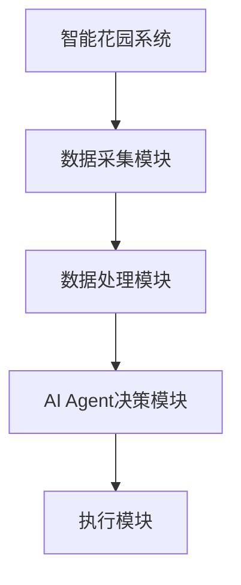

                 


# 智能花园：AI Agent的植物生长优化系统

---

## 关键词：智能花园, AI Agent, 植物生长优化, 物联网, 机器学习, 强化学习

---

## 摘要：  
本文详细介绍了智能花园系统中AI Agent的植物生长优化技术。通过结合AI Agent、物联网和机器学习等技术，本文提出了一个智能化的植物生长优化系统，能够实时监测植物生长环境，分析植物生长数据，并通过AI Agent进行智能决策，优化植物生长条件。文章从背景介绍、核心概念、算法原理、系统架构、项目实战等多个方面展开，为读者提供了一个全面的智能花园系统实现方案。

---

# 第1章: 智能花园与AI Agent的背景介绍

## 1.1 智能花园的概念与背景  
### 1.1.1 智能花园的定义  
智能花园是一种结合了物联网、人工智能和自动化技术的现代园艺系统。它通过传感器、摄像头和其他智能设备实时监测植物的生长环境，并利用AI技术优化植物的生长条件。  

### 1.1.2 AI Agent在智能花园中的作用  
AI Agent（智能代理）是智能花园的核心技术之一。它能够根据植物的生长数据和环境信息，自主决策并执行优化操作，例如调整光照强度、调节温湿度等。  

### 1.1.3 植物生长优化的背景与意义  
随着全球人口增长和资源有限化，优化植物生长条件以提高产量和质量变得尤为重要。AI Agent的引入能够显著提高植物生长效率，减少资源浪费，为农业智能化发展提供新的解决方案。  

## 1.2 智能花园的核心问题与目标  
### 1.2.1 植物生长优化的核心问题  
植物生长受到多种环境因素的影响，例如光照、温度、湿度、土壤酸碱度等。AI Agent需要实时监测这些因素，并根据植物的生长阶段调整优化策略。  

### 1.2.2 智能花园的目标与边界  
智能花园的目标是通过AI Agent实现植物生长的智能化管理，优化生长条件，提高产量和质量。其边界包括环境监测、生长数据采集、AI决策和执行优化操作。  

### 1.2.3 智能花园的系统组成与核心要素  
智能花园系统主要包括以下几个部分：  
1. **环境监测模块**：包括传感器和摄像头，用于采集光照、温度、湿度等数据。  
2. **数据处理模块**：对采集的数据进行清洗、分析和建模。  
3. **AI Agent决策模块**：基于数据和模型进行智能决策，优化生长条件。  
4. **执行模块**：根据决策结果执行优化操作，例如调节光照、喷水等。  

## 1.3 本章小结  
本章介绍了智能花园的定义、AI Agent的作用以及植物生长优化的核心问题和目标。通过分析智能花园的系统组成，为后续章节的深入探讨奠定了基础。

---

# 第2章: AI Agent的核心原理与技术  

## 2.1 AI Agent的基本原理  
### 2.1.1 AI Agent的定义与分类  
AI Agent是一种能够感知环境、自主决策并执行操作的智能系统。它可以分为基于规则的AI Agent和基于学习的AI Agent两类。  

### 2.1.2 AI Agent的核心技术与算法  
AI Agent的核心技术包括：  
1. **感知技术**：通过传感器和摄像头获取环境数据。  
2. **决策算法**：基于数据的机器学习算法和强化学习算法。  
3. **执行机构**：根据决策结果执行操作的机械臂或自动化设备。  

### 2.1.3 AI Agent的决策机制与学习方法  
AI Agent的决策机制可以基于规则、基于知识或基于学习。基于学习的决策机制通常使用强化学习算法，通过与环境的交互不断优化决策策略。  

## 2.2 植物生长优化的核心技术  
### 2.2.1 植物生长监测与数据采集  
植物生长监测需要采集光照、温度、湿度、土壤酸碱度等环境数据，以及植物的生长状态数据（如叶绿素含量、茎干生长速度等）。  

### 2.2.2 植物生长模型的建立与优化  
通过机器学习算法建立植物生长模型，分析环境因素与植物生长之间的关系，优化生长条件。  

### 2.2.3 环境因素对植物生长的影响分析  
不同环境因素对植物生长的影响程度不同，AI Agent需要根据这些影响程度制定优化策略。  

## 2.3 AI Agent与植物生长优化的结合  
### 2.3.1 AI Agent在植物生长监测中的应用  
AI Agent可以通过传感器实时监测植物的生长环境，并通过数据处理模块分析数据。  

### 2.3.2 AI Agent在植物生长优化中的策略  
AI Agent可以根据植物的生长阶段和环境条件，动态调整光照、温湿度等参数，优化植物的生长条件。  

### 2.3.3 AI Agent与植物生长模型的协同优化  
AI Agent与植物生长模型协同工作，通过不断优化模型参数和环境条件，实现植物生长的最优状态。  

## 2.4 本章小结  
本章详细介绍了AI Agent的基本原理和植物生长优化的核心技术，分析了AI Agent在智能花园中的具体应用。通过结合AI Agent与植物生长模型，能够实现植物生长的智能化优化。

---

# 第3章: AI Agent的算法原理  

## 3.1 AI Agent的核心算法  
### 3.1.1 机器学习算法在AI Agent中的应用  
机器学习算法（如支持向量机、随机森林等）可以用于分类和回归任务，帮助AI Agent识别植物的生长状态。  

### 3.1.2 强化学习算法在AI Agent中的应用  
强化学习算法（如Q-Learning、Deep Q-Learning）可以用于AI Agent的决策过程，通过与环境的交互不断优化决策策略。  

### 3.1.3 深度学习算法在AI Agent中的应用  
深度学习算法（如卷积神经网络、循环神经网络）可以用于图像识别和自然语言处理任务，帮助AI Agent更好地理解环境和数据。  

## 3.2 植物生长优化的算法实现  
### 3.2.1 植物生长数据的特征提取与处理  
通过传感器和摄像头获取的植物生长数据需要进行特征提取和处理，以便后续的机器学习和强化学习算法能够更好地处理这些数据。  

### 3.2.2 基于机器学习的植物生长预测模型  
通过机器学习算法建立植物生长预测模型，预测植物的生长趋势，并根据预测结果优化生长条件。  

### 3.2.3 基于强化学习的植物生长优化策略  
通过强化学习算法，AI Agent可以在复杂的环境中动态调整生长条件，实现植物生长的最优状态。  

## 3.3 算法实现的数学模型与公式  
### 3.3.1 机器学习模型的数学表达  
$$ y = f(x) $$  
其中，\( y \) 是输出，\( x \) 是输入特征，\( f \) 是模型函数。  

### 3.3.2 强化学习算法的数学模型  
$$ Q(s, a) = r + \gamma \max Q(s', a') $$  
其中，\( Q(s, a) \) 是状态-动作对的值，\( r \) 是奖励，\( \gamma \) 是折扣因子，\( s' \) 是下一个状态，\( a' \) 是下一个动作。  

### 3.3.3 深度学习模型的数学表达  
$$ y = \sigma(Wx + b) $$  
其中，\( W \) 是权重矩阵，\( b \) 是偏置向量，\( \sigma \) 是激活函数。  

## 3.4 本章小结  
本章详细介绍了AI Agent的核心算法，包括机器学习算法、强化学习算法和深度学习算法，并分析了这些算法在植物生长优化中的具体应用。通过数学模型和公式，帮助读者更好地理解算法的实现原理。

---

# 第4章: 智能花园系统的架构与设计  

## 4.1 系统架构的总体设计  
智能花园系统的总体架构包括以下几个部分：  
1. **数据采集模块**：通过传感器和摄像头采集植物生长环境数据。  
2. **数据处理模块**：对采集的数据进行清洗、分析和建模。  
3. **AI Agent决策模块**：基于数据和模型进行智能决策。  
4. **执行模块**：根据决策结果执行优化操作。  

## 4.2 系统功能模块的详细设计  
### 4.2.1 数据采集模块的设计  
数据采集模块需要集成多种传感器，如光照传感器、温度传感器、湿度传感器等，并通过物联网技术将数据传输到云端。  

### 4.2.2 数据处理模块的设计  
数据处理模块需要对采集的数据进行预处理、特征提取和建模分析，以便AI Agent能够更好地理解和决策。  

### 4.2.3 AI Agent决策模块  
AI Agent决策模块需要结合植物生长模型和环境数据，动态调整生长条件，优化植物生长。  

## 4.3 系统架构图  


## 4.4 本章小结  
本章详细介绍了智能花园系统的架构设计，包括数据采集、数据处理、AI Agent决策和执行模块的详细设计。通过系统架构图，帮助读者更好地理解系统的整体结构和各模块之间的关系。

---

# 第5章: 项目实战与代码实现  

## 5.1 环境安装与配置  
### 5.1.1 系统环境  
需要安装Python、TensorFlow、Keras、OpenCV等库。  

### 5.1.2 硬件配置  
需要配置传感器、摄像头和执行机构。  

## 5.2 系统核心代码实现  
### 5.2.1 数据采集模块  
```python
import numpy as np
import pandas as pd
import requests
import json

# 传感器数据采集
def get_sensor_data():
    # 模拟传感器数据
    temperature = np.random.uniform(20, 30)
    humidity = np.random.uniform(40, 60)
    light = np.random.uniform(500, 1500)
    return {
        'temperature': temperature,
        'humidity': humidity,
        'light': light
    }
```

### 5.2.2 数据处理模块  
```python
from sklearn import preprocessing

# 数据预处理
def preprocess_data(data):
    df = pd.DataFrame(data)
    df['temperature'] = preprocessing.minmax_scale(df['temperature'])
    df['humidity'] = preprocessing.minmax_scale(df['humidity'])
    df['light'] = preprocessing.minmax_scale(df['light'])
    return df
```

### 5.2.3 AI Agent决策模块  
```python
from tensorflow.keras import models, layers

# 构建植物生长预测模型
def build_model(input_dim):
    model = models.Sequential()
    model.add(layers.Dense(64, activation='relu', input_dim=input_dim))
    model.add(layers.Dense(1, activation='sigmoid'))
    model.compile(optimizer='adam', loss='binary_crossentropy', metrics=['accuracy'])
    return model
```

## 5.3 实际案例分析  
通过实际案例分析，展示AI Agent如何根据环境数据优化植物生长条件，例如在光照不足时增加光照强度，或者在温度过低时提高环境温度。  

## 5.4 本章小结  
本章通过实际项目实战，详细讲解了智能花园系统的环境配置、核心代码实现和实际案例分析。通过代码示例，帮助读者更好地理解系统实现的具体细节。

---

# 第6章: 优化建议与未来展望  

## 6.1 优化建议  
### 6.1.1 系统优化建议  
可以通过引入更多的传感器和数据源，进一步提高系统的感知能力和决策精度。  

### 6.1.2 算法优化建议  
可以通过优化机器学习和强化学习算法，提高系统的计算效率和决策准确率。  

## 6.2 未来展望  
随着人工智能和物联网技术的不断发展，智能花园系统将变得更加智能化和自动化。未来的智能花园系统将能够实现更精准的植物生长优化，甚至可以实现植物的个性化种植。  

## 6.3 本章小结  
本章提出了智能花园系统的优化建议，并展望了未来的发展方向。通过不断优化系统和算法，智能花园系统将能够更好地服务于人类的农业生产和园艺需求。

---

# 第7章: 附录  

## 7.1 参考文献  
1. 《机器学习实战》  
2. 《强化学习导论》  
3. 《深度学习入门》  

## 7.2 工具与资源  
1. Python编程语言  
2. TensorFlow和Keras框架  
3. OpenCV图像处理库  

## 7.3 作者信息  
作者：AI天才研究院/AI Genius Institute & 禅与计算机程序设计艺术/Zen And The Art of Computer Programming  

---

# 本章小结  
本文详细介绍了智能花园系统中AI Agent的植物生长优化技术，从背景介绍、核心概念、算法原理到系统架构和项目实战，为读者提供了一个全面的智能花园系统实现方案。通过不断优化系统和算法，智能花园系统将能够更好地服务于人类的农业生产和园艺需求。

