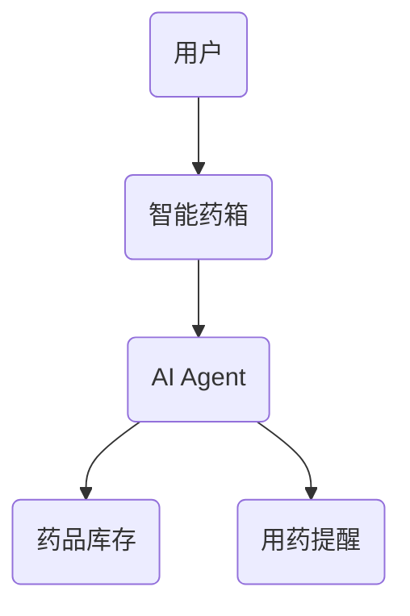
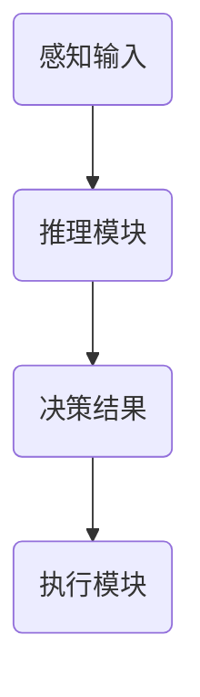
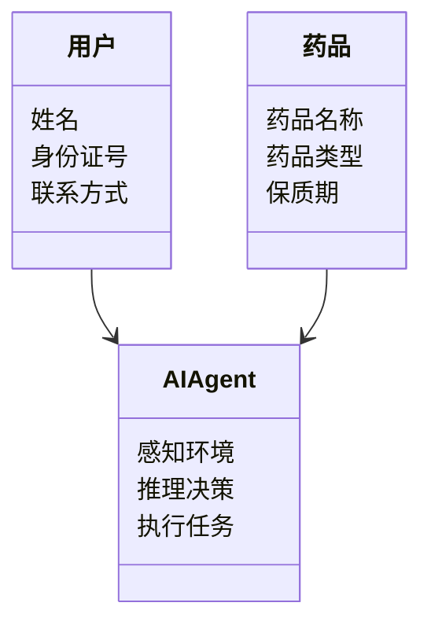
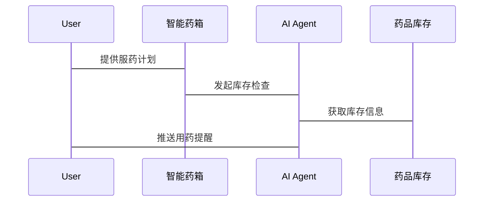

                 


# 智能药箱：AI Agent的用药管理与提醒系统

## 关键词：智能药箱, AI Agent, 用药管理, 人工智能, 健康管理, 用药提醒

## 摘要：  
本文探讨了智能药箱结合AI Agent的用药管理与提醒系统的实现。通过分析AI Agent的核心原理、算法设计、系统架构以及实际应用场景，展示了如何利用人工智能技术优化药品管理流程，提供智能化的用药提醒服务。文章内容涵盖了背景介绍、核心概念、算法原理、系统设计、项目实战以及最佳实践，为读者提供全面的技术解析和实践指导。

---

# 第一部分: 智能药箱与AI Agent概述

## 第1章: 智能药箱与AI Agent的背景介绍

### 1.1 智能药箱的概念与应用场景  
#### 1.1.1 智能药箱的定义  
智能药箱是一种结合物联网和人工智能技术的智能设备，用于管理和提醒用户的药品服用。它能够通过传感器、网络通信和AI算法实现药品的智能化管理。  

#### 1.1.2 智能药箱的核心功能  
- 药品库存管理：实时监测药品库存，提醒用户补充药品。  
- 用药提醒：根据用户的服药计划，智能推送提醒信息。  
- 用户交互：通过语音、App或其他交互方式与用户进行信息同步。  

#### 1.1.3 智能药箱的用户群体与市场需求  
智能药箱主要面向慢性病患者、老年人以及需要长期服药的用户群体。市场需求主要集中在提高用药依从性、优化药品管理效率以及提升用户体验等方面。  

### 1.2 AI Agent的基本概念与特点  
#### 1.2.1 AI Agent的定义  
AI Agent（人工智能代理）是指能够感知环境、自主决策并执行任务的智能实体。它可以是一个软件程序，也可以是一个硬件设备。  

#### 1.2.2 AI Agent的核心特点  
- **自主性**：能够自主决策和执行任务。  
- **反应性**：能够实时感知环境并做出反应。  
- **学习能力**：能够通过数据学习和优化自身行为。  

#### 1.2.3 AI Agent与传统软件的区别  
AI Agent的核心区别在于其具备自主决策和学习能力，能够根据环境变化动态调整行为。  

### 1.3 智能药箱与AI Agent的结合  
#### 1.3.1 智能药箱中AI Agent的作用  
AI Agent在智能药箱中主要负责药品管理、用药提醒和用户交互等功能。  

#### 1.3.2 AI Agent在用药管理中的应用  
- **药品库存管理**：AI Agent能够实时监测药品库存，并根据用户的服药计划预测未来的用量。  
- **用药提醒**：AI Agent能够根据用户的服药时间表，智能推送提醒信息。  
- **用户交互**：AI Agent可以通过语音或App与用户进行交互，提供用药建议和健康指导。  

#### 1.3.3 智能药箱与AI Agent的结合优势  
结合AI Agent后，智能药箱能够实现更智能化的药品管理，提高用户的用药依从性，同时优化管理效率。  

### 1.4 本章小结  
本章主要介绍了智能药箱和AI Agent的基本概念、核心特点以及它们的结合方式。通过这些内容，读者可以初步了解智能药箱与AI Agent的背景和应用场景。

---

## 第2章: 智能药箱与AI Agent的核心概念与联系

### 2.1 智能药箱的核心要素  
#### 2.1.1 药品库存管理  
智能药箱通过内置传感器实时监测药品库存，并根据用户的服药计划动态调整库存量。  

#### 2.1.2 用药提醒功能  
智能药箱能够根据用户的服药时间表，智能推送用药提醒。  

#### 2.1.3 用户交互界面  
智能药箱通常配备友好的用户交互界面，用户可以通过App或语音助手与药箱进行交互。  

### 2.2 AI Agent的核心原理  
#### 2.2.1 AI Agent的感知与推理  
AI Agent通过传感器、网络通信等手段感知环境，并基于感知信息进行推理和决策。  

#### 2.2.2 AI Agent的决策机制  
AI Agent根据推理结果选择最优的执行方案，并通过执行模块完成任务。  

#### 2.2.3 AI Agent的学习与优化  
AI Agent能够通过机器学习算法不断优化自身的推理和决策能力。  

### 2.3 智能药箱与AI Agent的实体关系图  


### 2.4 本章小结  
本章详细讲解了智能药箱和AI Agent的核心概念，并通过实体关系图展示了两者之间的联系。

---

## 第3章: 智能药箱与AI Agent的算法原理

### 3.1 AI Agent的算法选择  
#### 3.1.1 基于规则的AI Agent  
基于规则的AI Agent通过预设的规则进行推理和决策，适用于规则明确的场景。  

#### 3.1.2 基于机器学习的AI Agent  
基于机器学习的AI Agent能够通过数据学习，动态优化自身的推理和决策能力。  

#### 3.1.3 基于深度学习的AI Agent  
基于深度学习的AI Agent能够处理复杂的非结构化数据，适用于更复杂的场景。  

### 3.2 AI Agent的推理算法  
#### 3.2.1 前向推理  
前向推理是从已知的事实出发，通过规则库推导出结论。  

#### 3.2.2 后向推理  
后向推理是从目标出发，逆向寻找满足条件的事实。  

#### 3.2.3 混合推理  
混合推理结合了前向推理和后向推理的优势，适用于复杂的推理场景。  

### 3.3 AI Agent的数学模型与公式  
#### 3.3.1 基于规则的推理公式  
$$ \text{如果 } A \text{ 并且 } B，\text{ 那么 } C $$  

#### 3.3.2 基于概率的推理公式  
$$ P(C|A,B) = \frac{P(A,B|C)P(C)}{P(A,B)} $$  

### 3.4 AI Agent的推理流程  


### 3.5 本章小结  
本章详细讲解了AI Agent的算法选择和推理原理，并通过数学公式和流程图展示了推理过程。

---

## 第4章: 智能药箱与AI Agent的系统架构设计

### 4.1 问题场景介绍  
智能药箱需要实现药品库存管理、用药提醒和用户交互等功能，同时需要与AI Agent协同工作。  

### 4.2 系统功能设计  
#### 4.2.1 领域模型设计  


#### 4.2.2 系统架构设计  


### 4.3 接口设计与交互流程  
#### 4.3.1 接口设计  
- **输入接口**：用户通过App或语音助手输入服药计划。  
- **输出接口**：智能药箱通过App或语音助手推送用药提醒。  

#### 4.3.2 交互流程图  


### 4.4 本章小结  
本章详细讲解了智能药箱与AI Agent的系统架构设计，并通过类图和流程图展示了系统的结构和交互过程。

---

## 第5章: 项目实战

### 5.1 环境安装与配置  
- 安装Python和相关库（如TensorFlow、Flask）。  
- 配置硬件设备（如传感器、网络模块）。  

### 5.2 核心代码实现  
#### 5.2.1 AI Agent的推理模块  
```python
def infer(condition):
    if condition == 'yes':
        return '服药提醒'
    else:
        return '无需提醒'
```

#### 5.2.2 药品库存管理模块  
```python
def manage_inventory(stock, order):
    if stock < order:
        return '需要补货'
    else:
        return '库存充足'
```

### 5.3 代码解读与分析  
- **推理模块**：根据输入条件输出推理结果。  
- **库存管理模块**：根据当前库存和订单需求判断是否需要补货。  

### 5.4 实际案例分析  
案例：用户服药计划为每天两次，每次一粒药。智能药箱通过AI Agent推理出当前库存不足，推送补货提醒，并根据用户反馈调整用药提醒时间。  

### 5.5 项目小结  
本章通过实际案例展示了智能药箱与AI Agent的实现过程，并提供了核心代码和分析。

---

## 第6章: 最佳实践

### 6.1 小结  
智能药箱结合AI Agent能够显著提升用药管理的效率和用户体验。  

### 6.2 注意事项  
- 数据隐私保护：确保用户数据的安全性。  
- 系统稳定性：确保AI Agent的推理和执行过程稳定可靠。  

### 6.3 拓展阅读  
- 《人工智能：一种现代的方法》  
- 《机器学习实战》  

---

# 作者：AI天才研究院 & 禅与计算机程序设计艺术  
# 作者信息：AI天才研究院（AI Genius Institute）专注于人工智能领域的研究与实践，致力于推动AI技术的创新与应用。

