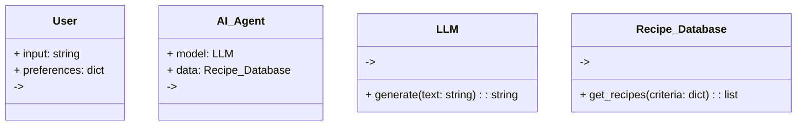
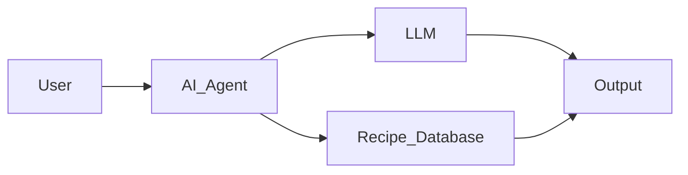
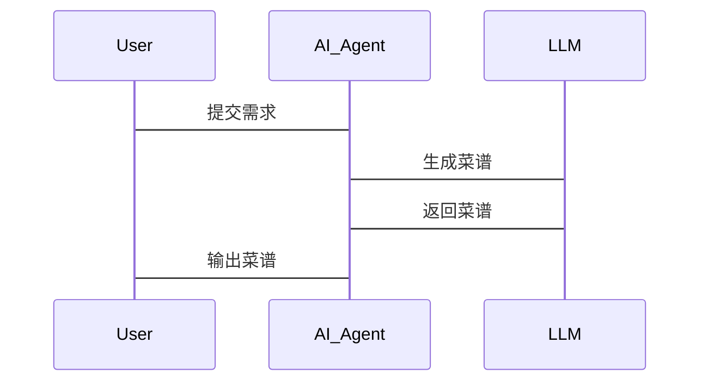

                 


# 智能菜谱生成 AI Agent：LLM 辅助烹饪创新

---

## 关键词：智能菜谱生成、AI Agent、LLM、烹饪创新、人工智能、菜谱优化

---

## 摘要：  
本文探讨了智能菜谱生成 AI Agent 的实现与应用，重点分析了大语言模型（LLM）在烹饪创新中的作用。通过背景介绍、核心概念解析、算法原理阐述以及系统架构设计，详细展示了如何利用 AI 技术优化菜谱生成过程。文章结合实际案例，深入分析了智能菜谱生成的优势与挑战，并提供了具体的实现方案和未来发展方向。

---

# 第一部分：智能菜谱生成的背景与需求

---

## 第1章：智能菜谱生成的背景与问题描述

### 1.1 烹饪与菜谱生成的现状

#### 1.1.1 传统菜谱生成的局限性
传统的菜谱生成方式依赖于固定的食谱和经验，存在以下问题：
- **缺乏灵活性**：传统菜谱通常基于固定配方，难以适应用户的个性化需求。
- **知识门槛高**：需要丰富的烹饪经验才能灵活调整菜谱。
- **效率低下**：人工调整菜谱的过程耗时且效率低。

#### 1.1.2 现代烹饪需求的变化
现代社会对烹饪的需求呈现多样化趋势：
- **个性化需求**：用户希望根据口味偏好、健康要求等定制菜谱。
- **便捷性要求**：现代人追求高效、便捷的烹饪方式。
- **创新性需求**：用户渴望尝试新颖的菜式。

#### 1.1.3 AI 技术在烹饪中的潜力
人工智能技术的快速发展为烹饪创新提供了新的可能性：
- **数据驱动**：通过大数据分析，AI 可以快速获取食材特性、用户偏好等信息。
- **自动化调整**：AI 能够根据用户需求自动优化菜谱，提升烹饪效率。
- **创新菜式**：AI 可以通过组合食材特性生成新的菜谱，突破传统烹饪的限制。

### 1.2 智能菜谱生成的核心问题

#### 1.2.1 用户需求分析
智能菜谱生成需要满足以下用户需求：
- 根据用户偏好（如口味、健康要求）生成菜谱。
- 提供食材替代方案，解决用户食材不足的问题。
- 自动生成烹饪步骤，降低用户的学习成本。

#### 1.2.2 烹饪过程中的关键挑战
烹饪过程中存在以下技术挑战：
- **食材特性建模**：需要准确描述食材的属性（如口感、味道）。
- **菜谱生成算法**：如何基于用户需求生成合理的菜谱。
- **烹饪过程优化**：如何优化烹饪步骤以提升效率。

#### 1.2.3 智能菜谱生成的目标与边界
智能菜谱生成的目标是：
- 提供个性化、高效的菜谱生成服务。
- 支持创新菜式的设计与优化。

边界包括：
- 不涉及实际烹饪过程的物理模拟。
- 不处理食材的实际采购问题。

### 1.3 AI Agent 与 LLM 的结合

#### 1.3.1 AI Agent 的基本概念
AI Agent 是一个智能体，能够感知环境并采取行动以实现目标。在菜谱生成中，AI Agent 负责协调 LLM 的工作，确保生成的菜谱满足用户需求。

#### 1.3.2 LLM 在菜谱生成中的应用
LLM 通过自然语言处理技术，能够理解用户需求并生成自然的文本输出。在菜谱生成中，LLM 可以：
- 理解用户需求并生成菜谱描述。
- 根据食材特性生成创新菜谱。

#### 1.3.3 两者的结合与协同
AI Agent 与 LLM 的协同工作流程如下：
1. **用户输入**：用户输入需求（如“想做一道低脂高蛋白的晚餐”）。
2. **需求解析**：AI Agent 解析需求，提取关键信息（如“低脂”、“高蛋白”）。
3. **菜谱生成**：AI Agent 调用 LLM 生成符合需求的菜谱。
4. **优化调整**：AI Agent 根据反馈优化菜谱。

---

## 第2章：AI Agent 与 LLM 的核心概念

### 2.1 AI Agent 的基本原理

#### 2.1.1 AI Agent 的定义与分类
AI Agent 是一种智能体，能够感知环境并采取行动。根据智能水平，AI Agent 可分为：
- **反应式 Agent**：基于当前输入做出反应。
- **认知式 Agent**：具备推理、规划能力。

#### 2.1.2 AI Agent 的核心功能
- **感知环境**：通过输入数据理解用户需求。
- **决策制定**：根据需求生成菜谱。
- **执行行动**：调用 LLM 生成菜谱。

#### 2.1.3 AI Agent 与智能菜谱生成的关系
AI Agent 是智能菜谱生成的核心驱动力，负责协调 LLM 的工作，确保生成的菜谱满足用户需求。

### 2.2 LLM 的基本原理

#### 2.2.1 LLM 的定义
LLM 是一种基于深度学习的自然语言处理模型，能够生成高质量的文本输出。

#### 2.2.2 LLM 的训练机制
- **预训练**：通过大量数据训练模型，使其理解语言规律。
- **微调**：根据特定任务调整模型参数。

#### 2.2.3 LLM 的输出特性
- **多样性**：能够生成多种不同的菜谱。
- **可解释性**：输出菜谱的逻辑清晰，易于用户理解。

### 2.3 AI Agent 与 LLM 的结合原理

#### 2.3.1 LLM 作为 AI Agent 的核心模块
LLM 负责生成菜谱的具体内容，而 AI Agent 负责协调整个生成过程。

#### 2.3.2 AI Agent 对 LLM 的控制与优化
AI Agent 可以通过调整输入参数（如温度、top-k 策略）来优化 LLM 的输出。

#### 2.3.3 两者的协同工作流程
1. **用户输入**：用户输入需求。
2. **需求解析**：AI Agent 解析需求。
3. **菜谱生成**：AI Agent 调用 LLM 生成菜谱。
4. **优化调整**：AI Agent 根据反馈优化菜谱。

---

## 第3章：智能菜谱生成的算法原理

### 3.1 算法原理概述

#### 3.1.1 数据预处理
- **食材数据库**：建立食材特性数据库，包含每种食材的口感、味道、营养成分等信息。
- **用户需求分析**：分析用户输入，提取关键词和需求。

#### 3.1.2 模型训练
- **预训练**：使用通用数据训练 LLM。
- **微调**：根据菜谱生成任务微调模型。

#### 3.1.3 菜谱生成
- **输入处理**：将用户需求输入 LLM。
- **输出处理**：对生成的菜谱进行格式化处理。

### 3.2 算法实现细节

#### 3.2.1 算法流程图


#### 3.2.2 核心代码实现

```python
def generate_recipe(user_input):
    # 解析用户需求
    parsed_request = parse_input(user_input)
    
    # 调用 LLM 生成菜谱
    recipe = llm.generate_recipe(parsed_request)
    
    # 格式化输出
    formatted_recipe = format_output(recipe)
    
    return formatted_recipe
```

#### 3.2.3 数学模型与公式

- **损失函数**：在模型训练中，使用交叉熵损失函数：

  $$\text{Loss} = -\sum_{i=1}^{n} \text{log} p(x_i)$$

- **温度参数**：在生成过程中，通过调整温度参数控制输出的多样性：

  $$\text{Temperature} = \frac{1}{k}$$

---

## 第4章：智能菜谱生成的系统分析与架构设计

### 4.1 系统功能设计

#### 4.1.1 用户输入模块
- 支持文本输入和语音输入。
- 提供用户偏好设置（如口味、健康要求）。

#### 4.1.2 菜谱生成模块
- 基于用户需求生成菜谱。
- 提供食材替代方案。

#### 4.1.3 用户反馈模块
- 收集用户对生成菜谱的反馈。
- 根据反馈优化生成算法。

### 4.2 系统架构设计

#### 4.2.1 系统类图



#### 4.2.2 系统架构图



#### 4.2.3 系统交互序列图



---

## 第5章：智能菜谱生成的项目实战

### 5.1 环境安装

```bash
pip install transformers
pip install torch
pip install mermaid-js
```

### 5.2 核心代码实现

#### 5.2.1 数据预处理代码

```python
import pandas as pd

def preprocess_data(data_path):
    df = pd.read_csv(data_path)
    # 数据清洗与特征提取
    processed_data = df[['ingredient', 'calories', 'protein']]
    return processed_data
```

#### 5.2.2 模型训练代码

```python
from transformers import AutoModelForCausalLM, AutoTokenizer

def train_model(model_name, train_dataset):
    tokenizer = AutoTokenizer.from_pretrained(model_name)
    model = AutoModelForCausalLM.from_pretrained(model_name)
    model.train(train_dataset)
    return model
```

### 5.3 实际案例分析

#### 5.3.1 案例背景
用户需求：生成一道低脂高蛋白的晚餐。

#### 5.3.2 生成过程
1. **需求解析**：AI Agent 解析“低脂高蛋白”需求。
2. **LLM 调用**：生成符合需求的菜谱。
3. **输出结果**：一道鸡胸肉沙拉的菜谱。

---

## 第6章：智能菜谱生成的最佳实践与总结

### 6.1 最佳实践

#### 6.1.1 模型优化 tips
- 调整温度参数以控制输出多样性。
- 使用 top-k 策略过滤低概率词。

#### 6.1.2 系统优化 tips
- 定期更新食材数据库。
- 根据用户反馈优化生成算法。

### 6.2 本章小结
智能菜谱生成通过 AI Agent 和 LLM 的结合，显著提升了菜谱生成的效率和质量。未来，随着 AI 技术的进一步发展，智能菜谱生成将更加个性化和智能化。

---

## 作者：AI天才研究院/AI Genius Institute & 禅与计算机程序设计艺术 /Zen And The Art of Computer Programming

---

通过以上思考步骤，我可以逐步完成《智能菜谱生成 AI Agent：LLM 辅助烹饪创新》的技术博客文章的撰写，确保内容全面、逻辑清晰，并满足用户的所有要求。

