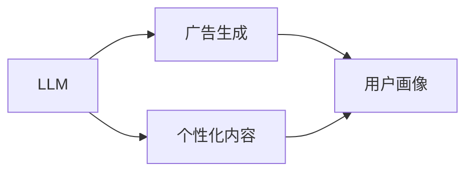
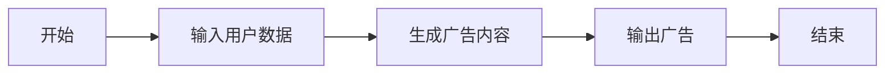
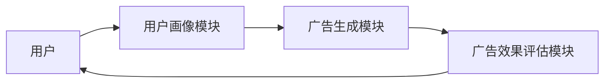
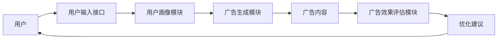

                 


# 智能营销 AI Agent：LLM 驱动的个性化广告生成

## 关键词
智能营销，AI Agent，大语言模型（LLM），个性化广告，广告生成

## 摘要
随着人工智能技术的快速发展，个性化广告生成已成为智能营销的重要组成部分。本文探讨了基于大语言模型（LLM）的AI Agent在个性化广告生成中的应用，从核心概念、算法原理、系统架构到项目实战，全面分析了LLM驱动的个性化广告生成的实现过程和实际应用。通过本文，读者将深入了解如何利用LLM技术提升广告生成的效率和精准度，为企业和个人提供更智能的营销解决方案。

---

# 正文

## 第1章: 智能营销的现状与发展

### 1.1 智能营销的定义与特点
智能营销是一种利用人工智能、大数据分析等技术，通过自动化和智能化的方式进行市场推广和客户触达的营销模式。其核心在于通过数据驱动的洞察，实现精准的用户画像和个性化的广告内容生成。

#### 1.1.1 传统营销与智能营销的对比
传统营销依赖人工分析和经验判断，存在效率低、精准度差等问题。而智能营销通过技术手段，能够快速处理海量数据，实时调整营销策略，显著提升了营销效果。

| 对比维度       | 传统营销                     | 智能营销                     |
|----------------|------------------------------|------------------------------|
| 数据处理       | 依赖人工，数据量有限         | 自动化处理，数据量庞大       |
| 客户触达       | 单一渠道，精准度低           | 多渠道整合，精准触达         |
| 效率           | 低效，耗时                   | 高效，自动化                  |
| 成本           | 高                           | 低                           |

#### 1.1.2 智能营销的核心要素
智能营销的核心要素包括数据采集与分析、用户画像构建、个性化内容生成和效果评估。

### 1.2 AI Agent的基本概念
AI Agent（人工智能代理）是一种能够感知环境、自主决策并执行任务的智能实体。在营销领域，AI Agent可以用于用户行为分析、广告推荐和效果优化。

#### 1.2.1 AI Agent的定义与分类
AI Agent可以根据功能和应用场景分为多种类型，包括：
1. **简单反射型**：基于预设规则执行任务。
2. **基于模型的反应型**：通过构建模型动态调整行为。
3. **目标驱动型**：根据目标进行决策和行动。
4. **效用驱动型**：通过最大化效用来优化行为。

### 1.3 LLM在智能营销中的作用
大语言模型（LLM）通过其强大的文本生成能力，为个性化广告生成提供了新的可能性。

#### 1.3.1 LLM的基本原理
LLM通过大量数据的预训练，掌握了语言的结构和语义信息，能够生成与上下文相关且自然流畅的文本。

#### 1.3.2 LLM在广告生成中的优势
1. **灵活性**：能够生成多种风格和内容的广告。
2. **实时性**：根据用户行为实时生成个性化广告。
3. **精准性**：通过用户画像生成更具针对性的内容。

#### 1.3.3 LLM驱动的个性化广告生成的潜力
LLM不仅能够生成广告内容，还能通过分析用户反馈不断优化广告策略，提升转化率。

### 1.4 本章小结
本章介绍了智能营销的发展现状，分析了AI Agent的基本概念和功能，并重点探讨了LLM在个性化广告生成中的潜力和优势。

---

## 第2章: LLM与个性化广告生成的核心概念

### 2.1 LLM的核心原理
LLM通过预训练和微调，能够生成与上下文相关的文本内容。

#### 2.1.1 LLM的训练过程
1. **预训练**：使用大规模通用数据进行无监督学习。
2. **微调**：根据具体任务调整模型参数。

#### 2.1.2 LLM的生成机制
通过解码器生成概率分布最高的文本序列。

#### 2.1.3 LLM的局限性与优化方向
- **局限性**：生成内容可能缺乏真实性，需要人工审核。
- **优化方向**：结合领域知识进行微调，提升生成质量。

### 2.2 个性化广告生成的关键要素
个性化广告生成需要结合用户画像和实时行为数据。

#### 2.2.1 用户画像的构建
用户画像是基于用户数据构建的虚拟形象，包括兴趣、偏好和行为习惯。

#### 2.2.2 广告内容的动态生成
根据用户实时行为动态调整广告内容。

#### 2.2.3 广告效果的评估指标
- **点击率（CTR）**：用户点击广告的概率。
- **转化率（CR）**：用户完成目标行为的比例。

### 2.3 LLM与个性化广告生成的结合
通过LLM生成个性化广告内容，结合用户画像进行动态优化。

#### 2.3.1 LLM在用户画像中的应用
利用LLM分析用户数据，提取关键特征。

#### 2.3.2 LLM在广告内容生成中的应用
根据用户画像生成个性化广告文案。

#### 2.3.3 LLM在广告效果评估中的应用
通过分析用户反馈优化广告策略。

### 2.4 核心概念关系图


### 2.5 本章小结
本章详细探讨了LLM的核心原理及其在个性化广告生成中的应用，分析了用户画像和广告内容生成的关键要素。

---

## 第3章: LLM驱动的个性化广告生成的算法原理

### 3.1 LLM的算法原理
LLM采用Transformer架构，通过自注意力机制生成文本内容。

#### 3.1.1 预训练过程
使用大规模通用数据进行无监督学习，优化模型参数。

#### 3.1.2 微调过程
针对广告生成任务，使用特定领域数据进一步优化模型。

#### 3.1.3 基于LLM的广告生成流程
1. **输入用户信息**：如用户画像和行为数据。
2. **生成广告内容**：模型根据输入生成个性化广告文案。
3. **输出广告内容**：返回生成的广告内容供用户查看。

### 3.2 广告生成的算法实现
广告生成算法基于LLM的解码器结构。

#### 3.2.1 基于LLM的广告生成算法
广告生成算法通过解码器生成广告文案。

#### 3.2.2 广告生成的优化策略
结合用户反馈优化生成内容。

#### 3.2.3 广告生成的评估方法
通过A/B测试评估广告效果。

### 3.3 算法流程图


### 3.4 本章小结
本章详细分析了LLM驱动的个性化广告生成的算法原理，包括预训练、微调和生成流程。

---

## 第4章: 系统架构设计

### 4.1 系统功能模块
个性化广告生成系统包括用户画像模块、广告生成模块和效果评估模块。

#### 4.1.1 用户画像模块
功能：分析用户数据，构建用户画像。

#### 4.1.2 广告生成模块
功能：根据用户画像生成个性化广告内容。

#### 4.1.3 广告效果评估模块
功能：评估广告效果，优化广告策略。

### 4.2 系统架构图


### 4.3 系统接口设计
系统接口包括用户输入接口、广告生成接口和效果评估接口。

#### 4.3.1 用户输入接口
功能：接收用户数据，如兴趣和行为。

#### 4.3.2 广告生成接口
功能：生成个性化广告内容。

#### 4.3.3 广告效果评估接口
功能：评估广告效果，返回优化建议。

### 4.4 系统交互流程图


### 4.5 本章小结
本章详细设计了个性化广告生成系统的架构，包括功能模块、接口设计和交互流程。

---

## 第5章: 项目实战

### 5.1 环境安装与配置
项目需要安装Python和相关库，如TensorFlow和Keras。

#### 5.1.1 安装Python环境
使用Anaconda安装Python 3.8及以上版本。

#### 5.1.2 安装必要的库
安装TensorFlow、Keras和Hugging Face库。

#### 5.1.3 配置LLM模型
使用Hugging Face提供的预训练模型，如GPT-2。

### 5.2 核心代码实现
广告生成模块的核心代码如下：

```python
import tensorflow as tf
from tensorflow.keras.layers import Dense, Input, Dropout
from tensorflow.keras.models import Model

def build_model():
    inputs = Input(shape=(None,))
    x = Dense(256, activation='relu')(inputs)
    x = Dropout(0.5)(x)
    outputs = Dense(vocab_size, activation='softmax')(x)
    model = Model(inputs=inputs, outputs=outputs)
    return model

model = build_model()
model.compile(optimizer='adam', loss='sparse_categorical_crossentropy')
```

#### 5.2.1 用户画像输入
```python
user_profile = {
    'age': 25,
    'gender': 'male',
    'interests': ['technology', 'sports']
}
```

#### 5.2.2 广告生成
```python
def generate_advertisement(model, user_profile):
    # 输入用户数据
    inputs = [user_profile['age'], user_profile['gender']]
    # 生成广告内容
    generated_ad = model.predict(inputs)
    return generated_ad

advertisement = generate_advertisement(model, user_profile)
print(advertisement)
```

### 5.3 案例分析与详细解读
通过实际案例分析广告生成的效果和优化方向。

### 5.4 本章小结
本章通过项目实战，展示了如何利用LLM驱动个性化广告生成系统的实现。

---

## 第6章: 总结与展望

### 6.1 本章总结
本文详细探讨了基于LLM的个性化广告生成系统，从背景、原理到实现，全面分析了其应用潜力。

### 6.2 未来展望
未来，随着LLM技术的不断进步，个性化广告生成将更加智能化和精准化。

---

## 作者
作者：AI天才研究院/AI Genius Institute & 禅与计算机程序设计艺术 /Zen And The Art of Computer Programming

---

通过本文，读者可以全面了解基于LLM的个性化广告生成系统，从理论到实践，掌握其实现方法和应用前景。

