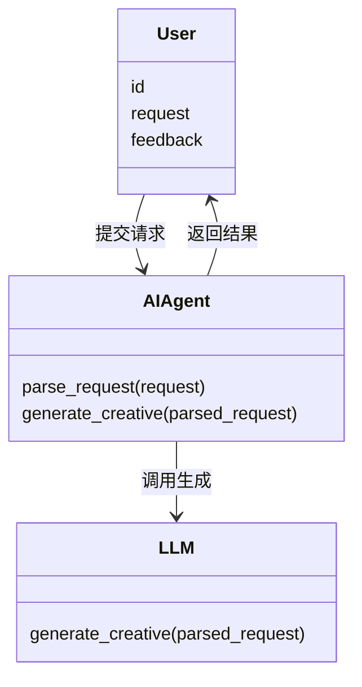
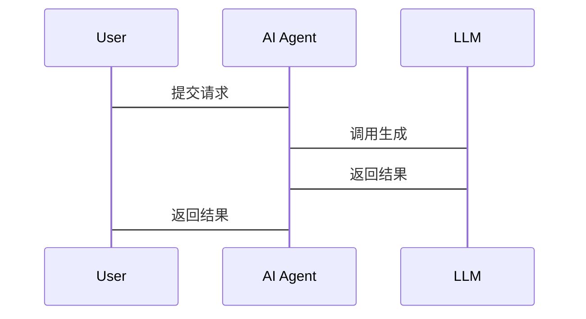

                 


# 智能营销文案AI Agent：LLM辅助的广告创意生成

> 关键词：AI Agent，LLM，广告创意生成，营销文案，大语言模型

> 摘要：本文深入探讨了基于大语言模型（LLM）的智能营销文案AI Agent在广告创意生成中的应用。通过分析问题背景、核心概念、算法原理、系统架构和实际案例，本文详细阐述了如何利用LLM技术提升广告创意生成的效率和效果。文章还提供了代码实现和系统设计的详细内容，帮助读者更好地理解和应用相关技术。

---

## 第1章: 智能营销文案AI Agent的背景与问题描述

### 1.1 问题背景

#### 1.1.1 数字营销的挑战与痛点
在数字化时代，企业面临着前所未有的市场竞争压力。传统的广告创意生成方式效率低下，难以满足快速变化的市场需求。企业需要在短时间内生成大量高质量的广告文案，但传统的人工创意过程耗时长、成本高，且难以保证创意的多样性。

#### 1.1.2 传统广告创意生成的局限性
- 依赖人工经验，创意效率低。
- 难以快速响应市场变化。
- 个性化需求难以满足。
- 创意质量受制于创意人员的能力和经验。

#### 1.1.3 AI技术在营销领域的应用潜力
AI技术，特别是大语言模型（LLM），在自然语言处理领域取得了显著进展，为广告创意生成提供了新的可能性。LLM能够快速生成多样化、个性化的文案，帮助企业在竞争激烈的市场中快速响应需求。

### 1.2 问题描述

#### 1.2.1 广告创意生成的效率问题
广告创意生成需要在短时间内完成大量文案，传统方法难以满足需求。

#### 1.2.2 个性化营销的需求
现代消费者需求多样化，个性化广告文案成为提升转化率的关键。

#### 1.2.3 大语言模型在文案生成中的优势
LLM能够快速生成高质量、多样化的文案，具有高效性和可扩展性。

### 1.3 问题解决与边界

#### 1.3.1 AI Agent在广告创意生成中的解决方案
AI Agent通过整合LLM技术，实现自动化、智能化的广告创意生成。

#### 1.3.2 边界与外延
- 系统边界：AI Agent专注于广告创意生成，不涉及广告投放和效果监测。
- 外延：未来可扩展至内容分发和效果优化。

#### 1.3.3 核心要素与组成结构
- 核心要素：LLM模型、用户需求解析模块、创意生成模块。
- 组成结构：输入需求、解析、生成、输出结果。

---

## 第2章: 智能营销文案AI Agent的核心概念

### 2.1 AI Agent的基本概念

#### 2.1.1 AI Agent的定义与特点
- 定义：AI Agent是一种能够感知环境、自主决策的智能体。
- 特点：智能性、自主性、反应性、社会性。

#### 2.1.2 AI Agent的核心要素
- 感知模块：接收输入数据。
- 决策模块：基于数据做出决策。
- 执行模块：输出结果。

#### 2.1.3 AI Agent与传统营销的区别
- AI Agent能够自动化处理任务，提高效率。
- 传统营销依赖人工经验，效率较低。

### 2.2 大语言模型（LLM）的定义与特点

#### 2.2.1 LLM的基本概念
- LLM是一种基于深度学习的自然语言处理模型，能够生成人类水平的文本。

#### 2.2.2 LLM的核心算法原理
- 预训练：通过大量数据学习语言模式。
- 微调：针对特定任务进行优化。

#### 2.2.3 LLM与传统NLP模型的对比
| 特性 | LLM | 传统NLP模型 |
|------|------|-------------|
| 复杂度 | 高 | 低 |
| 精度 | 高 | 中 |
| 应用范围 | 广泛 | 有限 |

### 2.3 广告创意生成的核心概念

#### 2.3.1 广告创意生成的定义
- 广告创意生成：利用技术手段生成吸引人的广告文案。

#### 2.3.2 广告创意生成的关键要素
- 用户需求：目标受众、产品特点。
- 创意策略：情感共鸣、痛点挖掘。
- 文案结构：标题、正文、CTA。

#### 2.3.3 广告创意生成的流程与方法
1. 需求分析。
2. 创意构思。
3. 内容生成。
4. 效果优化。

### 2.4 AI Agent与LLM的联系

#### 2.4.1 AI Agent如何利用LLM进行广告创意生成
- LLM作为核心模块，负责生成文案。
- AI Agent负责任务管理和优化。

#### 2.4.2 LLM在广告创意生成中的优势
- 高效性：快速生成多样化文案。
- 精准性：基于用户需求优化内容。

#### 2.4.3 LLM与AI Agent的协同工作
- LLM负责内容生成。
- AI Agent负责任务管理和优化。

---

## 第3章: 智能营销文案AI Agent的算法原理

### 3.1 LLM的预训练过程

#### 3.1.1 预训练目标
- 学习语言模式。
- 捕捉语义关系。

#### 3.1.2 预训练模型架构
- Transformer架构。
- 自注意力机制。

#### 3.1.3 预训练损失函数
$$ \mathcal{L} = -\sum_{i=1}^{n} \log p(x_i) $$

### 3.2 LLM的微调过程

#### 3.2.1 微调目标
- 适应特定任务。
- 提高生成质量。

#### 3.2.2 微调数据集
- 广告文案数据集。

#### 3.2.3 微调策略
- 参数微调。
- 任务特定优化。

### 3.3 基于LLM的广告创意生成算法

#### 3.3.1 算法流程
1. 输入用户需求。
2. 解析需求。
3. 生成文案。
4. 输出结果。

#### 3.3.2 算法实现
```python
def generate_creative(user_request):
    # 解析用户需求
    parsed_request = parse_request(user_request)
    # 调用LLM生成文案
    creative = llm.generate_creative(parsed_request)
    return creative
```

#### 3.3.3 算法优化
- 多样性优化：生成多个候选文案。
- 质量优化：基于用户反馈调整模型。

---

## 第4章: 智能营销文案AI Agent的系统分析与架构设计

### 4.1 系统功能设计

#### 4.1.1 领域模型


#### 4.1.2 系统架构
```mermaid
--- 智能营销文案AI Agent架构 ---
```

### 4.2 系统架构设计

#### 4.2.1 系统模块
- 用户请求模块。
- AI Agent解析模块。
- LLM生成模块。

#### 4.2.2 模块交互


### 4.3 系统接口设计

#### 4.3.1 接口定义
- 输入接口：用户需求。
- 输出接口：生成文案。

#### 4.3.2 接口实现
```python
# 接口定义
class AgentInterface:
    def generate_creative(self, request):
        pass

# 实现类
class LLMAgent(AgentInterface):
    def __init__(self, llm):
        self.llm = llm

    def generate_creative(self, request):
        return self.llm.generate_creative(request)
```

---

## 第5章: 智能营销文案AI Agent的项目实战

### 5.1 环境安装

#### 5.1.1 安装Python环境
- 安装Python 3.8及以上版本。

#### 5.1.2 安装依赖
```bash
pip install transformers torch
```

### 5.2 系统核心实现

#### 5.2.1 文本生成模块
```python
from transformers import AutoModelForCausalLM, AutoTokenizer

class LLMGenerator:
    def __init__(self, model_name):
        self.tokenizer = AutoTokenizer.from_pretrained(model_name)
        self.model = AutoModelForCausalLM.from_pretrained(model_name)

    def generate(self, prompt, max_length=50):
        inputs = self.tokenizer(prompt, return_tensors="pt")
        outputs = self.model.generate(inputs.input_ids, max_length=max_length)
        return self.tokenizer.decode(outputs[0], skip_special_tokens=True)
```

#### 5.2.2 AI Agent实现
```python
class AIAssistant:
    def __init__(self, llm_generator):
        self.llm_generator = llm_generator

    def generate_creative(self, request):
        prompt = f"Create an advertising creative for {request}"
        return self.llm_generator.generate(prompt)
```

### 5.3 代码实现与解读

#### 5.3.1 代码解读
- `LLMGenerator`类：负责调用LLM生成文案。
- `AIAssistant`类：负责解析用户需求并调用生成模块。

#### 5.3.2 实际案例分析
- 案例1：生成产品广告文案。
- 案例2：生成社交媒体推广文案。

### 5.4 项目小结

---

## 第6章: 智能营销文案AI Agent的最佳实践

### 6.1 小结

### 6.2 注意事项

### 6.3 拓展阅读

---

## 附录: 术语表与参考文献

作者：AI天才研究院/AI Genius Institute & 禅与计算机程序设计艺术 /Zen And The Art of Computer Programming

---

以上是文章的完整目录结构和内容框架，您可以根据需要进一步扩展每个部分的具体内容，添加更多的技术细节和实际案例。

