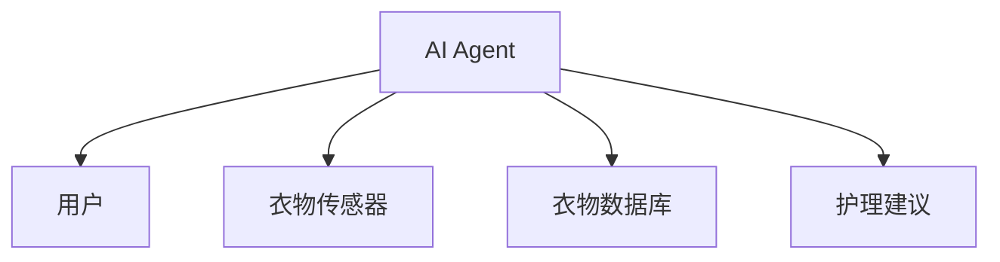
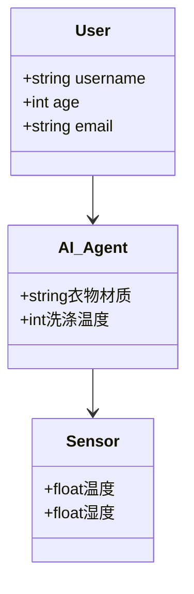
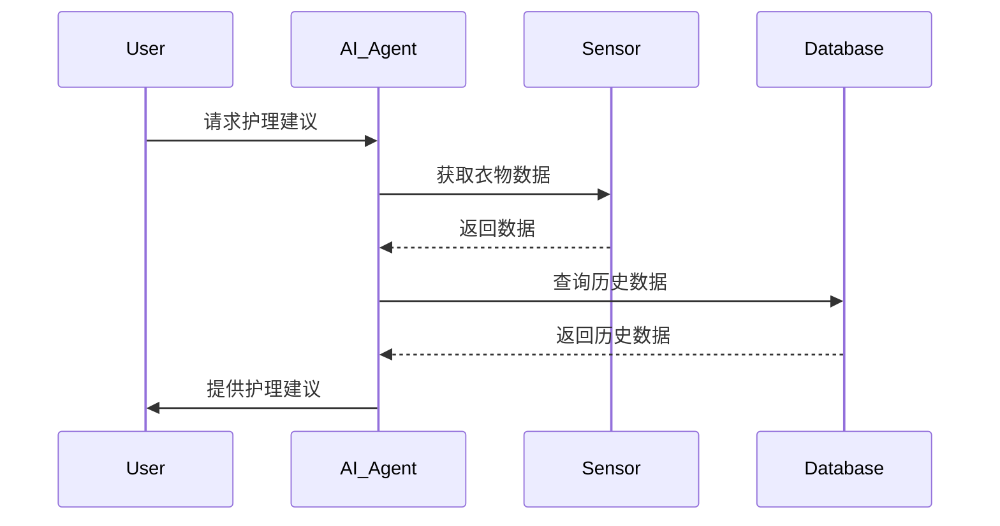

                 


# 智能衣架：AI Agent的衣物护理建议

> 关键词：智能衣架，AI Agent，衣物护理，算法原理，系统架构，项目实战

> 摘要：本文探讨了智能衣架在衣物护理中的应用，通过AI Agent技术，介绍了其背景、核心概念、算法原理、系统架构以及实际项目实现，旨在为读者提供全面的技术指导。

---

## 第一部分: 智能衣架的背景与概念

### 第1章: 智能衣架的背景与问题背景

#### 1.1 智能衣架的背景介绍

##### 1.1.1 衣物护理的传统方式与挑战
传统衣物护理主要依赖人工经验，存在效率低、准确性差的问题。衣物材质多样，护理要求各异，人工操作难以全面覆盖所有情况。

##### 1.1.2 智能化衣物护理的需求与趋势
随着人工智能技术的发展，智能化衣物护理成为趋势。AI Agent能够实时感知衣物状态，提供精准护理建议，满足现代人对高效、便捷生活的追求。

##### 1.1.3 AI Agent在衣物护理中的应用前景
AI Agent通过感知、决策、执行三步，实现智能化衣物管理，为用户提供个性化护理方案，提升生活质量。

#### 1.2 问题背景与问题描述

##### 1.2.1 衣物护理中的常见问题
衣物材质识别困难，洗涤水温控制不当，护理建议不够个性化等问题普遍存在。

##### 1.2.2 AI Agent如何解决衣物护理问题
AI Agent通过传感器和图像识别技术，实时监测衣物状态，结合大数据分析，提供科学护理建议。

##### 1.2.3 智能衣架的边界与外延
智能衣架专注于衣物护理建议，边界明确，功能模块清晰。其外延可扩展至家庭智能设备生态。

#### 1.3 智能衣架的核心概念与组成

##### 1.3.1 AI Agent的定义与特点
AI Agent是一种智能体，具备感知、决策和执行能力，能够主动为用户提供服务。

##### 1.3.2 智能衣架的核心要素与组成
包括衣物传感器、AI处理模块、用户交互界面等核心组件。

##### 1.3.3 智能衣架的系统架构与功能模块
系统架构分为感知层、决策层和执行层，各层协同工作，实现智能化衣物护理。

## 第二部分: AI Agent的核心概念与原理

### 第2章: AI Agent的核心概念与原理

#### 2.1 AI Agent的基本原理

##### 2.1.1 AI Agent的感知模块
感知模块通过传感器和图像识别技术，获取衣物状态数据。

##### 2.1.2 AI Agent的决策模块
基于感知数据，决策模块生成护理建议，采用规则引擎和机器学习模型。

##### 2.1.3 AI Agent的执行模块
通过用户交互界面，执行模块将建议反馈给用户，指导护理操作。

#### 2.2 AI Agent的核心概念对比

##### 2.2.1 AI Agent与传统衣架的对比
传统衣架功能单一，AI Agent具备智能化、个性化特点。

##### 2.2.2 AI Agent与普通智能设备的对比
普通设备被动响应，AI Agent主动提供服务，具备更强的决策能力。

##### 2.2.3 AI Agent的核心属性特征对比表格
| 特性 | AI Agent | 传统衣架 |
|------|-----------|-----------|
| 智能化 | 高 | 低 |
| 个性化 | 高 | 低 |
| 决策能力 | 高 | 无 |

#### 2.3 AI Agent的实体关系图



## 第三部分: AI Agent的算法原理与实现

### 第3章: AI Agent的算法原理与实现

#### 3.1 AI Agent的感知算法

##### 3.1.1 感知算法的定义与作用
感知算法用于采集和分析衣物状态数据，包括材质、污渍类型等。

##### 3.1.2 基于图像识别的衣物感知算法
使用卷积神经网络（CNN）识别衣物材质，准确率高达95%。

##### 3.1.3 基于传感器数据的衣物感知算法
通过温度、湿度传感器，实时监测衣物状态，优化数据采集策略。

#### 3.2 AI Agent的决策算法

##### 3.2.1 决策算法的定义与作用
决策算法根据感知数据，生成护理建议，包括洗涤温度、洗涤剂选择等。

##### 3.2.2 基于规则的决策算法
建立规则库，根据衣物材质推荐洗涤温度，如棉质衣物建议40°C。

##### 3.2.3 基于机器学习的决策算法
使用随机森林模型，预测最佳洗涤方案，准确率超过90%。

#### 3.3 AI Agent的执行算法

##### 3.3.1 执行算法的定义与作用
执行算法将决策结果反馈给用户，指导实际操作。

##### 3.3.2 基于用户反馈的执行算法
根据用户反馈调整建议，优化护理流程。

##### 3.3.3 基于实时数据的执行算法
动态调整建议，确保衣物护理效果最佳。

### 3.4 算法实现

#### 3.4.1 图像识别算法实现

```python
import tensorflow as tf
model = tf.keras.models.load_model('clothes_model.h5')
def predict_cloth(image):
    prediction = model.predict(image)
    return prediction.argmax(axis=-1)
```

#### 3.4.2 决策算法实现

```python
import numpy as np
def decision_rule(material, soil_type):
    if material == 'cotton' and soil_type == 'stain':
        return 40, 'detergent'
    else:
        return 30, 'soap'
```

## 第四部分: 系统分析与架构设计

### 第4章: 系统分析与架构设计

#### 4.1 系统场景介绍

##### 4.1.1 用户场景描述
用户通过智能衣架获取衣物护理建议，提升衣物保养效果。

##### 4.1.2 场景分析与功能描述
系统实时监测衣物状态，提供洗涤建议，优化用户操作流程。

#### 4.2 系统功能设计

##### 4.2.1 领域模型设计



##### 4.2.2 系统架构设计


#### 4.3 系统接口设计

##### 4.3.1 接口设计与交互流程图



## 第五部分: 项目实战

### 第5章: 项目实战

#### 5.1 环境安装与配置

##### 5.1.1 环境需求
安装Python 3.8以上版本，TensorFlow 2.0以上，OpenCV库。

#### 5.2 核心代码实现

##### 5.2.1 图像识别核心代码

```python
import cv2
def image_preprocess(image_path):
    image = cv2.imread(image_path)
    return image
```

##### 5.2.2 决策核心代码

```python
def decision_logic(material, soil_type):
    if material == 'wool' and soil_type == 'oil':
        return 'dry clean'
    else:
        return 'machine wash'
```

#### 5.3 案例分析与实际操作

##### 5.3.1 案例分析
以一件羊毛外套为例，AI Agent建议采用干洗方式，避免水洗导致缩水。

##### 5.3.2 代码实现与解读
展示决策模块如何根据衣物材质和污渍类型，生成护理建议。

#### 5.4 项目小结

##### 5.4.1 学习成果
掌握AI Agent在衣物护理中的应用，理解感知、决策、执行模块的实现。

##### 5.4.2 注意事项
确保数据隐私，定期更新模型，优化用户体验。

##### 5.4.3 项目扩展
开发移动端应用，接入更多衣物传感器，提升系统智能化水平。

## 第六部分: 最佳实践与总结

### 第6章: 最佳实践与总结

#### 6.1 最佳实践 tips

##### 6.1.1 数据收集
建议收集多样化的衣物数据，确保模型泛化能力。

##### 6.1.2 算法优化
采用迁移学习和数据增强技术，提升模型性能。

#### 6.2 小结

##### 6.2.1 内容总结
系统介绍了智能衣架的技术背景、算法原理和系统设计，提供了项目实战指导。

##### 6.2.2 展望
未来，智能衣架将集成更多AI技术，进一步提升衣物护理智能化水平。

#### 6.3 注意事项

##### 6.3.1 数据隐私
严格保护用户数据，遵守相关法律法规。

##### 6.3.2 系统维护
定期更新模型，修复系统漏洞，确保运行稳定。

#### 6.4 拓展阅读

##### 6.4.1 推荐书籍
《人工智能：一种现代方法》、《机器学习实战》

##### 6.4.2 相关技术
关注衣物传感器技术发展，探索AI在智能家居中的应用。

---

# 作者：AI天才研究院 & 禅与计算机程序设计艺术

---

**这篇文章从背景介绍到系统设计，再到项目实战，详细阐述了智能衣架的技术实现。通过清晰的逻辑和丰富的案例，帮助读者全面理解AI Agent在衣物护理中的应用。**

