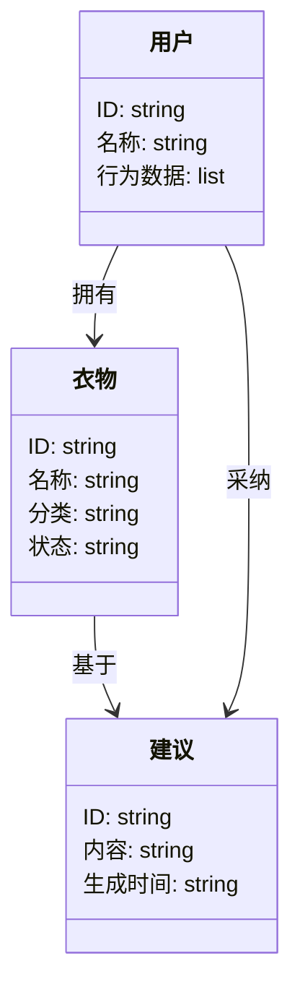
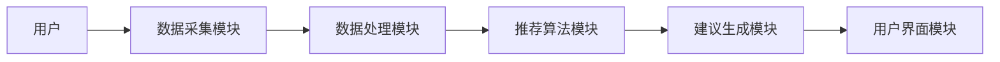
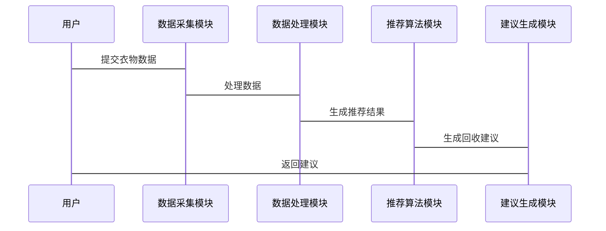

                 


# 智能衣柜：AI Agent的衣物回收建议系统

## 关键词：AI Agent，衣物回收，智能衣柜，推荐系统，环保科技

## 摘要：  
本文介绍了一种基于AI Agent的智能衣柜衣物回收建议系统，探讨了其在衣物管理、环保科技和人工智能技术中的应用。通过分析衣物回收的现状与挑战，结合AI Agent的核心原理，详细阐述了系统的实现方法和应用场景。本文旨在为衣物管理提供一种智能化解决方案，同时强调环保与科技的结合，为未来衣物回收行业提供新的思路。

---

## 第一部分: 智能衣柜与AI Agent的背景介绍

### 第1章: 智能衣柜与AI Agent概述

#### 1.1 问题背景与目标
##### 1.1.1 衣物管理的现状与挑战
- 衣物管理问题日益突出：衣柜空间有限，衣物数量增多，管理效率低下。
- 衣物浪费现象严重：大量衣物被闲置或丢弃，造成资源浪费和环境污染。
- 用户需求多样化：用户希望提高衣物利用率，同时减少资源浪费。

##### 1.1.2 AI Agent在衣物管理中的应用前景
- AI Agent的核心优势：智能化、个性化、实时反馈。
- 衣物管理中的AI Agent应用：衣物分类、推荐、回收建议。

##### 1.1.3 智能衣柜的核心目标与意义
- 核心目标：通过AI技术优化衣物管理，提高衣物利用率。
- 意义：减少资源浪费，推动环保，提升用户体验。

#### 1.2 衣物回收建议系统的定义与特点
##### 1.2.1 衣物回收建议系统的定义
- 基于AI Agent的衣物回收系统：通过分析用户的衣物数据，提供个性化的回收建议。

##### 1.2.2 系统的核心功能与特点
- 功能：衣物分类、推荐、回收建议。
- 特点：智能化、个性化、高效性。

#### 1.3 本章小结
- 总结了智能衣柜与AI Agent的基本概念和应用前景，明确了系统的核心目标和意义。

---

## 第二部分: 核心概念与联系

### 第2章: AI Agent与衣物回收建议系统的原理

#### 2.1 AI Agent的基本原理
##### 2.1.1 AI Agent的定义与核心要素
- AI Agent的定义：智能主体，具备感知环境、自主决策、执行任务的能力。
- 核心要素：感知、推理、决策、执行。

##### 2.1.2 AI Agent的分类与应用场景
- 分类：简单反射型、基于模型的反射型、目标驱动型、效用驱动型。
- 应用场景：衣物管理、智能家居、个性化推荐。

##### 2.1.3 AI Agent在衣物管理中的具体实现
- 数据收集：用户行为数据、衣物属性数据。
- 数据分析：基于用户行为和衣物属性的分析。
- 决策与执行：生成衣物分类、推荐、回收建议。

#### 2.2 衣物回收建议系统的实体关系分析
##### 2.2.1 实体关系图（ER图）的构建
- 用户：用户的衣物数据、行为数据。
- 衣物：衣物的属性、分类、状态。
- 建议：AI Agent生成的回收建议。

##### 2.2.2 用户、衣物、建议三者的关系分析
- 用户与衣物的关系：用户拥有衣物。
- 衣物与建议的关系：建议基于衣物属性生成。
- 用户与建议的关系：用户根据建议进行操作。

##### 2.2.3 系统核心实体的属性与操作
- 用户：ID、名称、行为数据。
- 衣物：ID、名称、分类、状态。
- 建议：ID、内容、生成时间。

#### 2.3 本章小结
- 详细阐述了AI Agent的基本原理和在衣物管理中的具体实现，构建了系统的实体关系模型。

---

## 第三部分: 算法原理讲解

### 第3章: 衣物推荐算法的原理与实现

#### 3.1 基于协同过滤的推荐算法
##### 3.1.1 协同过滤的基本原理
- 协同过滤的核心思想：基于用户行为的相似性，推荐相似用户的物品。

##### 3.1.2 用户相似度计算公式
$$ 相似度 = \frac{\sum (x_i - \mu)(y_i - \mu)}{\sqrt{\sum (x_i - \mu)^2} \cdot \sqrt{\sum (y_i - \mu)^2}} $$
其中，$\mu$ 表示用户行为的平均值。

##### 3.1.3 物品相似度计算公式
$$ 相似度 = \frac{\sum x_i y_i}{\sqrt{\sum x_i^2} \cdot \sqrt{\sum y_i^2}} $$

#### 3.2 基于内容的推荐算法
##### 3.2.1 内容特征提取方法
- 衣物属性：材质、颜色、款式、品牌。
- 用户偏好：颜色偏好、品牌偏好。

##### 3.2.2 基于向量空间模型的相似度计算
$$ 相似度 = \frac{\sum x_i y_i}{\sqrt{\sum x_i^2} \cdot \sqrt{\sum y_i^2}} $$

#### 3.3 混合推荐模型
##### 3.3.1 混合推荐模型的构建
- 协同过滤与内容推荐的结合：利用用户行为数据和衣物属性数据，生成综合建议。

##### 3.3.2 混合推荐模型的优势
- 提高推荐的准确性和多样性。

---

## 第四部分: 系统分析与架构设计

### 第4章: 衣物回收建议系统的架构设计

#### 4.1 问题场景介绍
- 用户需求：提高衣物利用率，减少浪费。
- 系统目标：基于AI Agent，提供智能化的衣物回收建议。

#### 4.2 系统功能设计
##### 4.2.1 领域模型类图


#### 4.3 系统架构设计
##### 4.3.1 系统架构图


#### 4.4 系统接口设计
##### 4.4.1 接口设计
- 数据采集接口：获取用户行为数据和衣物属性数据。
- 推荐接口：返回衣物推荐结果。
- 回收建议接口：返回回收建议。

##### 4.4.2 系统交互流程图


---

## 第五部分: 项目实战

### 第5章: 衣物回收建议系统的实现

#### 5.1 环境安装
- Python 3.8+
- 推荐算法库：scikit-learn
- 数据处理库：pandas
- 可视化工具：Matplotlib

#### 5.2 核心代码实现
##### 5.2.1 数据采集模块
```python
def collect_data(user_id):
    # 数据采集逻辑
    pass
```

##### 5.2.2 数据处理模块
```python
def process_data(data):
    # 数据处理逻辑
    pass
```

##### 5.2.3 推荐算法模块
```python
def collaborative_filtering(user_id):
    # 协同过滤算法实现
    pass
```

##### 5.2.4 建议生成模块
```python
def generate_recommendations(user_id):
    # 建议生成逻辑
    pass
```

#### 5.3 代码解读与分析
- 数据采集模块：负责获取用户行为数据和衣物属性数据。
- 数据处理模块：对数据进行清洗和预处理。
- 推荐算法模块：基于协同过滤算法生成推荐结果。
- 建议生成模块：根据推荐结果生成回收建议。

#### 5.4 实际案例分析
- 案例1：用户A的衣物数据分析与回收建议。
- 案例2：用户B的衣物数据分析与回收建议。

#### 5.5 本章小结
- 详细讲解了系统的实现过程，包括环境安装、核心代码实现、案例分析等。

---

## 第六部分: 总结与展望

### 第6章: 智能衣柜与AI Agent的总结与展望

#### 6.1 系统的创新点与环保意义
- 创新点：基于AI Agent的衣物回收建议系统，实现了智能化衣物管理。
- 环保意义：减少衣物浪费，推动环保事业。

#### 6.2 系统的优化方向
- 数据隐私保护：加强用户数据隐私保护。
- 系统性能优化：提升算法效率和系统响应速度。

#### 6.3 本章小结
- 总结了系统的创新点和环保意义，展望了未来的优化方向。

---

## 作者：AI天才研究院/AI Genius Institute & 禅与计算机程序设计艺术 /Zen And The Art of Computer Programming

---

**注**：以上为文章的完整目录和内容框架，具体实现时需要根据实际需求进行调整和补充。

