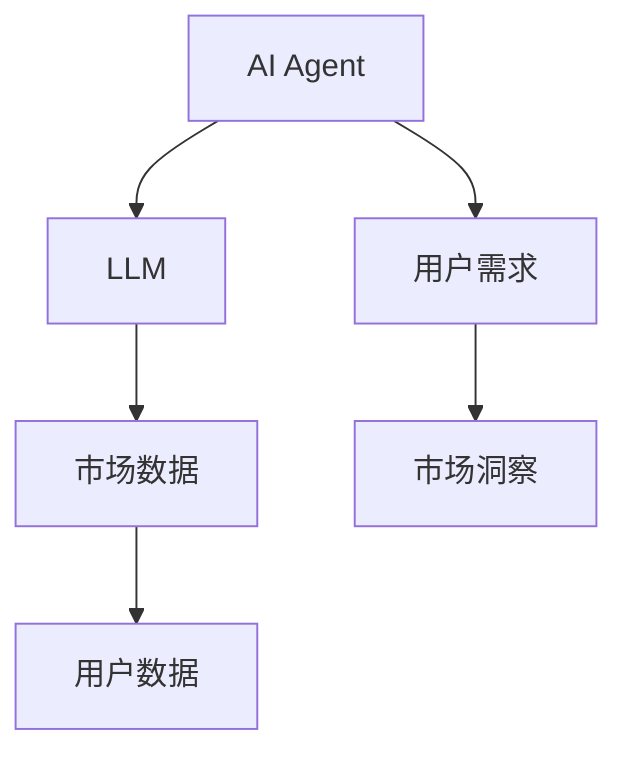
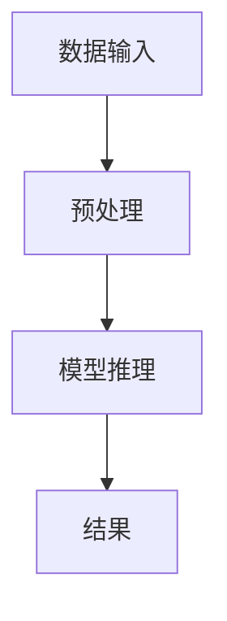
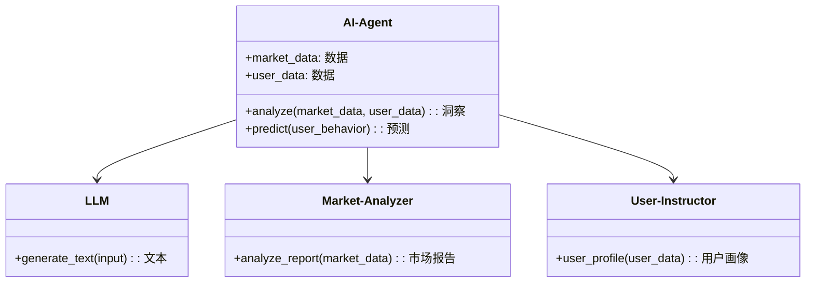
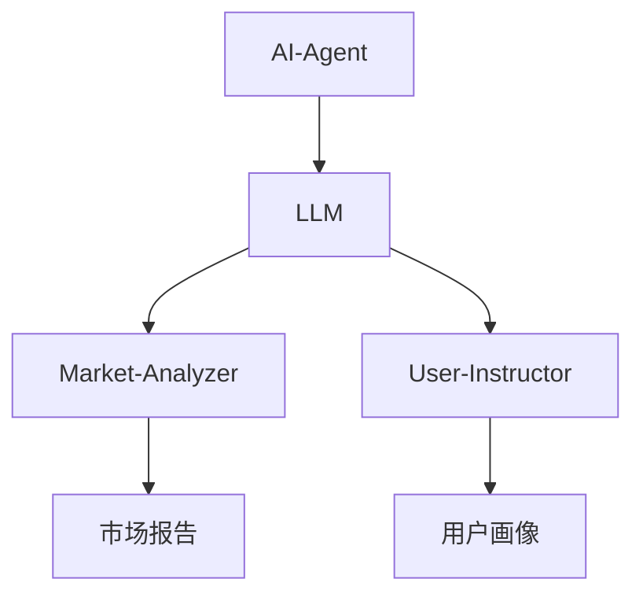
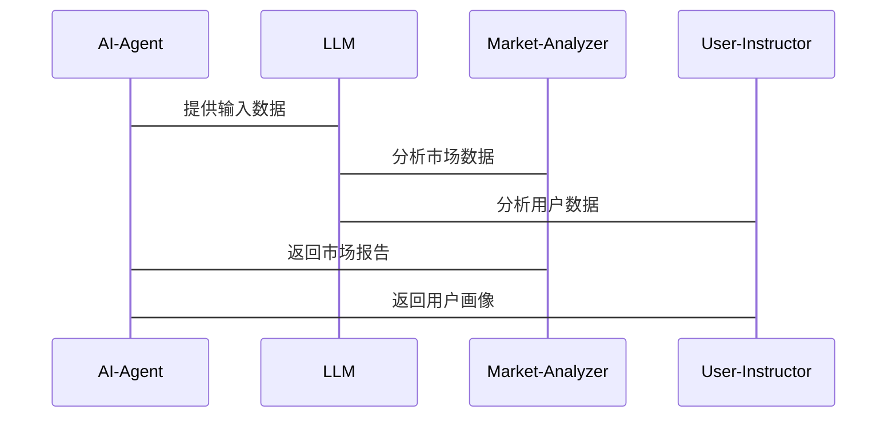

                 


# 智能调研 AI Agent：LLM 辅助市场分析与用户洞察

> 关键词：AI Agent, LLM, 市场分析, 用户洞察, 人工智能, 大语言模型, 智能调研

> 摘要：本文将深入探讨如何利用大语言模型（LLM）构建智能调研 AI Agent，以辅助市场分析和用户洞察。通过结合AI Agent的核心概念、LLM的技术原理、系统架构设计以及实际项目案例，本文旨在为读者提供从理论到实践的全面指导，展示如何利用先进的AI技术提升市场分析和用户研究的效率与准确性。

---

# 第1章: AI Agent 与 LLM 的基本概念

## 1.1 AI Agent 的定义与特点

### 1.1.1 AI Agent 的定义  
AI Agent（人工智能代理）是指能够感知环境、自主决策并执行任务的智能实体。它可以是一个软件程序、一个机器人或任何具备AI能力的实体，其目标是通过与环境的交互实现特定目标。

### 1.1.2 AI Agent 的核心特点  
1. **自主性**：AI Agent能够自主决策，无需外部干预。  
2. **反应性**：能够实时感知环境并做出反应。  
3. **目标导向**：所有行为都围绕实现特定目标展开。  
4. **学习能力**：通过数据和经验不断优化自身性能。  

### 1.1.3 AI Agent 与传统自动化工具的区别  
AI Agent不仅能够执行预设任务，还能通过学习和推理适应新场景，而传统自动化工具仅能执行固定任务。

---

## 1.2 LLM 的定义与特点

### 1.2.1 大语言模型的定义  
LLM（Large Language Model）是基于深度学习的自然语言处理模型，能够理解和生成人类语言，如GPT系列模型。

### 1.2.2 LLM 的核心特点  
1. **大规模训练数据**：通常使用数十亿参数进行训练，能够捕捉语言的复杂性。  
2. **多任务能力**：通过调整参数和输入，可以完成多种任务，如文本生成、问答系统等。  
3. **上下文理解**：能够处理长上下文，理解复杂语义。  

### 1.2.3 LLM 的主要应用场景  
1. **自然语言处理**：文本生成、翻译、问答等。  
2. **内容创作**：辅助写作、营销文案生成等。  
3. **数据分析**：从文本中提取信息、情感分析等。  

---

## 1.3 AI Agent 在市场分析与用户洞察中的作用

### 1.3.1 AI Agent 的核心功能  
1. **数据采集**：自动收集市场和用户数据。  
2. **数据分析**：通过LLM进行数据理解和洞察提取。  
3. **决策支持**：基于分析结果提供优化建议。  

### 1.3.2 LLM 在市场分析中的应用  
1. **文本挖掘**：从新闻、报告中提取市场趋势。  
2. **竞争分析**：分析竞争对手的产品和策略。  
3. **用户评论分析**：从社交媒体中提取用户反馈。  

### 1.3.3 用户洞察中的 AI Agent 实践  
1. **用户画像构建**：通过数据分析生成用户画像。  
2. **行为预测**：基于历史数据预测用户行为。  
3. **个性化推荐**：根据用户偏好推荐产品或服务。  

---

## 1.4 本章小结  
本章介绍了AI Agent和LLM的基本概念及其在市场分析和用户洞察中的作用，为后续内容奠定了理论基础。

---

# 第2章: 智能调研 AI Agent 的问题背景与需求分析

## 2.1 市场分析的传统方法与挑战

### 2.1.1 传统市场分析方法的局限性  
1. **数据量不足**：传统方法依赖少量样本数据，可能导致结果偏差。  
2. **分析效率低**：手动分析耗时且成本高。  
3. **洞察深度有限**：难以从非结构化数据中提取有价值的信息。  

### 2.1.2 数据收集与处理的挑战  
1. **数据多样性**：市场数据来源多样，难以统一处理。  
2. **数据质量**：数据可能存在噪声，影响分析结果。  
3. **数据隐私**：数据收集和处理需遵守隐私保护法规。  

### 2.1.3 分析效率与准确性的提升需求  
随着市场竞争加剧，企业需要更高效、准确的市场分析方法。

---

## 2.2 用户洞察的传统方法与挑战

### 2.2.1 用户调研的传统方式  
1. **问卷调查**：依赖人工设计和分析问卷。  
2. **焦点小组**：成本高，覆盖面有限。  
3. **用户访谈**：耗时且依赖访谈技巧。  

### 2.2.2 数据分析的复杂性  
1. **数据量大**：用户数据通常非常庞大。  
2. **数据维度多**：需要处理多种数据类型。  
3. **分析深度不足**：难以挖掘深层用户需求。  

### 2.2.3 用户行为预测的难点  
1. **数据稀疏性**：某些用户行为数据不足。  
2. **行为模式复杂**：用户行为受多种因素影响。  
3. **实时性要求高**：需要快速预测和响应。  

---

## 2.3 AI Agent 在市场分析与用户洞察中的问题解决

### 2.3.1 AI Agent 的问题解决思路  
1. **自动化数据采集**：通过爬虫等技术自动收集数据。  
2. **智能数据分析**：利用LLM处理结构化和非结构化数据。  
3. **实时反馈与优化**：根据分析结果动态调整策略。  

### 2.3.2 LLM 在市场分析中的应用价值  
1. **文本挖掘**：从非结构化数据中提取有用信息。  
2. **趋势预测**：基于历史数据预测市场走向。  
3. **竞争分析**：快速分析竞争对手的动态。  

### 2.3.3 用户洞察中的 AI Agent 解决方案  
1. **用户画像构建**：整合多源数据生成精准画像。  
2. **行为预测模型**：基于机器学习预测用户行为。  
3. **个性化推荐系统**：根据用户偏好推荐相关内容。  

---

## 2.4 本章小结  
本章分析了传统市场分析和用户洞察的局限性，并提出了AI Agent作为解决方案的核心思路。

---

# 第3章: 智能调研 AI Agent 的核心概念与联系

## 3.1 核心概念原理

### 3.1.1 AI Agent 的工作原理  
AI Agent通过感知环境、分析数据、制定决策并执行操作来完成任务。其核心包括感知模块、决策模块和执行模块。

### 3.1.2 LLM 的工作原理  
LLM通过多层神经网络处理输入数据，生成与输入匹配的输出。其关键组件包括编码器、解码器和注意力机制。

---

## 3.2 核心概念属性特征对比

| **属性**      | **AI Agent**         | **LLM**             |
|----------------|----------------------|---------------------|
| **目标**       | 执行特定任务         | 生成人类语言        |
| **输入**       | 多种数据格式         | 文本数据            |
| **输出**       | 动作或决策           | 文本生成            |
| **学习方式**   | 监督或强化学习       | 监督学习             |
| **应用场景**   | 通用任务自动化       | 自然语言处理        |

---

## 3.3 ER 实体关系图架构



---

## 3.4 本章小结  
本章通过对比和图解，展示了AI Agent和LLM的核心概念及其在智能调研中的联系。

---

# 第4章: 智能调研 AI Agent 的算法原理

## 4.1 LLM 的算法原理

### 4.1.1 变压器模型的结构  
LLM通常基于Transformer模型，由编码器和解码器组成。编码器将输入序列编码为上下文表示，解码器根据编码结果生成输出序列。

### 4.1.2 注意力机制的实现  
注意力机制通过计算输入序列中每个位置的重要性，聚焦关键信息。其公式为：

$$
\text{Attention}(Q, K, V) = \text{softmax}\left(\frac{QK^T}{\sqrt{d_k}}\right)V
$$

其中，$Q$ 是查询向量，$K$ 是键向量，$V$ 是值向量，$d_k$ 是维度。

### 4.1.3 梯度下降优化算法  
常用的优化算法包括随机梯度下降（SGD）和Adam优化器。Adam优化器公式为：

$$
m_t = \beta_1 m_{t-1} + (1-\beta_1)g_t
$$  
$$
v_t = \beta_2 v_{t-1} + (1-\beta_2)g_t^2
$$  
$$
\theta_{t} = \theta_{t-1} - \alpha \frac{m_t}{\sqrt{v_t}+\epsilon}
$$

其中，$\alpha$ 是学习率，$\beta_1$ 和 $\beta_2$ 是动量参数，$\epsilon$ 是小量以避免除以零。

---

## 4.2 智能调研 AI Agent 的算法流程



---

## 4.3 本章小结  
本章详细介绍了LLM的算法原理及其在AI Agent中的应用流程。

---

# 第5章: 智能调研 AI Agent 的系统分析与架构设计方案

## 5.1 项目介绍

### 5.1.1 项目背景  
本项目旨在利用AI Agent和LLM技术，构建一个智能市场分析和用户洞察系统。

### 5.1.2 项目目标  
1. 实现市场数据的自动采集和分析。  
2. 提供用户行为预测和个性化推荐功能。  

---

## 5.2 系统功能设计



---

## 5.3 系统架构设计



---

## 5.4 系统接口设计



---

## 5.5 本章小结  
本章详细设计了智能调研 AI Agent的系统架构和接口，为后续实现奠定了基础。

---

# 第6章: 智能调研 AI Agent 的项目实战

## 6.1 环境安装

### 6.1.1 安装Python  
确保安装Python 3.8及以上版本。

### 6.1.2 安装依赖库  
安装必要的库，如`transformers`, `numpy`, `pandas`等：

```bash
pip install transformers numpy pandas
```

---

## 6.2 系统核心实现源代码

### 6.2.1 数据预处理代码

```python
import pandas as pd

def preprocess_data(data):
    # 数据清洗
    data = data.dropna()
    # 标准化处理
    from sklearn.preprocessing import StandardScaler
    scaler = StandardScaler()
    data = scaler.fit_transform(data)
    return data
```

---

### 6.2.2 LLM 接口实现代码

```python
from transformers import AutoModelForCausalLM, AutoTokenizer

class LLM_Interface:
    def __init__(self, model_name):
        self.model = AutoModelForCausalLM.from_pretrained(model_name)
        self.tokenizer = AutoTokenizer.from_pretrained(model_name)
    
    def generate_text(self, input_text):
        inputs = self.tokenizer.encode(input_text, return_tensors="pt")
        outputs = self.model.generate(inputs, max_length=50)
        return self.tokenizer.decode(outputs[0], skip_special_tokens=True)
```

---

### 6.2.3 市场分析实现代码

```python
class Market_Analyzer:
    def __init__(self, llm_interface):
        self.llm = llm_interface
    
    def analyze_report(self, market_data):
        report = self.llm.generate_text(market_data)
        return report
```

---

## 6.3 代码应用解读与分析

### 6.3.1 数据预处理  
数据预处理代码用于清洗和标准化数据，确保输入模型的数据质量。

### 6.3.2 LLM 接口实现  
LLM_Interface类封装了与大语言模型交互的接口，方便后续调用。

### 6.3.3 市场分析实现  
Market_Analyzer类利用LLM生成市场分析报告，展示了AI Agent在实际应用中的功能。

---

## 6.4 实际案例分析

### 6.4.1 案例背景  
假设我们有一个电商公司，需要分析市场趋势和用户行为。

### 6.4.2 数据收集  
收集过去一年的销售数据和用户评论。

### 6.4.3 数据处理  
使用预处理代码清洗数据，去除缺失值并标准化。

### 6.4.4 市场分析  
调用LLM生成市场趋势报告，识别主要竞争对手和用户偏好。

### 6.4.5 用户洞察  
通过LLM分析用户评论，生成用户画像和行为预测。

---

## 6.5 项目小结  
本章通过实际案例展示了智能调研 AI Agent的实现过程，从数据预处理到市场分析，完整地呈现了系统的应用价值。

---

# 第7章: 智能调研 AI Agent 的最佳实践与注意事项

## 7.1 最佳实践 tips

### 7.1.1 数据隐私保护  
确保数据处理符合相关法律法规，保护用户隐私。

### 7.1.2 模型优化  
定期更新模型参数，保持模型性能。

### 7.1.3 系统维护  
定期检查系统稳定性，及时修复漏洞。

---

## 7.2 注意事项

### 7.2.1 数据质量  
确保输入数据的准确性和完整性。  
### 7.2.2 模型选择  
根据具体任务选择合适的LLM模型。  
### 7.2.3 系统安全  
防止数据泄露和网络攻击。

---

## 7.3 本章小结  
本章总结了智能调研 AI Agent的最佳实践和注意事项，帮助读者更好地应用这些技术。

---

# 结语

智能调研 AI Agent结合了AI Agent和LLM的优势，为市场分析和用户洞察提供了高效、智能的解决方案。通过本文的系统介绍和实际案例，读者可以全面了解如何利用这些技术提升市场分析和用户研究的效率与准确性。

---

# 作者：AI天才研究院/AI Genius Institute & 禅与计算机程序设计艺术 /Zen And The Art of Computer Programming

---

