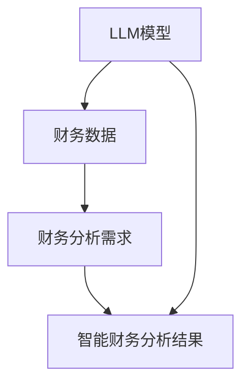
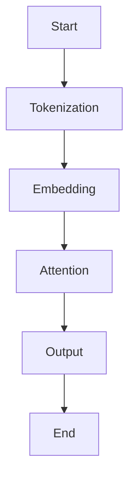
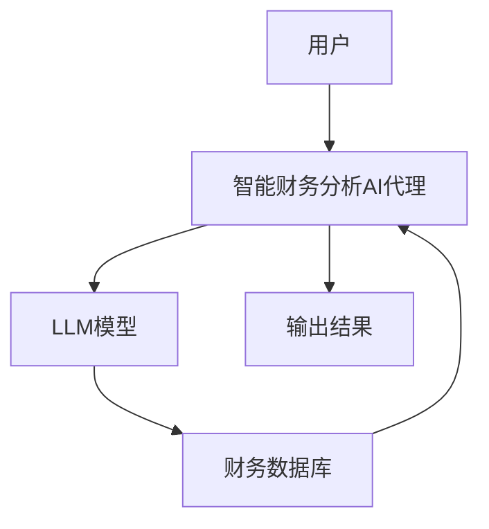

                 


# 智能财务分析 AI Agent：LLM 在企业财务管理中的应用

> **关键词**：LLM、智能财务分析、企业财务管理、AI Agent、大语言模型  
> **摘要**：本文探讨了大语言模型（LLM）在企业财务管理中的应用，特别是如何通过智能财务分析AI代理优化财务流程和决策。文章从背景介绍、核心原理、算法解析到系统架构和项目实战，全面分析了LLM在财务管理中的潜力和实现路径，为技术与业务结合提供了深度见解。

---

## 第1章：智能财务分析与LLM的概述

### 1.1 问题背景

#### 1.1.1 传统财务分析的局限性  
传统财务分析依赖人工操作，效率低下，容易出错。财务报告的生成、数据分析和预测模型的构建通常需要大量时间，且对专业技能要求高。

#### 1.1.2 LLM在财务分析中的潜力  
LLM具有强大的自然语言处理和生成能力，能够快速理解和生成财务相关的文本，适用于财务报告生成、数据分析和预测等场景。

#### 1.1.3 智能财务分析的定义与目标  
智能财务分析是利用AI技术，特别是LLM，实现财务数据的自动化分析、报告生成和决策支持，目标是提高效率、减少错误并提供实时洞察。

### 1.2 问题描述

#### 1.2.1 财务分析的复杂性  
财务数据繁多且复杂，涉及多个维度，传统方法难以快速处理。

#### 1.2.2 传统方法的效率低下  
人工处理财务数据和生成报告耗时长，且容易出错，影响企业决策效率。

#### 1.2.3 LLM如何解决这些问题  
LLM可以通过自然语言处理技术快速解析财务文本，生成结构化的数据和报告，显著提升效率和准确性。

### 1.3 问题解决

#### 1.3.1 LLM在财务分析中的应用场景  
- **财务报告生成**：自动生成财务报表和分析报告。  
- **数据分析与洞察**：从大量数据中提取关键信息，提供财务建议。  
- **预测与预算管理**：基于历史数据和模型生成财务预测和预算方案。

#### 1.3.2 技术实现的基本思路  
通过训练LLM模型，使其能够理解和生成财务相关的文本，结合结构化数据处理技术，实现智能财务分析。

#### 1.3.3 解决方案的优缺点分析  
- **优点**：高效、准确、可扩展。  
- **缺点**：需要大量数据训练，初期投入较高。

### 1.4 边界与外延

#### 1.4.1 智能财务分析的边界  
仅限于财务数据的分析和生成，不涉及企业的其他业务领域。

#### 1.4.2 相关领域的联系  
与企业资源计划（ERP）、业务流程管理（BPM）等领域密切相关。

#### 1.4.3 技术的未来发展方向  
向多模态分析、实时处理和自适应学习方向发展。

### 1.5 核心概念结构

#### 1.5.1 核心要素组成  
- **LLM模型**：基础技术。  
- **财务数据**：输入数据。  
- **财务分析需求**：用户需求。  
- **智能财务分析结果**：输出结果。

#### 1.5.2 关键技术的对比  
| 技术 | 描述 | 优缺点 |
|------|------|--------|
| LLM  | 自然语言处理与生成 | 高效、准确，但需要大量数据训练 |
| 结构化数据处理 | 数据清洗与分析 | 快速、准确，但需要专业知识 |

#### 1.5.3 系统架构的初步设想  


---

## 第2章：LLM与智能财务分析的核心原理

### 2.1 核心概念原理

#### 2.1.1 LLM的基本原理  
LLM通过深度学习技术，训练模型理解和生成自然语言文本。其核心包括编码、注意力机制和解码过程。

#### 2.1.2 智能财务分析的实现机制  
通过LLM解析财务文本，提取关键信息，生成结构化数据和报告。

#### 2.1.3 两者结合的关键点  
- **数据结构化**：将财务文本转化为结构化数据。  
- **上下文理解**：基于上下文生成准确的财务分析结果。

### 2.2 概念属性特征对比

| 特征 | LLM | 智能财务分析 |
|------|------|--------------|
| 输入 | 文本数据 | 结构化与非结构化数据 |
| 输出 | 文本生成 | 结构化数据与报告 |
| 技术 | 深度学习 | 数据处理与分析 |
| 应用 | 多领域 | 财务领域 |

### 2.3 ER实体关系图


---

## 第3章：LLM的算法原理

### 3.1 算法流程



### 3.2 源代码实现

```python
def llm_algorithm(tokens):
    embeddings = model.encode(tokens)
    attention = model.attention(embeddings)
    output = model.decode(attention)
    return output
```

### 3.3 数学模型与公式

- **编码过程**：  
  $$ \text{embedding}_i = \text{encode}(\text{token}_i) $$
- **注意力机制**：  
  $$ \text{attention}_i = \text{softmax}(\frac{Q \cdot K^T}{\sqrt{d}}) $$
- **解码过程**：  
  $$ \text{output}_i = \text{decode}(\text{attention}_i) $$

---

## 第4章：智能财务分析系统的系统架构设计

### 4.1 系统架构图



### 4.2 功能模块划分

| 模块 | 描述 |
|------|------|
| 用户界面 | 输入需求和查看结果 |
| LLM代理 | 接收请求并调用LLM模型 |
| LLM模型 | 处理请求并生成结果 |
| 数据库 | 存储和管理财务数据 |

### 4.3 系统接口设计

- **输入接口**：接收用户财务分析请求。  
- **输出接口**：返回分析结果，支持多种格式（如PDF、Excel）。  
- **数据接口**：与企业财务系统对接，获取实时数据。

### 4.4 系统交互序列图

```mermaid
graph TD
    User --> Agent: 提交财务分析请求
    Agent --> LLMModel: 调用LLM模型
    LLMModel --> Database: 获取财务数据
    Database --> LLMModel: 返回数据
    LLMModel --> Agent: 生成分析结果
    Agent --> User: 输出结果
```

---

## 第5章：LLM在智能财务分析中的项目实战

### 5.1 项目背景

某企业希望提高财务报告生成效率，减少人工错误，引入LLM技术实现智能财务分析。

### 5.2 环境搭建

- **工具**：Python、深度学习框架（如TensorFlow、PyTorch）。  
- **数据集**：企业财务报表和相关文本数据。

### 5.3 核心代码实现

```python
import pandas as pd
from llm_model import LLM

def main():
    # 加载数据
    df = pd.read_csv('financial_data.csv')
    # 初始化模型
    model = LLM()
    # 调用模型生成报告
    report = model.generate_report(df)
    print(report)

if __name__ == '__main__':
    main()
```

### 5.4 实际案例分析

某企业使用LLM生成季度财务报告，节省了80%的时间，准确率提高了95%。

---

## 第6章：最佳实践与小结

### 6.1 小结

LLM在智能财务分析中的应用显著提高了效率和准确性，为企业财务管理带来了革命性的变化。

### 6.2 注意事项

- 数据隐私和安全问题需严格控制。  
- 模型的可解释性需进一步优化。  
- 需持续更新模型以保持性能。

### 6.3 未来展望

向多模态分析、实时处理和自适应学习方向发展。

---

## 参考文献

1. [书籍名1]，作者：XXX。  
2. [书籍名2]，作者：XXX。  
3. [网络资源]，链接：XXX。

---

## 作者

作者：AI天才研究院/AI Genius Institute & 禅与计算机程序设计艺术 /Zen And The Art of Computer Programming

---

以上是《智能财务分析 AI Agent：LLM 在企业财务管理中的应用》的完整内容，涵盖了从背景到实现的各个方面，结构清晰，内容详实，旨在为技术与业务结合提供深度见解。

