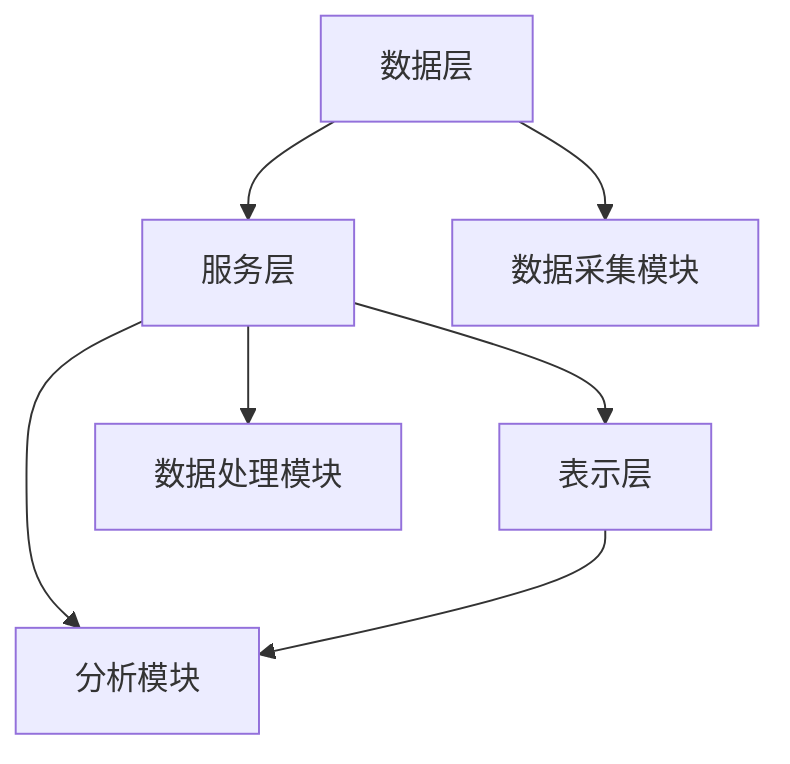

                 


# 智能财务分析AI Agent：LLM在企业决策中的应用

> 关键词：LLM、AI Agent、财务分析、企业决策、智能系统、大语言模型  
> 摘要：本文探讨大语言模型（LLM）在智能财务分析中的应用，分析其技术原理与企业决策中的价值，通过实际案例展示如何利用LLM优化财务分析流程，为企业提供高效决策支持。

---

## 第一部分：智能财务分析的背景与概述

### 第1章：AI Agent与LLM的基本概念

#### 1.1 AI Agent的基本概念

- **AI Agent的定义与特点**
  - AI Agent是一种智能主体，能够感知环境并执行目标导向的行为。
  - 具备自主性、反应性、目标导向性和社交能力。

- **AI Agent在企业中的作用**
  - 协助决策：通过分析数据提供优化建议。
  - 自动化处理：执行重复性任务，提高效率。
  - 实时反馈：监控企业运营状态，及时预警。

- **智能财务分析的定义与特点**
  - 利用AI技术，自动化分析财务数据，生成见解。
  - 实时监控，动态调整分析结果。

#### 1.2 大语言模型（LLM）的基本概念

- **LLM的定义与特点**
  - 基于Transformer架构，具有强大的上下文理解能力。
  - 参数量大，能够处理多种任务，如文本生成、问答等。

- **LLM与传统NLP模型的区别**
  - 传统模型：针对特定任务训练，如情感分析。
  - LLM：通用性强，适应多种任务，通过提示工程实现定制化。

- **LLM在智能财务分析中的应用前景**
  - 自动生成财务报告，解析复杂数据。
  - 提供实时市场分析，辅助投资决策。

---

### 第2章：智能财务分析的背景与应用价值

#### 2.1 财务分析的现状与挑战

- **传统财务分析的痛点**
  - 数据量大，分析耗时。
  - 依赖人工经验，结果可能有偏差。
  - 跨部门协作复杂，数据孤岛问题。

- **智能财务分析的优势与价值**
  - 提高效率，节省时间。
  - 增强准确性，提供可靠决策依据。
  - 实现数据整合，打破孤岛。

#### 2.2 智能财务分析的应用场景

- **财务报告生成**
  - 自动生成财务报表，分析趋势。
  - 识别关键指标，生成可视化图表。

- **风险预警与预测**
  - 监控财务风险，预测潜在问题。
  - 提供实时预警，协助决策者应对风险。

---

## 第二部分：LLM的原理与技术

### 第3章：LLM的核心原理

#### 3.1 LLM的模型结构

- **Transformer架构**
  - 由编码器和解码器组成。
  - 注意力机制：捕捉输入中的关键信息。

- **多层神经网络**
  - 每层包含自注意力机制和前馈网络。
  - 参数量庞大，提升模型表达能力。

#### 3.2 LLM的训练与优化

- **预训练目标**
  - 使用大规模数据进行无监督预训练。
  - 目标函数：预测下一个词的概率分布。

- **微调策略**
  - 根据具体任务调整模型参数。
  - 使用任务特定的数据进行Fine-tuning。

#### 3.3 LLM的推理机制

- **生成策略**
  - 采样方法：如贪心搜索和随机采样。
  - 温度参数：调节生成的多样性和确定性。

- **解码过程**
  - 逐步生成文本，实时调整生成策略。

---

### 第4章：LLM的多模态能力与应用

#### 4.1 多模态能力的实现

- **多模态数据处理**
  - 同时处理文本、图像和表格数据。
  - 使用跨模态注意力机制，关联不同数据类型。

- **多任务学习**
  - 同一模型完成多种任务，如翻译和问答。
  - 使用任务权重，平衡各任务的影响。

#### 4.2 LLM在财务分析中的应用

- **跨模态数据处理**
  - 结合财务报表和市场新闻，进行综合分析。
  - 自动生成可视化图表，辅助理解。

- **多任务财务分析**
  - 同时进行趋势预测和风险评估。
  - 融合多源数据，提升分析准确性。

---

## 第三部分：AI Agent的系统架构与设计

### 第5章：AI Agent的系统架构设计

#### 5.1 系统架构概述

- **分层架构**
  - 数据层：存储原始数据和处理结果。
  - 服务层：提供API接口，处理用户请求。
  - 表示层：展示分析结果，与用户交互。

- **模块划分**
  - 数据采集模块：获取财务数据。
  - 数据处理模块：清洗和预处理数据。
  - 分析模块：利用LLM进行深度分析。
  - 结果展示模块：生成可视化报告。

#### 5.2 系统架构图



---

### 第6章：系统设计与功能实现

#### 6.1 功能模块设计

- **数据采集模块**
  - 从ERP系统获取财务数据。
  - 支持多种数据格式，如CSV和Excel。

- **数据处理模块**
  - 数据清洗：处理缺失值和异常值。
  - 数据转换：将数据转换为模型可接受的格式。

- **分析模块**
  - 调用LLM进行文本生成和问答。
  - 生成财务报告和风险预警。

---

## 第四部分：项目实战与实现

### 第7章：项目环境搭建

#### 7.1 环境安装

- 安装Python 3.8及以上版本。
- 安装必要的库：如transformers和torch。

```bash
pip install transformers torch
```

#### 7.2 项目初始化

- 创建项目目录结构。
- 初始化配置文件，如API密钥配置。

---

### 第8章：系统核心实现

#### 8.1 数据处理代码

```python
import pandas as pd

def process_data(data_path):
    df = pd.read_csv(data_path)
    df.dropna(inplace=True)
    return df
```

#### 8.2 LLM调用代码

```python
from transformers import AutoTokenizer, AutoModelForCausalLM

model_name = "gpt2-large"
tokenizer = AutoTokenizer.from_pretrained(model_name)
model = AutoModelForCausalLM.from_pretrained(model_name)
```

---

## 第五部分：企业级应用与最佳实践

### 第9章：企业需求分析与场景设计

#### 9.1 企业需求分析

- **财务报告生成**
  - 自动生成月报和季报。
  - 提供数据可视化支持。

- **风险预警**
  - 监控财务指标，预测潜在风险。
  - 提供实时预警和应对策略。

---

### 第10章：系统部署与优化

#### 10.1 系统部署方案

- 使用容器化技术部署，如Docker。
- 部署到私有服务器，确保数据安全。

#### 10.2 性能优化策略

- 优化模型推理速度，减少延迟。
- 使用分布式训练，提升处理能力。

---

## 第六部分：总结与展望

### 第11章：总结与展望

#### 11.1 全文总结

- LLM技术为智能财务分析带来革命性变化。
- AI Agent在企业决策中的应用前景广阔。

#### 11.2 未来展望

- 模型优化：提升LLM的准确性和效率。
- 应用扩展：探索更多场景，如智能审计和合规性检查。
- 技术融合：结合其他AI技术，如计算机视觉和知识图谱，提升分析能力。

---

## 作者

作者：AI天才研究院/AI Genius Institute & 禅与计算机程序设计艺术/Zen And The Art of Computer Programming

---

通过以上详细的内容结构，文章系统地介绍了LLM在智能财务分析中的应用，从理论到实践，帮助读者全面理解技术原理和实际应用。

