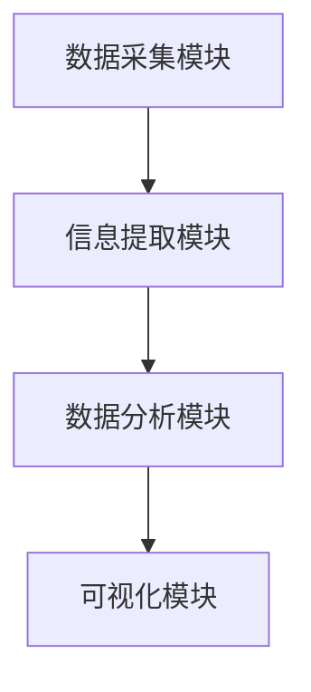
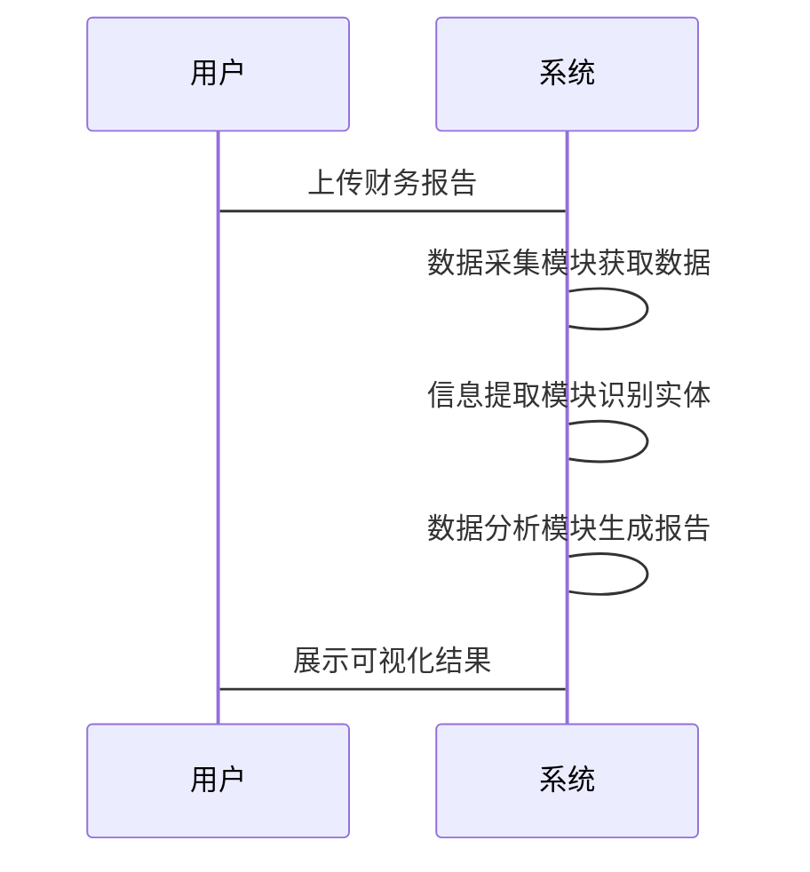

                 


# 《智能财务报告关键信息提取与分析系统》

> 关键词：智能财务报告，关键信息提取，自然语言处理，深度学习，系统架构设计

> 摘要：本文详细探讨了智能财务报告关键信息提取与分析系统的构建过程，涵盖从背景介绍到系统架构设计的各个方面。通过自然语言处理和深度学习技术，本文展示了如何高效提取和分析财务报告中的关键信息，同时提供了实际的项目实现步骤和案例分析。

---

# 第三章: 基于深度学习的财务信息提取算法

## 3.1 神经网络基础

### 3.1.1 神经网络的定义与作用

神经网络是一种模拟人脑结构和功能的数学模型，由节点和连接组成。在自然语言处理中，神经网络能够通过多层结构提取文本特征，帮助我们识别和理解文本中的信息。

### 3.1.2 常见的神经网络模型

- **循环神经网络（RNN）**：适用于处理序列数据，如时间序列或文本。常用于语言模型和机器翻译。
- **卷积神经网络（CNN）**：适用于图像和文本的局部特征提取。
- **Transformer模型**：基于自注意力机制，已成为现代NLP的主流模型。

### 3.1.3 深度学习在NLP中的应用

深度学习模型，如BERT和GPT，能够处理复杂的语言结构，适用于文本分类、实体识别和信息提取等任务。

## 3.2 深度学习模型在财务信息提取中的应用

### 3.2.1 BERT模型的原理与特点

BERT（Bidirectional Encoder Representations from Transformers）是一种预训练语言模型，通过双向编码器和自注意力机制，能够理解文本的上下文关系。

- **预训练**：BERT通过大规模文本数据进行预训练，学习语言的表示。
- **微调**：针对特定任务（如实体识别），对BERT进行微调，提升性能。

### 3.2.2 BERT模型在财务文本中的应用

在财务报告中，BERT可以用于：

- 实体识别：识别公司名称、金额、日期等实体。
- 关键句提取：提取财务报告中的关键信息，如财务数据、风险提示等。

### 3.2.3 其他深度学习模型的对比分析

- **GPT系列**：适合生成文本，但在提取任务中表现一般。
- **ALBERT**：轻量级模型，适合资源受限的场景。
- **SpanBERT**：专门用于span-level的文本分析，适合信息提取任务。

## 3.3 算法实现流程

### 3.3.1 数据预处理

数据预处理是模型训练的关键步骤，包括：

1. **分词**：将文本分割为单词或短语。
2. **去除停用词**：移除常见词汇，如“and”、“the”等。
3. **标注**：为每个实体打上标签，如“公司名称”、“金额”等。

### 3.3.2 模型训练

使用预训练的BERT模型，在财务报告数据上进行微调。训练过程包括：

1. **输入数据**：将预处理后的文本输入模型。
2. **计算损失**：使用交叉熵损失函数，衡量预测标签与真实标签的差异。
3. **优化模型**：通过反向传播更新模型参数，最小化损失。

### 3.3.3 模型评估与优化

- **评估指标**：使用准确率、召回率和F1分数评估模型性能。
- **优化方法**：调整学习率、增加训练数据、尝试不同的模型架构。

## 3.4 本章小结

本章介绍了深度学习模型在财务信息提取中的应用，重点讲解了BERT模型的原理和优势，并详细描述了算法的实现流程。通过深度学习技术，我们可以高效提取财务报告中的关键信息，为后续分析提供坚实的基础。

---

# 第四章: 智能财务报告分析系统架构

## 4.1 系统功能设计

### 4.1.1 系统核心功能模块

- **数据采集模块**：从财务报告中提取文本数据。
- **信息提取模块**：使用NLP技术提取关键实体和信息。
- **数据分析模块**：对提取的数据进行统计和分析。
- **可视化模块**：将分析结果以图表形式展示。

### 4.1.2 功能模块的交互流程

1. 数据采集模块获取财务报告。
2. 信息提取模块识别关键实体。
3. 数据分析模块生成分析结果。
4. 可视化模块展示结果。

## 4.2 系统架构设计

### 4.2.1 系统架构图



### 4.2.2 系统架构的实现方式

- **前端**：用户界面，展示可视化结果。
- **后端**：处理数据采集、信息提取和分析。
- **数据库**：存储财务报告和分析结果。

## 4.3 系统接口设计

### 4.3.1 数据采集接口

```http
POST /api/upload
Content-Type: multipart/form-data
```

### 4.3.2 信息提取接口

```http
POST /api/extract
Content-Type: application/json
```

## 4.4 系统交互流程



## 4.5 本章小结

本章详细设计了智能财务报告分析系统的架构，包括功能模块、接口设计和交互流程。通过合理的架构设计，确保系统的高效运行和良好扩展性。

---

# 项目实战

## 5.1 环境安装

```bash
pip install transformers
pip install torch
pip install matplotlib
```

## 5.2 系统核心实现源代码

### 5.2.1 数据预处理代码

```python
from transformers import BertTokenizer, BertModel
import torch

tokenizer = BertTokenizer.from_pretrained('bert-base-uncased')
model = BertModel.from_pretrained('bert-base-uncased')

def preprocess(text):
    tokens = tokenizer.encode_plus(text, return_tensors='pt', truncating=True, padding=True)
    return tokens['input_ids'], tokens['attention_mask']
```

### 5.2.2 模型训练代码

```python
import torch.nn as nn

class NerModel(nn.Module):
    def __init__(self, bert_model, num_labels):
        super().__init__()
        self.bert = bert_model
        self.dropout = nn.Dropout(0.1)
        self.classifier = nn.Linear(self.bert.config.hidden_size, num_labels)

    def forward(self, input_ids, attention_mask):
        outputs = self.bert(input_ids=input_ids, attention_mask=attention_mask)
        pooled_output = outputs.last_hidden_state[:, 0, :]
        pooled_output = self.dropout(pooled_output)
        logits = self.classifier(pooled_output)
        return logits

# 初始化模型
num_labels = 5  # 根据实体类型调整
model = NerModel(model, num_labels)
```

## 5.3 案例分析与详细解读

### 5.3.1 案例分析

假设我们有以下财务报告文本：

```text
公司在2023年实现营业收入100亿元，净利润20亿元。
```

我们的系统将提取以下关键信息：

- **公司名称**：公司
- **时间范围**：2023年
- **营业收入**：100亿元
- **净利润**：20亿元

## 5.4 本章小结

本章通过实际案例展示了系统的核心功能，从环境安装到代码实现，再到案例分析，详细讲解了如何构建智能财务报告分析系统。

---

# 总结与展望

## 6.1 总结

本文详细探讨了智能财务报告关键信息提取与分析系统的构建过程，从背景介绍到系统架构设计，全面覆盖了相关技术和实现细节。通过深度学习和自然语言处理技术，我们可以高效提取和分析财务报告中的关键信息，为企业的决策提供有力支持。

## 6.2 展望

未来，随着NLP技术的不断发展，智能财务报告分析系统将更加智能化和自动化。我们可以探索以下方向：

- **多模态数据融合**：结合文本、图像等多种数据源，提升分析精度。
- **实时分析**：实现对实时财务数据的即时分析，提高企业反应速度。
- **自适应学习**：通过在线学习，系统能够自动适应新的数据和任务需求。

---

# 附录

## A. 术语表

- **NLP**：自然语言处理
- **BERT**：Bidirectional Encoder Representations from Transformers
- **NER**：命名实体识别

## B. 工具安装指南

```bash
pip install transformers torch matplotlib
```

## C. 参考文献

1. Vasudevan, S., et al. "BERT: Pre-training of deep bidirectional transformers for language understanding." (2018)
2. Le, C. "Transformers for NLP." Medium, 2019.

---

# 作者

作者：AI天才研究院 & 禅与计算机程序设计艺术

---

