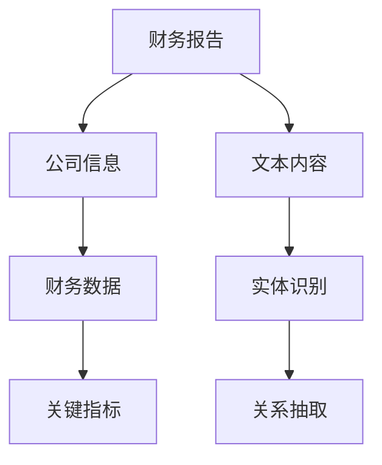
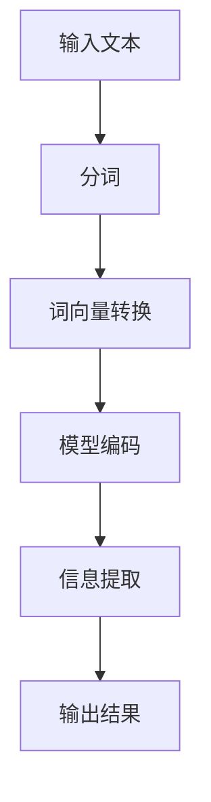
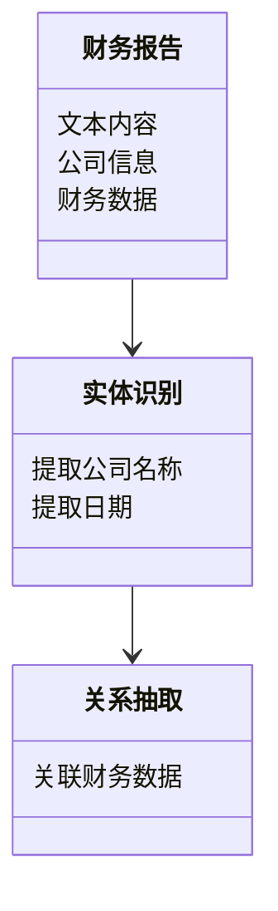
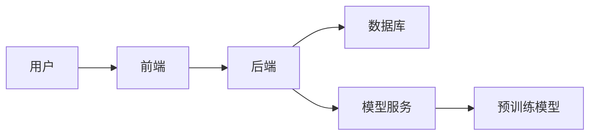

                 


# 智能财务报告关键信息提取工具

> 关键词：财务报告，信息提取，自然语言处理，预训练语言模型，实体识别

> 摘要：本文详细介绍了智能财务报告关键信息提取工具的背景、核心概念、算法原理、系统架构以及项目实战。通过分析财务报告信息提取的挑战，探讨了智能化提取的需求，并结合自然语言处理和预训练语言模型，详细阐述了提取算法的实现过程。最后，通过系统架构设计和项目实战，展示了工具的实际应用场景和实现细节。

---

# 第一部分: 智能财务报告关键信息提取工具的背景与概念

## 第1章: 财务报告关键信息提取的背景与问题

### 1.1 问题背景

#### 1.1.1 财务报告的重要性
财务报告是企业经济活动的重要记录，通常包括资产负债表、利润表和现金流量表等。这些报告为企业管理层、投资者和债权人提供了关键的财务信息，帮助他们进行决策和评估企业绩效。

#### 1.1.2 传统财务报告信息提取的挑战
传统的财务报告信息提取主要依赖人工操作，效率低、误差大。财务报告通常是以文本形式存在，人工提取需要花费大量时间，并且容易出错。此外，财务报告中的信息通常涉及复杂的术语和结构，人工提取需要专业知识，成本较高。

#### 1.1.3 智能化信息提取的需求
随着企业规模的扩大和业务的复杂化，财务报告的信息量和复杂性也在不断增加。传统的人工提取方式已经无法满足高效、准确的需求。因此，智能化的信息提取工具成为迫切需要。

### 1.2 问题描述

#### 1.2.1 财务报告信息提取的核心问题
财务报告信息提取的核心问题是如何从非结构化的文本中准确提取关键信息。这些信息包括公司名称、财务指标、日期等。

#### 1.2.2 关键信息提取的定义与目标
关键信息提取是指从财务报告文本中识别和抽取重要的实体和数值信息。目标是将这些信息结构化，便于后续的分析和应用。

#### 1.2.3 信息提取的边界与外延
信息提取的边界包括财务报告的范围和内容，外延则涉及提取信息的结构化存储和后续的应用。

### 1.3 问题解决思路

#### 1.3.1 智能化技术在财务信息提取中的应用
智能化技术，如自然语言处理（NLP）和机器学习，可以帮助自动识别和提取财务报告中的关键信息。

#### 1.3.2 关键技术的选择与优化
选择合适的NLP技术，如预训练语言模型和命名实体识别（NER），优化算法性能，提高提取准确率。

#### 1.3.3 解决方案的可行性分析
通过技术可行性、成本效益和实际应用效果等方面进行分析，确保解决方案的可行性和有效性。

### 1.4 概念结构与核心要素

#### 1.4.1 财务报告的结构化分析
财务报告通常包含固定的结构，如公司基本信息、财务数据和注释等。结构化分析有助于提取关键信息。

#### 1.4.2 关键信息提取的核心要素
核心要素包括公司名称、财务指标、日期等。这些要素是财务报告中最重要的信息。

#### 1.4.3 核心概念的特征与对比
通过对比不同的信息提取方法，分析其优缺点，选择最优方案。

---

## 第2章: 智能信息提取的核心概念

### 2.1 核心概念原理

#### 2.1.1 自然语言处理在财务信息提取中的应用
自然语言处理技术可以帮助理解和分析财务报告文本，提取关键信息。

#### 2.1.2 预训练语言模型的原理
预训练语言模型（如BERT）通过大规模数据预训练，能够理解上下文，提取实体信息。

#### 2.1.3 命名实体识别在财务报告中的应用
命名实体识别（NER）用于从文本中识别公司名称、日期等实体。

### 2.2 核心概念的特征对比

#### 2.2.1 不同信息提取方法的对比
比较传统方法和智能方法的优缺点，选择最优方案。

#### 2.2.2 各种模型的优缺点分析
分析不同模型在财务信息提取中的表现，选择最适合的模型。

#### 2.2.3 特征提取的对比与选择
根据实际需求，选择适合的特征提取方法。

### 2.3 ER实体关系图



---

## 第3章: 基于预训练语言模型的信息提取算法

### 3.1 算法原理概述

#### 3.1.1 预训练语言模型的文本表示
预训练语言模型将文本转化为向量表示，捕捉上下文信息。

#### 3.1.2 基于上下文的信息提取
利用模型的上下文理解能力，准确提取实体信息。

#### 3.1.3 算法流程图



### 3.2 算法实现细节

#### 3.2.1 模型训练过程
预训练语言模型通过大规模数据训练，具备良好的文本理解和生成能力。

#### 3.2.2 算法的数学模型
模型编码层的输出是一个向量表示，用于后续的实体识别。

$$P(y|x) = \frac{\exp(S)}{\sum_{y'} \exp(S_{y'})}$$

---

## 第4章: 系统分析与架构设计

### 4.1 系统功能设计

#### 4.1.1 数据预处理
对财务报告文本进行清洗和格式化处理，便于后续处理。

#### 4.1.2 模型训练
训练预训练语言模型，优化参数，提高提取准确率。

#### 4.1.3 结果展示
将提取的信息以结构化形式展示，便于用户查看和分析。

### 4.2 系统架构设计

#### 4.2.1 领域模型类图



#### 4.2.2 系统架构图



---

## 第5章: 项目实战

### 5.1 环境安装

#### 5.1.1 Python环境配置
安装Python和必要的库，如TensorFlow和PyTorch。

#### 5.1.2 模型权重下载
下载预训练语言模型的权重文件，准备训练数据。

### 5.2 系统核心实现源代码

#### 5.2.1 分词代码

```python
import jieba

def tokenize(text):
    return jieba.lcut(text)
```

#### 5.2.2 词向量转换

```python
from gensim.models import Word2Vec

model = Word2Vec.load("model")
```

#### 5.2.3 模型编码

```python
import torch
from transformers import BertModel

bert_model = BertModel.from_pretrained("bert-base-uncased")
```

#### 5.2.4 信息提取

```python
def extract_entities(text):
    # 调用预训练模型进行实体识别
    pass
```

### 5.3 实际案例分析

#### 5.3.1 案例描述
以某公司财务报告为例，展示信息提取的过程。

#### 5.3.2 案例分析
通过代码实现，提取公司名称、财务指标等关键信息。

### 5.4 项目小结

---

## 第6章: 最佳实践与小结

### 6.1 工具优势总结
智能财务报告关键信息提取工具提高了信息提取的效率和准确性。

### 6.2 注意事项
在实际应用中，需要注意模型的训练数据质量和提取结果的验证。

### 6.3 未来发展方向
未来可以进一步优化模型性能，扩展提取的实体类型，提升工具的智能化水平。

---

# 作者：AI天才研究院 & 禅与计算机程序设计艺术

