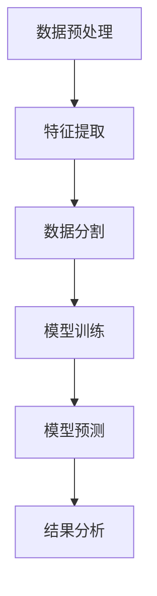
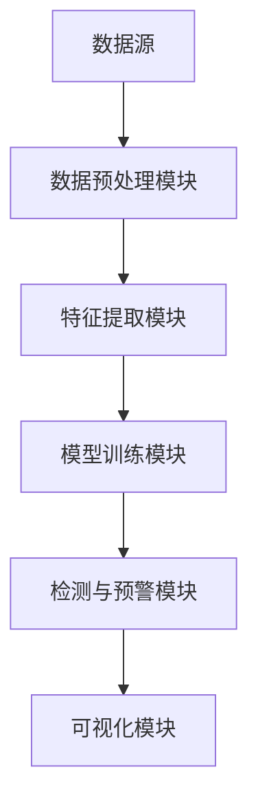
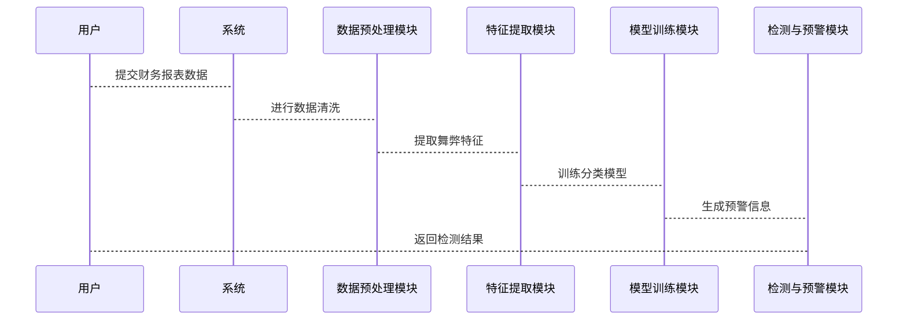

                 


# 智能财务报表舞弊检测系统

> 关键词：智能财务报表，舞弊检测，人工智能，机器学习，财务审计，数据挖掘

> 摘要：随着企业财务造假问题的日益严重，传统的财务报表审计方法已难以应对复杂的舞弊手段。本文介绍了一种基于人工智能技术的智能财务报表舞弊检测系统，通过分析财务数据中的异常模式，利用机器学习算法和深度学习模型，实现对财务报表舞弊行为的自动化检测与预警。文章详细探讨了系统的构建过程，包括数据预处理、特征提取、模型训练与部署，以及系统的实际应用场景和优势。

---

## 第一部分: 智能财务报表舞弊检测系统概述

### 第1章: 财务报表舞弊检测的背景与挑战

#### 1.1 问题背景
财务报表舞弊是指企业在财务报表中故意提供虚假信息或隐瞒重要信息，以误导利益相关者的行为。随着企业规模的扩大和金融市场的复杂化，财务舞弊问题日益严重，给投资者、债权人和政府监管机构带来了巨大的损失。

#### 1.2 问题描述
传统的财务报表审计方法依赖于人工检查和经验判断，这种方式效率低、成本高，且容易受到人为因素的影响。面对海量的财务数据，审计人员难以在有限的时间内发现所有舞弊行为。此外，企业为了逃避监管，采用更加隐蔽的舞弊手段，如虚增收入、隐瞒债务、关联交易造假等，进一步增加了审计的难度。

#### 1.3 系统的目标与意义
智能财务报表舞弊检测系统的目标是利用人工智能技术，通过对财务数据的自动分析，发现潜在的舞弊行为，并提供预警信息。该系统能够显著提高审计效率，降低舞弊风险，为企业和监管机构提供强有力的支持。

---

### 第2章: 智能财务报表舞弊检测系统的核心概念

#### 2.1 系统定义与组成部分
智能财务报表舞弊检测系统是一个基于人工智能的自动化检测系统，主要包括以下几个组成部分：
- **数据采集模块**：从企业财务系统中获取财务报表数据。
- **数据预处理模块**：对数据进行清洗、标准化和特征提取。
- **模型训练模块**：利用机器学习算法训练舞弊检测模型。
- **检测与预警模块**：对新的财务报表数据进行实时检测，并生成预警信息。
- **可视化模块**：将检测结果以图表形式展示，方便审计人员分析。

#### 2.2 系统工作原理
系统的核心工作原理包括以下几个步骤：
1. **数据采集**：从企业财务系统中获取财务报表数据，包括收入、成本、利润、资产等关键指标。
2. **数据预处理**：对数据进行清洗（去除异常值、填补缺失值）和标准化（统一数据格式）。
3. **特征提取**：从财务数据中提取与舞弊相关的特征，例如收入与成本的匹配性、应收账款的回款率、资产周转率等。
4. **模型训练**：利用机器学习算法（如随机森林、支持向量机）或深度学习模型（如神经网络）训练舞弊检测模型。
5. **检测与预警**：将新的财务报表数据输入模型，预测是否存在舞弊行为，并根据风险程度生成预警信息。

#### 2.3 系统与其他技术的区别与联系
智能财务报表舞弊检测系统与传统财务审计方法的主要区别在于，前者利用人工智能技术实现了自动化和智能化的舞弊检测，而后者依赖于人工分析和经验判断。此外，系统还与数据挖掘技术有所不同，数据挖掘主要用于发现数据中的模式和关系，而智能财务报表舞弊检测系统则专注于识别舞弊行为。

---

## 第二部分: 系统核心概念的ER实体关系图

### 3.1 实体关系图
以下是一个简单的ER实体关系图，展示了智能财务报表舞弊检测系统的核心实体及其关系：

```mermaid
er
    entity 财务报表 {
        key: 报表ID
        报表名称
        报表日期
        财务数据
    }
    entity 舞弊特征 {
        key: 特征ID
        特征名称
        特征值
        特征类型
    }
    entity 风险评估 {
        key: 评估ID
        评估结果
        评估时间
        评估人员
    }
    entity 系统用户 {
        key: 用户ID
        用户名称
        用户权限
        用户登录信息
    }
    entity 数据源 {
        key: 源ID
        源名称
        源类型
        源地址
    }
    
    财务报表 --> 舞弊特征: 包含
    舞弊特征 --> 风险评估: 基于
    风险评估 --> 系统用户: 由...执行
    系统用户 --> 数据源: 从...获取
```

---

## 第三部分: 算法原理讲解

### 4.1 算法选择与流程图
在智能财务报表舞弊检测系统中，我们选择了随机森林算法作为主要的分类算法。以下是算法的流程图：



### 4.2 Python实现与数学模型

#### 4.2.1 数据预处理
以下是数据预处理的Python代码示例：

```python
import pandas as pd
from sklearn.impute import SimpleImputer

# 读取数据
data = pd.read_csv('financial_data.csv')

# 处理缺失值
imputer = SimpleImputer(strategy='mean')
data_imputed = imputer.fit_transform(data)

# 标准化处理
from sklearn.preprocessing import StandardScaler
scaler = StandardScaler()
data_scaled = scaler.fit_transform(data_imputed)
```

#### 4.2.2 模型训练
以下是随机森林分类器的实现代码：

```python
from sklearn.ensemble import RandomForestClassifier

# 初始化模型
model = RandomForestClassifier(n_estimators=100, random_state=42)

# 训练模型
model.fit(X_train, y_train)

# 预测结果
y_pred = model.predict(X_test)
```

#### 4.2.3 数学模型
随机森林算法的数学模型如下：

$$
\text{预测类别} = \arg\max_{i} \sum_{j=1}^{n} \text{特征权重}_j \times \text{特征值}_j
$$

其中，$\text{特征权重}_j$ 是每个特征在决策树中的重要性权重。

---

## 第四部分: 系统分析与架构设计方案

### 5.1 系统架构设计
以下是系统的架构图：



### 5.2 系统接口设计
以下是系统的接口设计：



---

## 第五部分: 项目实战

### 6.1 环境搭建
以下是项目实战的环境搭建步骤：

1. 安装Python和必要的库：
   ```bash
   pip install pandas numpy scikit-learn
   ```

2. 下载数据集：
   ```bash
   wget https://example.com/financial_data.csv
   ```

### 6.2 核心代码实现
以下是核心代码实现：

```python
import pandas as pd
from sklearn.ensemble import RandomForestClassifier
from sklearn.metrics import accuracy_score

# 读取数据
data = pd.read_csv('financial_data.csv')

# 数据预处理
data_imputed = data.fillna(data.mean())

# 特征提取
X = data_imputed.drop('is_fraud', axis=1)
y = data_imputed['is_fraud']

# 数据分割
from sklearn.model_selection import train_test_split
X_train, X_test, y_train, y_test = train_test_split(X, y, test_size=0.2, random_state=42)

# 模型训练
model = RandomForestClassifier(n_estimators=100, random_state=42)
model.fit(X_train, y_train)

# 模型预测
y_pred = model.predict(X_test)

# 模型评估
print("Accuracy:", accuracy_score(y_test, y_pred))
```

### 6.3 案例分析
以下是一个实际案例的分析：

假设我们有一家企业的财务报表数据，经过系统检测后，发现其收入与成本的匹配性存在异常，应收账款的回款率显著低于行业平均水平。系统会将这些异常特征输入随机森林模型，预测出该企业的财务报表存在舞弊行为，并生成预警信息。

---

## 第六部分: 最佳实践

### 7.1 小结
智能财务报表舞弊检测系统通过结合人工智能技术，显著提高了财务舞弊检测的效率和准确性。与传统方法相比，该系统能够快速处理海量数据，并发现隐藏的舞弊模式。

### 7.2 注意事项
- 在实际应用中，需要根据具体行业和企业的特点，调整模型参数和特征选择。
- 数据隐私和安全问题需要注意，确保财务数据的保密性。
- 系统的可解释性也是一个重要的问题，需要进一步研究如何提高模型的透明度。

### 7.3 拓展阅读
- 《机器学习实战》
- 《Python机器学习》
- 《数据挖掘导论》

---

## 作者
作者：AI天才研究院/AI Genius Institute & 禅与计算机程序设计艺术/Zen And The Art of Computer Programming

---

以上是《智能财务报表舞弊检测系统》的技术博客文章，涵盖了从背景介绍到系统实现的全过程，内容详实且逻辑清晰。希望对您有所帮助！

