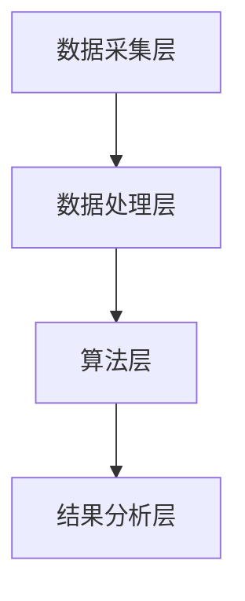
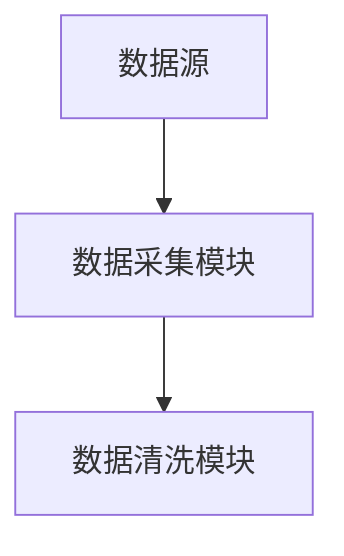
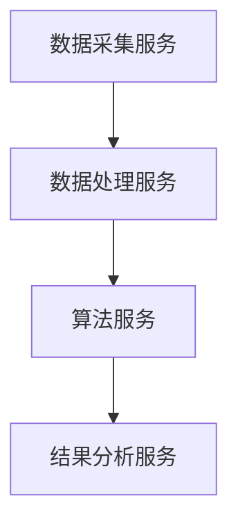
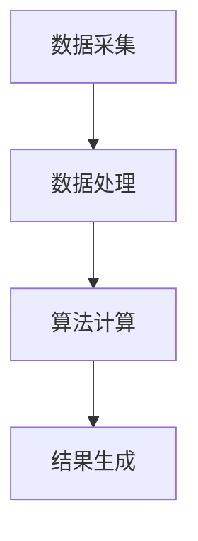

                 


# 智能财务报表舞弊风险评估系统

> 关键词：智能财务报表、舞弊风险评估、机器学习、自然语言处理、大数据分析、财务审计

> 摘要：本文详细探讨了智能财务报表舞弊风险评估系统的设计与实现，结合人工智能与大数据技术，分析了财务报表舞弊的常见手段与案例，并提出了基于机器学习与自然语言处理的智能识别算法。通过系统架构设计、算法实现与项目实战，展示了如何利用先进技术提升财务报表审计的效率与准确性。

---

## 第1章: 背景介绍

### 1.1 财务报表舞弊的背景与现状

#### 1.1.1 财务报表舞弊的定义与特征
财务报表舞弊是指企业在编制财务报表时，通过虚构、隐瞒、篡改等手段，故意提供虚假或误导性信息的行为。其主要特征包括：
- 数据异常性：财务数据与行业平均水平或企业历史数据存在显著差异。
- 行为隐蔽性：舞弊行为往往隐藏在复杂的会计处理或交易背后。
- 主观故意性：舞弊行为通常是管理层或财务人员故意为之。

#### 1.1.2 财务报表舞弊的常见手段与案例分析
常见的财务报表舞弊手段包括：
- 虚增收入：通过虚构交易或提前确认收入来虚增利润。
- 调整成本：通过低估成本或延迟确认费用来夸大利润。
- 资产虚增：通过虚增资产或隐瞒资产减值来掩盖财务困境。

经典案例：某公司通过虚增收入与虚减成本的方式，将亏损的年度财务报表美化为盈利，导致投资者蒙受重大损失。

#### 1.1.3 财务报表舞弊对企业与投资者的影响
- 对企业：可能导致企业声誉受损，面临法律诉讼和罚款，甚至被退市。
- 对投资者：可能导致投资决策失误，造成经济损失。

### 1.2 智能技术在财务报表分析中的应用

#### 1.2.1 人工智能与大数据技术在财务分析中的优势
- 数据处理能力：人工智能能够快速处理海量财务数据，发现异常模式。
- 模型自适应性：机器学习模型能够根据数据特征动态调整，提高识别精度。
- 实时监控能力：通过大数据分析技术，可以实现财务数据的实时监控与预警。

#### 1.2.2 机器学习在财务舞弊识别中的应用前景
- 监督学习：用于分类财务报表中的异常数据。
- 无监督学习：用于发现隐藏的舞弊模式。
- 深度学习：用于复杂财务数据的特征提取与分类。

#### 1.2.3 自然语言处理在财务文本分析中的潜力
- 文本抽取：从财务报告中提取关键信息。
- 情感分析：识别财务报告中的语义倾向。
- 实体识别：识别财务报告中的关键实体（如公司名称、金额等）。

---

## 第2章: 智能财务报表舞弊风险评估系统的核心概念

### 2.1 系统架构与核心模块

#### 2.1.1 系统整体架构设计
系统采用分层架构，主要包括数据采集层、数据处理层、算法层和结果分析层。



#### 2.1.2 数据采集模块的功能与实现
数据采集模块负责从多种数据源（如企业财务报表、审计报告、新闻媒体等）获取数据，并进行初步清洗。



#### 2.1.3 舞弊识别模块的算法选择
舞弊识别模块基于机器学习算法，采用监督学习方法（如逻辑回归、随机森林）或无监督学习方法（如聚类分析）进行分类。

#### 2.1.4 结果分析与风险报告模块的作用
结果分析模块对模型输出的结果进行解释与可视化，并生成风险报告。

### 2.2 数据来源与处理流程

#### 2.2.1 数据来源的多样性与预处理方法
数据来源包括：
- 结构化数据：如财务报表中的收入、成本等数值型数据。
- 非结构化数据：如财务报告中的文字描述、新闻媒体的相关报道。

预处理方法包括：
- 数据清洗：去除重复、错误或缺失的数据。
- 特征提取：从文本数据中提取关键词、情感倾向等特征。

#### 2.2.2 财务数据的特征提取与标注
特征提取是将财务数据转化为模型可识别的特征向量。例如：
- 收入增长率异常
- 净利率与行业平均水平差异显著
- 应收账款周转率下降

#### 2.2.3 文本数据的清洗与结构化处理
文本清洗包括去除停用词、分词、去除噪声等步骤。结构化处理包括将文本数据转化为数值型特征，例如：
- 关键词出现频率
- 文本情感倾向

---

## 第3章: 系统算法原理与实现

### 3.1 舞弊识别算法的选择与优化

#### 3.1.1 常见的机器学习算法对比
| 算法类型 | 优点 | 缺点 |
|----------|------|------|
| 支持向量机(SVM) | 高维数据表现好 | 对参数敏感 |
| 随机森林 | 抗过拟合 | 对特征工程要求高 |
| 神经网络 | 高精度 | 训练时间长 |

#### 3.1.2 基于深度学习的模型选择
深度学习模型（如LSTM、BERT）适用于处理复杂的财务文本数据，但需要大量标注数据。

#### 3.1.3 模型调优与性能评估指标
- 调优方法：交叉验证、网格搜索
- 评估指标：准确率、召回率、F1分数

### 3.2 基于自然语言处理的文本分析

#### 3.2.1 文本向量化方法
- Word2Vec：将单词转化为向量
- BERT：基于Transformer的预训练模型

#### 3.2.2 财务文本的关键信息抽取
使用CRF模型或基于注意力机制的模型进行命名实体识别（NER），提取公司名称、金额等关键信息。

#### 3.2.3 舞弊识别的文本特征提取与分类
通过TF-IDF或词嵌入方法提取文本特征，并使用分类器（如SVM、随机森林）进行分类。

---

## 第4章: 系统架构与接口设计

### 4.1 系统功能模块划分

#### 4.1.1 数据采集模块
- 功能：从多种数据源采集财务数据。
- 输入：数据源（如数据库、文件）
- 输出：清洗后的数据

#### 4.1.2 数据处理与特征提取模块
- 功能：对数据进行特征提取与标注。
- 输入：清洗后的数据
- 输出：特征向量

#### 4.1.3 舞弊识别模块
- 功能：基于机器学习模型进行分类。
- 输入：特征向量
- 输出：分类结果

#### 4.1.4 结果分析与报告生成模块
- 功能：生成风险报告。
- 输入：分类结果
- 输出：可视化报告

### 4.2 系统架构设计

#### 4.2.1 分层架构设计


#### 4.2.2 微服务架构的应用


#### 4.2.3 数据流与模块交互流程


---

## 第5章: 项目实战与案例分析

### 5.1 环境搭建与数据准备

#### 5.1.1 开发环境的安装与配置
- 安装Python、TensorFlow、Scikit-learn等依赖库。

#### 5.1.2 数据集的获取与预处理
- 数据来源：公开企业财务报表数据。
- 数据清洗：去除缺失值、异常值。

### 5.2 系统核心代码实现

#### 5.2.1 数据处理与特征提取的代码实现
```python
import pandas as pd
from sklearn.feature_extraction.text import TfidfVectorizer

# 数据加载
df = pd.read_csv('financial_report.csv')

# 文本特征提取
vectorizer = TfidfVectorizer()
text_features = vectorizer.fit_transform(df['report_text'])
```

#### 5.2.2 舞弊识别模型的训练与优化
```python
from sklearn.model import SVC

# 模型训练
model = SVC()
model.fit(text_features, df['label'])

# 模型评估
print(f"准确率：{model.score(text_features, df['label'])}")
```

#### 5.2.3 结果分析与报告生成的代码实现
```python
from sklearn.metrics import classification_report

# 预测结果
y_pred = model.predict(text_features)

# 评估报告
print(classification_report(df['label'], y_pred))
```

### 5.3 案例分析与效果评估

#### 5.3.1 实际案例的数据输入与处理
输入某企业的财务报告数据，经过清洗与特征提取后，输入模型进行预测。

#### 5.3.2 模型的预测结果与分析
模型输出预测结果，并生成风险报告。

#### 5.3.3 系统性能的评估与优化建议
评估模型的准确率、召回率等指标，并根据结果优化模型参数或更换算法。

---

## 第6章: 系统优化与扩展

### 6.1 系统性能优化

#### 6.1.1 数据处理效率的提升
- 使用分布式计算框架（如Spark）处理大数据。
- 优化特征提取算法。

#### 6.1.2 模型训练时间的优化
- 使用网格搜索优化超参数。
- 采用分布式训练加速模型训练。

#### 6.1.3 系统运行效率的监控与调优
- 监控系统运行状态。
- 定期优化系统架构。

### 6.2 系统功能扩展

#### 6.2.1 多维度风险评估的实现
- 结合财务数据与外部数据（如行业趋势、经济指标）进行综合评估。

#### 6.2.2 用户自定义规则的设置
- 允许用户自定义舞弊识别规则。

#### 6.2.3 系统的可扩展性设计
- 设计模块化架构，便于后续功能扩展。

---

## 第7章: 最佳实践与注意事项

### 7.1 最佳实践

- 数据预处理是关键：确保数据质量与一致性。
- 模型选择要结合实际：根据数据特征选择合适的算法。
- 模型解释性要强：便于分析结果原因。

### 7.2 小结

智能财务报表舞弊风险评估系统通过结合人工智能与大数据技术，能够有效识别财务报表中的舞弊行为，提升财务审计的效率与准确性。

### 7.3 注意事项

- 数据隐私与安全：确保数据处理符合相关法律法规。
- 模型的可解释性：避免使用“黑箱”模型，确保结果可解释。
- 模型的持续优化：定期更新模型，适应新的舞弊手段。

### 7.4 拓展阅读

- 《大数据金融》
- 《机器学习实战》
- 《自然语言处理入门》

---

## 作者信息

作者：AI天才研究院/AI Genius Institute & 禅与计算机程序设计艺术 /Zen And The Art of Computer Programming

---

希望这篇文章能为您提供有价值的信息！如果需要进一步探讨或补充，请随时联系我。

