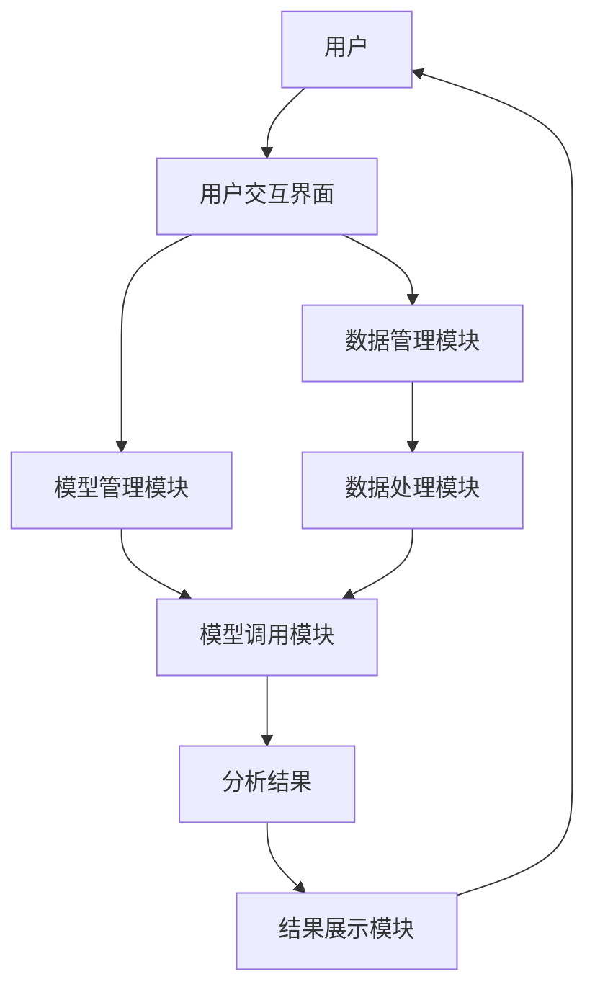

                 


# 智能财务规划AI Agent：LLM在个人理财中的应用

## 关键词：智能财务规划，AI Agent，LLM，个人理财，大语言模型，自然语言处理

## 摘要：  
随着人工智能技术的快速发展，大语言模型（LLM）在自然语言处理领域的应用日益广泛。本文探讨了LLM在智能财务规划中的创新应用，详细分析了AI Agent在个人理财中的核心功能、系统架构以及实际应用场景。通过理论与实践相结合的方式，本文为读者展示了如何利用先进的AI技术提升个人财务规划的效率和精准度。

---

# 第一部分: 智能财务规划AI Agent概述

## 第1章: 智能财务规划与AI Agent概述

### 1.1 智能财务规划的背景与意义

#### 1.1.1 传统财务规划的局限性  
传统财务规划依赖人工分析和经验判断，存在效率低、成本高、个性化不足等问题。  
- **人工依赖**：需要大量人工输入数据和分析，效率低下。  
- **个性化不足**：难以根据用户的实时需求和市场变化提供个性化建议。  
- **数据处理能力有限**：难以处理海量数据，难以覆盖复杂的投资组合优化。

#### 1.1.2 智能财务规划的核心优势  
智能财务规划通过AI技术实现自动化、个性化和实时化的财务管理和优化。  
- **自动化**：AI能够自动收集、分析和处理数据，生成财务报告和建议。  
- **个性化**：基于用户的财务状况、风险偏好和目标，提供定制化建议。  
- **实时化**：能够实时跟踪市场变化和用户财务状况，动态调整规划。

#### 1.1.3 AI Agent在智能财务规划中的作用  
AI Agent作为智能财务规划的核心技术，能够实现以下功能：  
- **数据处理与分析**：从多源数据中提取相关信息，进行财务分析。  
- **智能决策支持**：基于分析结果，生成投资建议、预算优化等方案。  
- **实时交互与反馈**：与用户进行自然语言交互，实时调整规划方案。

### 1.2 大语言模型（LLM）的基本概念

#### 1.2.1 LLM的定义与特点  
大语言模型（LLM）是一种基于深度学习的自然语言处理模型，具有以下特点：  
- **大规模训练**：通常使用海量数据进行预训练，具备强大的上下文理解和生成能力。  
- **多任务通用性**：能够适应多种自然语言处理任务，如文本生成、问答、翻译等。  
- **可解释性**：通过分析模型的内部参数，可以理解其生成结果的逻辑。

#### 1.2.2 LLM与传统NLP模型的区别  
与传统NLP模型相比，LLM的优势在于其规模和通用性：  
- **模型规模**：LLM通常拥有数亿参数，能够处理更复杂、更长的上下文。  
- **任务通用性**：能够同时处理多种NLP任务，而传统模型通常针对特定任务优化。  
- **生成能力**：LLM在文本生成任务中表现出色，能够生成连贯且合理的文本。

#### 1.2.3 LLM在智能财务规划中的应用潜力  
LLM在智能财务规划中的应用潜力主要体现在以下几个方面：  
- **自然语言交互**：通过与用户进行自然语言对话，理解其财务需求并生成建议。  
- **文本生成与解释**：生成财务报告、投资建议等文本内容，并提供解释性说明。  
- **信息抽取与分析**：从非结构化文本中提取财务相关信息，辅助分析。

### 1.3 智能财务规划AI Agent的定义与特点

#### 1.3.1 AI Agent的定义  
AI Agent是一种智能代理系统，能够在特定环境中感知信息、执行任务并做出决策。  
- **感知能力**：通过传感器或数据接口获取环境信息。  
- **决策能力**：基于感知信息和预设目标，生成行动计划。  
- **执行能力**：通过执行器或接口完成任务。

#### 1.3.2 智能财务规划AI Agent的核心功能  
智能财务规划AI Agent的核心功能包括：  
- **数据采集与处理**：收集用户的财务数据（如收入、支出、资产等），并进行清洗和预处理。  
- **财务分析与建模**：基于数据分析结果，生成财务模型，评估当前财务状况。  
- **智能建议生成**：根据分析结果，生成个性化的财务建议，如投资组合优化、预算调整等。  
- **实时监控与反馈**：实时跟踪用户的财务变化和市场动态，动态调整建议方案。

#### 1.3.3 与传统财务工具的区别  
与传统财务工具相比，智能财务规划AI Agent具有以下优势：  
- **智能化**：能够自动分析数据并生成建议，减少人工干预。  
- **个性化**：基于用户的实时需求和市场变化，提供定制化建议。  
- **高效性**：通过自动化处理，显著提高财务规划的效率。

### 1.4 本章小结  
本章介绍了智能财务规划的背景与意义，阐述了AI Agent的核心功能及其在智能财务规划中的作用，分析了LLM的基本概念及其在智能财务规划中的应用潜力。通过这些内容，读者可以理解智能财务规划AI Agent的基本框架和其在个人理财中的重要性。

---

## 第2章: 大语言模型（LLM）原理

### 2.1 大语言模型的基本原理

#### 2.1.1 深度学习与自然语言处理  
深度学习是一种基于人工神经网络的机器学习方法，广泛应用于自然语言处理领域。  
- **神经网络结构**：深度学习模型通常包含多个隐藏层，能够学习数据的高层次特征。  
- **端到端训练**：模型通过端到端的训练方式，直接从输入数据中学习目标输出。

#### 2.1.2 LLM的训练过程  
大语言模型的训练过程通常包括以下几个步骤：  
1. **数据准备**：收集和整理大量文本数据，进行分词和预处理。  
2. **模型构建**：选择适当的模型架构（如Transformer），定义模型参数。  
3. **损失函数优化**：使用优化算法（如Adam）优化模型参数，最小化损失函数。  
4. **预训练与微调**：通过大规模数据预训练，再在特定任务上进行微调。

#### 2.1.3 模型的参数化与优化  
模型的参数化与优化是LLM训练的关键环节：  
- **参数化**：模型通过参数化的方式表示，每个参数都是模型权重，需要通过训练优化。  
- **优化算法**：常用的优化算法包括随机梯度下降（SGD）、Adam等，用于更新模型参数，降低损失函数值。

### 2.2 常用的大语言模型

#### 2.2.1 GPT系列模型  
GPT（Generative Pre-trained Transformer）是基于Transformer架构的大语言模型，具有强大的文本生成能力。  
- **GPT-2**：由OpenAI开发，包含15亿参数，能够生成连贯的文本段落。  
- **GPT-3**：参数规模扩大到1750亿，具备更强的生成能力和上下文理解能力。  
- **GPT-4**：进一步优化模型结构，支持多模态输入输出。

#### 2.2.2 BERT及其变体  
BERT（Bidirectional Encoder Representations from Transformers）是一种基于Transformer的预训练模型，主要用于文本理解任务。  
- **原始BERT**：主要针对文本理解任务，如问答、文本分类等。  
- **BERT-Large**：参数规模更大的BERT变体，具备更强的文本理解能力。  
- **RoBERTa**：基于BERT优化的开源模型，性能更优。

#### 2.2.3 其他LLM模型介绍  
除了GPT和BERT，还有一些其他重要的LLM模型：  
- **PaLM**：由Google开发，参数规模达到670亿，具备强大的多语言处理能力。  
- **Llama**：Meta开源的开源大语言模型，参数规模从7B到70B不等。  
- **Falcon**：由TigerGraph开发，支持开源和商业版本，参数规模从7B到120B。

### 2.3 LLM在智能财务规划中的应用

#### 2.3.1 自然语言理解与生成  
自然语言理解（NLU）和生成（NLG）是LLM在智能财务规划中的核心应用：  
- **NLU**：通过理解用户的自然语言输入，提取财务需求和偏好。  
- **NLG**：根据分析结果生成财务报告、投资建议等文本内容。  

#### 2.3.2 财务数据分析与预测  
LLM可以辅助进行财务数据分析与预测：  
- **文本数据处理**：从非结构化文本中提取财务相关信息。  
- **时间序列分析**：基于历史数据，预测未来的财务状况和市场趋势。  
- **风险评估**：通过分析市场波动和用户资产配置，评估财务风险。

#### 2.3.3 个性化财务建议生成  
个性化财务建议生成是LLM在智能财务规划中的重要应用：  
- **投资组合优化**：基于用户的财务状况和市场数据，生成最优投资组合建议。  
- **预算管理**：根据用户的收入和支出情况，制定个性化的预算方案。  
- **税务规划**：提供税务优化建议，帮助用户降低税务负担。

### 2.4 本章小结  
本章详细介绍了大语言模型的基本原理，对比了常用LLM模型的特点，并分析了LLM在智能财务规划中的具体应用。通过这些内容，读者可以理解LLM在智能财务规划中的技术基础和应用场景。

---

## 第3章: 智能财务规划需求分析与场景设计

### 3.1 用户需求分析

#### 3.1.1 个人用户需求  
个人用户在智能财务规划中的需求主要包括：  
- **资产配置优化**：根据个人资产状况，优化投资组合。  
- **预算管理**：根据收入和支出情况，制定合理的预算方案。  
- **风险管理**：识别和评估财务风险，制定应对策略。  

#### 3.1.2 机构用户需求  
机构用户的需求主要包括：  
- **客户画像**：通过分析客户数据，生成客户画像，制定个性化服务方案。  
- **市场分析**：分析市场趋势，提供投资策略建议。  
- **风险管理**：评估机构财务风险，制定风险管理方案。

#### 3.1.3 不同用户群体的需求差异  
不同用户群体的需求存在显著差异：  
- **高净值客户**：关注资产保值与增值，注重投资组合的复杂性和风险控制。  
- **中低收入用户**：关注基本的预算管理和风险管理，对复杂的投资组合优化需求较低。  

### 3.2 智能财务规划的功能需求

#### 3.2.1 财务数据分析与可视化  
财务数据分析与可视化是智能财务规划的核心功能：  
- **数据清洗与整合**：整合多源数据，去除无效信息，确保数据质量。  
- **数据分析与建模**：通过数据分析和建模，评估当前财务状况。  
- **数据可视化**：通过图表等形式，直观展示财务数据，帮助用户理解分析结果。

#### 3.2.2 投资组合优化建议  
投资组合优化建议是智能财务规划的重要功能：  
- **资产配置建议**：根据用户的风险偏好和市场状况，推荐最优资产配置方案。  
- **投资策略优化**：基于市场趋势和用户目标，优化投资策略。  
- **绩效评估**：定期评估投资组合的绩效，动态调整优化建议。

#### 3.2.3 财务风险管理与预警  
财务风险管理与预警是智能财务规划的重要组成部分：  
- **风险识别**：识别潜在的财务风险，如市场风险、流动性风险等。  
- **风险评估**：评估风险的严重程度，制定应对策略。  
- **风险预警**：通过实时监控，及时预警潜在的财务风险。

### 3.3 场景设计

#### 3.3.1 财务预算管理  
财务预算管理是智能财务规划的重要应用场景：  
- **预算制定**：根据用户的收入和支出情况，制定个性化的预算方案。  
- **预算执行监控**：实时跟踪预算执行情况，及时发现偏差。  
- **预算调整建议**：根据实际执行情况，动态调整预算方案。

#### 3.3.2 投资决策支持  
投资决策支持是智能财务规划的核心应用场景：  
- **市场分析**：分析市场趋势，提供投资建议。  
- **资产配置优化**：根据用户风险偏好和市场状况，优化投资组合。  
- **投资策略制定**：基于分析结果，制定长期投资策略。

#### 3.3.3 税务规划与优化  
税务规划与优化是智能财务规划的重要应用场景：  
- **税务计算**：根据用户的财务数据，计算应缴税款。  
- **税务优化建议**：通过合法合规的方式，优化税务负担。  
- **税务风险管理**：识别税务风险，制定应对策略。

### 3.4 本章小结  
本章分析了智能财务规划的需求，设计了具体的场景，并提出了相应的功能需求。通过这些内容，读者可以理解智能财务规划AI Agent在实际应用中的具体场景和功能设计。

---

## 第4章: 智能财务规划AI Agent系统设计

### 4.1 系统总体架构

#### 4.1.1 数据处理模块  
数据处理模块是系统的核心模块，负责数据的采集、清洗和预处理：  
- **数据采集**：通过API接口或文件导入，采集用户的财务数据。  
- **数据清洗**：去除无效数据，处理数据中的异常值。  
- **数据预处理**：对数据进行标准化和格式化处理，确保数据一致性。

#### 4.1.2 模型调用模块  
模型调用模块负责调用大语言模型进行分析和生成：  
- **模型调用**：通过API或本地调用LLM模型，进行自然语言理解与生成。  
- **结果解析**：解析模型返回的结果，生成财务建议。  
- **结果展示**：将分析结果以用户友好的形式展示，如文本、图表等。

#### 4.1.3 系统功能模块  
系统功能模块包括以下几部分：  
- **用户交互界面**：用户通过界面输入需求，查看分析结果。  
- **数据管理模块**：管理用户数据，确保数据安全和隐私保护。  
- **模型管理模块**：管理大语言模型，包括模型加载、参数调优等。  
- **结果展示模块**：以多种形式展示分析结果，如文本、图表、数据表格等。

### 4.2 系统架构设计

#### 4.2.1 系统架构图  
以下是系统的总体架构图：



#### 4.2.2 数据流分析  
数据流分析是理解系统运行的关键：  
- **数据输入**：用户通过界面输入财务数据或需求。  
- **数据处理**：数据处理模块对输入数据进行清洗和预处理。  
- **模型调用**：模型调用模块调用LLM进行分析和生成。  
- **结果展示**：分析结果通过结果展示模块呈现给用户。

### 4.3 系统实现

#### 4.3.1 环境安装  
系统实现需要以下环境：  
- **编程语言**：Python 3.8+  
- **深度学习框架**：TensorFlow或PyTorch  
- **大语言模型**：使用Hugging Face的Transformers库或本地部署的模型  

#### 4.3.2 核心代码实现  
以下是系统核心代码示例：

```python
import transformers
from transformers import AutoTokenizer, AutoModelForCausalLM

# 加载预训练模型
model_name = "gpt2"
tokenizer = AutoTokenizer.from_pretrained(model_name)
model = AutoModelForCausalLM.from_pretrained(model_name)

# 定义输入
input_text = "我的收入是50000元，支出每月30000元，如何优化我的预算？"

# 编码输入
inputs = tokenizer.encode(input_text, return_tensors="pt")

# 生成输出
outputs = model.generate(inputs, max_length=500, num_beams=5, temperature=0.7)

# 解码输出
response = tokenizer.decode(outputs[0], skip_special_tokens=True)
print(response)
```

#### 4.3.3 系统功能实现  
系统功能实现包括以下步骤：  
1. **用户输入**：用户通过界面输入财务数据或需求。  
2. **数据处理**：数据处理模块对输入数据进行清洗和预处理。  
3. **模型调用**：模型调用模块调用LLM进行分析和生成。  
4. **结果展示**：分析结果以用户友好的形式展示，如文本、图表等。

### 4.4 本章小结  
本章详细介绍了智能财务规划AI Agent的系统设计，包括系统总体架构、功能模块设计和系统实现。通过这些内容，读者可以理解智能财务规划AI Agent的技术实现细节。

---

## 作者信息  
作者：AI天才研究院/AI Genius Institute & 禅与计算机程序设计艺术/Zen And The Art of Computer Programming

