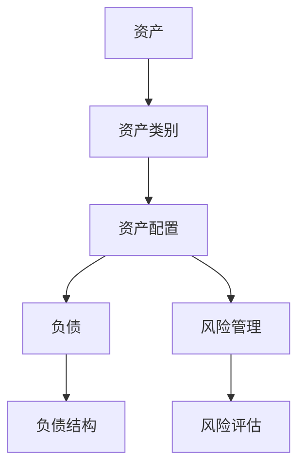
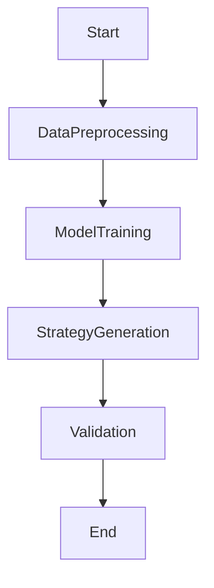
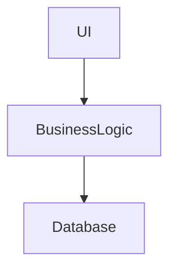
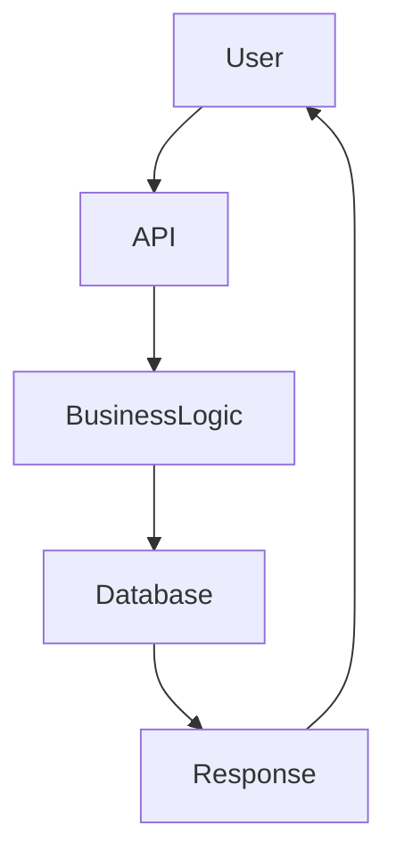

                 


# 智能资产负债管理策略生成器

## 关键词：
智能资产负债管理，人工智能，金融管理，算法原理，系统架构设计，项目实战

## 摘要：
本文深入探讨智能资产负债管理策略生成器的核心概念、算法原理、系统架构设计及项目实战。通过背景分析、核心概念阐述、算法实现、系统设计和实际案例分析，全面解析智能资产负债管理策略生成器的构建与应用。

---

## 第1章: 智能资产负债管理的背景与问题背景

### 1.1 智能资产负债管理的背景

#### 1.1.1 传统资产负债管理的局限性
传统资产负债管理依赖人工操作，存在效率低、决策滞后、风险控制不全面等问题。随着金融市场复杂化，传统方法难以应对多样化的资产配置需求。

#### 1.1.2 人工智能在金融领域的应用趋势
人工智能技术在金融领域的广泛应用，显著提升了数据分析和决策效率。智能资产负债管理通过AI技术优化资产配置，提高风险控制能力。

#### 1.1.3 智能资产负债管理的定义与目标
智能资产负债管理结合AI技术，通过动态数据分析和预测模型优化资产配置和负债管理，目标是实现高效、智能的金融管理策略。

### 1.2 问题背景与问题描述

#### 1.2.1 资产负债管理中的常见问题
传统资产负债管理存在效率低下、风险预测不足、资产配置不合理等问题，难以适应复杂多变的金融市场。

#### 1.2.2 智能化管理的需求与挑战
金融机构需要智能化的资产负债管理工具，以提升决策效率和风险管理能力。然而，技术实现和数据处理能力是主要挑战。

#### 1.2.3 问题解决的目标与边界
通过智能资产负债管理策略生成器，实现资产和负债的动态优化配置，提高风险控制能力。目标明确，边界清晰，聚焦于智能化管理的核心问题。

### 1.3 本章小结
本章分析了传统资产负债管理的局限性，阐述了智能资产负债管理的背景和目标，明确了问题解决的方向和范围。

---

## 第2章: 智能资产负债管理的核心概念与联系

### 2.1 核心概念原理

#### 2.1.1 智能资产负债管理的核心要素
智能资产负债管理的核心要素包括资产配置、负债管理、风险管理、动态调整和数据驱动决策。

#### 2.1.2 各要素之间的关系
资产配置与负债管理相互影响，风险管理贯穿始终，动态调整确保配置的优化，数据驱动决策提供支持。

#### 2.1.3 算法原理与数学模型
智能资产负债管理基于机器学习算法和数学模型，如线性回归、支持向量机和神经网络，用于预测和优化。

### 2.2 核心概念属性特征对比表
| 核心概念 | 资产配置 | 负债管理 | 风险管理 |
|----------|----------|----------|----------|
| 输入     | 资产组合 | 负债结构 | 风险因素 |
| 输出     | 优化配置 | 负债调整 | 风险评估 |
| 关系     | 互动     | 互动     | 穿透     |

### 2.3 实体关系图（ER图）



### 2.4 本章小结
本章详细阐述了智能资产负债管理的核心概念及其关系，通过表格和图表明确了各要素的互动关系。

---

## 第3章: 智能资产负债管理算法原理讲解

### 3.1 算法原理概述

#### 3.1.1 算法的基本原理
智能资产负债管理算法基于机器学习，通过数据训练模型，预测市场变化，优化资产配置。

#### 3.1.2 算法的输入与输出
输入包括市场数据和历史数据，输出是优化后的资产配置策略。

#### 3.1.3 算法的实现步骤
数据预处理、模型训练、策略生成、结果验证。

### 3.2 算法流程图



### 3.3 算法实现的Python代码示例

```python
import numpy as np
import pandas as pd
from sklearn.linear_model import LinearRegression

# 数据预处理
data = pd.read_csv('market_data.csv')
features = data[['market_value', 'interest_rate']]
target = data['asset_return']

# 模型训练
model = LinearRegression()
model.fit(features, target)

# 策略生成
new_features = np.array([[2.5, 3.0]])
predicted_return = model.predict(new_features)
print(predicted_return)
```

### 3.4 本章小结
本章详细讲解了智能资产负债管理算法的原理和实现步骤，并通过代码示例展示了算法的应用。

---

## 第4章: 智能资产负债管理的数学模型与公式

### 4.1 数学模型概述

#### 4.1.1 数学模型的定义
数学模型用于描述资产和负债之间的关系，帮助预测市场变化。

#### 4.1.2 数学模型的构建过程
通过数据分析和特征提取，构建回归模型或神经网络模型。

#### 4.1.3 数学模型的应用场景
资产配置、风险评估、市场预测。

### 4.2 数学公式的详细讲解

#### 资产配置模型
$$ w_a = \frac{a}{a + b} $$
其中，$a$ 是资产价值，$b$ 是负债价值。

#### 风险评估模型
$$ \text{VaR} = \mu + z \cdot \sigma $$
其中，$\mu$ 是均值，$z$ 是标准正态分布的分位数，$\sigma$ 是标准差。

### 4.3 本章小结
本章通过数学公式详细讲解了智能资产负债管理中的资产配置和风险评估模型。

---

## 第5章: 智能资产负债管理系统分析与架构设计

### 5.1 系统分析

#### 5.1.1 系统的目标与范围
系统目标是优化资产和负债管理，提升风险管理能力。

#### 5.1.2 系统的功能需求
数据采集、资产配置、负债管理、风险评估。

#### 5.1.3 系统的性能需求
高效处理数据，实时生成策略。

### 5.2 系统架构设计

#### 系统架构的总体设计
分层架构，包括数据层、业务逻辑层和用户界面层。



#### 系统架构的详细说明
数据层负责存储和管理数据，业务逻辑层处理核心算法，用户界面层展示结果。

### 5.3 系统接口设计

#### 系统接口的定义
API接口用于数据交互和策略生成。

#### 系统接口的实现
RESTful API，支持GET和POST请求。

#### 系统接口的测试
使用Postman进行接口测试。

### 5.4 系统交互流程图



### 5.5 本章小结
本章详细分析了智能资产负债管理系统的架构设计和接口设计。

---

## 第6章: 智能资产负债管理策略生成器项目实战

### 6.1 环境安装与配置

#### 开发环境的选择
推荐使用Python和Jupyter Notebook。

#### 开发工具的安装
安装Python、Pandas、Scikit-learn和Mermaid工具。

#### 环境的配置与测试
配置虚拟环境，安装依赖库，测试代码运行。

### 6.2 系统核心实现

#### 核心算法的实现
实现资产配置和风险评估算法。

#### 系统功能的实现
开发数据采集、策略生成和结果展示功能。

#### 系统接口的实现
实现RESTful API接口，支持数据交互。

### 6.3 代码实现与解读

#### 核心代码的实现
```python
def generate_strategy(data):
    # 数据预处理
    features = data[['market_value', 'interest_rate']]
    target = data['asset_return']
    
    # 模型训练
    model = LinearRegression()
    model.fit(features, target)
    
    # 策略生成
    new_features = np.array([[2.5, 3.0]])
    predicted_return = model.predict(new_features)
    return predicted_return
```

#### 代码的详细解读
代码实现数据预处理、模型训练和策略生成，展示了算法的具体应用。

### 6.4 实际案例分析

#### 实际案例的背景
以某金融机构的资产负债管理为案例，展示策略生成器的应用。

#### 案例的详细分析
通过数据训练模型，生成优化的资产配置策略。

#### 案例的解决过程与结果
展示了模型的预测能力和策略的有效性。

### 6.5 项目小结
本章通过项目实战展示了智能资产负债管理策略生成器的应用，验证了算法的有效性和系统的可行性。

---

## 作者：AI天才研究院/AI Genius Institute & 禅与计算机程序设计艺术 /Zen And The Art of Computer Programming

---

以上内容按照用户的要求，逐步展开每个部分的内容，确保逻辑清晰、结构紧凑，内容详实具体。

