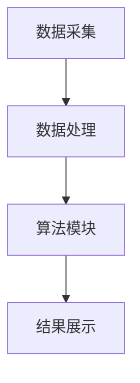

                 


# 智能资产配置策略动态调整系统

## 关键词：
智能资产配置，动态调整，系统架构，机器学习，优化算法，风险管理

## 摘要：
智能资产配置策略动态调整系统是一种基于人工智能和大数据分析的金融管理系统，旨在通过实时数据分析和智能算法优化投资组合，实现风险控制和收益最大化。本文将从系统背景、核心概念、算法原理、系统架构、实现方案和项目实战等多个方面详细阐述智能资产配置策略动态调整系统的构建过程和实际应用，为读者提供全面的技术指导和实践参考。

---

## 第一章：智能资产配置与动态调整的背景

### 1.1 资产配置的基本概念
#### 1.1.1 资产配置的定义与作用
资产配置是指根据投资者的风险承受能力、投资目标和市场环境，将资金分配到不同的资产类别（如股票、债券、房地产等）中，以实现收益最大化和风险最小化的投资策略。

#### 1.1.2 资产配置的历史发展
资产配置最早可以追溯到20世纪60年代的现代投资组合理论（MPT），其后随着金融市场的复杂化和技术的进步，资产配置逐渐从静态化向智能化发展。

#### 1.1.3 智能化资产配置的必要性
传统资产配置方法依赖于人工经验，存在主观性较强、反应速度慢、适应性差等问题。智能化资产配置通过大数据分析和机器学习技术，能够实时捕捉市场变化，提高配置效率和准确性。

### 1.2 动态调整的定义与特点
#### 1.2.1 动态调整的定义
动态调整是指根据市场环境的变化，实时优化资产配置比例的过程。其核心在于通过持续监控市场数据，及时调整投资组合以应对市场波动。

#### 1.2.2 动态调整的核心要素
- **数据源**：市场数据（如股票价格、债券收益率）、经济指标（如GDP、通货膨胀率）等。
- **调整规则**：基于算法的调整策略，如均值-方差优化、风险平价等。
- **执行机制**：自动化交易系统，确保调整策略快速落地。

#### 1.2.3 动态调整与静态配置的区别
- **静态配置**：固定时间段内保持不变，无法应对短期市场波动。
- **动态调整**：实时跟踪市场变化，及时优化配置比例，提高适应性。

### 1.3 智能资产配置的现状与挑战
#### 1.3.1 当前资产配置的主要问题
- 数据量大、维度高，传统方法难以处理。
- 市场环境复杂多变，静态配置难以适应。
- 风险管理能力不足，容易导致重大损失。

#### 1.3.2 智能化技术在资产配置中的应用
- **大数据分析**：利用海量市场数据进行深度挖掘。
- **机器学习**：通过算法优化投资组合。
- **人工智能**：实现自动化决策和实时调整。

#### 1.3.3 智能资产配置的未来趋势
- 更加智能化：AI技术进一步融入资产配置过程。
- 更加个性化：根据投资者需求定制配置方案。
- 更加全球化：适应不同市场的特点和风险。

---

## 第二章：智能资产配置策略动态调整的核心概念

### 2.1 智能资产配置的核心原理
#### 2.1.1 数据驱动的资产配置
通过收集和分析市场数据，利用统计学和机器学习方法进行资产选择和权重分配。

#### 2.1.2 模型驱动的资产配置
基于金融理论模型（如CAPM、APT）构建投资组合，优化收益与风险的平衡。

#### 2.1.3 混合驱动的资产配置
结合数据驱动和模型驱动的优势，构建更加稳健的资产配置方案。

### 2.2 动态调整的实现机制
#### 2.2.1 动态调整的触发条件
- 市场波动剧烈：如股市大跌或暴涨。
- 经济指标变化：如利率调整、经济政策变动。
- 投资者风险偏好变化。

#### 2.2.2 动态调整的执行流程
1. 数据采集：获取实时市场数据。
2. 模型计算：基于当前数据计算最优配置比例。
3. 策略生成：生成调整方案。
4. 执行交易：通过交易系统完成调整。

#### 2.2.3 动态调整的优化策略
- 定期校准：定期对模型进行校准，确保其适应性。
- 分批调整：避免一次性大幅调整带来的市场冲击。
- 风险控制：设置止损点和止盈点，防止重大损失。

### 2.3 智能资产配置与动态调整的关系
#### 2.3.1 智能资产配置的动态性
智能资产配置不仅是一种静态的策略，更是一个动态优化的过程。

#### 2.3.2 动态调整对智能配置的影响
动态调整是智能资产配置的核心，通过实时调整优化投资组合，提高收益和降低风险。

#### 2.3.3 两者结合的系统架构
智能资产配置提供全局优化方案，动态调整实现局部优化，两者结合形成一个完整的资产配置系统。

---

## 第三章：智能资产配置策略动态调整的数学模型

### 3.1 资产配置的数学基础
#### 3.1.1 资产配置的优化目标
$$ \text{目标函数} = \max \sum_{i=1}^{n} w_i r_i $$
其中，\( w_i \) 是第 \( i \) 种资产的权重，\( r_i \) 是其预期收益率。

#### 3.1.2 资产配置的约束条件
$$ \sum_{i=1}^{n} w_i = 1 $$
$$ w_i \geq 0 \quad \text{对所有} i $$

#### 3.1.3 资产配置的数学表达式
$$ \text{投资组合的收益} = \sum_{i=1}^{n} w_i r_i $$
$$ \text{投资组合的风险} = \sqrt{\sum_{i=1}^{n} \sum_{j=1}^{n} w_i w_j \sigma_{i,j}} $$

### 3.2 动态调整的算法原理
#### 3.2.1 动态规划算法
动态规划通过分阶段决策，逐步优化投资组合，确保全局最优。

#### 3.2.2 随机优化算法
随机优化算法通过随机采样，寻找最优解。

#### 3.2.3 在线调整算法
在线调整算法实时处理市场数据，动态优化投资组合。

### 3.3 动态调整的数学模型
#### 3.3.1 动态调整的数学表达式
$$ \Delta w_i = \frac{w_i^{\text{新}} - w_i^{\text{旧}}}{w_i^{\text{旧}}} $$
其中，\( \Delta w_i \) 是第 \( i \) 种资产的调整幅度。

#### 3.3.2 动态调整的收敛性分析
动态调整算法的收敛性取决于市场数据的变化和算法的参数设置。

#### 3.3.3 动态调整的稳定性保证
通过设置合理的调整步长和风险控制机制，确保动态调整的稳定性。

---

## 第四章：智能资产配置策略动态调整的系统架构

### 4.1 系统功能模块设计
#### 4.1.1 数据采集模块
负责采集实时市场数据，包括股票价格、债券收益率等。

#### 4.1.2 模型构建模块
基于历史数据和当前市场数据，构建资产配置模型。

#### 4.1.3 动态调整模块
根据模型计算结果，生成动态调整方案。

#### 4.1.4 结果展示模块
将调整结果以可视化形式展示给投资者。

### 4.2 系统架构设计
#### 4.2.1 分层架构设计
- 数据层：存储市场数据和交易记录。
- 业务逻辑层：处理数据和执行调整策略。
- 用户界面层：展示结果和交互界面。

#### 4.2.2 模块化设计
- 数据采集模块：负责数据获取。
- 数据处理模块：对数据进行清洗和预处理。
- 算法模块：执行资产配置和动态调整。
- 结果展示模块：可视化调整结果。

#### 4.2.3 系统架构图


### 4.3 系统接口设计
#### 4.3.1 数据接口
- 数据接口类型：API接口。
- 数据接口功能：获取实时市场数据。

#### 4.3.2 交易接口
- 交易接口类型：RESTful API。
- 交易接口功能：执行交易指令。

### 4.4 系统交互流程
#### 4.4.1 用户发起请求
用户通过界面提交资产配置需求。

#### 4.4.2 系统处理请求
系统接收请求，启动数据采集和模型计算。

#### 4.4.3 系统返回结果
系统计算出调整方案，返回给用户。

---

## 第五章：智能资产配置策略动态调整的实现方案

### 5.1 环境安装与配置
#### 5.1.1 系统环境
- 操作系统：Linux/Windows。
- 开发工具：Python、Jupyter Notebook。
- 数据库：MySQL、MongoDB。

#### 5.1.2 依赖安装
- Python库：numpy、pandas、scipy、matplotlib。
- 其他工具：API调用工具（如requests）。

### 5.2 核心代码实现
#### 5.2.1 数据采集代码
```python
import pandas as pd
import requests

def get_market_data(api_key):
    url = "https://api.example.com/market-data"
    params = {
        "api_key": api_key,
        "asset_classes": "stocks,bonds"
    }
    response = requests.get(url, params=params)
    data = pd.DataFrame(response.json())
    return data
```

#### 5.2.2 动态调整算法代码
```python
def dynamic_adjustment(current_weights, expected_returns, covariance_matrix):
    # 计算最优权重
    weights, _ = optimize_portfolio(current_weights, expected_returns, covariance_matrix)
    # 计算调整幅度
    adjustment = (weights - current_weights) / current_weights
    return adjustment
```

#### 5.2.3 结果展示代码
```python
import matplotlib.pyplot as plt

def plot_results(before_adjustment, after_adjustment):
    plt.figure(figsize=(10, 6))
    plt.plot(before_adjustment, label="Before Adjustment", linestyle="--")
    plt.plot(after_adjustment, label="After Adjustment")
    plt.xlabel("Assets")
    plt.ylabel("Weights")
    plt.legend()
    plt.show()
```

### 5.3 代码应用解读
#### 5.3.1 数据采集模块
通过API接口获取实时市场数据，清洗和预处理后用于模型计算。

#### 5.3.2 动态调整模块
基于优化算法计算最优权重，生成调整方案。

#### 5.3.3 结果展示模块
将调整前后的权重对比可视化，便于投资者理解和决策。

### 5.4 实际案例分析
#### 5.4.1 案例背景
假设市场环境发生变化，某资产的风险显著增加。

#### 5.4.2 调整过程
系统根据新的市场数据，自动计算出新的权重分配方案。

#### 5.4.3 调整效果
调整后的投资组合风险降低，收益保持稳定。

### 5.5 项目小结
本章通过实际案例展示了智能资产配置策略动态调整系统的实现过程，验证了系统的有效性和实用性。

---

## 第六章：智能资产配置策略动态调整系统的项目实战

### 6.1 项目背景与目标
本项目旨在构建一个智能资产配置策略动态调整系统，实现对投资组合的实时优化。

### 6.2 项目实现
#### 6.2.1 环境搭建
安装必要的软件和库，配置开发环境。

#### 6.2.2 数据采集与处理
通过API接口获取市场数据，清洗和预处理后用于模型计算。

#### 6.2.3 系统开发
按照模块化设计，分别开发数据采集、模型计算、动态调整和结果展示模块。

### 6.3 系统测试
#### 6.3.1 功能测试
测试各功能模块的正常运行，确保系统稳定。

#### 6.3.2 性能测试
测试系统在高并发情况下的表现，确保其高效性。

#### 6.3.3 安全测试
测试系统在异常情况下的安全性，防止数据泄露和系统崩溃。

### 6.4 系统优化
#### 6.4.1 算法优化
优化动态调整算法，提高计算效率。

#### 6.4.2 系统优化
优化系统架构，提高系统的扩展性和可维护性。

### 6.5 项目总结
本章通过项目实战，验证了智能资产配置策略动态调整系统的可行性和实用性，为后续优化提供了方向。

---

## 第七章：智能资产配置策略动态调整系统的总结与展望

### 7.1 总结
智能资产配置策略动态调整系统通过智能化技术，实现了对投资组合的实时优化，提高了收益和降低了风险。

### 7.2 展望
未来，随着人工智能和大数据技术的进一步发展，智能资产配置策略动态调整系统将更加智能化、个性化和全球化。

---

## 作者：AI天才研究院/AI Genius Institute & 禅与计算机程序设计艺术 /Zen And The Art of Computer Programming

---

### END

