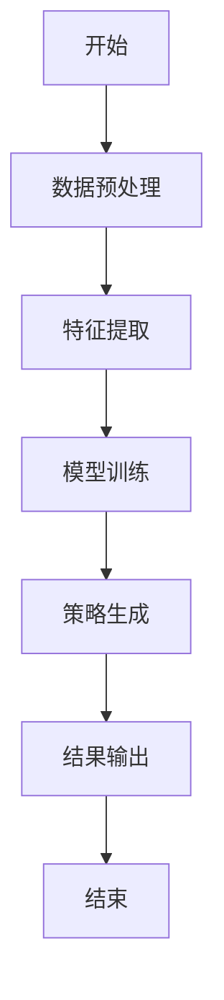

                 


# 智能跨境税收筹划建议系统

**关键词：** 智能税收筹划、跨境税务、人工智能、算法优化、系统架构

**摘要：**  
智能跨境税收筹划建议系统是一种基于人工智能技术的税务优化工具，旨在通过智能化分析和算法优化，为跨国企业和个人提供最优的税务筹划建议。本文从系统背景、核心概念、算法原理、系统架构到实际应用，全面阐述智能跨境税收筹划建议系统的构建与实现，为读者提供理论与实践相结合的深度解析。

---

## 第一部分: 智能跨境税收筹划建议系统的背景与核心概念

### 第1章: 背景介绍与问题背景

#### 1.1 智能跨境税收筹划的背景
- **1.1.1 全球化背景下的税务挑战**  
  随着全球经济的快速发展，跨国企业和个人在全球范围内的税务筹划需求日益增加。不同国家和地区的税收政策差异为税务优化提供了空间，但也带来了复杂的税务合规问题。

- **1.1.2 数字化与智能化对税务筹划的影响**  
  随着人工智能技术的快速发展，税务筹划从传统的手动分析逐渐向智能化、自动化方向转变。智能化系统能够快速处理海量税务数据，提供实时优化建议。

- **1.1.3 跨境税收筹划的核心问题与目标**  
  跨境税收筹划的核心问题是如何在遵守国际税收规则的前提下，最大化税务优化效果。其目标是通过技术手段，降低税务成本，提高合规性。

#### 1.2 跨境税收筹划的核心概念
- **1.2.1 税务主体与税务居民的定义**  
  税务主体包括企业、个人等，税务居民则是根据居住地或法律认定的纳税人。跨境税务筹划需要明确不同税务主体的定义和责任。

- **1.2.2 跨境交易与税务管辖权的冲突**  
  跨境交易涉及多个国家的税务管辖权，可能导致双重征税或税负不公。智能系统需要解决这一冲突，确保税务合规。

- **1.2.3 税收优惠政策与避税策略**  
  不同国家和地区提供不同的税收优惠政策，智能系统能够分析这些政策，制定最优的避税策略。

### 第2章: 系统核心概念与联系

#### 2.1 系统的核心概念
- **税务主体**：包括企业、个人等，是系统的主要服务对象。
- **税务机关**：负责税收征管和政策制定。
- **税务顾问**：提供专业税务建议，协助系统优化。

#### 2.2 核心概念的ER实体关系图
```mermaid
erDiagram
    actor 税务主体 {
        id : 整数
        name : 字符串
        country : 字符串
    }
    actor 税务机关 {
        id : 整数
        name : 字符串
        jurisdiction : 字符串
    }
    actor 税务顾问 {
        id : 整数
        name : 字符串
        expertise : 字符串
    }
    税务主体 --> 税务机关 : 缴纳
    税务主体 --> 税务顾问 : 咨询
    税务机关 --> 税务顾问 : 协作
```

---

## 第二部分: 算法原理与数学模型

### 第3章: 税务筹划算法的原理与实现

#### 3.1 基于机器学习的税务优化算法
- **3.1.1 算法选择与适用场景**  
  基于机器学习的算法，如决策树、随机森林和神经网络，适用于复杂的税务数据挖掘和模式识别。

- **3.1.2 算法流程图**  


- **3.1.3 算法实现的Python代码示例**  
```python
def tax_optimization(data):
    # 数据预处理
    processed_data = preprocess(data)
    # 特征提取
    features = extract_features(processed_data)
    # 模型训练
    model = train_model(features)
    # 策略生成
    optimized_strategy = generate_strategy(model, features)
    return optimized_strategy
```

#### 3.2 税务筹划的数学模型与优化方法
- **3.2.1 税收筹划的数学建模**  
  基于线性规划的数学模型，如：
  $$ \text{minimize } \sum w_i x_i $$
  $$ \text{subject to } \sum x_i \leq C $$

- **3.2.2 基于优化算法的税务策略设计**  
  使用遗传算法或模拟退火算法优化税务策略，确保在约束条件下找到最优解。

---

## 第三部分: 系统分析与架构设计

### 第4章: 系统架构与功能设计

#### 4.1 系统应用场景
- 跨境企业的税务优化
- 个人跨国税务规划
- 税务机关的政策评估

#### 4.2 系统功能设计
- **数据采集模块**：采集税务数据，包括跨国交易数据、税收政策等。
- **数据处理模块**：清洗、转换和标准化数据。
- **智能分析模块**：基于机器学习算法生成税务优化建议。
- **结果展示模块**：以可视化方式呈现优化策略。

#### 4.3 系统架构设计


---

## 第四部分: 项目实战与案例分析

### 第5章: 项目实战

#### 5.1 环境安装与配置
- 安装Python、机器学习库（如scikit-learn、TensorFlow）和数据处理工具（如Pandas）。

#### 5.2 系统核心代码实现
```python
import pandas as pd
from sklearn.tree import DecisionTreeRegressor

def preprocess(data):
    # 数据清洗与转换
    return data.dropna()

def extract_features(data):
    # 特征提取
    return data[['income', 'transaction_amount', 'country_code']]

def train_model(features, labels):
    # 模型训练
    model = DecisionTreeRegressor()
    model.fit(features, labels)
    return model

def generate_strategy(model, features):
    # 策略生成
    predictions = model.predict(features)
    return predictions
```

#### 5.3 案例分析与结果解读
- 案例背景：一家跨国企业的税务优化需求。
- 数据分析与处理。
- 算法应用与结果解读。

---

## 第五部分: 总结与展望

### 第6章: 总结与展望

#### 6.1 最佳实践 tips
- 数据质量是关键，确保数据的完整性和准确性。
- 定期更新税收政策库，保持系统的实时性。

#### 6.2 小结
智能跨境税收筹划建议系统通过人工智能技术，为税务优化提供了高效、智能的解决方案，帮助企业和个人实现最优税务策略。

#### 6.3 注意事项
- 税务法规复杂多变，系统需要定期更新。
- 数据隐私和合规性需严格遵守。

#### 6.4 拓展阅读
- 人工智能与税务的结合
- 全球税收政策的最新变化

---

**作者：AI天才研究院/AI Genius Institute & 禅与计算机程序设计艺术 /Zen And The Art of Computer Programming**

