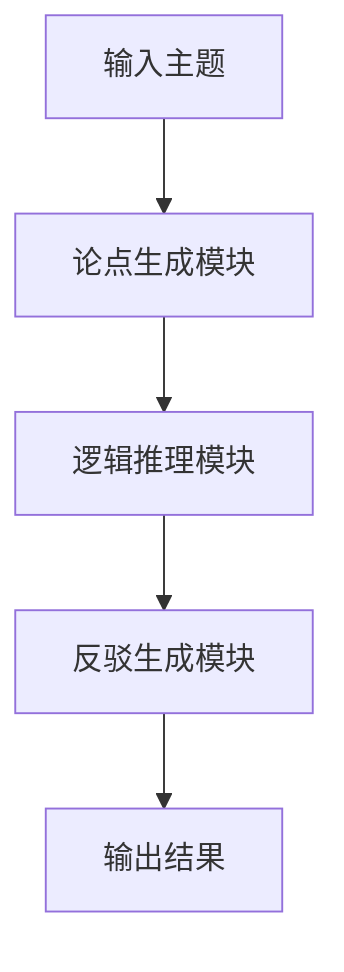

                 


# 智能辩论AI Agent：LLM驱动的论证与反驳系统

> 关键词：智能辩论AI Agent, 大语言模型, 论证, 反驳, 自然语言处理, 人工智能

> 摘要：本文将详细介绍基于大语言模型（LLM）的智能辩论AI Agent的构建与实现，从核心概念、算法原理到系统架构设计，再到项目实战，全面解析智能辩论AI Agent的运作机制。通过本文，读者将能够理解智能辩论AI Agent的核心原理，并掌握其实现的关键技术。

---

# 第1章: 智能辩论AI Agent概述

## 1.1 问题背景与描述
### 1.1.1 辩论AI Agent的背景
随着人工智能技术的快速发展，特别是在自然语言处理（NLP）领域的突破，大语言模型（LLM）如GPT-3、GPT-4等，已经展现出强大的文本生成和理解能力。然而，这些模型虽然在生成文本方面表现出色，但在逻辑推理、论证和反驳方面仍有提升空间。智能辩论AI Agent正是基于LLM构建的一种能够自动进行论证和反驳的系统。

### 1.1.2 智能辩论的定义与目标
智能辩论AI Agent是一种能够自动生成和反驳论点的AI系统，其目标是通过自然语言处理技术，模拟人类在辩论中的逻辑推理过程，从而实现自动化、智能化的论证和反驳。

### 1.1.3 辩论AI Agent的应用场景
智能辩论AI Agent的应用场景广泛，包括但不限于：
- 教育领域：辅助学生进行论点生成和辩论训练。
- 司法领域：辅助律师进行案件分析和论点构建。
- 商业领域：帮助企业进行市场分析和竞争策略制定。
- 科技领域：用于机器人对话系统中的逻辑推理和反驳。

---

## 1.2 问题解决与边界
### 1.2.1 辩论AI Agent的核心问题
智能辩论AI Agent的核心问题是如何基于LLM生成论点，并根据给定的论点生成反驳。这需要解决以下问题：
1. 如何从LLM生成论点。
2. 如何根据论点生成反驳。
3. 如何确保论点和反驳的逻辑一致性。

### 1.2.2 边界与外延
智能辩论AI Agent的边界在于其仅专注于生成和反驳论点，而不涉及具体的情感分析或语境理解。外延则包括基于LLM的论点生成、反驳生成以及两者之间的逻辑关系分析。

### 1.2.3 核心要素与组成
智能辩论AI Agent的核心要素包括：
1. LLM模型：用于生成论点和反驳。
2. 论证逻辑：用于构建论点和反驳的逻辑结构。
3. 反驳逻辑：用于生成针对论点的反驳。

---

# 第2章: 智能辩论AI Agent的核心原理

## 2.1 LLM驱动的论证机制
### 2.1.1 LLM的基本原理
大语言模型（LLM）通过大量文本数据的训练，能够生成与输入相关的文本输出。其核心在于概率预测，即根据输入的上下文，预测下一个词的概率分布。

### 2.1.2 论证的逻辑结构
论证的逻辑结构包括以下部分：
1. **论点**：一个具体的主张或声明。
2. **论据**：支持论点的事实或理由。
3. **推理**：从论据到论点的逻辑连接。

### 2.1.3 反驳的逻辑结构
反驳的逻辑结构包括以下部分：
1. **反驳论点**：对原论点的否定。
2. **反驳论据**：用于支持反驳论点的事实或理由。
3. **反驳推理**：从反驳论据到反驳论点的逻辑连接。

---

## 2.2 核心概念的ER实体关系图
```mermaid
er
    entity 论证系统 {
        <辩论主题, 唯一>
        <论点, 多对多>
        <论据, 多对多>
    }
    entity 论点 {
        <论点ID, 唯一>
        <论点内容>
    }
    entity 论据 {
        <论据ID, 唯一>
        <论据内容>
    }
```

---

## 2.3 概念属性对比表
| 概念 | 属性 | 描述 |
|------|------|------|
| 论证 | 独立性 | 独立的论点 |
|      | 依赖性 | 依赖其他论点 |
| 反驳 | 直接性 | 直接反驳论点 |
|      | 间接性 | 间接反驳论点 |

---

# 第3章: LLM驱动的论证与反驳算法

## 3.1 算法原理
### 3.1.1 基于LLM的生成式模型
大语言模型通过生成式模型生成文本，其核心在于概率预测。例如，给定输入“我们应该减少碳排放”，模型会根据上下文生成相关论点，如“减少碳排放可以减缓气候变化”。

---

## 3.2 算法流程
### 3.2.1 论证生成
1. 输入：论点主题（如“我们应该减少碳排放”）。
2. 输出：生成多个支持论点的论据，例如：
   - 碳排放导致气候变化。
   - 减少碳排放有助于保护环境。

### 3.2.2 反驳生成
1. 输入：原论点（如“我们应该减少碳排放”）。
2. 输出：生成反驳论点，例如：
   - 碳排放是经济发展不可避免的结果。
   - 当前技术无法有效减少碳排放。

---

## 3.3 算法数学模型
### 3.3.1 概率预测模型
$$ P(word_{n+1} | context) = \frac{P(word_{n+1}, context)}{P(context)} $$

### 3.3.2 论证生成模型
$$ Argument = f_{LLM}(Topic) $$

### 3.3.3 反驳生成模型
$$ Refutation = f_{LLM}(Argument) $$

---

# 第4章: 系统分析与架构设计方案

## 4.1 系统架构设计
### 4.1.1 系统功能模块
1. **论点生成模块**：基于输入主题生成论点。
2. **反驳生成模块**：基于生成的论点生成反驳。
3. **逻辑推理模块**：确保论点和反驳的逻辑一致性。

### 4.1.2 系统架构图


---

## 4.2 系统接口设计
### 4.2.1 API接口
1. `/generate_argument`：输入主题，输出论点。
2. `/generate_refutation`：输入论点，输出反驳。

### 4.2.2 接口交互流程
1. 用户调用`/generate_argument`，输入“减少碳排放”。
2. 系统生成论点“减少碳排放可以减缓气候变化”。
3. 用户调用`/generate_refutation`，输入生成的论点。
4. 系统生成反驳“碳排放是经济发展不可避免的结果”。

---

# 第5章: 项目实战

## 5.1 环境安装
```bash
pip install transformers
pip install mermaid
```

## 5.2 核心代码实现
### 5.2.1 论点生成代码
```python
from transformers import pipeline

argument_generator = pipeline("text-generation", model="gpt2")
argument = argument_generator("减少碳排放", max_length=50)[0]['generated_text']
```

### 5.2.2 反驳生成代码
```python
refutation_generator = pipeline("text-generation", model="gpt2")
refutation = refutation_generator(argument, max_length=50)[0]['generated_text']
```

## 5.3 案例分析
### 5.3.1 论点生成案例
输入主题：减少碳排放
生成论点：减少碳排放可以减缓气候变化。

### 5.3.2 反驳生成案例
输入论点：减少碳排放可以减缓气候变化。
生成反驳：碳排放是经济发展不可避免的结果。

---

## 5.4 项目小结
通过本项目，我们实现了基于LLM的智能辩论AI Agent，能够自动生成论点和反驳。该系统可以应用于教育、司法、商业等多个领域，帮助用户快速构建和分析论点。

---

# 第6章: 最佳实践、小结、注意事项与拓展阅读

## 6.1 最佳实践
1. 在实际应用中，建议结合具体领域知识优化模型性能。
2. 注意模型的伦理问题，避免生成有害内容。

## 6.2 小结
本文详细介绍了智能辩论AI Agent的构建与实现，从核心概念到算法原理，再到系统架构设计和项目实战，全面解析了其运作机制。

## 6.3 注意事项
1. 模型的训练数据可能影响生成内容的客观性。
2. 需要结合具体场景优化模型参数。

## 6.4 拓展阅读
建议读者进一步阅读以下内容：
- 大语言模型（LLM）的原理与应用。
- 自然语言处理（NLP）在辩论中的应用。
- 逻辑推理与论证的高级技术。

---

作者：AI天才研究院/AI Genius Institute & 禅与计算机程序设计艺术 /Zen And The Art of Computer Programming

