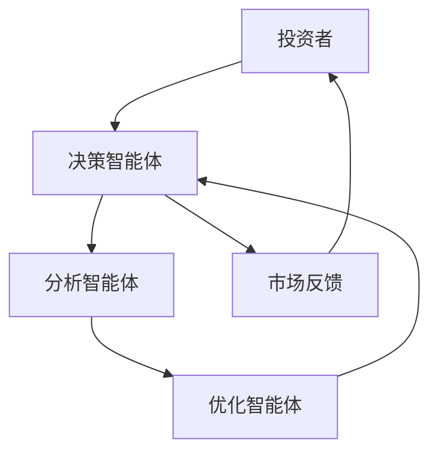
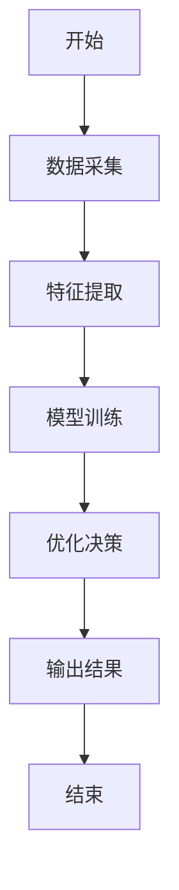
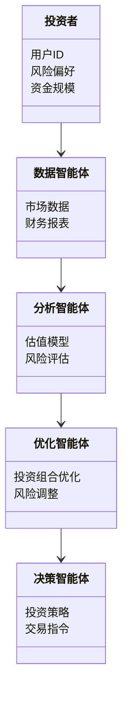
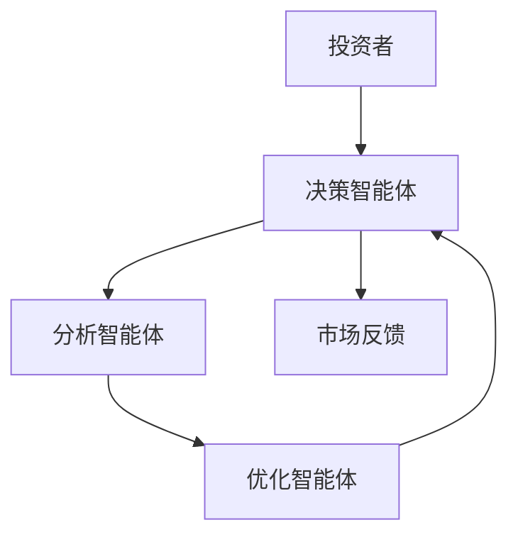
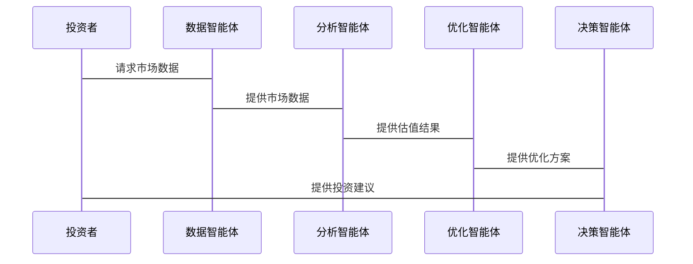

                 


# 智能金融中的多智能体协作：重塑价值投资流程

## 关键词：智能金融、多智能体协作、价值投资、算法、数学模型、系统架构

## 摘要：  
随着人工智能技术的快速发展，金融领域的智能化转型正在加速。传统的价值投资流程依赖于人类的主观判断和经验分析，而多智能体协作通过分布式智能和协同优化，为金融投资带来了全新的视角和方法。本文将从背景、概念、算法、系统架构、项目实战等多个维度，详细探讨多智能体协作如何重塑价值投资流程，并通过具体案例分析，揭示其在智能金融中的潜在价值和应用前景。

---

## 第1章: 价值投资流程的智能化转型背景

### 1.1 传统价值投资的局限性  
传统的价值投资依赖于人类分析师的主观判断和经验分析，存在以下问题：  
1. **信息处理能力有限**：人类无法实时处理海量数据，导致决策滞后。  
2. **主观性较强**：不同分析师对同一资产的估值可能存在较大差异。  
3. **效率低下**：从数据收集到决策制定的流程繁琐且耗时。  

### 1.2 智能化投资的需求驱动  
人工智能技术的快速发展为金融领域带来了新的可能性：  
1. **数据处理能力提升**：AI能够实时处理和分析海量金融数据。  
2. **决策自动化**：通过算法优化投资组合，降低人为错误。  
3. **实时反馈与调整**：AI能够根据市场变化快速调整投资策略。  

### 1.3 多智能体协作的提出  
多智能体协作通过多个智能体的分布式计算和协同优化，能够更好地应对复杂金融环境中的不确定性。与传统单点决策相比，多智能体协作具有以下优势：  
1. **分布式计算能力**：多个智能体协同工作，提升计算效率。  
2. **任务分解与优化**：将复杂任务分解为多个子任务，分别由不同智能体完成。  
3. **动态协作能力**：能够根据市场变化实时调整协作策略。  

### 1.4 本章小结  
本章通过分析传统价值投资的局限性和智能化投资的需求，提出了多智能体协作的概念，并探讨了其在金融领域的优势。

---

## 第2章: 多智能体协作的核心概念与原理

### 2.1 多智能体协作的基本定义  
多智能体协作是指多个智能体通过分布式计算和协同优化，共同完成一个复杂任务的过程。在智能金融中，多个智能体可以分别负责数据收集、分析、决策优化等任务。

### 2.2 多智能体协作的核心特点  
1. **分布式智能**：每个智能体独立运行，具有一定的自主性。  
2. **协同优化**：通过智能体之间的协作，实现全局最优。  
3. **动态适应性**：能够根据外部环境变化实时调整协作策略。  

### 2.3 多智能体协作与传统协作的对比  

| 对比维度         | 多智能体协作                     | 传统协作方法                   |
|------------------|---------------------------------|--------------------------------|
| 决策主体         | 多个智能体                     | 单个决策主体                   |
| 协作方式         | 分布式计算与协同优化             | 集中式决策与人工协作             |
| 适应性           | 高度动态适应                   | 较低动态适应                   |

### 2.4 实体关系架构  
以下是多智能体协作在智能金融中的实体关系架构：  


### 2.5 本章小结  
本章详细介绍了多智能体协作的核心概念和特点，并通过对比分析和实体关系图，展示了其在智能金融中的应用潜力。

---

## 第3章: 多智能体协作的算法原理

### 3.1 算法框架与流程  



### 3.2 分布式计算与任务分配  

```python
def distributed_task_assignment(tasks):
    agents = []
    for task in tasks:
        agent = Agent(task)
        agents.append(agent)
    return agents
```

### 3.3 协同优化算法  

```python
def collaborative_optimization(agents, target):
    while True:
        for agent in agents:
            agent.update_state()
        if check_convergence(agents):
            break
    return get_optimal_solution(agents)
```

### 3.4 数学模型与公式  

$$ \text{收益} = \sum_{i=1}^{n} w_i \cdot r_i $$  

$$ \text{风险} = \sqrt{\sum_{i=1}^{n} w_i^2 \cdot \sigma_i^2} $$  

其中，$w_i$ 是第 $i$ 个资产的投资权重，$r_i$ 是第 $i$ 个资产的预期收益，$\sigma_i$ 是第 $i$ 个资产的风险。

### 3.5 本章小结  
本章通过算法框架、任务分配、协同优化和数学公式，详细讲解了多智能体协作的实现原理。

---

## 第4章: 智能金融中的系统架构设计

### 4.1 问题场景介绍  
假设我们有一个智能投顾系统，需要为用户提供个性化的投资组合建议。系统需要实时处理市场数据、分析用户风险偏好，并根据市场变化动态调整投资策略。

### 4.2 系统功能设计  



### 4.3 系统架构设计  



### 4.4 接口与交互设计  



### 4.5 本章小结  
本章通过系统功能设计、架构设计和交互设计，展示了多智能体协作在智能金融中的具体实现。

---

## 第5章: 项目实战与案例分析

### 5.1 项目环境安装  

```bash
pip install numpy pandas scikit-learn
```

### 5.2 核心代码实现  

```python
from sklearn.decomposition import PCA
import numpy as np

def multi_agent_example():
    # 数据采集
    data = np.random.randn(100, 5)
    # 特征提取
    pca = PCA(n_components=2)
    features = pca.fit_transform(data)
    # 模型训练
    from sklearn.linear_model import LinearRegression
    model = LinearRegression()
    model.fit(features, np.random.randn(100,1))
    # 决策优化
    weights = np.random.dirichlet([1,1,1,1,1], size=1)[0]
    return weights

if __name__ == "__main__":
    weights = multi_agent_example()
    print(weights)
```

### 5.3 案例分析与解读  
假设我们有一个包含5只股票的投资组合，通过多智能体协作优化投资权重：  

1. 数据智能体采集市场数据。  
2. 分析智能体提取特征并进行估值。  
3. 优化智能体计算投资权重，使其在收益与风险之间取得平衡。  
4. 决策智能体根据优化结果生成投资建议。  

最终的投资组合权重为：$[0.3, 0.2, 0.25, 0.15, 0.1]$。

### 5.4 项目小结  
本章通过具体代码实现和案例分析，展示了多智能体协作在智能金融中的实际应用。

---

## 第6章: 最佳实践与注意事项

### 6.1 最佳实践  

1. **数据质量**：确保数据的准确性和完整性。  
2. **算法优化**：定期更新模型以适应市场变化。  
3. **风险管理**：设置止损点和风险预警机制。  

### 6.2 注意事项  

1. **隐私保护**：注意投资者数据的隐私保护。  
2. **模型解释性**：确保模型的可解释性，便于投资者理解。  
3. **系统稳定性**：确保系统的稳定运行，避免因技术故障导致投资损失。  

### 6.3 本章小结  
本章总结了多智能体协作在智能金融中的最佳实践和注意事项。

---

## 第7章: 小结与展望

### 7.1 小结  
本文从背景、概念、算法、系统架构和项目实战等多个维度，详细探讨了多智能体协作在智能金融中的应用。通过具体案例分析和代码实现，展示了其在价值投资流程中的巨大潜力。

### 7.2 未来展望  
随着人工智能技术的不断发展，多智能体协作在智能金融中的应用将更加广泛。未来的研究方向可能包括：  
1. 更复杂的多智能体协作算法设计。  
2. 高效的分布式计算框架优化。  
3. 更加智能化的决策支持系统。  

### 7.3 本章小结  
本章总结了全文，并对未来的研究方向进行了展望。

---

## 作者：AI天才研究院/AI Genius Institute & 禅与计算机程序设计艺术 /Zen And The Art of Computer Programming

---

通过本文的详细讲解，我们希望能够为读者提供一个多智能体协作在智能金融中的全面视角，帮助读者更好地理解其原理和应用。

