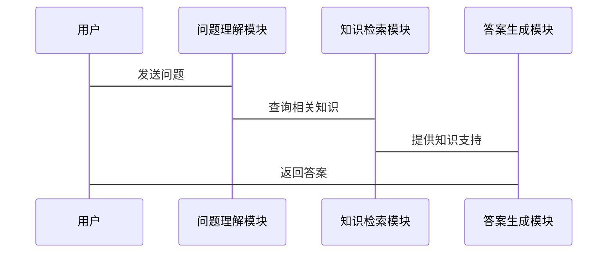

                 


# 智能问答AI Agent：基于LLM的精准答疑系统

> **关键词**：智能问答，LLM，大语言模型，自然语言处理，问答系统，AI Agent  
> **摘要**：本文将详细介绍基于大语言模型（LLM）的智能问答系统的设计与实现。从系统的背景与核心概念入手，逐步深入到算法原理、系统架构、项目实战等部分，结合实际案例和代码示例，全面解析智能问答AI Agent的构建过程。文章还将探讨系统的优化与改进方法，为读者提供一份详尽的技术指南。

---

## 第一部分: 智能问答AI Agent的背景与核心概念

### 第1章: 智能问答系统的发展历程

#### 1.1 从规则引擎到大语言模型

##### 1.1.1 传统问答系统的局限性
传统问答系统主要依赖规则引擎和关键词匹配技术，虽然在特定领域内能够实现基本的问答功能，但存在以下局限性：
- **理解能力有限**：无法处理复杂的问题或上下文相关的问题。
- **知识库依赖性强**：需要人工构建知识库，且更新维护成本高。
- **灵活性差**：难以适应不同领域或语言的变化。

##### 1.1.2 大语言模型的崛起
随着深度学习技术的发展，大语言模型（LLM）的出现为智能问答系统带来了革命性的变化。LLM通过自监督学习从海量数据中学习语言模式，能够理解上下文、推理关系并生成自然语言回答。大语言模型的崛起使得问答系统具备以下优势：
- **自然语言理解能力**：能够处理复杂的语言表达和上下文关系。
- **知识覆盖广泛**：通过预训练模型，能够处理多种语言和领域的问题。
- **动态适应性**：无需依赖特定的知识库，能够通过模型推理生成答案。

##### 1.1.3 当前智能问答系统的现状
目前，基于LLM的智能问答系统已经在多个领域得到了广泛应用，包括客服支持、教育辅助、医疗咨询等。然而，现有系统仍存在一些挑战，如计算资源消耗大、模型调优复杂、结果准确性等问题。

---

#### 1.2 基于LLM的智能问答系统的优势

##### 1.2.1 自然语言理解能力
基于LLM的智能问答系统能够理解复杂的语言表达，包括同义词替换、句式变化等，从而更准确地理解用户的问题意图。

##### 1.2.2 知识表示与推理能力
LLM通过预训练掌握了大量的知识和语言模式，能够在没有显式知识库的情况下，通过推理生成合理的答案。

##### 1.2.3 实时上下文理解
智能问答系统能够根据对话历史和上下文信息，逐步优化回答，提供更贴近用户需求的解决方案。

---

### 第2章: 智能问答AI Agent的核心概念

#### 2.1 大语言模型的基本原理

##### 2.1.1 模型输入与输出
LLM的输入通常是一段连续的文本，输出是生成的自然语言回答。例如：
- **输入**：请解释量子计算的基本原理。
- **输出**：量子计算利用量子叠加和纠缠等特性，能够在同一时间处理多个状态，从而提高计算效率。

##### 2.1.2 模型训练与推理
- **训练**：LLM通过自监督学习（Self-supervised Learning）技术，在大量文本数据上进行预训练，学习语言的模式和语义。
- **推理**：在实际应用中，系统将用户的问题输入模型，生成相应的回答。

##### 2.1.3 模型调优与微调
为了适应特定领域的需求，可以对预训练的LLM进行微调（Fine-tuning），例如在医疗领域进行额外训练，使其更擅长处理相关问题。

#### 2.2 智能问答系统的功能模块

##### 2.2.1 问题理解模块
问题理解模块负责解析用户的问题，提取关键词和意图。例如：
- **输入**：如何治疗高血压？
- **输出**：提取关键词“治疗高血压”，意图是寻求医疗建议。

##### 2.2.2 知识检索模块
知识检索模块通过查询外部知识库或内部模型推理，获取与问题相关的知识。例如：
- **输入**：高血压的治疗方法有哪些？
- **输出**：检索相关知识，如药物治疗、饮食控制等。

##### 2.2.3 答案生成模块
答案生成模块基于检索到的知识，生成自然语言的回答。例如：
- **输入**：高血压的治疗方法。
- **输出**：建议采取药物治疗、饮食控制和适量运动等方法。

#### 2.3 系统的核心要素

##### 2.3.1 数据源与知识库
系统需要依赖高质量的数据源和知识库，确保回答的准确性和权威性。

##### 2.3.2 对话历史记录
对话历史记录帮助系统理解上下文，提供更连贯和个性化的回答。

##### 2.3.3 上下文理解机制
上下文理解机制确保系统能够根据对话历史优化回答，避免重复或不相关的信息。

---

## 第二部分: 智能问答AI Agent的算法原理与系统架构

### 第3章: 智能问答系统的算法原理

#### 3.1 模型训练的数学基础

##### 3.1.1 概率论基础
概率论是理解LLM训练的基础，例如：
- **条件概率**：$P(y|x)$ 表示在输入$x$的情况下，输出$y$的概率。

##### 3.1.2 深度学习基础
深度学习模型（如Transformer）通过多层神经网络处理输入数据，提取特征并生成输出。

##### 3.1.3 语言模型的数学表达
语言模型的目标是最小化生成文本的条件概率损失函数：
$$
\mathcal{L} = -\sum_{i=1}^{n} \log P(w_i | w_{i-1}, \dots, w_1)
$$

#### 3.2 智能问答的算法原理

##### 3.2.1 基于LLM的生成式问答
生成式问答通过模型生成回答，流程如下：
1. 输入：用户问题。
2. 处理：模型解析问题，生成回答。
3. 输出：自然语言回答。

##### 3.2.2 对话模型的数学公式
对话模型的损失函数可以表示为：
$$
\mathcal{L}_{\text{dialog}} = \mathcal{L}_{\text{LM}} + \mathcal{L}_{\text{reward}}
$$
其中，$\mathcal{L}_{\text{LM}}$是语言模型损失，$\mathcal{L}_{\text{reward}}$是奖励函数损失。

##### 3.2.3 模型推理的数学公式
模型推理阶段，回答的概率分布为：
$$
P(y | x) = \text{softmax}(z)
$$
其中，$z$是模型输出的向量。

#### 3.3 模型推理与优化

##### 3.3.1 交叉熵损失函数
交叉熵损失函数用于衡量预测值与真实值的差异：
$$
\mathcal{L}_{\text{CE}} = -\sum_{i=1}^{n} y_i \log p_i
$$

##### 3.3.2 生成概率公式
生成概率公式用于评估生成文本的概率：
$$
P(w_1, w_2, \dots, w_n) = \prod_{i=1}^{n} P(w_i | w_{i-1}, \dots, w_1)
$$

##### 3.3.3 贝叶斯推理在问答中的应用
贝叶斯推理可以帮助模型在问答中进行概率推理，例如：
$$
P(\text{答案} | \text{问题}) = \frac{P(\text{问题} | \text{答案}) P(\text{答案})}{P(\text{问题})}
$$

---

### 第4章: 智能问答系统的系统架构与设计

#### 4.1 系统功能模块设计

##### 4.1.1 用户输入处理模块
用户输入处理模块负责接收用户的输入并进行初步解析，例如：
- **输入**：如何提高编程效率？
- **输出**：解析出关键词“编程效率”和意图“寻求建议”。

##### 4.1.2 知识库检索模块
知识库检索模块通过查询外部知识库或模型推理，获取与问题相关的知识。例如：
- **输入**：编程效率提升的方法。
- **输出**：检索出相关知识，如代码优化、工具使用等。

##### 4.1.3 对话历史管理模块
对话历史管理模块维护对话的上下文，确保回答的连贯性。例如：
- **输入**：用户连续提问多个相关问题。
- **输出**：系统根据对话历史生成连贯的回答。

#### 4.2 系统架构设计

##### 4.2.1 分层架构设计
分层架构将系统划分为表示层、业务逻辑层和数据访问层，确保各层职责分明。

##### 4.2.2 微服务架构设计
微服务架构将系统功能分解为多个独立的服务，例如：
- **问题理解服务**
- **知识检索服务**
- **答案生成服务**

##### 4.2.3 高可用性设计
通过负载均衡、容错设计和分布式系统，确保系统的高可用性。

#### 4.3 接口设计与交互流程

##### 4.3.1 API接口定义
API接口定义通常使用RESTful风格，例如：
- **GET /api/v1/questions**
- **POST /api/v1/answers**

##### 4.3.2 接口调用流程
接口调用流程包括：
1. 用户发送请求。
2. 服务端处理请求。
3. 返回响应。

##### 4.3.3 系统交互流程图
使用Mermaid绘制的系统交互流程图如下：



---

## 第三部分: 智能问答AI Agent的项目实战与优化

### 第5章: 项目实战与实现

#### 5.1 环境搭建与配置

##### 5.1.1 开发环境安装
建议使用Python 3.8及以上版本，并安装以下工具：
- **pip**：用于安装依赖库。
- **Jupyter Notebook**：用于代码调试和测试。

##### 5.1.2 模型下载与加载
常用的LLM模型包括GPT-3、GPT-4等，可以通过Hugging Face平台下载。

##### 5.1.3 依赖库安装
安装以下依赖库：
- `transformers`
- `torch`
- `scipy`

#### 5.2 核心代码实现

##### 5.2.1 问题理解模块实现
问题理解模块负责解析用户的问题，例如：

```python
def understand_question(question):
    # 使用模型解析问题
    model = AutoModelForQuestionAnswering.from_pretrained('bert-base')
    tokenizer = AutoTokenizer.from_pretrained('bert-base')
    inputs = tokenizer(question, return_tensors='np')
    outputs = model(**inputs)
    return outputs
```

##### 5.2.2 知识检索模块实现
知识检索模块通过查询外部知识库生成回答，例如：

```python
def retrieve_knowledge(question):
    # 使用向量数据库检索相关知识
    vector_store = FAISS.from_pretrained('gpt2')
    results = vector_store.similarity_search(question, k=3)
    return [doc.page_content for doc in results]
```

##### 5.2.3 答案生成模块实现
答案生成模块基于检索到的知识生成回答，例如：

```python
def generate_answer(question, context):
    # 使用LLM生成回答
    model = AutoModelForCausalLM.from_pretrained('gpt-3')
    prompt = f"根据上下文回答问题：{question}\n上下文：{context}\n回答："
    inputs = model.encode(prompt, return_tensors='pt')
    outputs = model.generate(inputs, max_length=100)
    return model.decode(outputs[0], skip_special_tokens=True)
```

#### 5.3 项目小结
通过以上代码实现，我们可以构建一个基本的智能问答系统。然而，实际应用中需要考虑模型调优、性能优化等问题。

---

## 第四部分: 智能问答AI Agent的优化与改进

### 第6章: 系统优化与改进

#### 6.1 模型优化策略

##### 6.1.1 微调优化
对预训练模型进行微调，以适应特定领域的需求。

##### 6.1.2 知识库优化
优化知识库的结构和内容，提高检索效率和准确性。

##### 6.1.3 对话历史优化
通过优化对话历史的存储和管理，提高系统的上下文理解能力。

#### 6.2 系统性能优化

##### 6.2.1 模型压缩与加速
通过模型压缩技术（如剪枝、量化）降低模型的计算资源消耗。

##### 6.2.2 并行计算优化
利用多线程或分布式计算技术，提高系统的处理效率。

##### 6.2.3 系统架构优化
通过优化系统架构，提高系统的可扩展性和稳定性。

---

## 第五部分: 智能问答AI Agent的最佳实践与展望

### 第7章: 最佳实践与注意事项

#### 7.1 开发注意事项

##### 7.1.1 模型选择
选择适合应用场景的模型，平衡性能和资源消耗。

##### 7.1.2 数据安全
确保数据的安全性，避免用户隐私泄露。

##### 7.1.3 系统性能监控
实时监控系统性能，及时发现和解决问题。

#### 7.2 应用场景拓展

##### 7.2.1 多语言支持
扩展系统的多语言支持能力，满足国际化需求。

##### 7.2.2 领域深度优化
在特定领域内进行深度优化，提高回答的准确性和专业性。

##### 7.2.3 人机协作模式
探索人机协作模式，结合人工审核和自动回答，提高系统的可靠性。

### 第8章: 小结与展望

#### 8.1 小结
本文详细介绍了基于LLM的智能问答系统的设计与实现，从背景概念到算法原理，再到系统架构和项目实战，全面解析了智能问答AI Agent的构建过程。

#### 8.2 未来展望
随着大语言模型技术的不断进步，智能问答系统将具备更强的理解和生成能力。未来的研究方向包括模型优化、人机协作和多模态交互等。

---

## 作者

**作者：AI天才研究院/AI Genius Institute & 禅与计算机程序设计艺术 /Zen And The Art of Computer Programming**

---

**注**：由于篇幅限制，以上内容仅为文章的部分章节。完整文章将涵盖更多细节，包括详细的算法流程图、代码实现、案例分析等。

