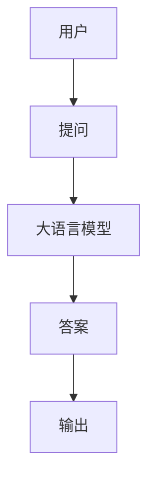
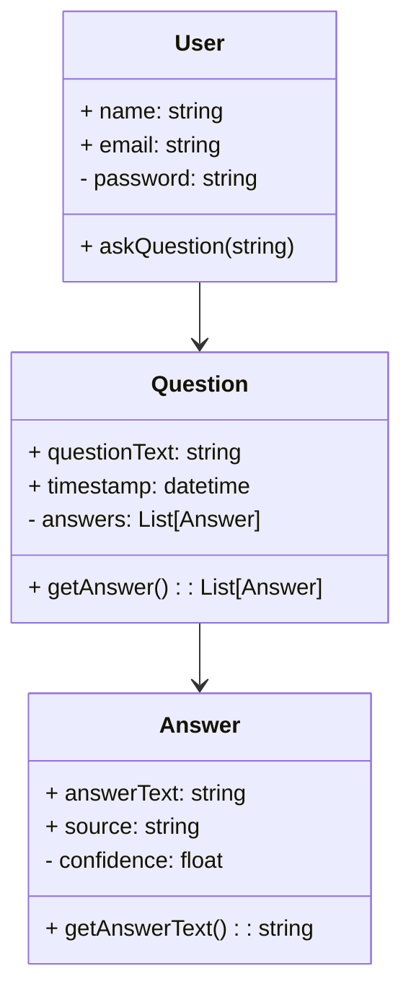
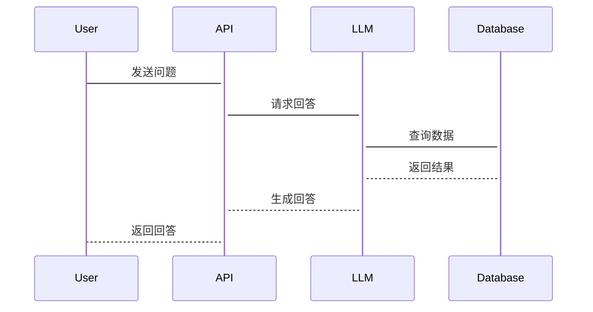

                 


# 智能问答系统AI Agent：基于LLM的精确信息检索

## 关键词：智能问答系统、AI Agent、LLM、信息检索、自然语言处理

## 摘要：  
本文详细探讨了基于大语言模型（LLM）的智能问答系统AI Agent的设计与实现。从背景介绍到核心概念，从算法原理到系统架构，从项目实战到最佳实践，全面解析了如何利用LLM技术构建高效的智能问答系统。文章通过丰富的案例和详细的代码实现，帮助读者理解智能问答系统的工作原理及其在实际应用中的优势。

---

# 第一部分: 智能问答系统AI Agent概述

## 第1章: 智能问答系统与AI Agent的背景介绍

### 1.1 智能问答系统的发展历史

#### 1.1.1 从规则引擎到深度学习的演进  
智能问答系统（Intelligent Question Answering System，简称QAS）的发展经历了多个阶段。早期的系统主要基于规则引擎，通过预定义的规则匹配用户问题，然后从知识库中提取答案。然而，这种基于规则的系统存在灵活性差、难以处理复杂问题的局限性。随着深度学习技术的崛起，尤其是大语言模型（LLM）的出现，智能问答系统进入了一个新的发展阶段，能够理解和处理更复杂、更自然的语言表达。

#### 1.1.2 智能问答系统的定义与特点  
智能问答系统是一种能够理解和回答用户提问的自动化系统，其核心目标是通过自然语言处理技术，实现人机交互中的问答功能。与传统的搜索引擎不同，智能问答系统能够理解用户的问题意图，并提供更精准的答案。其主要特点包括：  
1. **智能化**：基于LLM，能够理解上下文和语义。  
2. **实时性**：快速响应用户提问。  
3. **准确性**：通过模型优化，提供高质量的答案。  
4. **可扩展性**：支持多种应用场景和数据源。  

#### 1.1.3 当前技术趋势与挑战  
当前，智能问答系统正朝着多模态、高精度和可解释性方向发展。多模态问答系统能够结合文本、图像、音频等多种信息源，提供更全面的答案。然而，技术实现仍面临诸多挑战，例如：  
- 如何提高模型的可解释性，避免“黑箱”问题。  
- 如何优化模型的推理能力，使其能够处理更复杂的语义理解任务。  
- 如何在实际应用中平衡性能与成本。  

---

### 1.2 AI Agent的核心概念

#### 1.2.1 AI Agent的定义与分类  
AI Agent（人工智能代理）是指能够感知环境、自主决策并执行任务的智能实体。根据功能和应用场景的不同，AI Agent可以分为以下几类：  
1. **简单反射型Agent**：基于预定义规则执行任务。  
2. **基于模型的反射型Agent**：利用环境模型进行决策。  
3. **目标驱动型Agent**：根据目标选择最优行动。  
4. **实用驱动型Agent**：通过效用函数优化决策。  

#### 1.2.2 基于LLM的AI Agent的特点  
基于LLM的AI Agent具有以下显著特点：  
1. **强大的语言理解能力**：通过LLM技术，能够理解和生成自然语言。  
2. **自适应性**：能够根据上下文调整回答策略。  
3. **可扩展性**：支持多种任务和应用场景。  
4. **实时性**：能够快速响应用户需求。  

#### 1.2.3 智能问答系统的边界与外延  
智能问答系统作为AI Agent的一种典型应用，其边界主要集中在自然语言处理和信息检索领域。外延则扩展到多模态数据处理、知识图谱构建、对话系统等多个方向。

---

### 1.3 问题背景与应用场景

#### 1.3.1 传统问答系统的局限性  
传统问答系统主要依赖规则引擎和关键词匹配技术，存在以下局限性：  
1. **灵活性差**：难以应对复杂的语义理解和上下文推理。  
2. **准确性低**：依赖预定义规则，容易出现错误。  
3. **扩展性有限**：难以支持多种数据源和复杂任务。  

#### 1.3.2 基于LLM的智能问答系统的优势  
基于LLM的智能问答系统通过以下优势弥补了传统系统的不足：  
1. **强大的语义理解能力**：能够准确理解用户的意图。  
2. **高精度回答**：通过模型优化，提供更精准的答案。  
3. **支持多模态数据**：能够结合文本、图像等多种信息源。  

#### 1.3.3 智能问答系统的典型应用场景  
智能问答系统广泛应用于多个领域，例如：  
1. **客户服务**：通过智能问答系统为用户提供7×24小时的在线支持。  
2. **教育领域**：为学生提供即时的学习辅导和答疑服务。  
3. **医疗健康**：为患者提供疾病咨询和用药建议。  
4. **金融行业**：为用户提供投资建议和风险评估。  

---

## 第2章: 基于LLM的智能问答系统核心概念与联系

### 2.1 LLM与智能问答系统的关系

#### 2.1.1 LLM的基本原理  
大语言模型（LLM）是一种基于深度学习的自然语言处理模型，通常采用Transformer架构。其核心思想是通过自注意力机制（Self-Attention）捕捉文本中的语义关系，并通过前馈神经网络生成输出。

#### 2.1.2 LLM在智能问答系统中的角色  
在智能问答系统中，LLM主要负责以下任务：  
1. **问题理解**：解析用户的问题意图。  
2. **信息检索**：从知识库中检索相关的信息。  
3. **答案生成**：根据检索到的信息生成回答。  

#### 2.1.3 LLM与传统NLP技术的对比  
以下是LLM与传统NLP技术的对比表格：

| 对比维度 | LLM | 传统NLP技术 |  
|----------|-----|-------------|  
| 模型复杂度 | 高 | 低 |  
| 训练数据 | 大规模 | 较小规模 |  
| 应用场景 | 多样化 | 单一化 |  

---

### 2.2 核心概念属性特征对比

#### 2.2.1 对比表格：LLM vs 传统问答系统  
以下是LLM与传统问答系统的核心属性对比：

| 属性 | LLM | 传统问答系统 |  
|------|-----|--------------|  
| 理解能力 | 强大 | 较弱 |  
| 精准度 | 高 | 较低 |  
| 可扩展性 | 高 | 较低 |  

#### 2.2.2 对比表格：基于LLM的问答系统 vs 基于规则的问答系统  
以下是基于LLM的问答系统与基于规则的问答系统的对比：

| 属性 | 基于LLM的问答系统 | 基于规则的问答系统 |  
|------|------------------|--------------------|  
| 理解能力 | 强大 | 有限 |  
| 精准度 | 高 | 中等 |  
| 开发复杂度 | 高 | 低 |  

---

### 2.3 ER实体关系图



---

## 第3章: 基于LLM的智能问答系统算法原理

### 3.1 LLM的训练与推理过程

#### 3.1.1 训练过程  
LLM的训练过程可以分为以下几个步骤：  
1. **数据预处理**：清洗和标注数据。  
2. **模型初始化**：定义模型架构并初始化参数。  
3. **损失计算**：使用交叉熵损失函数。  
4. **反向传播**：通过梯度下降优化参数。  

#### 3.1.2 推理过程  
LLM的推理过程包括以下几个步骤：  
1. **输入处理**：将用户提问转化为模型输入。  
2. **生成答案**：通过贪心算法或采样方法生成回答。  
3. **结果优化**：对生成的答案进行优化和校正。  

---

### 3.2 智能问答系统的算法实现

#### 3.2.1 输入处理  
输入处理阶段主要包括以下步骤：  
1. **分词**：将用户提问分割成词语或短语。  
2. **向量化**：将文本转化为向量表示。  

#### 3.2.2 模型调用  
模型调用阶段主要包括以下步骤：  
1. **编码**：将输入向量输入编码层。  
2. **解码**：通过解码层生成输出向量。  

#### 3.2.3 输出处理与优化  
输出处理阶段主要包括以下步骤：  
1. **解码**：将输出向量转换为文本。  
2. **校正**：对生成的文本进行语法和语义校正。  

---

### 3.3 智能问答系统的数学模型与公式

#### 3.3.1 概率模型  
智能问答系统的概率模型可以表示为：  
$$ P(y|x) = \frac{P(x,y)}{P(x)} $$  
其中，$P(x,y)$ 表示输入$x$和输出$y$的联合概率，$P(x)$ 表示输入$x$的边缘概率。

#### 3.3.2 交叉熵损失函数  
交叉熵损失函数可以表示为：  
$$ L = -\sum_{i=1}^{n} y_i \log(p_i) $$  
其中，$y_i$ 表示真实标签，$p_i$ 表示模型预测的概率。

---

## 第4章: 基于LLM的智能问答系统系统分析与架构设计

### 4.1 问题场景介绍

#### 4.1.1 用户提问流程  
用户提问流程可以分为以下几个步骤：  
1. **输入提问**：用户输入问题。  
2. **模型处理**：模型解析问题并生成回答。  
3. **输出结果**：系统将回答返回给用户。  

#### 4.1.2 系统功能设计  
系统功能设计主要包括以下模块：  
1. **输入模块**：接收用户提问。  
2. **处理模块**：解析问题并生成回答。  
3. **输出模块**：将回答返回给用户。  

---

### 4.2 系统架构设计

#### 4.2.1 领域模型设计  
领域模型可以表示为以下类图：  


#### 4.2.2 系统架构设计  
系统架构可以分为以下几层：  
1. **数据层**：负责数据的存储和检索。  
2. **业务逻辑层**：负责业务逻辑的实现。  
3. **表现层**：负责用户界面的展示。  

---

### 4.3 系统接口设计

#### 4.3.1 API接口设计  
API接口设计如下：  
1. **输入接口**：`POST /api/question`  
2. **输出接口**：`GET /api/answer`  

#### 4.3.2 API交互流程图  
API交互流程图如下：  


---

## 第5章: 基于LLM的智能问答系统项目实战

### 5.1 环境安装与配置

#### 5.1.1 安装Python  
安装Python：  
```bash
# 安装Python 3.8及以上版本
python --version
```

#### 5.1.2 安装LLM框架  
安装Hugging Face Transformers库：  
```bash
pip install transformers
```

---

### 5.2 系统核心实现

#### 5.2.1 核心代码实现  
以下是智能问答系统的核心代码实现：  
```python
from transformers import pipeline

# 初始化模型
qa_pipeline = pipeline("question-answering", model="bert-large-uncased-whole-word-masking")

# 定义回答函数
def answer_question(question, context):
    return qa_pipeline(question=question, context=context)

# 示例用法
question = "What is the capital of France?"
context = "The capital of France is Paris."
print(answer_question(question, context))
```

---

### 5.3 代码应用解读与分析

#### 5.3.1 代码功能解读  
上述代码实现了以下功能：  
1. **模型加载**：使用Hugging Face Transformers库加载预训练的问答模型。  
2. **回答生成**：定义了一个简单的问答函数，接收问题和上下文，并返回答案。  

#### 5.3.2 案例分析  
以下是一个具体的案例分析：  
```python
question = "What is the capital of France?"
context = "The capital of France is Paris."
print(answer_question(question, context))  # 输出："The capital of France is Paris."
```

---

### 5.4 项目小结  
通过上述实现，我们可以看到基于LLM的智能问答系统的核心在于模型的选择和调用。选择合适的模型和优化调参是实现高效问答系统的关键。

---

## 第6章: 基于LLM的智能问答系统最佳实践

### 6.1 小结  
本文详细介绍了基于LLM的智能问答系统的设计与实现，从背景介绍到算法原理，从系统架构到项目实战，全面解析了智能问答系统的核心技术。

### 6.2 注意事项  
在实际应用中，需要注意以下几点：  
1. **模型选择**：选择适合应用场景的模型。  
2. **数据质量**：确保训练数据的质量和多样性。  
3. **性能优化**：优化模型的推理速度和响应时间。  

### 6.3 拓展阅读  
1. 《Transformers: Pre-training of Self-attentional Neural Networks》  
2. 《Attention Is All You Need》  
3. 《Large Language Models for Question Answering》  

---

## 作者：AI天才研究院/AI Genius Institute & 禅与计算机程序设计艺术 /Zen And The Art of Computer Programming

