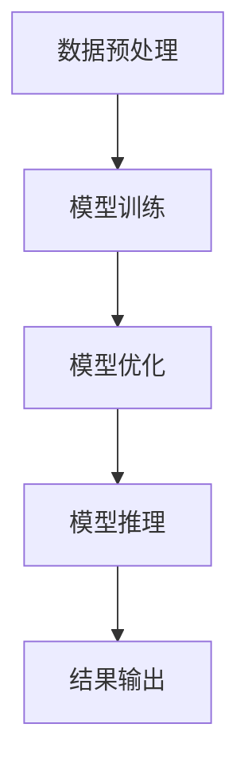
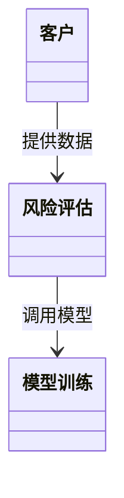

                 


# 智能风险评估 AI Agent：LLM 在保险行业中的应用

## 关键词：智能风险评估, AI Agent, LLM, 保险行业, 人工智能, 大语言模型

## 摘要

本文深入探讨了智能风险评估AI Agent在保险行业中的应用，特别是大语言模型（LLM）如何优化风险评估流程。文章从背景介绍、核心概念、算法原理、系统架构到项目实战，全面分析了LLM在保险行业的潜力，并提供了实际应用的最佳实践和未来展望。

---

# 智能风险评估 AI Agent：LLM 在保险行业中的应用

## 第一部分：智能风险评估 AI Agent 背景介绍

### 第1章：智能风险评估 AI Agent 概述

#### 1.1 问题背景与描述

保险行业传统的风险评估方法依赖人工分析和统计模型，存在效率低、覆盖面有限的问题。随着AI技术的发展，AI Agent（智能代理）的应用为保险行业带来了新的机遇。AI Agent能够实时分析大量数据，提供精准的风险评估结果，显著提升保险公司的决策效率。

#### 1.2 问题解决与边界

AI Agent通过自动化数据处理和智能分析，解决了传统方法中的低效问题。其应用边界包括客户画像、风险预测和欺诈检测等领域。AI Agent的核心概念包括数据处理、模型训练和结果输出，这些要素共同构成了智能风险评估系统的基础。

---

## 第二部分：核心概念与联系

### 第2章：LLM 的原理与特性

#### 2.1 LLM 的核心原理

大语言模型（LLM）通过深度学习技术处理自然语言数据，具备强大的理解和生成能力。在保险行业中，LLM能够分析客户的文本信息，提取关键特征，辅助风险评估。

#### 2.2 核心概念对比

通过对比分析，LLM在风险评估中的应用具有高效、精准和可扩展的特点。以下是一个核心概念对比表格：

| 概念 | 传统方法 | AI Agent（LLM） |
|------|-----------|-----------------|
| 数据来源 | 结构化数据 | 文本、语音、图像 |
| 分析速度 | 较慢 | 实时分析 |
| 精度 | 中等 | 高精度 |

以下是实体关系图：

```mermaid
er
actor: 客户
agent: AI Agent
model: LLM 模型
```

---

## 第三部分：算法原理讲解

### 第3章：LLM 的算法流程

#### 3.1 算法流程图

以下是一个LLM的训练与推理流程图：



#### 3.2 数学模型与公式

损失函数：$$ L = -\sum_{i=1}^{n} y_i \log p(y_i) $$

优化器：Adam 算法

---

## 第四部分：系统分析与架构设计

### 第4章：保险行业应用场景

#### 4.1 系统功能设计

以下是领域模型类图：



---

## 第五部分：项目实战

### 第5章：环境安装与核心代码实现

#### 5.1 环境配置

安装Python和相关库：

```bash
pip install numpy torch transformers
```

#### 5.2 核心代码实现

以下是一个示例代码：

```python
import torch
import torch.nn as nn

class RiskAssessmentModel(nn.Module):
    def __init__(self):
        super().__init__()
        self.fc = nn.Linear(10, 1)
        
    def forward(self, x):
        return torch.sigmoid(self.fc(x))

model = RiskAssessmentModel()
criterion = nn.BCELoss()
optimizer = torch.optim.Adam(model.parameters(), lr=0.001)
```

---

## 第六部分：最佳实践与总结

### 第6章：小结与注意事项

#### 6.1 最佳实践 tips

- 数据安全与隐私保护
- 模型调优与持续学习

#### 6.2 未来展望与拓展阅读

AI在保险行业的未来发展潜力巨大，建议深入研究多模态模型和强化学习技术。

---

## 附录：数学公式与代码示例

- LLM 训练的损失函数：$$ L = \frac{1}{n}\sum_{i=1}^{n} \text{交叉熵}(y_i, \hat{y}_i) $$

---

## 作者

作者：AI天才研究院/AI Genius Institute & 禅与计算机程序设计艺术 /Zen And The Art of Computer Programming

