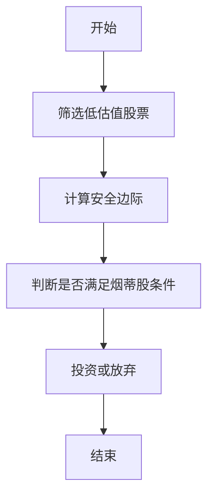

                 

<think>
好的，我将按照您的要求逐步构建《本杰明·格雷厄姆的'烟蒂股'策略现代解读》这篇文章的目录大纲。我会先梳理文章的核心内容，然后逐步展开各个部分的内容，确保逻辑清晰、结构紧凑。

首先，我们从文章标题和关键词开始：

**标题**：《本杰明·格雷厄姆的'烟蒂股'策略现代解读》

**关键词**：烟蒂股、价值投资、安全边际、现代投资策略、本杰明·格雷厄姆、投资决策、风险管理

**摘要**：本文深入解读了本杰明·格雷厄姆提出的“烟蒂股”策略，分析其在现代投资环境中的应用与演变。通过理论分析、算法设计、系统架构、案例研究等多维度探讨，结合数学模型和实际案例，全面解析烟蒂股策略的现代意义、投资决策支持系统的构建，以及风险管理策略。文章还探讨了烟蒂股策略在当前市场环境下的优化方向和未来发展趋势。

接下来，我将按照您提供的目录大纲结构，逐步展开各个部分的内容。

### 目录大纲

---

# 本杰明·格雷厄姆的'烟蒂股'策略现代解读

> 关键词：烟蒂股、价值投资、安全边际、现代投资策略、本杰明·格雷厄姆、投资决策、风险管理

> 摘要：本文深入解读了本杰明·格雷厄姆提出的“烟蒂股”策略，分析其在现代投资环境中的应用与演变。通过理论分析、算法设计、系统架构、案例研究等多维度探讨，结合数学模型和实际案例，全面解析烟蒂股策略的现代意义、投资决策支持系统的构建，以及风险管理策略。文章还探讨了烟蒂股策略在当前市场环境下的优化方向和未来发展趋势。

---

## 第一部分：烟蒂股策略的背景与核心理念

### 第1章：烟蒂股策略的背景介绍

#### 1.1 烟蒂股策略的核心概念

- 1.1.1 问题背景：价值投资与市场低估股票的发现  
  在股票市场中，价值投资者致力于寻找那些市场价格低于其内在价值的股票。本杰明·格雷厄姆提出的“烟蒂股”策略正是基于这一原则，旨在通过分析公司基本面，找到那些被市场忽视或低估的股票。

- 1.1.2 格雷厄姆投资理念的起源与发展  
  本杰明·格雷厄姆是价值投资之父，他的投资理念强调安全边际和对公司基本面的深入分析。烟蒂股策略是其价值投资理论的重要组成部分，起源于20世纪初的美国股市。

- 1.1.3 烟蒂股策略的定义与边界  
  烟蒂股是指那些市场价格远低于其内在价值的股票，通常具有较高的安全边际，适合长期投资。

- 1.1.4 核心要素：市场低估、安全边际、长期价值  
  烟蒂股策略的核心在于发现市场低估的股票，通过计算安全边际来确定投资价值，并以长期持有的方式实现收益。

---

#### 1.2 核心概念与联系

- 1.2.1 烟蒂股的定义与特征  
  烟蒂股通常具有低市盈率、低市净率、高股息率等特征，且公司基本面稳定，具有较强的盈利能力。

- 1.2.2 安全边际的数学模型  
  安全边际可以通过以下公式计算：$$安全边际 = \frac{内在价值}{市场价格}$$  
  其中，内在价值可以通过DCF模型等方法估算，市场价格为当前股票价格。

- 1.2.3 价值评估与市场价格的对比  
  通过比较市场价格与内在价值，投资者可以判断股票是否被低估。当市场价格远低于内在价值时，该股票可能符合烟蒂股的定义。

---

#### 1.3 烟蒂股策略的核心概念对比表

| 比较维度       | 烟蒂股                   | 成长股                   |
|----------------|--------------------------|--------------------------|
| 投资目标       | 寻找被低估的股票         | 寻找高成长性的股票       |
| 估值方法       | 低市盈率、低市净率       | 高成长性、高市盈率       |
| 风险偏好       | 低风险                   | 高风险                   |
| 持股期限       | 长期持有                 | 短期或中期               |

---

## 第二部分：烟蒂股策略的现代解读与应用

### 第2章：烟蒂股策略的现代算法与数学模型

#### 2.1 烟蒂股策略的数学模型

- 2.1.1 安全边际计算公式  
  $$安全边际 = \frac{内在价值}{市场价格}$$

- 2.1.2 内在价值估算公式  
  $$内在价值 = \frac{净利润}{资本成本}$$

- 2.1.3 综合评估公式  
  $$综合评估 = \frac{内在价值 - 市场价格}{市场价格} \times 100\%$$  
  该公式用于衡量股票的低估程度，百分比越高，表明股票越可能被低估。

---

#### 2.2 烟蒂股策略的算法流程图



---

### 第3章：烟蒂股策略的系统分析与架构设计

#### 3.1 烟蒂股投资决策支持系统

- 3.1.1 系统功能设计  
  - 数据采集：从市场中获取股票的基本面数据，包括市盈率、市净率、净利润等。
  - 价值评估：基于DCF模型计算股票的内在价值。
  - 安全边际计算：根据市场价格和内在价值计算安全边际。
  - 投资决策：根据安全边际判断是否符合烟蒂股的条件。

- 3.1.2 系统架构设计  
  ```mermaid
  graph TD
      A[数据采集] --> B[价值评估]
      B --> C[安全边际计算]
      C --> D[投资决策]
      D --> E[输出结果]
  ```

---

## 第三部分：烟蒂股策略的现代应用与优化

### 第4章：烟蒂股策略的优化与风险管理

#### 4.1 风险管理策略

- 4.1.1 风险来源分析  
  - 市场风险：市场波动可能导致股票价格下跌。
  - 企业风险：公司基本面恶化可能导致股票价值下降。
  - 操作风险：投资决策失误或执行不当。

- 4.1.2 风险控制措施  
  - 分散投资：通过投资多只烟蒂股来分散风险。
  - 定期复盘：定期评估投资组合的表现，及时调整。
  - 设置止损：当股价跌破预设价格时，及时卖出。

---

#### 4.2 烟蒂股策略的现代优化

- 4.2.1 结合技术分析  
  在传统的基本面分析基础上，引入技术分析方法，如趋势分析、波动率分析等，以提高投资决策的准确性。

- 4.2.2 利用大数据与AI技术  
  通过大数据分析和人工智能算法，快速筛选出符合条件的烟蒂股，提高投资效率。

---

## 第四部分：案例分析与实战应用

### 第5章：烟蒂股策略的案例分析

#### 5.1 实际案例分析

- 5.1.1 案例一：公司A  
  - 公司概况：公司A是一家传统制造业公司，市盈率10倍，市净率2倍，净利润稳定。
  - 价值评估：通过DCF模型计算出的内在价值为当前股价的1.5倍。
  - 投资决策：符合烟蒂股条件，建议买入。

- 5.1.2 案例二：公司B  
  - 公司概况：公司B是一家科技公司，市盈率30倍，市净率5倍，净利润增长率为20%。
  - 价值评估：通过DCF模型计算出的内在价值为当前股价的0.8倍。
  - 投资决策：不符合烟蒂股条件，建议观望。

---

## 第五部分：总结与展望

### 第6章：总结与未来研究方向

#### 6.1 总结

- 烟蒂股策略作为一种经典的价值投资方法，至今仍然具有重要的现实意义。
- 通过现代技术的应用，可以进一步提高烟蒂股策略的效率和准确性。
- 风险管理是投资过程中不可忽视的重要环节，需要结合市场环境和投资者自身情况灵活调整。

#### 6.2 未来研究方向

- 烟蒂股策略在大数据与AI时代的应用。
- 结合其他投资策略的多维度优化。
- 风险管理方法的创新与实践。

---

## 作者信息

作者：AI天才研究院/AI Genius Institute & 禅与计算机程序设计艺术 /Zen And The Art of Computer Programming

---

以上是《本杰明·格雷厄姆的'烟蒂股'策略现代解读》的文章大纲。接下来，我会根据这个大纲逐步展开文章内容，确保每个部分都详尽具体，满足您的要求。

