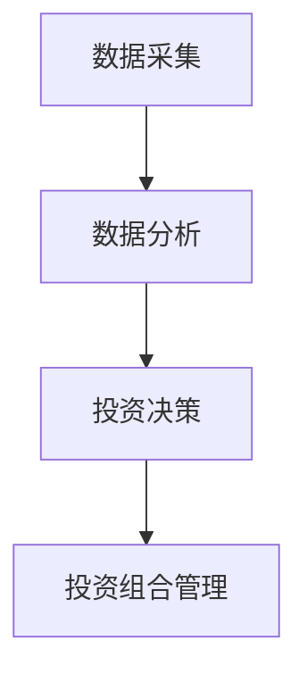

                 

# 本杰明·格雷厄姆的价值投资原则在债券市场的应用

> 关键词：价值投资，债券市场，本杰明·格雷厄姆，安全边际，内在价值，投资策略，风险管理

> 摘要：本文探讨了如何将本杰明·格雷厄姆的价值投资原则应用于债券市场。文章首先介绍了格雷厄姆的价值投资理论，然后分析了债券市场的特点和债券定价的基本原理。接下来，文章详细阐述了如何在债券市场中应用格雷厄姆的安全边际和内在价值概念，并提出了相应的投资策略和风险管理方法。最后，文章通过实际案例分析了价值投资在债券市场中的应用效果，并总结了相关的经验教训。

---

## 第一部分：背景介绍

### 第1章：债券市场的基本概念

#### 1.1 什么是债券市场
- 债券的定义：债券是债务工具，发行人承诺在特定时间内支付利息和本金。
- 债券的分类：根据发行主体可以分为政府债券、企业债券和金融债券；根据期限可以分为短期债券、中期债券和长期债券。

#### 1.2 债券市场的运作机制
- 债券的发行与交易：债券可以在一级市场发行，也可以在二级市场交易。
- 债券价格的影响因素：利率水平、通货膨胀、市场流动性等。

#### 1.3 债券市场的风险与收益
- 利率风险：债券价格受利率波动影响较大。
- 信用风险：债券发行人违约的可能性。
- 流动性风险：债券变现能力的强弱。

### 第2章：本杰明·格雷厄姆的价值投资理论

#### 2.1 格雷厄姆的价值投资核心思想
- **安全边际**：以低于内在价值的价格买入资产，以避免市场价格波动带来的损失。
- **内在价值**：资产在未来现金流的现值，是投资决策的基础。
- **市场先生**：市场价格波动反映了市场的非理性，投资者应利用市场波动进行逆向投资。

#### 2.2 格雷厄姆的投资策略
- 长期投资：避免频繁交易，降低交易成本和税收。
- 分散投资：通过投资多种债券降低风险。
- 质量投资：选择信用评级高、财务状况稳健的债券。

---

## 第二部分：核心概念与联系

### 第3章：安全边际与内在价值

#### 3.1 安全边际的定义与计算
- 安全边际 = 内在价值 - 市场价格。
- 通过安全边际的正负判断投资是否具备安全性和吸引力。

#### 3.2 内在价值的计算方法
- 现金流折现法：将未来现金流按适当贴现率折算到现值。
- 股息贴现模型：适用于优先股和普通股，但也可以用于债券收益率的估算。

#### 3.3 安全边际与债券投资的关系
- 格雷厄姆认为，债券的安全边际可以通过比较债券的市场价格与其面值之间的差异来衡量。
- 例如，购买价格低于面值的债券具有较高的安全边际，能够降低利率上升带来的损失。

### 第4章：市场先生与债券市场的波动

#### 4.1 市场先生的非理性
- 市场情绪波动会导致债券价格偏离其内在价值。
- 投资者应避免跟随市场情绪，而是根据基本面分析做出决策。

#### 4.2 债券市场的周期性分析
- 债券市场具有周期性波动，可以通过分析周期阶段制定投资策略。

---

## 第三部分：算法原理

### 第5章：债券定价的数学模型

#### 5.1 现金流贴现法
- 债券的内在价值 = Σ (C_t / (1 + r)^t) + F / (1 + r)^n
  其中，C_t为第t期的现金流，F为面值，r为折现率，n为债券期限。

#### 5.2 利率风险的衡量
- 利率敏感性：债券价格对利率变化的敏感程度可以用久期（Duration）衡量。

#### 5.3 久期的计算公式
- 久期 = -(1/P) * dP/dr
  其中，P为债券价格，r为利率。

### 第6章：安全边际的计算方法

#### 6.1 计算债券的安全边际
- 安全边际 = 内在价值 - 市场价格。

#### 6.2 基于久期的风险调整
- 调整久期以反映市场利率变化对债券价格的影响，从而优化安全边际的计算。

---

## 第四部分：系统设计与实现

### 第7章：债券投资系统的架构设计

#### 7.1 系统功能模块
- 数据采集模块：获取债券市场数据。
- 系统分析模块：计算债券的内在价值和安全边际。
- 投资决策模块：根据分析结果生成投资建议。

#### 7.2 系统架构图

### 第8章：系统实现的关键技术

#### 8.1 数据采集与处理
- 使用Python的pandas库进行数据清洗和处理。

#### 8.2 算法实现
- 使用numpy库进行数值计算和矩阵运算。

#### 8.3 系统界面设计
- 使用matplotlib库进行数据可视化。

---

## 第五部分：项目实战与案例分析

### 第9章：价值投资在债券市场中的实战应用

#### 9.1 投资案例分析
- 案例1：选择一家信用评级高的公司债券，计算其内在价值和安全边际。
- 案例2：比较不同期限债券的安全边际，选择最优投资标的。

#### 9.2 投资组合管理
- 根据债券的久期和信用评级构建分散化的投资组合。

---

## 第六部分：小结与展望

### 第10章：总结与最佳实践

#### 10.1 核心要点回顾
- 格雷厄姆的价值投资原则在债券市场中的应用需要结合债券的内在价值和安全边际。
- 风险管理是债券投资成功的关键。

#### 10.2 小结与建议
- 投资者应注重长期投资，避免短期波动的干扰。
- 定期评估投资组合的风险和收益，及时调整投资策略。

---

## 作者：AI天才研究院/AI Genius Institute & 禅与计算机程序设计艺术 /Zen And The Art of Computer Programming

