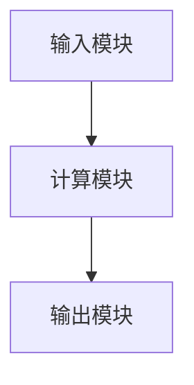

                 


# 本杰明·格雷厄姆的企业价值计算方法

> 关键词：企业价值，本杰明·格雷厄姆，价值投资，自由现金流，贴现率，安全边际，投资策略

> 摘要：本文详细介绍了本杰明·格雷厄姆的企业价值计算方法，从其核心理念、计算模型、系统设计到实际案例分析，全面解读了这一经典投资策略的理论基础和实践应用。文章通过数学公式、Python代码和系统架构图等技术手段，深入剖析了企业价值计算的关键步骤和注意事项，为投资者提供了理论与实践相结合的指导。

---

## 第一部分: 本杰明·格雷厄姆的企业价值计算方法概述

### 第1章: 价值投资的起源与核心理念

#### 1.1 价值投资的起源

价值投资是一种以企业内在价值为核心的投资策略，起源于20世纪20年代的美国。本杰明·格雷厄姆是这一方法的创始人，他通过深入研究企业的财务状况和市场行为，提出了以基本面分析为基础的投资策略。与传统的基于市场情绪的投资方法不同，价值投资强调通过对企业内在价值的计算，找到被市场低估的投资标的。

**投资理论的发展历程**

- **早期投资理论**：20世纪初，市场参与者主要依赖市场情绪和股票价格的波动来进行投资决策，这种方法缺乏科学性和稳定性。
- **格雷厄姆的贡献**：格雷厄姆通过对企业财务数据的分析，提出了以自由现金流为核心的内在价值计算方法，为价值投资奠定了理论基础。
- **现代发展**：以沃伦·巴菲特为代表的价值投资者进一步完善了格雷厄姆的理论，并将其应用于实际投资中，取得了显著的成果。

**本杰明·格雷厄姆的生平与贡献**

- **生平简介**：格雷厄姆出生于1897年，是美国著名的投资家和教授，被誉为“价值投资之父”。他在哥伦比亚大学教授证券分析，培养了包括巴菲特在内的众多投资大师。
- **贡献**：格雷厄姆提出了“安全边际”概念，强调在投资中留出足够的安全空间以应对市场波动和企业经营风险。

**价值投资的核心理念**

- **核心理念**：价值投资的核心在于寻找那些市场价格低于其内在价值的企业进行投资，长期持有，等待市场价格回归其真实价值。
- **安全边际**：通过购买价格与内在价值的差距，为投资提供安全保障，降低投资风险。

---

#### 1.2 价值投资与传统投资方法的对比

**传统投资方法的局限性**

- **基于市场情绪**：传统投资方法依赖于市场趋势和价格波动，缺乏对企业基本面的深入分析。
- **高风险性**：由于缺乏对企业内在价值的理解，投资者容易受到市场情绪的影响，导致投资决策失误。

**价值投资的独特性与优势**

- **基于基本面分析**：价值投资通过对企业财务状况、行业地位和未来盈利能力的分析，找到具有长期投资价值的企业。
- **降低风险**：通过安全边际的概念，价值投资在价格波动中保持了较高的安全性。

**格雷厄姆方法在现代的应用**

- **现代发展**：格雷厄姆的理论在现代被进一步完善，尤其是在量化分析和风险管理方面，价值投资方法被广泛应用于机构投资和个人投资中。

---

### 第2章: 企业价值计算的基本原理

#### 2.1 企业价值的核心概念

**企业价值的定义与特征**

- **定义**：企业价值是指企业在持续经营的基础上，所有者权益的公允价值，包括企业的资产、负债和未来盈利能力的综合体现。
- **特征**：企业价值不仅包括企业的现有资产价值，还包括未来现金流的现值。

**格雷厄姆对企业价值的解读**

- **内在价值**：格雷厄姆认为，企业的内在价值是其未来现金流的现值，而市场价格会在短期偏离内在价值，但长期会回归。

**企业价值与市场价值的关系**

- **市场价值**：市场价值是企业股票在市场上的交易价格，受市场情绪和市场参与者行为的影响。
- **内在价值**：内在价值是企业的真实价值，与市场波动无关。

---

#### 2.2 格雷厄姆的企业价值计算方法

**自由现金流的概念与计算**

- **自由现金流**：自由现金流是指企业在支付了所有费用和税金之后，剩余的可用于投资和偿还债务的资金。
- **计算公式**：自由现金流 = 营业收入 - 营业费用 - 利息支出 - 税费

**贴现率的确定与应用**

- **贴现率**：贴现率是指将未来的现金流折现到当前时点的利率，通常使用无风险利率加上风险溢价。
- **应用**：通过贴现率将未来现金流折现，计算企业内在价值。

**安全边际的计算与意义**

- **安全边际**：安全边际是市场价格低于内在价值的部分，提供了一个缓冲区，以应对市场波动和企业经营风险。
- **意义**：通过安全边际，投资者可以在市场价格波动时保持投资的稳定性。

---

### 第3章: 格雷厄姆投资策略的数学模型

#### 3.1 格雷厄姆投资模型的构建

**自由现金流贴现模型**

- **模型公式**：企业内在价值 = ∑(FCF / (1 + r)^t)，其中FCF为自由现金流，r为贴现率，t为时间。

**贴现率的数学表达式**

- **贴现率公式**：r = R + β × (市场风险溢价)，其中R为无风险利率，β为贝塔系数，反映企业的系统性风险。

**内在价值的计算公式**

- **计算公式**：V = ∑(CF_t / (1 + r)^t)，其中CF_t为第t年的现金流，r为贴现率。

---

#### 3.2 格雷厄姆安全边际的数学分析

**安全边际的定义与计算**

- **定义**：安全边际 = 内在价值 - 市场价格
- **计算**：通过比较市场价格与内在价值，确定安全边际的大小。

**安全边际与投资风险的关系**

- **关系**：安全边际越大，投资风险越小，因为市场价格偏离内在价值的程度越小。

---

### 第4章: 格雷厄姆企业价值计算的系统分析

#### 4.1 企业价值评估系统的设计

**系统功能模块划分**

- **输入模块**：接收企业财务数据和市场数据。
- **计算模块**：计算自由现金流和贴现率，得出内在价值。
- **输出模块**：显示计算结果和安全边际。

**系统输入与输出的定义**

- **输入**：企业财务报表数据，市场利率和风险溢价。
- **输出**：内在价值和安全边际。

---

#### 4.2 系统架构设计与实现

**系统架构的Mermaid图展示**



**系统模块之间的交互关系**

- **输入模块**：接收数据并传递给计算模块。
- **计算模块**：处理数据并传递结果给输出模块。
- **输出模块**：显示结果。

---

### 第5章: 项目实战与案例分析

#### 5.1 项目环境的搭建

**系统运行环境的要求**

- **硬件要求**：现代计算机，具备足够的处理能力和存储空间。
- **软件要求**：Python编程环境，Jupyter Notebook或PyCharm。

---

#### 5.2 核心算法的实现

**自由现金流计算的Python代码**

```python
def calculate_fcf(revenue, operating_expenses, interest_expenses, taxes):
    return revenue - operating_expenses - interest_expenses - taxes
```

**贴现率计算的数学推导**

- **公式推导**：r = R + β × (市场风险溢价)

---

#### 5.3 案例分析

**实际案例分析**

- **案例选择**：以某制造企业为例，计算其内在价值和安全边际。

---

### 第6章: 最佳实践与投资策略优化

#### 6.1 格雷厄姆投资策略的优化

**投资组合的优化方法**

- **多样化投资**：通过投资多个企业分散风险。
- **定期调整**：根据市场变化和企业基本面调整投资组合。

---

## 第七章: 小结与展望

---

**作者：AI天才研究院 & 禅与计算机程序设计艺术**

