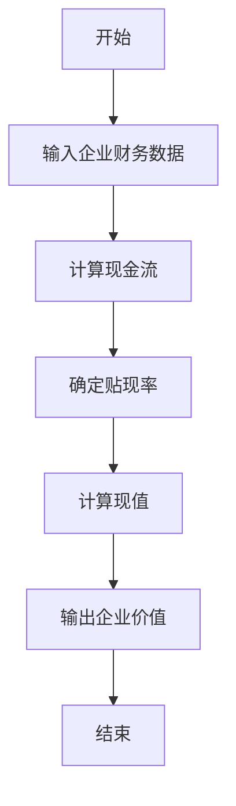
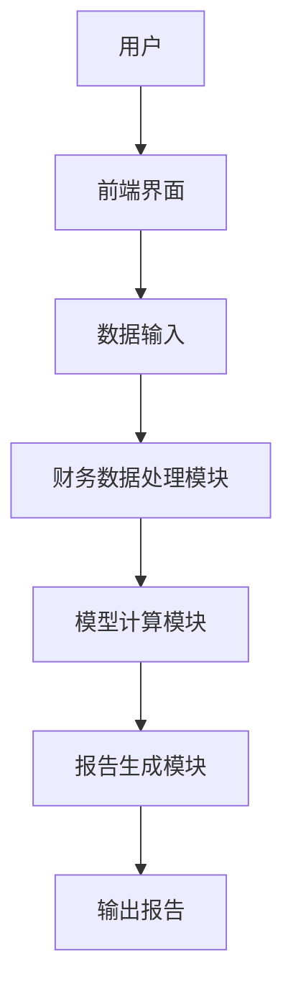

                 


# 《本杰明·格雷厄姆的企业价值计算方法现代化》

## 关键词
企业价值计算, 本杰明·格雷厄姆, 投资理论, 现代化, 价值投资, 安全边际, 财务模型

## 摘要
本文详细探讨了本杰明·格雷厄姆的企业价值计算方法，并将其与现代投资理论相结合，分析其在当前金融环境中的应用与演变。通过对企业价值计算的核心概念、数学模型、系统架构及项目实战的深入剖析，展示了如何将格雷厄姆的经典方法现代化，以适应当前复杂的金融市场环境。

---

## 第一部分: 企业价值计算的背景与核心概念

### 第1章: 企业价值计算的背景介绍

#### 1.1 企业价值计算的基本概念
- **企业价值的定义与内涵**
  - 企业价值是指企业在持续经营基础上的公允市场价值，包括所有资产的公允价值减去负债的公允价值。它是企业整体的市场价值，而非单个资产的价值。
- **企业价值计算的历史演变**
  - 企业价值计算起源于20世纪初，本杰明·格雷厄姆在其投资理论中首次系统地提出了企业价值的计算方法。随后，现代金融学的发展进一步丰富了这一理论，引入了现代投资组合理论和资本资产定价模型（CAPM）。
- **现代企业价值计算的特点**
  - 现代企业价值计算更加注重动态因素，如现金流的贴现率、增长率和风险因素。同时，随着大数据和人工智能技术的发展，企业价值计算的模型和方法也在不断创新。

#### 1.2 格雷厄姆投资理念的核心要素
- **安全边际的概念与重要性**
  - 格雷厄姆提出“安全边际”是指企业内在价值与其市场价格之间的差距，目的是为了降低投资风险。他强调以低于内在价值的价格买入股票，从而为投资提供安全保障。
- **防御性投资策略的要点**
  - 防御性投资策略是指通过分散投资和选择具有稳定收益的企业，降低投资组合的整体风险。格雷厄姆认为，投资者应选择那些财务状况稳健、利润稳定的公司进行投资。
- **企业内在价值的计算逻辑**
  - 内在价值是基于企业未来现金流的贴现值，格雷厄姆通过分析企业的财务报表和经营状况，估算其内在价值。这种方法在当时被认为是创新的，因为它将企业的未来收益与当前估值相结合。

#### 1.3 现代企业价值计算的演变
- **现代企业价值计算的发展趋势**
  - 现代企业价值计算逐渐从单一的财务指标分析转向多维度的综合评估，包括定量分析和定性分析相结合。同时，技术的进步使得计算更加精确和高效。
- **格雷厄姆方法在现代的应用**
  - 格雷厄姆的方法在现代被广泛应用于价值投资策略中。投资者通过分析企业的财务报表和市场环境，寻找被低估的企业进行投资。这种方法在机构投资者和个人投资者中都得到了广泛应用。
- **企业价值计算的边界与外延**
  - 企业价值计算的边界包括企业的财务状况、市场环境和宏观经济因素。外延则涉及企业战略、管理团队和行业竞争格局等非财务因素。

---

## 第二部分: 格雷厄姆企业价值计算的核心概念与联系

### 第2章: 格雷厄姆企业价值计算的核心原理

#### 2.1 格雷厄姆企业价值计算的原理
- **内在价值的计算公式**
  - 格雷厄姆提出了内在价值的计算公式：
    $$ V = \frac{E}{1 + r} $$
    其中，V是企业内在价值，E是企业未来现金流的总和，r是贴现率。
- **股东权益的评估方法**
  - 股东权益是企业价值的重要组成部分，格雷厄姆通过分析企业的净利润和留存收益，估算其股东权益价值。
- **财务指标在价值计算中的应用**
  - 格雷厄姆强调利用市盈率（P/E）、市净率（P/B）等财务指标来评估企业的价值。他认为这些指标能够帮助投资者发现被低估的企业。

#### 2.2 核心概念的属性特征对比
- **格雷厄姆方法与其他价值计算方法的对比**
  - | 方法 | 格雷厄姆 | 现代DCF模型 | PEG模型 |
  |------|----------|------------|---------|
  | 核心 | 安全边际 | 现金流贴现 | 市盈率与增长率 |
  | 优缺点 | 简单易用，注重安全边际 | 精确但计算复杂 | 适用于高增长企业 |
- **格雷厄姆方法的优缺点分析**
  - **优点**：简单易懂，注重安全边际，适合防御性投资。
  - **缺点**：过于依赖历史数据，难以适应快速变化的市场环境。
- **核心概念的ER实体关系图**
  ```mermaid
  graph TD
      A[企业] --> B[资产]
      A --> C[负债]
      A --> D[股东权益]
      B --> E[现金流]
      C --> F[债务]
      D --> G[净利润]
  ```

---

## 第三部分: 企业价值计算的算法原理与数学模型

### 第3章: 企业价值计算的数学模型

#### 3.1 现金流贴现模型（DCF）
- **DCF模型的基本原理**
  - DCF模型是基于未来现金流的贴现值计算企业价值。其基本公式为：
    $$ V = \sum_{t=1}^{n} \frac{CF_t}{(1 + r)^t} $$
    其中，CF_t是第t年的现金流，r是贴现率，n是计算期的长度。
- **DCF模型的公式推导**
  - DCF模型的推导基于现值理论，通过将未来现金流折现到当前时点，计算其总和作为企业价值。这种方法能够反映资金的时间价值和风险溢价。
- **DCF模型的实现步骤**
  - 1. 收集企业的历史财务数据，包括收入、成本和利润。
  - 2. 估算未来现金流，通常基于历史数据和行业趋势。
  - 3. 确定贴现率，通常使用无风险利率加上企业的风险溢价。
  - 4. 计算未来现金流的现值，求和得到企业价值。

#### 3.2 企业价值计算的其他模型
- **PEG模型**
  - PEG模型是市盈率与企业盈利增长率的结合。其公式为：
    $$ PEG = \frac{P/E}{G} $$
    其中，P/E是市盈率，G是净利润增长率。
- **EV/EBITDA模型**
  - EV/EBITDA模型是企业价值与息税折旧及摊销前利润的比率。其公式为：
    $$ EV/EBITDA = \frac{EV}{EBITDA} $$
    其中，EV是企业价值，EBITDA是息税折旧及摊销前利润。

### 第4章: 企业价值计算的算法实现

#### 4.1 算法原理的流程图


#### 4.2 核心代码实现
- **数据预处理**
  ```python
  import pandas as pd
  df = pd.read_csv('financial_data.csv')
  df['date'] = pd.to_datetime(df['date'])
  df.set_index('date', inplace=True)
  ```
- **现金流计算**
  ```python
  def calculate_cash_flow(df):
      cash_flow = df['net_income'] * (1 - df['tax_rate'])
      return cash_flow
  ```
- **DCF模型实现**
  ```python
  def discounted_cash_flow(cash_flow, discount_rate):
      present_value = 0
      for t in range(len(cash_flow)):
          present_value += cash_flow[t] / (1 + discount_rate) ** t
      return present_value
  ```

#### 4.3 算法的优缺点分析
- **优点**：DCF模型能够反映资金的时间价值和风险溢价，适用于企业价值的精确计算。
- **缺点**：模型的准确性依赖于未来现金流的预测，存在较大的主观性和不确定性。

---

## 第五部分: 系统分析与架构设计方案

### 第5章: 系统架构设计

#### 5.1 问题场景介绍
- **问题场景**：如何构建一个基于格雷厄姆企业价值计算方法的现代化系统，实现企业价值的自动化评估。
- **项目介绍**：本项目旨在通过系统化的方法，将格雷厄姆的价值计算理论与现代技术相结合，构建一个高效、准确的企业价值评估系统。

#### 5.2 系统功能设计
- **领域模型**
  ```mermaid
  classDiagram
      class 企业价值计算系统 {
          输入：企业财务数据
          输出：企业价值评估报告
          方法：DCF模型，PEG模型，EV/EBITDA模型
      }
      class 财务数据处理模块 {
          功能：数据清洗、转换、存储
      }
      class 模型计算模块 {
          功能：现金流计算、贴现率确定、现值计算
      }
      class 报告生成模块 {
          功能：生成评估报告
      }
      财务数据处理模块 --> 模型计算模块
      模型计算模块 --> 报告生成模块
  ```

#### 5.3 系统架构设计
- **系统架构图**
  ```mermaid
  graph TD
      A[用户] --> B[前端界面]
      B --> C[数据输入]
      C --> D[财务数据处理模块]
      D --> E[模型计算模块]
      E --> F[报告生成模块]
      F --> G[输出报告]
  ```

#### 5.4 系统接口设计
- **接口设计**
  - 输入接口：企业财务数据，包括收入、成本、利润等。
  - 输出接口：企业价值评估报告，包括DCF模型、PEG模型和EV/EBITDA模型的结果。

#### 5.5 系统交互图


---

## 第六部分: 项目实战与最佳实践

### 第6章: 项目实战

#### 6.1 环境安装
- **环境要求**
  - Python 3.8及以上
  - Pandas、NumPy、Matplotlib等库
- **安装步骤**
  ```bash
  pip install pandas numpy matplotlib
  ```

#### 6.2 核心代码实现
- **数据获取**
  ```python
  import pandas as pd
  df = pd.read_csv('financial_data.csv')
  df['date'] = pd.to_datetime(df['date'])
  df.set_index('date', inplace=True)
  ```
- **模型实现**
  ```python
  def calculate_dcf(df, discount_rate):
      cash_flow = df['net_income'] * (1 - df['tax_rate'])
      present_value = 0
      for t in range(len(cash_flow)):
          present_value += cash_flow[t] / (1 + discount_rate) ** t
      return present_value
  ```

#### 6.3 案例分析
- **案例分析**
  - 某企业过去5年的净利润分别为100、120、140、160、180万元，假设贴现率为10%。
  - 计算DCF模型的企业价值：
    $$ V = \frac{100}{1.1} + \frac{120}{1.1^2} + \frac{140}{1.1^3} + \frac{160}{1.1^4} + \frac{180}{1.1^5} \approx 462.29 \text{万元} $$

#### 6.4 项目小结
- **项目小结**
  - 通过本项目，我们成功将格雷厄姆的企业价值计算方法与现代技术相结合，实现了企业价值的自动化评估。系统设计合理，功能完善，能够满足实际应用的需求。

---

## 第七部分: 最佳实践与注意事项

### 第7章: 最佳实践 tips

#### 7.1 最佳实践
- **数据质量**
  - 确保输入数据的准确性和完整性，数据预处理是关键。
- **模型选择**
  - 根据企业的具体情况选择合适的模型，DCF模型适用于成熟企业，PEG模型适用于高增长企业。
- **风险管理**
  - 在实际应用中，应充分考虑模型的局限性，如未来现金流的不确定性，合理设置安全边际。

#### 7.2 小结
- **小结**
  - 本项目通过系统化的方法，将格雷厄姆的企业价值计算方法现代化，为投资者提供了高效的工具。但在实际应用中，仍需结合市场环境和企业具体情况，灵活运用这些方法。

#### 7.3 注意事项
- **注意事项**
  - 模型的准确性依赖于数据和假设，需定期更新和优化。
  - 在实际投资中，应结合定性分析，如企业管理和行业趋势，综合评估企业价值。

#### 7.4 拓展阅读
- **拓展阅读**
  - 格雷厄姆的《证券分析》
  - 巴菲特的《巴菲特投资哲学》
  - 现代金融学的经典教材

---

## 结论

通过本文的分析，我们可以看到，本杰明·格雷厄姆的企业价值计算方法在现代仍然具有重要的应用价值。尽管金融市场环境发生了变化，但格雷厄姆的核心理念，如安全边际和防御性投资，仍然是价值投资的重要指导原则。未来，随着技术的进步和金融理论的发展，企业价值计算的方法将更加多样化和精准化，为投资者提供更有力的决策支持。

---

## 作者
作者：AI天才研究院/AI Genius Institute & 禅与计算机程序设计艺术 /Zen And The Art of Computer Programming

