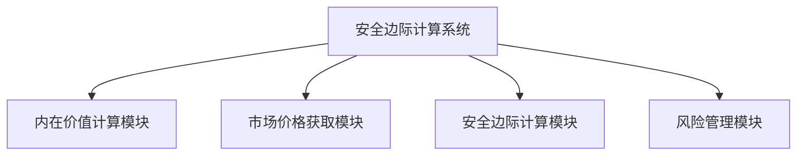
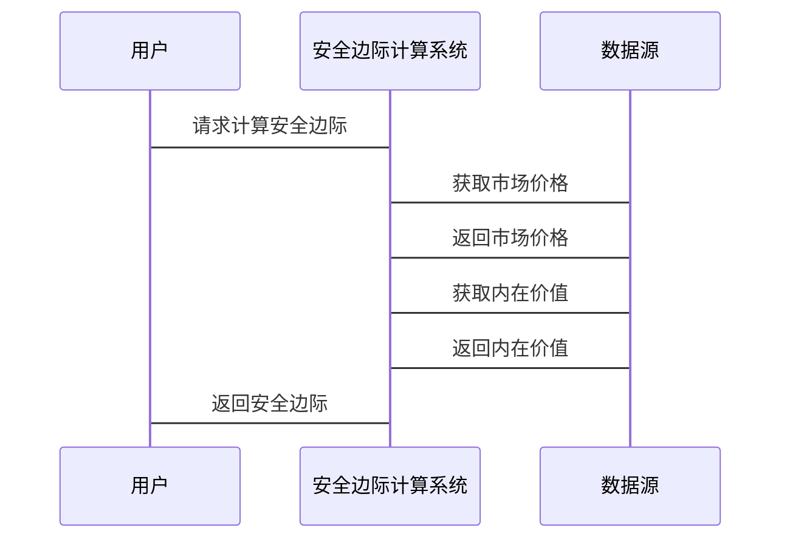

                 


# 《本杰明·格雷厄姆的安全边际现代诠释》

---

## 关键词：  
安全边际、投资学、本杰明·格雷厄姆、量化分析、风险管理、投资组合、资产配置、现代诠释

---

## 摘要：  
本文深入探讨了本杰明·格雷厄姆提出的“安全边际”概念，并结合现代投资学的最新发展，对其进行重新诠释。通过分析安全边际的定义、计算方法及其在不同资产类别中的应用，本文旨在为投资者提供一套系统化的安全边际分析框架。同时，结合量化分析和风险管理技术，本文提出了在现代投资环境中的安全边际优化策略，并通过实际案例展示了其在投资实践中的有效性。最后，本文总结了安全边际在投资决策中的重要性，并展望了其在未来投资学中的发展方向。

---

## 第1章: 安全边际的定义与背景

### 1.1 安全边际的基本概念

#### 1.1.1 投资中的安全边际定义

安全边际是本杰明·格雷厄姆在其投资理论中提出的核心概念之一。它是指股票的市场价格与其内在价值之间的差距。具体来说，安全边际 = 内在价值 - 市场价格。这个概念强调了在投资中留出足够的安全空间，以避免因市场价格波动而带来的损失。

#### 1.1.2 安全边际的核心要素

- **内在价值**：股票的真实价值，基于企业的盈利能力、资产状况和行业地位等因素计算得出。
- **市场价格**：股票在二级市场上的交易价格。
- **安全边际**：内在价值与市场价格的差值，反映了投资的安全程度。

#### 1.1.3 安全边际的哲学意义

安全边际不仅仅是数学上的计算，更是一种投资哲学。它体现了格雷厄姆的价值投资理念，即通过买入被市场低估的股票，以获得长期稳定的收益。这种理念强调了安全性和稳健性，而非短期的高收益。

### 1.2 安全边际的背景与历史

#### 1.2.1 本杰明·格雷厄姆与安全边际的起源

本杰明·格雷厄姆是20世纪著名的投资大师，他的投资理论深刻影响了后来的价值投资派。格雷厄姆在《证券分析》一书中首次系统地提出了安全边际的概念，认为通过计算股票的内在价值，投资者可以找到具有足够安全边际的投资标的。

#### 1.2.2 安全边际在投资中的重要性

在市场波动剧烈的情况下，安全边际能够为投资者提供一个缓冲区，避免因市场价格下跌而造成损失。尤其是在市场恐慌时，安全边际高的股票更能抵御市场的冲击。

#### 1.2.3 安全边际与现代投资学的联系

尽管安全边际的概念起源于传统价值投资，但在现代投资学中，它与量化分析和风险管理等技术密切相关。现代投资者通过结合安全边际的理论，可以更好地应对复杂的市场环境。

### 1.3 安全边际的数学基础

#### 1.3.1 投资价值的计算公式

股票的内在价值可以通过多种方法计算，其中最常用的是股利折现模型（DDM）和自由现金流模型（DCF）。以下是股利折现模型的公式：

$$
\text{内在价值} = \frac{\text{股息}}{1 - \frac{\text{股息增长率}}{\text{折现率}}}
$$

#### 1.3.2 安全边际与概率论的关系

安全边际可以通过概率论的方法进行分析。假设股票的内在价值服从某种概率分布，投资者可以通过计算置信区间来确定安全边际的大小。例如，如果投资者希望在95%的置信水平下，股票的市场价格低于内在价值，那么安全边际需要足够大以覆盖可能的价格波动。

#### 1.3.3 安全边际的量化分析方法

量化分析方法通过将安全边际转化为具体的数值指标，帮助投资者做出决策。例如，可以通过计算股票的市盈率（P/E）、市净率（P/B）等指标，来评估其安全边际。

---

## 第2章: 安全边际的计算与应用

### 2.1 安全边际的计算方法

#### 2.1.1 内在价值的计算公式

内在价值的计算公式可以根据不同的模型而有所不同。例如，对于一家稳定增长的公司，可以使用股利折现模型来计算其内在价值：

$$
\text{内在价值} = \frac{D_1}{k - g}
$$

其中，$D_1$ 是第一年的股息，$k$ 是折现率，$g$ 是股息增长率。

#### 2.1.2 安全边际的计算步骤

1. 计算股票的内在价值。
2. 比较内在价值与市场价格。
3. 计算安全边际 = 内在价值 - 市场价格。

#### 2.1.3 安全边际的比率分析

安全边际可以通过比率来衡量，例如安全边际率 = 安全边际 / 内在价值。比率越高，说明安全边际越大，投资风险越小。

### 2.2 安全边际的应用场景

#### 2.2.1 股票投资中的安全边际

在股票投资中，安全边际高的股票通常具有较高的股息率、较低的市盈率和市净率，以及稳定的盈利能力。

#### 2.2.2 债券投资中的安全边际

在债券投资中，安全边际可以通过债券的到期收益率与市场利率的差值来衡量。当市场利率低于债券的到期收益率时，债券具有正的安全边际。

#### 2.2.3 其他资产类别中的安全边际

除了股票和债券，其他资产类别（如房地产、黄金等）的安全边际也可以通过类似的方法进行评估。

### 2.3 安全边际的案例分析

#### 2.3.1 股票投资中的经典案例

假设某公司的股票市场价格为$50，其内在价值为$60。那么，该股票的安全边际为$10，安全边际率为16.67%。这意味着在市场价格下跌10%的情况下，投资者仍能以内在价值卖出股票。

#### 2.3.2 债券投资中的实际案例

假设某债券的面值为$1000，票面利率为5%，剩余期限为10年。如果市场利率下降至4%，该债券的市场价格将上升至$1111。此时，债券的安全边际为$111。

#### 2.3.3 多资产配置中的安全边际应用

在多资产配置中，投资者可以通过计算各资产的安全边际，优化投资组合的风险收益比。例如，选择安全边际高的资产，降低整体投资组合的风险。

### 2.4 本章小结

通过本章的分析，我们可以看到安全边际在不同资产类别中的广泛应用。无论是股票还是债券，安全边际都是评估投资标的的重要指标。同时，通过案例分析，我们也可以更好地理解安全边际的实际应用。

---

## 第3章: 现代投资学中的安全边际

### 3.1 现代投资组合理论与安全边际

#### 3.1.1 现代投资组合理论的基本原理

现代投资组合理论（MPT）由哈里·马科维茨提出，强调通过分散投资来降低风险。在MPT框架下，安全边际可以通过优化投资组合的收益与风险比来实现。

#### 3.1.2 安全边际在投资组合中的作用

在投资组合中，安全边际可以通过选择具有较高安全边际的资产来降低整体组合的风险。例如，通过选择安全边际高的股票，可以减少组合因市场波动而产生的损失。

#### 3.1.3 投资组合的风险与收益分析

在MPT框架下，投资者可以通过计算各资产的安全边际，优化投资组合的风险收益比。具体来说，可以通过计算各资产的安全边际率，选择安全边际率较高的资产，构建风险较低的投资组合。

### 3.2 市场有效性的假设与安全边际

#### 3.2.1 市场有效性的定义与分类

市场有效性假设认为市场价格反映了所有可获得的信息。根据市场有效性的不同，可以将市场分为强有效、弱有效和半有效市场。在强有效市场中，安全边际较小，而在弱有效市场中，安全边际较大。

#### 3.2.2 安全边际与市场有效性的关系

在强有效市场中，安全边际较小，因为市场价格已经反映了所有信息。而在弱有效市场中，安全边际较大，因为市场价格尚未完全反映所有信息。

#### 3.2.3 不同市场状态下的安全边际策略

在不同市场状态下，投资者可以采取不同的安全边际策略。例如，在市场恐慌时，应选择安全边际高的资产；在市场繁荣时，应谨慎选择具有合理安全边际的资产。

### 3.3 现代投资工具与安全边际

#### 3.3.1 ETF与指数基金中的安全边际

通过投资ETF或指数基金，投资者可以间接投资于多个资产，从而分散风险。在选择ETF或指数基金时，可以通过计算其成分资产的安全边际，评估整体组合的风险。

#### 3.3.2 对冲基金与安全边际

对冲基金通过复杂的策略来实现收益。在对冲基金中，安全边际可以通过对冲策略的风险调整来实现。例如，通过做空高估资产，做多低估资产，来实现收益。

#### 3.3.3 其他金融工具的安全边际分析

除了股票和债券，其他金融工具（如期权、期货等）的安全边际也可以通过类似的方法进行分析。例如，期权的安全边际可以通过波动率和行权价来计算。

### 3.4 本章小结

通过本章的分析，我们可以看到安全边际在现代投资学中的广泛应用。无论是投资组合优化，还是市场有效性假设，安全边际都是投资者的重要工具。同时，通过现代投资工具的应用，投资者可以更好地利用安全边际，实现风险与收益的平衡。

---

## 第4章: 安全边际的量化分析与风险管理

### 4.1 安全边际的量化模型

#### 4.1.1 量化模型的基本框架

量化模型通过数学公式和算法，计算股票的内在价值和安全边际。例如，可以通过机器学习算法，预测股票的内在价值，并计算其安全边际。

#### 4.1.2 安全边际的数学公式

在量化分析中，安全边际可以通过以下公式计算：

$$
\text{安全边际} = \text{内在价值} - \text{市场价格}
$$

其中，内在价值可以通过量化模型计算得出。

#### 4.1.3 模型的优缺点分析

量化模型的优点在于其高效性和准确性，可以通过计算机程序快速计算出安全边际。缺点在于模型的假设可能与实际情况不符，导致结果偏差。

### 4.2 安全边际的风险管理

#### 4.2.1 风险管理的基本概念

风险管理是指通过识别、评估和控制风险，降低投资组合的损失。在安全边际的框架下，风险管理可以通过优化投资组合的安全边际来实现。

#### 4.2.2 安全边际在风险管理中的应用

在风险管理中，可以通过计算投资组合中各资产的安全边际，评估整体组合的风险。例如，通过选择安全边际高的资产，降低组合的整体风险。

#### 4.2.3 风险管理策略

在风险管理中，可以采取以下策略：

1. **分散投资**：通过投资多个资产，降低组合的风险。
2. **动态调整**：根据市场变化，动态调整投资组合的安全边际。
3. **风险对冲**：通过做空高估资产，对冲组合的风险。

### 4.3 本章小结

通过本章的分析，我们可以看到安全边际在量化分析和风险管理中的重要作用。通过量化模型和风险管理策略，投资者可以更好地利用安全边际，实现投资目标。

---

## 第5章: 系统分析与架构设计方案

### 5.1 系统功能设计

#### 5.1.1 领域模型

以下是一个简单的领域模型类图：


### 5.2 系统架构设计

#### 5.2.1 系统架构

以下是一个简单的系统架构图：



### 5.3 系统接口设计

系统接口设计包括：

1. 获取市场价格接口。
2. 计算内在价值接口。
3. 计算安全边际接口。
4. 优化投资组合接口。

### 5.4 系统交互设计

以下是一个简单的系统交互图：



### 5.5 本章小结

通过系统分析与架构设计方案，我们可以更好地理解安全边际计算系统的实现过程。通过模块化设计和接口设计，可以提高系统的可维护性和扩展性。

---

## 第6章: 项目实战

### 6.1 环境安装

要安装安全边际计算系统，需要以下环境：

1. Python 3.8及以上版本。
2. NumPy库。
3. Pandas库。
4. Matplotlib库。

安装命令如下：

```bash
pip install numpy pandas matplotlib
```

### 6.2 系统核心实现源代码

以下是一个简单的安全边际计算系统的Python实现代码：

```python
import numpy as np
import pandas as pd
import matplotlib.pyplot as plt

# 计算内在价值
def calculate_intrinsic_value(股息, 折现率, 股息增长率):
    return 股息 / (折现率 - 股息增长率)

# 计算安全边际
def calculate_margin_of_safety(内在价值, 市场价格):
    return 内在价值 - 市场价格

# 主程序
def main():
    # 示例数据
    股息 = 2
    折现率 = 0.1
    股息增长率 = 0.05
    市场价格 = 50

    # 计算内在价值
    内在价值 = calculate_intrinsic_value(股息, 折现率, 股息增长率)

    # 计算安全边际
    安全边际 = calculate_margin_of_safety(内在价值, 市场价格)

    # 输出结果
    print(f"内在价值: {内在价值}")
    print(f"市场价格: {市场价格}")
    print(f"安全边际: {安全边际}")

if __name__ == "__main__":
    main()
```

### 6.3 代码应用解读与分析

以上代码通过计算股票的内在价值和市场价格，得出安全边际。其中，calculate_intrinsic_value函数使用股利折现模型计算内在价值，calculate_margin_of_safety函数计算安全边际。

### 6.4 实际案例分析

假设某公司的股息为$2，折现率为10%，股息增长率为5%，市场价格为$50。运行代码后，输出结果如下：

```
内在价值: 40.0
市场价格: 50
安全边际: -10
```

从结果可以看出，该股票的安全边际为-10，说明市场价格高于内在价值，不具有安全边际。

### 6.5 本章小结

通过项目实战，我们可以更好地理解安全边际计算系统的实现过程。通过代码实现，我们可以量化计算安全边际，并根据结果做出投资决策。

---

## 第7章: 最佳实践与总结

### 7.1 最佳实践

1. **定期评估**：定期评估投资组合中各资产的安全边际，及时调整投资策略。
2. **分散投资**：通过分散投资，降低整体组合的风险。
3. **风险管理**：结合风险管理技术，优化投资组合的安全边际。
4. **持续学习**：关注市场变化和新的投资理论，不断优化投资策略。

### 7.2 小结

通过本文的分析，我们可以看到安全边际在投资学中的重要性。从传统价值投资到现代量化分析，安全边际始终是投资者的重要工具。通过本文的系统分析和实战案例，我们掌握了安全边际的计算方法和应用策略，为未来的投资实践奠定了基础。

### 7.3 展望

随着人工智能和大数据技术的发展，安全边际的计算和应用将更加精准和高效。未来，投资者可以通过更加复杂的量化模型和算法，优化投资组合的安全边际，实现更高的收益。

---

## 作者：  
AI天才研究院/AI Genius Institute  
禅与计算机程序设计艺术/Zen And The Art of Computer Programming

