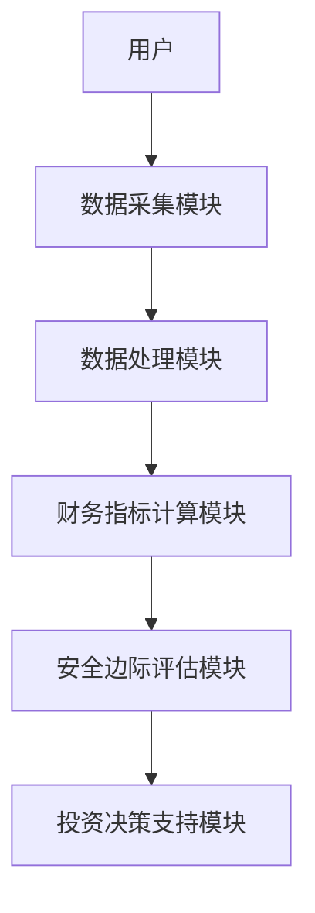

                 

# 《本杰明·格雷厄姆的工作资本分析技巧》

> 关键词：工作资本分析，价值投资，安全边际，内在价值，投资策略，本杰明·格雷厄姆，投资分析

> 摘要：本杰明·格雷厄姆是价值投资的鼻祖，他提出的工作资本分析方法为投资者提供了评估企业内在价值和安全边际的重要工具。本文将详细介绍工作资本分析的核心概念、算法原理、系统架构以及实际应用，帮助读者掌握这一经典投资技巧，并结合现代技术手段进行优化和扩展。

---

# 正文

## 第1章: 工作资本分析的背景介绍

### 1.1 投资学的基本概念
#### 1.1.1 投资学的定义与核心概念
投资学是研究资金分配和资产定价的学科，其核心目标是通过科学的方法最大化投资收益并最小化风险。投资学涵盖股票、债券、基金等多种资产类别，而股票投资作为其中的重要组成部分，一直是学术界和实务界的关注焦点。

#### 1.1.2 股票投资的基本原理
股票投资是指通过购买公司股份，期望从股价上涨或股息收入中获得收益的行为。股票投资的核心在于对企业基本面的深入分析，包括盈利能力、财务状况、行业地位等因素。

#### 1.1.3 工作资本分析的背景与意义
工作资本分析是股票投资中的重要环节，主要用于评估企业的财务健康状况和投资价值。通过分析企业的资产、负债和所有者权益，投资者可以更好地判断企业的内在价值和安全边际。

---

### 1.2 本杰明·格雷厄姆及其投资理念
#### 1.2.1 本杰明·格雷厄姆的生平简介
本杰明·格雷厄姆（Benjamin Graham）是20世纪最伟大的投资学家之一，被誉为“价值投资之父”。他在20世纪30年代提出了许多经典的投资理论，其中包括工作资本分析、安全边际和内在价值等概念。

#### 1.2.2 格雷厄姆的价值投资理论
格雷厄姆认为，股票不仅是一种金融资产，更是一家企业的所有权证书。投资者应该以企业所有者的角度看待投资，重点关注企业的基本面，而不是市场的短期波动。

#### 1.2.3 工作资本分析在价值投资中的地位
工作资本分析是格雷厄姆价值投资体系的核心部分，它通过对企业财务报表的分析，评估企业的内在价值和安全边际，从而帮助投资者做出合理的投资决策。

---

### 1.3 工作资本分析的核心目标
#### 1.3.1 确定企业的内在价值
内在价值是指企业在未来现金流的现值，是衡量企业价值的重要指标。通过工作资本分析，投资者可以估算出企业的内在价值，从而判断其是否被市场低估或高估。

#### 1.3.2 评估企业的安全边际
安全边际是指内在价值与市场价格之间的差额。当市场价格低于内在价值时，企业具有较高的安全边际，投资风险较低。

#### 1.3.3 判断企业的长期投资价值
通过分析企业的财务状况、盈利能力和发展潜力，工作资本分析可以帮助投资者判断企业的长期投资价值，从而做出长期的投资决策。

---

## 第2章: 工作资本分析的核心概念

### 2.1 安全边际的定义与计算
#### 2.1.1 安全边际的定义
安全边际是指内在价值与市场价格之间的差额。当市场价格远低于内在价值时，投资风险较小，安全边际较高。

#### 2.1.2 安全边际的计算公式
$$ 安全边际 = 内在价值 - 市场价格 $$

---

### 2.2 内在价值的评估方法
#### 2.2.1 内在价值的定义
内在价值是指企业在未来现金流的现值，是衡量企业价值的重要指标。通过分析企业的财务状况和盈利能力，投资者可以估算出企业的内在价值。

#### 2.2.2 内在价值的计算公式
$$ 内在价值 = (资产 - 流动负债) / (1 + 利率) $$

---

### 2.3 市场先生与投资者心理
#### 2.3.1 市场先生的定义
市场先生是格雷厄姆提出的一个形象化概念，指市场情绪的波动对股价的影响。市场先生每天都会以不同的价格出售股票，投资者需要在市场先生报价的基础上做出理性决策。

#### 2.3.2 投资者心理对市场的影响
投资者心理是市场波动的重要原因。当市场情绪乐观时，股价可能被高估；当市场情绪悲观时，股价可能被低估。

#### 2.3.3 如何应对市场波动
投资者应该以企业的内在价值为基准，避免被市场情绪左右。只有当市场价格低于内在价值时，才进行投资。

---

## 第3章: 工作资本分析的算法原理

### 3.1 格雷厄姆的筛选方法
格雷厄姆提出了许多筛选方法，用于评估企业的财务健康状况和投资价值。其中包括低市盈率、低市净率和高股息率等指标。

#### 3.1.1 低市盈率筛选法
市盈率是衡量股票价值的重要指标，低市盈率通常意味着股票被低估。格雷厄姆建议投资者选择市盈率低于15倍的股票。

#### 3.1.2 低市净率筛选法
市净率是企业市值与净资产的比率，低市净率通常意味着股票被低估。格雷厄姆建议投资者选择市净率低于1.5倍的股票。

#### 3.1.3 高股息率筛选法
高股息率通常意味着企业具有稳定的盈利能力和较高的分红能力。格雷厄姆建议投资者选择股息率高于5%的股票。

---

### 3.2 安全边际的计算流程
#### 3.2.1 确定企业的内在价值
通过分析企业的财务报表，估算出企业的内在价值。

#### 3.2.2 计算安全边际
用内在价值减去市场价格，得到安全边际。

#### 3.2.3 确定投资决策
当安全边际为正时，投资风险较低；当安全边际为负时，投资风险较高。

---

## 第4章: 工作资本分析的系统架构

### 4.1 系统功能设计
工作资本分析系统需要具备以下功能：
- 数据采集与处理
- 财务指标计算
- 安全边际评估
- 投资决策支持

---

### 4.2 系统架构设计
以下是工作资本分析系统的架构图：

---

## 第5章: 工作资本分析的项目实战

### 5.1 项目背景
以某制造业公司为例，分析其工作资本状况，评估其内在价值和安全边际。

---

### 5.2 数据采集与处理
#### 5.2.1 数据采集
通过财务报表获取企业的资产、负债和所有者权益等数据。

#### 5.2.2 数据处理
计算企业的财务指标，包括市盈率、市净率和股息率等。

---

### 5.3 安全边际评估
#### 5.3.1 内在价值计算
$$ 内在价值 = (资产 - 流动负债) / (1 + 利率) $$

#### 5.3.2 安全边际计算
$$ 安全边际 = 内在价值 - 市场价格 $$

---

### 5.4 投资决策支持
根据安全边际的计算结果，判断企业的投资价值。如果安全边际为正，建议买入；如果安全边际为负，建议卖出。

---

## 第6章: 工作资本分析的最佳实践

### 6.1 小结
工作资本分析是价值投资的重要工具，通过评估企业的内在价值和安全边际，投资者可以做出科学的投资决策。

---

### 6.2 注意事项
- 投资者应该结合企业的基本面和市场环境进行综合分析。
- 投资决策需要根据市场变化及时调整。

---

### 6.3 拓展阅读
- 《证券分析》（作者：本杰明·格雷厄姆）
- 《巴菲特的选股智慧》

---

## 作者信息

作者：AI天才研究院/AI Genius Institute & 禅与计算机程序设计艺术 /Zen And The Art of Computer Programming

