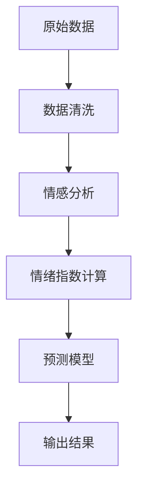
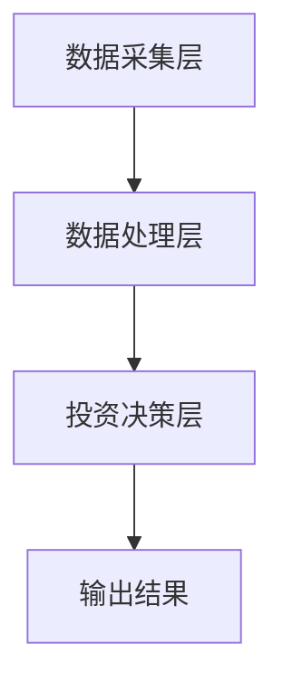

                 


# 本杰明·格雷厄姆的市场先生理论现代应用

## 关键词：
- 价值投资，市场情绪，市场先生，投资策略，机器学习

## 摘要：
本杰明·格雷厄姆的市场先生理论是价值投资的重要组成部分，强调市场情绪对投资决策的影响。本文将探讨如何在现代金融分析中应用市场先生理论，通过数据分析和机器学习技术量化市场情绪，预测市场波动，帮助投资者做出更明智的决策。文章结合理论与实践，详细介绍系统的构建和应用案例，展示市场先生理论在现代投资中的强大应用潜力。

---

## 第一部分：市场先生理论背景与核心概念

### 第1章：市场先生理论的起源与发展

#### 1.1 本杰明·格雷厄姆及其投资理念
- **1.1.1 格雷厄姆的生平简介**
  - 本杰明·格雷厄姆（1894-1976）是20世纪最伟大的投资思想家之一，被誉为“价值投资之父”。
  - 他创立了格雷厄姆-多德学院，培养了包括巴菲特在内的众多投资大师。
- **1.1.2 格雷厄姆的价值投资理论基础**
  - 核心理念：市场价格围绕内在价值波动，长期来看，价格回归价值。
  - 投资目标：寻找具有安全边际的股票，即市场价格远低于其内在价值。
- **1.1.3 市场先生理论的提出背景**
  - 格雷厄姆在《聪明的投资者》中首次提出“市场先生”概念。
  - 市场先生代表市场情绪，每天以不同的价格报价，投资者可以选择接受或拒绝这些价格。

#### 1.2 市场先生理论的核心思想
- **1.2.1 市场先生的定义与角色**
  - 市场先生是市场的化身，每天提供买卖价格。
  - 他的报价反映了市场的乐观或悲观情绪。
- **1.2.2 市场先生与理性投资者的互动**
  - 理性投资者应独立于市场先生的情绪，基于基本面分析做出决策。
  - 市场先生的报价为投资者提供了套利机会。
- **1.2.3 市场与理性的互动：波动与机会**
  - 市场波动是投资机会的来源。
  - 在市场恐慌时买入，在市场狂热时卖出。

---

### 第2章：市场情绪与投资者行为分析

#### 2.1 市场情绪的定义与分类
- **2.1.1 市场情绪的多维度分析**
  - 市场情绪可以分为乐观、悲观、中立等状态。
  - 不同的情绪状态会影响投资者的行为和市场走势。
- **2.1.2 投资者行为的心理学基础**
  - 投资者往往受情绪驱动，表现出从众心理和羊群效应。
  - 情绪化的决策可能导致非理性投资行为。

#### 2.2 市场情绪与投资决策的关系
- **2.2.1 市场情绪对投资决策的影响**
  - 过度乐观导致高估，过度悲观导致低估。
  - 投资者应识别市场情绪与实际价值的偏差。
- **2.2.2 理性与非理性决策的对比**
  - 理性决策基于基本面分析，非理性决策受情绪影响。
  - 理性投资者能在市场恐慌中寻找机会。

---

## 第二部分：市场先生理论的现代应用

### 第3章：市场情绪量化模型

#### 3.1 市场情绪指数的构建
- **3.1.1 数据来源与处理方法**
  - 数据来源：新闻网站、社交媒体、财经论坛。
  - 数据预处理：清洗、去重、情感分析。
- **3.1.2 情绪指数的计算公式**
  $$\text{情绪指数} = \frac{\text{正面情感数量} - \text{负面情感数量}}{\text{总样本数量}}$$

#### 3.2 市场情绪预测的算法实现
- **3.2.1 时间序列分析方法**
  - 使用ARIMA模型预测市场情绪指数。
- **3.2.2 机器学习模型的应用**
  - 使用随机森林分类器预测市场情绪类别。

#### 3.3 市场先生理论与机器学习结合
- **3.3.1 数据流图：市场情绪分析流程**

- **3.3.2 情感分析代码实现**
```python
from textblob import TextBlob

def get_sentiment(text):
    blob = TextBlob(text)
    return blob.sentiment.polarity
```

---

### 第4章：系统分析与架构设计

#### 4.1 系统功能设计
- **4.1.1 数据采集模块**
  - 功能：实时采集新闻、社交媒体数据。
  - 工具：API接口（如Twitter API）。
- **4.1.2 情绪分析模块**
  - 功能：对数据进行情感分析，生成情绪指数。
  - 工具：自然语言处理库（如spaCy）。
- **4.1.3 投资决策支持模块**
  - 功能：根据情绪指数和基本面分析，生成投资建议。

#### 4.2 系统架构设计
- **4.2.1 分层架构设计**

- **4.2.2 模块间的交互流程**


---

### 第5章：项目实战与案例分析

#### 5.1 项目环境与工具安装
- **5.1.1 开发环境配置**
  - 操作系统：Linux/Windows/MacOS。
  - 开发工具：PyCharm/VS Code。
- **5.1.2 数据获取工具安装**
  - 安装Python库：pandas、numpy、textblob、requests。

#### 5.2 核心代码实现
- **5.2.1 数据预处理代码**
```python
import pandas as pd
import requests

def fetch_data(api_key):
    url = f"https://api.twitter.com/1.1/search/tweets.json?q=finance&count=100"
    headers = {"Authorization": f"Bearer {api_key}"}
    response = requests.get(url, headers=headers)
    return response.json()

def preprocess(data):
    tweets = []
    for tweet in data.get('tweets', []):
        text = tweet.get('text', '')
        tweets.append({'text': text, 'time': tweet.get('created_at', '')})
    return pd.DataFrame(tweets)
```

- **5.2.2 情感分析算法代码**
```python
from textblob import TextBlob
import pandas as pd

def analyze_sentiment(text):
    blob = TextBlob(text)
    return blob.sentiment.polarity

data_frame['sentiment'] = data_frame['text'].apply(analyze_sentiment)
```

- **5.2.3 投资策略实现代码**
```python
import pandas as pd
import numpy as np

def generate_signals(data, threshold=0.1):
    signals = []
    for i in range(len(data)):
        if data['sentiment'][i] > threshold:
            signals.append(1)
        else:
            signals.append(0)
    return pd.Series(signals, index=data.index)

signals = generate_signals(data_frame)
```

#### 5.3 案例分析
- **5.3.1 数据可视化**
  - 使用Matplotlib绘制市场情绪指数变化图。
  - 使用Plotly绘制交互式图表。
- **5.3.2 情绪指数与股价的相关性分析**
  - 计算相关系数，验证情绪指数对股价的影响。

---

### 第6章：最佳实践与总结

#### 6.1 实践中的注意事项
- **数据质量的重要性**
  - 确保数据来源可靠，样本足够大。
- **模型的可解释性**
  - 避免过度依赖黑箱模型，保持模型的透明性。

#### 6.2 未来研究方向
- **结合其他投资理论**
  - 将市场先生理论与其他投资策略（如技术分析）结合。
- **新技术的应用**
  - 利用深度学习模型提高情感分析的准确性。

---

## 附录

### 附录A：常用工具与资源
- 数据源：Twitter API、财经新闻网站。
- 工具库：Python的文本处理库（spaCy、TextBlob）、时间序列分析库（ARIMA）。

### 附录B：参考文献
- 格雷厄姆，B. (1949). *The Intelligent Investor*.
- 克鲁克，M. (2014). *The Filter Bubble*.

---

## 后记

作者：AI天才研究院 & 禅与计算机程序设计艺术  
本文结合理论与实践，详细探讨了市场先生理论在现代金融分析中的应用。通过数据分析和机器学习技术，展示了如何量化市场情绪，帮助投资者做出更明智的决策。

--- 

以上是文章的完整内容，涵盖了市场先生理论的背景、核心概念、数学模型、系统设计、项目实战和总结。

