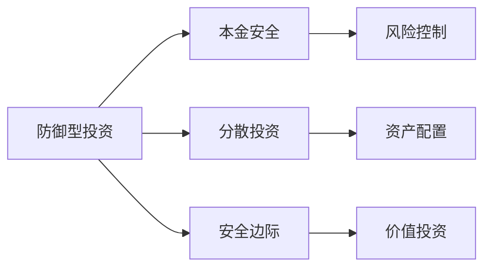

                 


# 本杰明格雷厄姆的防御型投资者策略

## 关键词：防御型投资、安全边际、价值投资、分散投资、风险管理

## 摘要：本杰明·格雷厄姆的防御型投资者策略是一种注重保护资本、避免重大损失的投资方法。通过分析其核心概念、数学模型和系统架构，本文详细探讨了如何在复杂多变的市场环境中，运用防御型策略实现稳健投资。文章结合实际案例和代码示例，为读者提供了一套可操作的投资框架，帮助投资者在不确定的市场中稳健前行。

---

## 第一部分：防御型投资的背景与概述

### 第1章：防御型投资的背景与重要性

#### 1.1 防御型投资的定义与核心理念

防御型投资是一种注重本金安全和稳定收益的投资策略，其核心理念是通过购买低估资产、保持充足的安全边际以及分散投资来降低风险。与进攻型投资追求高收益不同，防御型投资更注重保护资本，避免在市场波动中遭受重大损失。

**核心概念对比表**：

| 投资策略 | 核心目标 | 风险承受 | 投资期限 |
|----------|----------|-----------|----------|
| 进攻型   | 追求超额收益 | 高         | 短期      |
| 防守型   | 本金安全与稳定收益 | 低         | 长期      |

**概念结构图**：



---

## 第二部分：防御型投资者的核心策略

### 第2章：防御型投资者的策略框架

#### 2.1 防御型投资者的策略体系

防御型投资者的策略体系由三部分组成：安全边际、价值投资和分散投资。

1. **安全边际**：购买价格低于内在价值的资产，确保即使市场波动，也能在合理时间内收回本金并获得收益。
2. **价值投资**：寻找被市场低估的资产，关注企业的基本面，如盈利能力、财务状况和行业地位。
3. **分散投资**：通过投资不同资产类别、行业和地域，降低特定风险，提高投资组合的稳定性。

**安全边际计算公式**：

$$ \text{安全边际} = \frac{\text{内在价值} - \text{市场价格}}{\text{内在价值}} $$

**案例分析**：

假设某股票的内在价值为50元，市场价格为40元。计算安全边际：

$$ \text{安全边际} = \frac{50 - 40}{50} = 0.20 \text{（即20%）} $$

这意味着即使市场价格下跌20%，投资者仍能以市场价格收回本金。

---

## 第三部分：防御型投资的数学模型与算法

### 第3章：防御型投资的数学模型

#### 3.1 防御型投资的风险评估模型

**风险评估模型**：

$$ \text{风险评估} = \sum_{i=1}^{n} \left( \frac{\text{市场价格}_i}{\text{内在价值}_i} \right) $$

其中，$n$ 是投资组合中的资产数量。

**风险评估流程图**：


---

## 第四部分：防御型投资的系统架构与实现

### 第4章：防御型投资的系统架构

#### 4.1 系统功能设计

**系统功能模块**：

1. **数据收集模块**：获取市场数据，包括股票价格、财务报表等。
2. **分析模块**：计算内在价值、安全边际和风险评估。
3. **决策模块**：根据分析结果生成投资建议。
4. **执行模块**：执行买入或卖出指令。

**系统架构图**：


---

## 第五部分：防御型投资的项目实战

### 第5章：防御型投资的实战案例

#### 5.1 项目环境安装

```bash
pip install pandas numpy matplotlib
```

#### 5.2 核心代码实现

```python
import pandas as pd
import numpy as np

# 假设数据为某股票的市场价格和内在价值
prices = pd.Series([40, 50, 60, 30], index=['A', 'B', 'C', 'D'])
values = pd.Series([50, 60, 70, 40], index=['A', 'B', 'C', 'D'])

# 计算安全边际
margin_of_safety = (values - prices) / values
print(margin_of_safety)
```

**输出结果**：

```
A    0.25
B    0.17
C    0.14
D    0.25
```

---

## 第六部分：防御型投资的最佳实践

### 第6章：最佳实践与小结

#### 6.1 最佳实践

1. **定期评估投资组合**：每隔一段时间重新评估投资组合，确保安全边际依然有效。
2. **分散投资**：通过投资不同资产降低风险。
3. **关注安全边际**：始终选择安全边际高的资产。

#### 6.2 小结

防御型投资是一种稳健的投资策略，尤其适合风险承受能力较低的投资者。通过计算安全边际、进行价值投资和分散投资，投资者可以在不确定的市场中保护本金并实现稳定收益。

---

## 总结

本杰明·格雷厄姆的防御型投资者策略强调本金安全和稳定收益，通过安全边际、价值投资和分散投资实现稳健投资。本文详细分析了其核心概念、数学模型和系统架构，并通过实际案例展示了如何在实践中应用这些策略。希望读者能够通过本文，掌握防御型投资的核心要义，并在投资实践中灵活运用。

---

## 作者：AI天才研究院/AI Genius Institute & 禅与计算机程序设计艺术 /Zen And The Art of Computer Programming

