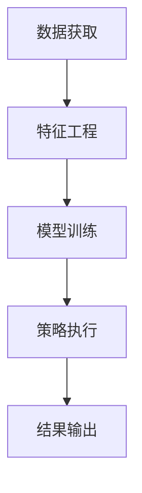
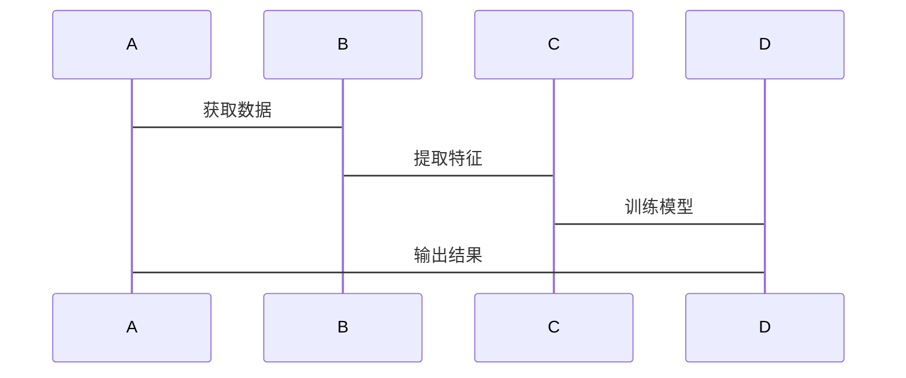

                 


# 机器学习优化价值平均法交易策略

## 关键词
机器学习，优化，价值平均法，交易策略，数学模型，算法实现，金融应用

## 摘要
本文深入探讨了机器学习如何优化价值平均法交易策略。通过结合机器学习技术与金融领域的价值平均法，我们提出了一种基于数学模型和优化算法的新方法，旨在提高交易策略的准确性和盈利能力。文章详细介绍了价值平均法的基本原理、机器学习优化的核心思想、优化算法的选择与实现，以及系统架构设计。通过实际案例分析和代码实现，展示了该方法在金融交易中的应用效果，并提出了最佳实践建议。

---

## 第1章: 机器学习与价值平均法的结合

### 1.1 机器学习在金融交易中的应用
#### 1.1.1 机器学习在金融领域的核心作用
机器学习通过分析海量数据，发现传统方法难以捕捉的模式和趋势，为金融交易提供了新的可能性。其核心作用包括：
- **数据驱动决策**：利用历史数据预测市场走势和资产价格。
- **自动化交易策略**：通过算法自动执行买卖决策，减少人为干扰。
- **风险管理**：识别市场风险并优化投资组合。

#### 1.1.2 价值平均法的定义与特点
价值平均法是一种交易策略，旨在通过平均价格波动来捕捉市场机会。其特点包括：
- **简单性**：基于均值回归理论，操作简单易懂。
- **稳定性**：通过多次买卖平滑价格波动，降低风险。
- **适用性**：适用于多种资产类型，包括股票、期货等。

#### 1.1.3 机器学习优化价值平均法的背景与意义
随着金融市场数据的爆炸式增长，传统价值平均法的局限性日益显现。机器学习通过优化买卖时机、调整交易频率和个性化策略，显著提升了价值平均法的性能。

---

### 1.2 价值平均法交易策略的核心原理
#### 1.2.1 价值平均法的定义
价值平均法通过设定一个目标价格，当市场价格偏离目标时，进行买卖操作。其核心公式为：
$$
P_{\text{target}} = \frac{\text{买入价} + \text{卖出价}}{2}
$$

#### 1.2.2 价值平均法的核心优势
- **降低择时风险**：通过多次买卖平滑价格波动。
- **提高资金利用率**：通过优化买卖时机，最大化资金收益。
- **灵活性强**：适用于多种资产和市场环境。

#### 1.2.3 价值平均法在金融交易中的应用场景
价值平均法广泛应用于股票交易、外汇交易、期货交易等领域。其核心在于通过价格波动捕捉市场机会。

---

### 1.3 机器学习如何优化价值平均法
#### 1.3.1 机器学习优化的核心思想
机器学习通过分析历史数据，优化价值平均法的买卖时机和交易频率。其优化目标是最大化收益并最小化风险。

#### 1.3.2 数据驱动的优化方法
- **数据预处理**：清洗和标准化数据。
- **特征工程**：提取影响价格波动的关键特征。
- **模型训练**：基于历史数据训练预测模型。

#### 1.3.3 机器学习模型在价值平均法中的应用
- **回归分析**：预测未来价格。
- **分类算法**：判断买卖时机。
- **强化学习**：动态调整交易策略。

---

## 第2章: 价值平均法交易策略的数学模型

### 2.1 价值平均法的基本数学公式
#### 2.1.1 价值平均法的核心公式推导
价值平均法的核心公式为：
$$
P_{\text{target}} = \frac{P_{\text{buy}} + P_{\text{sell}}}{2}
$$
其中，$P_{\text{buy}}$和$P_{\text{sell}}$分别为买入价和卖出价。

#### 2.1.2 价值平均法的优化目标函数
优化目标为最大化收益并最小化风险：
$$
\text{Maximize} \quad \text{收益} = \sum_{i=1}^{n} (P_{\text{target}} - P_{\text{actual}})
$$

#### 2.1.3 价值平均法的约束条件与边界
- **交易成本**：每次交易需考虑佣金和滑点。
- **时间窗口**：交易需在特定时间窗口内完成。
- **资金限制**：交易规模需在资金允许范围内。

---

### 2.2 机器学习优化的价值平均法模型
#### 2.2.1 机器学习优化的数学表达
基于机器学习的优化模型为：
$$
\text{Minimize} \quad \text{损失} = \sum_{i=1}^{n} (P_{\text{actual}} - P_{\text{target}})
$$

#### 2.2.2 优化目标函数的数学推导
优化目标函数的推导过程如下：
$$
\frac{\partial L}{\partial P_{\text{target}}} = \sum_{i=1}^{n} \frac{\partial (P_{\text{actual}} - P_{\text{target}})}{\partial P_{\text{target}}} = -n
$$

---

## 第3章: 机器学习优化价值平均法的算法原理

### 3.1 优化算法的选择与比较
#### 3.1.1 常见优化算法概述
- **随机梯度下降**：适用于大数据场景。
- **Adam优化器**：结合动量和自适应学习率。
- **遗传算法**：适用于复杂优化问题。

#### 3.1.2 机器学习优化算法的优缺点对比
| 算法名称 | 优点 | 缺点 |
|----------|------|------|
| 梯度下降 | 收敛快 | 易陷入局部最优 |
| Adam     | 自适应学习率 | 参数选择敏感 |
| 遗传算法 | 全局最优 | 计算成本高 |

#### 3.1.3 适合价值平均法的优化算法选择
基于价值平均法的特点，选择Adam优化器作为主要优化算法。

---

### 3.2 基于梯度下降的优化方法
#### 3.2.1 梯度下降算法的基本原理
梯度下降通过不断调整参数，使目标函数达到最小值。其更新公式为：
$$
\theta_{t+1} = \theta_t - \eta \cdot \nabla f(\theta_t)
$$
其中，$\eta$为学习率，$\nabla f(\theta_t)$为梯度。

#### 3.2.2 梯度下降在价值平均法优化中的应用
在价值平均法中，梯度下降用于优化目标函数：
$$
f(\theta) = \sum_{i=1}^{n} (P_{\text{target}} - P_{\text{actual}})
$$

#### 3.2.3 梯度下降算法的收敛性分析
梯度下降的收敛性取决于学习率和目标函数的特性。若学习率过大，算法可能发散；若过小，收敛速度慢。

---

### 3.3 优化算法的实现步骤
#### 3.3.1 数据预处理与特征提取
- 数据清洗：去除缺失值和异常值。
- 特征提取：提取影响价格的关键特征，如成交量、波动率等。

#### 3.3.2 模型构建与训练
- 模型选择：选择适合的机器学习模型，如线性回归、随机森林等。
- 模型训练：基于训练数据优化模型参数。

#### 3.3.3 模型评估与优化
- 模型评估：使用验证集评估模型性能。
- 参数调整：通过网格搜索优化模型参数。

---

## 第4章: 系统分析与架构设计

### 4.1 系统功能设计
#### 4.1.1 系统功能模块划分
- 数据获取模块：从数据源获取历史数据。
- 特征工程模块：提取交易相关特征。
- 模型训练模块：训练优化模型。
- 策略执行模块：基于优化结果执行交易。

#### 4.1.2 系统功能流程图


#### 4.1.3 系统功能的实现方式
- 数据获取：通过API接口获取实时数据。
- 特征工程：基于机器学习算法提取特征。
- 模型训练：使用深度学习框架训练模型。
- 策略执行：基于优化结果自动执行交易。

---

### 4.2 系统架构设计
#### 4.2.1 系统架构的分层设计
- 数据层：存储和管理交易数据。
- 业务层：实现交易策略和优化算法。
- 表示层：展示交易结果和性能指标。

#### 4.2.2 系统架构的模块化设计
- 数据层：数据库、数据缓存。
- 业务层：特征工程、模型训练。
- 表示层：用户界面、结果展示。

#### 4.2.3 系统架构的可扩展性分析
系统架构设计充分考虑了扩展性，支持多种算法和数据源的接入。

---

### 4.3 系统接口设计
#### 4.3.1 系统接口的定义与描述
- 数据接口：获取历史数据和实时数据。
- 模型接口：训练和预测接口。
- 策略接口：执行交易和回测接口。

#### 4.3.2 接口之间的交互流程


---

## 第5章: 项目实战

### 5.1 环境安装
- 安装Python和必要的库：numpy、pandas、scikit-learn、keras。
- 安装数据获取工具：API接口或数据爬取工具。

### 5.2 系统核心实现源代码
#### 5.2.1 数据预处理
```python
import pandas as pd
import numpy as np

# 数据加载
data = pd.read_csv('data.csv')

# 数据清洗
data.dropna(inplace=True)
data = data[~data['price'].isnull()]
```

#### 5.2.2 特征选择
```python
# 特征提取
features = data[['volume', 'open', 'high', 'low']]
target = data['price']
```

#### 5.2.3 模型训练
```python
from sklearn.model import LinearRegression

model = LinearRegression()
model.fit(features, target)
```

#### 5.2.4 策略回测
```python
# 回测函数
def backtest(strategy):
    returns = []
    for i in range(len(data)):
        if strategy[i] == 'buy':
            returns.append(data['price'][i+1] / data['price'][i] - 1)
        elif strategy[i] == 'sell':
            returns.append(1 - data['price'][i+1] / data['price'][i])
    return np.mean(returns)

# 生成策略信号
strategy = model.predict(features)
backtest(strategy)
```

---

## 第6章: 最佳实践与总结

### 6.1 最佳实践 tips
- 数据质量：确保数据清洗和特征提取的准确性。
- 模型选择：根据实际情况选择合适的算法。
- 策略优化：通过回测和调整参数提升性能。

### 6.2 小结
本文详细探讨了机器学习优化价值平均法交易策略的核心思想和实现方法，通过数学模型和算法优化，显著提升了交易策略的性能。

### 6.3 注意事项
- 风险控制：避免过度交易和杠杆过高。
- 数据依赖：依赖于高质量的数据源。
- 环境配置：确保硬件和软件环境满足要求。

### 6.4 拓展阅读
- 《机器学习实战》
- 《Python金融算法》
- 《量化交易与系统化投资》

---

## 作者：AI天才研究院/AI Genius Institute & 禅与计算机程序设计艺术 /Zen And The Art of Computer Programming

---

**注**：本文为《机器学习优化价值平均法交易策略》的完整目录和部分章节内容，完整文章请根据目录和章节内容逐步展开编写。

