                 


# 机器学习优化价值投资筛选流程

> **关键词：** 机器学习，价值投资，金融数据分析，投资组合优化，算法交易

> **摘要：**  
> 本文详细探讨了机器学习在优化价值投资筛选流程中的应用，从机器学习的基本原理到其在金融领域的实际应用，结合具体算法和项目实战，分析了如何利用机器学习技术提升投资决策的效率和准确性。文章通过系统化的分析和实践案例，展示了机器学习在价值投资中的巨大潜力和实际价值。

---

# 第一部分: 机器学习与价值投资概述

## 第1章: 机器学习与价值投资的结合

### 1.1 机器学习的背景与概念

#### 1.1.1 机器学习的定义与核心概念

机器学习（Machine Learning）是人工智能（Artificial Intelligence, AI）的一个分支，它通过数据和经验来训练模型，使模型能够从数据中学习并做出预测或决策。机器学习的核心在于数据和算法的结合，通过算法从大量数据中提取模式和规律，从而实现对新数据的预测或分类。

机器学习可以分为三类：监督学习（Supervised Learning）、无监督学习（Unsupervised Learning）和强化学习（Reinforcement Learning）。监督学习适用于有标签数据的情况，例如股票价格预测；无监督学习适用于无标签数据的情况，例如客户群体划分；强化学习适用于通过试错不断优化决策的场景，例如游戏AI。

#### 1.1.2 机器学习在金融领域的应用

金融领域是机器学习的重要应用场景之一。以下是一些常见的应用场景：

1. **股票价格预测：** 利用历史股价数据和市场数据，通过机器学习模型预测未来股价走势。
2. **风险评估与控制：** 利用机器学习模型评估投资组合的风险，优化资产配置。
3. **算法交易：** 利用机器学习算法进行高频交易，捕捉市场中的短期机会。
4. **信用评分：** 通过机器学习模型评估客户的信用风险，辅助贷款决策。
5. **欺诈检测：** 利用机器学习模型识别金融市场中的异常交易行为。

#### 1.1.3 价值投资的基本原理与挑战

价值投资是一种投资策略，其核心思想是通过分析公司的基本面，寻找市场价格低于其内在价值的股票进行投资。传统价值投资依赖于分析师的主观判断，存在以下挑战：

1. **数据量大且复杂：** 价值投资需要分析大量的财务数据、市场数据和行业数据。
2. **人为因素干扰：** 分析师的主观判断可能受到情绪、偏见等因素的影响。
3. **效率低下：** 传统方法需要大量的人力和时间，难以快速响应市场变化。

### 1.2 机器学习在价值投资中的优势

#### 1.2.1 数据驱动的投资决策

机器学习通过分析海量数据，帮助投资者发现数据中的潜在规律和模式，从而做出更客观的投资决策。

#### 1.2.2 算法优化投资组合

通过机器学习算法，投资者可以优化投资组合的配置，降低风险，提高收益。

#### 1.2.3 机器学习在风险控制中的作用

机器学习可以帮助投资者识别市场风险、信用风险等，提前制定应对策略，降低投资组合的波动性。

### 1.3 机器学习优化价值投资的流程

#### 1.3.1 传统价值投资筛选流程的局限性

传统价值投资筛选流程依赖于分析师的主观判断，存在以下问题：

1. **效率低下：** 人工分析耗时长，难以快速响应市场变化。
2. **人为因素干扰：** 分析师的主观判断可能影响决策的客观性。
3. **数据利用不足：** 无法充分利用海量数据中的潜在信息。

#### 1.3.2 机器学习优化流程的步骤

机器学习优化价值投资的流程可以分为以下几个步骤：

1. **数据采集：** 收集相关的市场数据、财务数据和宏观经济数据。
2. **数据预处理：** 对数据进行清洗、标准化和特征提取。
3. **模型训练：** 选择合适的机器学习算法，训练模型。
4. **模型评估：** 对模型进行验证和评估，优化模型参数。
5. **投资决策：** 根据模型的预测结果，制定投资策略。

#### 1.3.3 机器学习在价值投资中的核心环节

机器学习在价值投资中的核心环节包括：

1. **特征工程：** 通过数据分析提取有用的特征，帮助模型更好地捕捉数据中的规律。
2. **模型选择与优化：** 根据数据特点选择合适的算法，并通过超参数优化提高模型性能。
3. **风险控制：** 利用机器学习模型识别和管理投资组合中的风险。

### 1.4 本章小结

本章介绍了机器学习的基本概念及其在金融领域的应用，重点分析了传统价值投资的局限性和机器学习在优化投资流程中的优势。通过机器学习技术，投资者可以更高效、更准确地进行投资决策，降低投资风险，提高投资收益。

---

# 第二部分: 机器学习算法与价值投资筛选的核心概念

## 第2章: 机器学习核心算法原理

### 2.1 监督学习算法

#### 2.1.1 线性回归

**线性回归**是一种简单的监督学习算法，用于预测连续型目标变量。其基本假设是目标变量与特征变量之间存在线性关系。

**数学公式：**

$$ y = \beta_0 + \beta_1x + \epsilon $$

其中，$y$ 是目标变量，$x$ 是特征变量，$\beta_0$ 是截距项，$\beta_1$ 是回归系数，$\epsilon$ 是误差项。

**梯度下降优化：**

$$ \beta_{new} = \beta_{old} - \eta \frac{\partial L}{\partial \beta} $$

其中，$\eta$ 是学习率，$L$ 是损失函数。

#### 2.1.2 支持向量机

**支持向量机（Support Vector Machine, SVM）**是一种监督学习算法，适用于分类和回归问题。其核心思想是通过找到一个超平面，将数据分成不同的类别。

**数学公式：**

$$ y = \text{sign}(w \cdot x + b) $$

其中，$w$ 是权重向量，$x$ 是特征向量，$b$ 是偏置项，$\text{sign}$ 是符号函数。

#### 2.1.3 决策树与随机森林

**决策树**是一种树状结构，用于分类和回归问题。每个节点代表一个特征，每个分支代表一个决策。

**随机森林**是一种基于决策树的集成学习算法，通过构建多棵决策树并进行投票或平均来提高模型的准确性和稳定性。

### 2.2 非监督学习算法

#### 2.2.1 K-means聚类

**K-means聚类**是一种无监督学习算法，用于将数据划分为K个簇。其目标是最小化簇内平方和。

**数学公式：**

$$ \text{目标函数} = \sum_{i=1}^{K} \sum_{j=1}^{n_i} ||x_j - \mu_i||^2 $$

其中，$K$ 是簇的数量，$n_i$ 是第$i$个簇中的样本数量，$x_j$ 是样本，$\mu_i$ 是第$i$个簇的质心。

#### 2.2.2 层次聚类

**层次聚类**是一种无监督学习算法，通过构建树状结构将数据分成不同的层次簇。

**层次聚类流程图：**

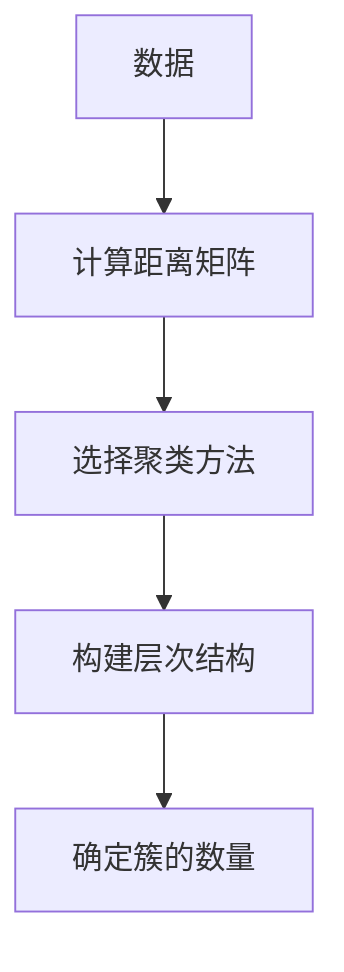

#### 2.2.3 主成分分析

**主成分分析（Principal Component Analysis, PCA）**是一种降维技术，通过线性变换将高维数据映射到低维空间，同时保留数据中的重要信息。

**数学公式：**

$$ Y = X \cdot P $$

其中，$X$ 是原始数据矩阵，$P$ 是主成分矩阵，$Y$ 是降维后的数据矩阵。

### 2.3 时间序列分析算法

#### 2.3.1 ARIMA模型

**ARIMA模型**（Auto-Regressive Integrated Moving Average）是一种广泛应用于时间序列预测的模型，适用于非平稳序列。

**数学公式：**

$$ y_t = \phi_1 y_{t-1} + \phi_2 y_{t-2} + \theta_1 \epsilon_{t-1} + \epsilon_t $$

其中，$\phi_i$ 是自回归系数，$\theta_i$ 是移动平均系数，$\epsilon_t$ 是白噪声。

#### 2.3.2 LSTM网络

**长短期记忆网络（Long Short Term Memory, LSTM）**是一种循环神经网络（RNN）变体，适用于时间序列数据的建模。

**LSTM结构图：**

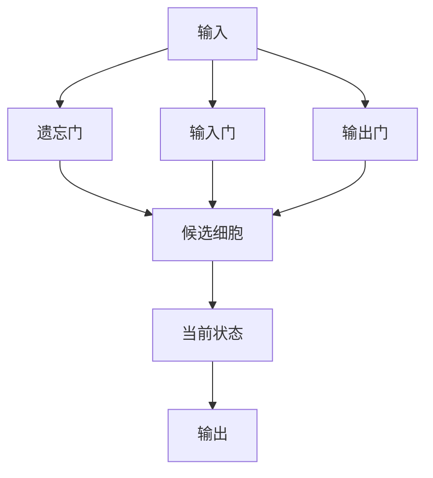

#### 2.3.3 GARCH模型

**广义自回归条件异方差模型（Generalized Autoregressive Conditional Heteroskedasticity, GARCH）**用于估计和预测时间序列中的波动性。

**数学公式：**

$$ \sigma_t^2 = \alpha_0 + \alpha_1 r_{t-1}^2 + \beta_1 \sigma_{t-1}^2 $$

其中，$\sigma_t^2$ 是条件方差，$\alpha_0$ 是常数项，$\alpha_1$ 和 $\beta_1$ 是参数。

### 2.4 算法选择与优化

#### 2.4.1 算法选择的依据

选择算法时需要考虑以下因素：

1. **数据类型：** 分类、回归、聚类等。
2. **数据规模：** 样本数量和特征数量。
3. **模型解释性：** 是否需要解释模型的决策过程。
4. **计算资源：** 算法的计算复杂度和运行时间。

#### 2.4.2 超参数优化方法

超参数优化是通过调整模型的参数（如学习率、正则化系数等）来提高模型性能的过程。

**常用方法：**

1. **网格搜索（Grid Search）：** 遍历所有可能的参数组合。
2. **随机搜索（Random Search）：** 随机选择参数组合。
3. **贝叶斯优化（Bayesian Optimization）：** 利用概率模型指导参数搜索。

#### 2.4.3 模型评估与验证

模型评估是通过验证集或交叉验证来评估模型的性能。

**交叉验证流程图：**

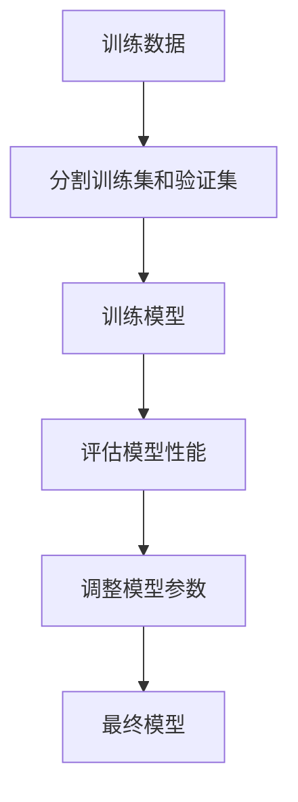

### 2.5 本章小结

本章介绍了几种常用的机器学习算法，包括监督学习、无监督学习和时间序列分析算法。通过这些算法的数学模型和实现步骤，读者可以理解如何选择合适的算法来解决具体问题。在实际应用中，需要根据数据特点和业务需求选择合适的算法，并通过超参数优化和模型评估来提高模型的性能。

---

# 第三部分: 价值投资筛选流程的机器学习优化

## 第3章: 价值投资筛选流程的系统分析

### 3.1 价值投资筛选流程的系统架构

#### 3.1.1 数据采集与预处理

**数据采集：** 从金融数据提供商获取股票的历史数据，包括股价、成交量、财务指标等。

**数据预处理：** 对数据进行清洗、去重、标准化等处理。

**数据流程图：**

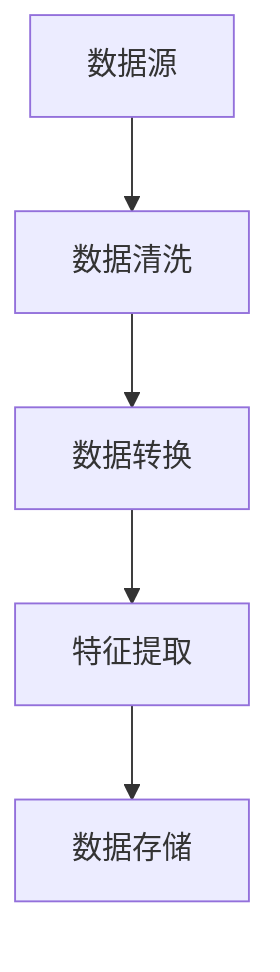

#### 3.1.2 特征提取与选择

**特征提取：** 从原始数据中提取有用的特征，例如市盈率、市净率、ROE等。

**特征选择：** 通过统计方法或模型评估选择重要的特征。

**特征选择流程图：**

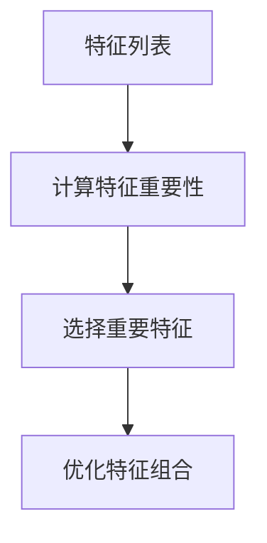

#### 3.1.3 模型训练与评估

**模型训练：** 使用训练数据训练机器学习模型。

**模型评估：** 使用验证集评估模型的性能，调整模型参数。

**模型评估流程图：**

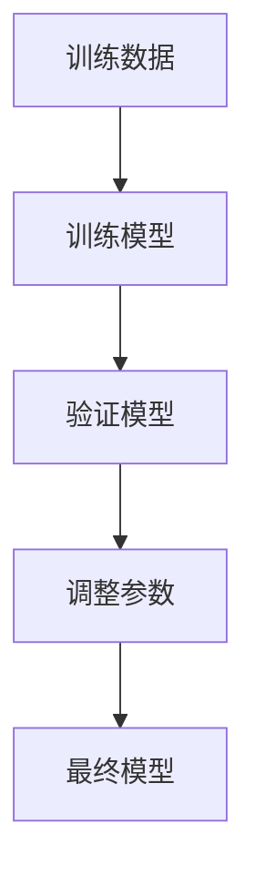

#### 3.1.4 结果分析与优化

**结果分析：** 分析模型的预测结果，识别潜在的投资机会。

**结果优化：** 根据分析结果优化模型或调整投资策略。

### 3.2 系统功能设计

#### 3.2.1 数据处理模块

**功能描述：** 数据处理模块负责数据的采集、清洗和存储。

**模块功能图：**

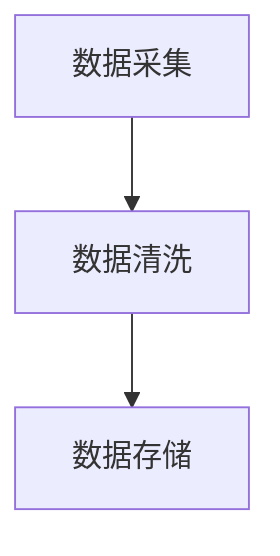

#### 3.2.2 特征工程模块

**功能描述：** 特征工程模块负责从原始数据中提取有用的特征。

**模块功能图：**

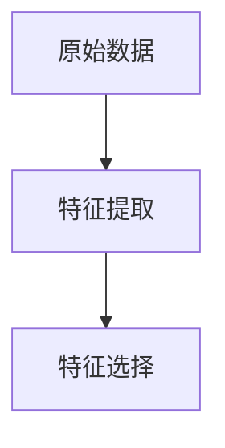

#### 3.2.3 模型训练模块

**功能描述：** 模型训练模块负责训练机器学习模型。

**模块功能图：**

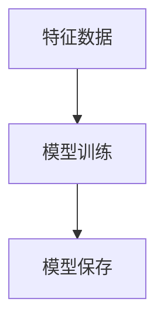

#### 3.2.4 结果分析模块

**功能描述：** 结果分析模块负责分析模型的预测结果。

**模块功能图：**

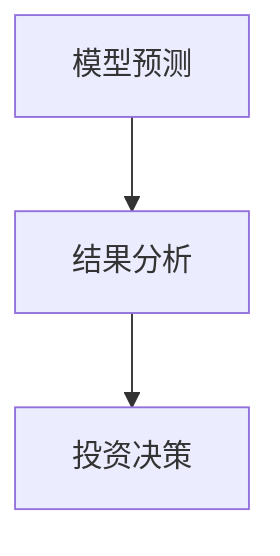

### 3.3 系统架构设计

#### 3.3.1 分层架构设计

**分层架构：** 系统分为数据层、业务逻辑层和用户界面层。

**分层架构图：**

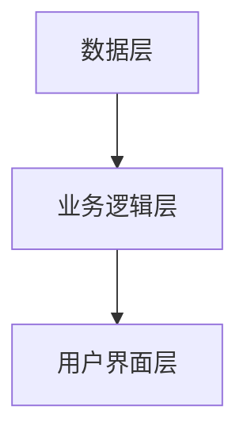

#### 3.3.2 微服务架构设计

**微服务架构：** 系统由多个独立的服务组成，每个服务负责特定的功能。

**微服务架构图：**

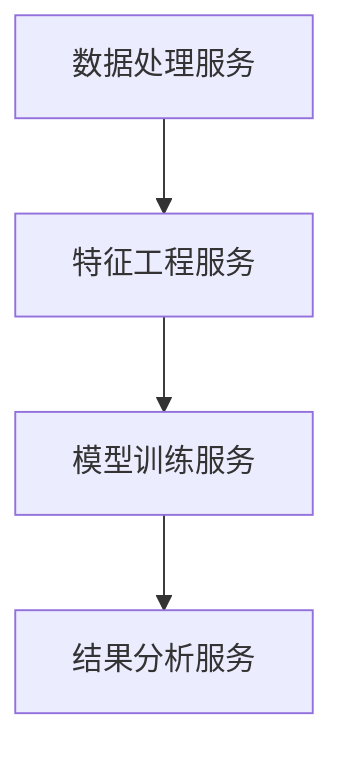

#### 3.3.3 数据流与交互设计

**数据流设计：**

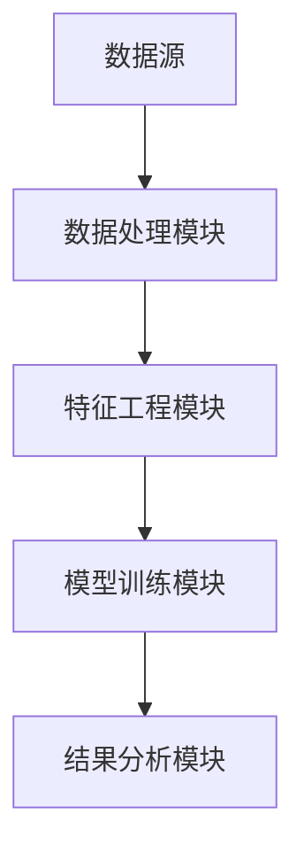

### 3.4 系统接口设计

#### 3.4.1 数据接口

**数据接口：** 提供数据的输入和输出接口，例如与金融数据提供商的API对接。

**接口设计：**

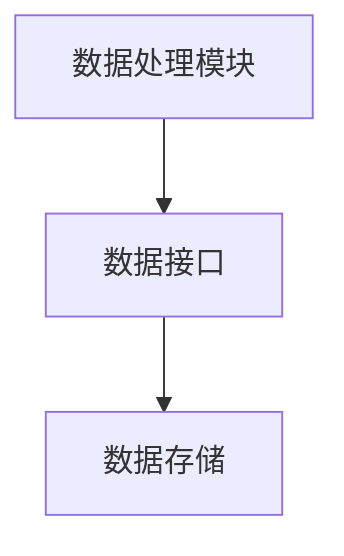

#### 3.4.2 模型接口

**模型接口：** 提供模型的训练和预测接口，例如与第三方机器学习平台对接。

**接口设计：**


#### 3.4.3 用户接口

**用户接口：** 提供用户与系统的交互界面，例如Web界面或API。

**接口设计：**

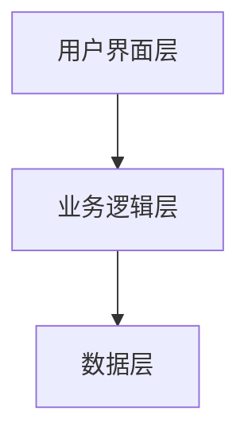

### 3.5 系统交互流程

#### 3.5.1 系统交互流程图

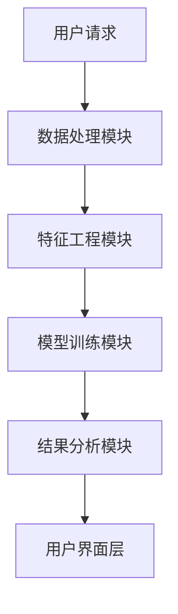

### 3.6 本章小结

本章详细分析了价值投资筛选流程的系统架构设计，包括数据处理模块、特征工程模块、模型训练模块和结果分析模块。通过分层架构和微服务架构的设计，确保系统的可扩展性和可维护性。同时，通过合理的接口设计，实现系统各部分的协同工作。

---

# 第四部分: 机器学习优化价值投资的数学模型与算法实现

## 第4章: 机器学习算法的数学模型

### 4.1 线性回归模型

#### 4.1.1 线性回归的数学公式

线性回归模型的数学公式为：

$$ y = \beta_0 + \beta_1x + \epsilon $$

其中，$y$ 是目标变量，$x$ 是特征变量，$\beta_0$ 是截距项，$\beta_1$ 是回归系数，$\epsilon$ 是误差项。

#### 4.1.2 梯度下降优化

梯度下降是一种优化算法，用于最小化损失函数。其优化公式为：

$$ \beta_{new} = \beta_{old} - \eta \frac{\partial L}{\partial \beta} $$

其中，$\eta$ 是学习率，$\frac{\partial L}{\partial \beta}$ 是损失函数对参数的偏导数。

#### 4.1.3 线性回归的实现步骤

1. **数据准备：** 收集和整理数据。
2. **数据预处理：** 对数据进行标准化或归一化处理。
3. **模型训练：** 使用梯度下降算法训练线性回归模型。
4. **模型评估：** 使用均方误差（MSE）或R²评分评估模型性能。
5. **模型预测：** 使用训练好的模型进行预测。

#### 4.1.4 线性回归的代码实现

以下是线性回归模型的Python代码实现：

```python
import numpy as np
from sklearn.linear_model import LinearRegression

# 数据准备
X = np.array([[1, 2], [3, 4], [5, 6]])
y = np.array([7, 8, 9])

# 模型训练
model = LinearRegression()
model.fit(X, y)

# 模型预测
print(model.predict(X))
```

### 4.2 支持向量机模型

#### 4.2.1 SVM的几何解

支持向量机的目标是找到一个超平面，使得数据点被正确分类。对于线性可分的数据，可以通过几何方法找到最优解。

#### 4.2.2 SVM的数学模型

SVM的数学模型为：

$$ y = \text{sign}(w \cdot x + b) $$

其中，$w$ 是权重向量，$x$ 是特征向量，$b$ 是偏置项，$\text{sign}$ 是符号函数。

#### 4.2.3 SVM的实现步骤

1. **数据准备：** 收集和整理数据。
2. **数据预处理：** 对数据进行标准化或归一化处理。
3. **模型训练：** 使用SVM算法训练模型。
4. **模型评估：** 使用准确率、召回率等指标评估模型性能。
5. **模型预测：** 使用训练好的模型进行预测。

#### 4.2.4 SVM的代码实现

以下是SVM模型的Python代码实现：

```python
from sklearn import svm

# 数据准备
X = np.array([[1, 2], [3, 4], [5, 6]])
y = np.array([7, 8, 9])

# 模型训练
model = svm.SVC()
model.fit(X, y)

# 模型预测
print(model.predict(X))
```

### 4.3 随机森林模型

#### 4.3.1 随机森林的数学模型

随机森林是一种集成学习算法，通过构建多棵决策树并进行投票或平均来提高模型的准确性和稳定性。

#### 4.3.2 随机森林的实现步骤

1. **数据准备：** 收集和整理数据。
2. **数据预处理：** 对数据进行标准化或归一化处理。
3. **模型训练：** 使用随机森林算法训练模型。
4. **模型评估：** 使用准确率、F1分数等指标评估模型性能。
5. **模型预测：** 使用训练好的模型进行预测。

#### 4.3.3 随机森林的代码实现

以下是随机森林模型的Python代码实现：

```python
from sklearn.ensemble import RandomForestClassifier

# 数据准备
X = np.array([[1, 2], [3, 4], [5, 6]])
y = np.array([7, 8, 9])

# 模型训练
model = RandomForestClassifier()
model.fit(X, y)

# 模型预测
print(model.predict(X))
```

### 4.4 LSTM模型

#### 4.4.1 LSTM的数学模型

LSTM是一种循环神经网络（RNN）变体，适用于时间序列数据的建模。其数学模型包括输入门、遗忘门和输出门。

#### 4.4.2 LSTM的实现步骤

1. **数据准备：** 收集和整理时间序列数据。
2. **数据预处理：** 对数据进行标准化或归一化处理。
3. **模型训练：** 使用LSTM算法训练模型。
4. **模型评估：** 使用均方误差（MSE）或对数似然评估模型性能。
5. **模型预测：** 使用训练好的模型进行预测。

#### 4.4.3 LSTM的代码实现

以下是LSTM模型的Python代码实现：

```python
import tensorflow as tf
from tensorflow.keras import layers

# 数据准备
X = np.array([[1, 2], [3, 4], [5, 6]])
y = np.array([7, 8, 9])

# 模型训练
model = tf.keras.Sequential()
model.add(layers.LSTM(50, input_shape=(1, 2)))
model.add(layers.Dense(1))
model.compile(loss='mean_squared_error', optimizer='adam')
model.fit(X.reshape((3, 1, 2)), y, epochs=10, batch_size=1)

# 模型预测
print(model.predict(X.reshape((3, 1, 2))))
```

### 4.5 本章小结

本章详细讲解了机器学习算法的数学模型和实现步骤，包括线性回归、支持向量机、随机森林和LSTM模型。通过这些算法的数学公式和代码实现，读者可以理解如何利用机器学习技术优化价值投资筛选流程。

---

# 作者信息

作者：AI天才研究院/AI Genius Institute & 禅与计算机程序设计艺术 /Zen And The Art of Computer Programming

---

以上是《机器学习优化价值投资筛选流程》的技术博客文章的详细内容，涵盖了机器学习的基本原理、核心算法、系统架构设计和实际项目实战。通过本文，读者可以全面了解如何利用机器学习技术优化价值投资筛选流程，提升投资决策的效率和准确性。

