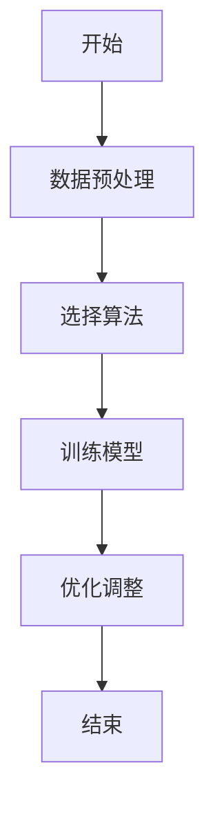

                 

# 机器学习优化投资组合分散化

> 关键词：机器学习，投资组合优化，分散化，风险控制，金融建模

> 摘要：本文探讨了机器学习在投资组合优化中的应用，特别是如何通过机器学习技术优化投资组合的分散化。文章从投资组合分散化的背景、核心概念、算法选择、数学模型、系统架构到项目实战，全面分析了机器学习在投资组合分散化中的潜力和实现方法。通过实际案例和详细的技术分析，展示了机器学习如何帮助投资者在复杂金融市场中实现更优的风险控制和收益最大化。

---

# 第1章: 投资组合分散化的背景与挑战

## 1.1 投资组合分散化的概念

### 1.1.1 投资组合分散化的定义
投资组合分散化是指通过将资金分配到不同资产或资产类别中，以降低投资风险的一种策略。分散化的核心思想是“不要把所有鸡蛋放在一个篮子里”，通过多样化投资来减少特定资产或市场的波动对整体投资组合的影响。

### 1.1.2 分散化的意义与作用
- **降低风险**：通过分散投资，投资者可以减少单一资产价格波动带来的风险。
- **提高稳定性**：分散化投资能够使投资组合的收益更加平稳，避免因个别资产价格剧烈波动而导致的损失。
- **捕捉不同收益来源**：通过配置不同资产或行业，投资者可以利用不同资产之间的低相关性来优化收益。

### 1.1.3 分散化与风险控制的关系
分散化是风险控制的重要手段之一。通过分散化，投资者可以在面对市场波动时，降低非系统性风险，从而实现更稳健的投资回报。

---

## 1.2 传统投资组合优化的局限性

### 1.2.1 传统分散化方法的优缺点
- **优点**：
  - 理论基础扎实，均值-方差模型是经典的投资组合优化方法。
  - 计算简单，易于实现。
- **缺点**：
  - 假设资产收益呈正态分布，忽略了实际市场中的非线性关系。
  - 无法捕捉复杂的市场动态和资产之间的非线性相关性。

### 1.2.2 传统优化模型的假设与限制
- **假设**：
  - 资产收益独立或低相关。
  - 投资者是理性的，追求风险调整后的收益最大化。
- **限制**：
  - 无法处理大数据量和高维数据。
  - 忽略了市场中的复杂交互关系和非线性特征。

### 1.2.3 实际投资中的挑战与问题
- 市场波动性大，传统分散化方法难以应对极端情况。
- 不同资产之间的相关性可能在某些情况下显著增加，导致分散化效果下降。
- 传统方法难以动态调整投资组合，无法实时捕捉市场变化。

---

## 1.3 机器学习在投资组合优化中的应用前景

### 1.3.1 机器学习的基本概念
机器学习是一种人工智能技术，通过数据训练模型，使其能够从数据中学习模式和关系，并用于预测或决策。机器学习分为监督学习、无监督学习和强化学习等类型。

### 1.3.2 机器学习在金融领域的应用现状
- **量化交易**：利用机器学习进行市场预测和交易策略优化。
- **风险管理**：通过机器学习模型识别和预警市场风险。
- **客户画像**：利用机器学习进行客户行为分析和投资建议。

### 1.3.3 机器学习优化投资组合分散化的潜力
- **捕捉非线性关系**：机器学习能够发现传统方法难以捕捉的资产之间复杂的非线性相关性。
- **大数据处理能力**：机器学习能够处理海量数据，发现隐藏在数据中的潜在模式。
- **动态调整能力**：机器学习模型可以实时更新，根据市场变化动态调整投资组合。

---

## 1.4 本章小结

### 1.4.1 核心概念回顾
- 投资组合分散化的定义和作用。
- 传统分散化方法的优缺点及其局限性。
- 机器学习在投资组合优化中的潜力。

### 1.4.2 机器学习的优势与挑战
- 优势：能够捕捉复杂关系，处理大数据，动态调整。
- 挑战：模型解释性差，数据质量要求高，市场变化快。

### 1.4.3 本书的结构安排
- 第二章将介绍机器学习与投资组合优化的核心概念。
- 第三章将详细讲解机器学习算法在投资组合优化中的应用。
- 后续章节将从数学模型、系统架构到项目实战，全面分析机器学习优化投资组合分散化的实现方法。

---

# 第2章: 机器学习与投资组合优化的核心概念

## 2.1 机器学习的基本原理

### 2.1.1 数据、模型与算法的关系
- 数据是机器学习的基础，模型是数据的表达方式，算法是模型优化的工具。
- 数据决定了模型的表现，模型通过算法进行优化和训练。

### 2.1.2 监督学习与无监督学习的区别
- **监督学习**：有标签数据，目标是学习输入到输出的映射关系。
- **无监督学习**：无标签数据，目标是发现数据中的内在结构。

### 2.1.3 回归与分类在金融中的应用
- **回归**：用于预测资产收益。
- **分类**：用于预测市场状态（牛市、熊市等）。

---

## 2.2 投资组合优化的数学模型

### 2.2.1 投资组合的收益与风险模型
- **收益**：$r_i$ 表示资产 $i$ 的预期收益率。
- **风险**：$\sigma_i^2$ 表示资产 $i$ 的方差。
- **协方差**：$\sigma_{i,j}$ 表示资产 $i$ 和资产 $j$ 的协方差。

### 2.2.2 均值-方差优化的数学公式
$$\text{目标函数：} \min \sigma^2$$
$$\text{约束条件：} \sum w_i = 1, w_i \geq 0$$
其中，$w_i$ 表示资产 $i$ 的权重。

### 2.2.3 现实中的复杂性与简化假设
- 现实中的资产回报可能不符合正态分布。
- 市场中可能存在杠杆、交易成本等复杂因素。

---

## 2.3 机器学习在分散化中的应用特点

### 2.3.1 非线性关系的捕捉能力
- 机器学习模型（如神经网络）能够捕捉资产之间的非线性相关性，提高分散化效果。

### 2.3.2 大数据分析的优势
- 通过分析海量历史数据，机器学习能够发现传统方法难以察觉的模式和关系。

### 2.3.3 动态调整的灵活性
- 机器学习模型可以根据市场变化实时调整权重，优化投资组合。

---

## 2.4 核心概念对比分析

### 2.4.1 传统优化与机器学习的对比表格
| 方法       | 优点                          | 缺点                          |
|------------|-------------------------------|-------------------------------|
| 均值-方差优化 | 简单明了，理论基础扎实         | 忽略非线性关系，假设过于简化   |
| 机器学习   | 捕捉复杂关系，动态调整能力强     | 模型解释性差，需要大量数据      |

---

## 2.5 本章小结

### 2.5.1 核心概念的总结
- 机器学习能够捕捉传统方法难以发现的复杂关系。
- 投资组合优化需要结合数学模型和机器学习算法。

### 2.5.2 机器学习的优势与局限
- 优势：能够处理复杂数据，动态调整。
- 局限：需要大量数据，模型解释性差。

### 2.5.3 下一章的预览
- 第三章将详细讲解机器学习算法在投资组合优化中的应用。

---

# 第3章: 机器学习算法在投资组合优化中的应用

## 3.1 常见的机器学习算法简介

### 3.1.1 线性回归
- 用于预测资产收益，简单但假设线性关系。

### 3.1.2 支持向量机
- 用于分类和回归，能够处理高维数据。

### 3.1.3 随机森林
- 通过集成学习捕捉复杂关系，适合金融数据分析。

### 3.1.4 神经网络
- 能够处理非线性关系，适合复杂市场预测。

---

## 3.2 优化算法的选择与应用

### 3.2.1 均值-方差优化的改进
- 使用机器学习模型预测资产收益和协方差矩阵，优化投资组合权重。

### 3.2.2 遗传算法
- 通过模拟自然选择，优化投资组合权重。

### 3.2.3 粒子群优化
- 通过粒子群运动，寻找最优投资组合权重。

### 3.2.4 深度学习的应用
- 使用神经网络预测市场趋势，优化投资组合。

---

## 3.3 算法流程图

---

## 3.4 机器学习算法的数学模型

### 3.4.1 线性回归模型
$$y = \beta x + \epsilon$$
其中，$y$ 是目标变量，$x$ 是自变量，$\beta$ 是回归系数，$\epsilon$ 是误差项。

### 3.4.2 支持向量机模型
$$\text{目标函数：} \min \frac{1}{2}||\beta||^2$$
$$\text{约束条件：} y_i (x_i \cdot \beta + \beta_0) \geq 1, i=1,2,...,n$$

---

## 3.5 本章小结

### 3.5.1 核心算法的总结
- 各种算法的优缺点及其适用场景。
- 机器学习算法在投资组合优化中的应用潜力。

### 3.5.2 算法选择的注意事项
- 数据量和数据类型。
- 模型的复杂度和计算成本。
- 市场环境和动态变化。

---

## 3.6 本章小结

### 3.6.1 核心概念的总结
- 机器学习算法在投资组合优化中的应用。
- 不同算法的特点及其适用场景。

### 3.6.2 机器学习算法的优势与局限
- 优势：能够捕捉复杂关系，动态调整能力强。
- 局限：需要大量数据，计算成本高。

### 3.6.3 下一章的预览
- 第四章将详细讲解机器学习优化投资组合分散化的数学模型。

---

# 作者：AI天才研究院/AI Genius Institute & 禅与计算机程序设计艺术 /Zen And The Art of Computer Programming

