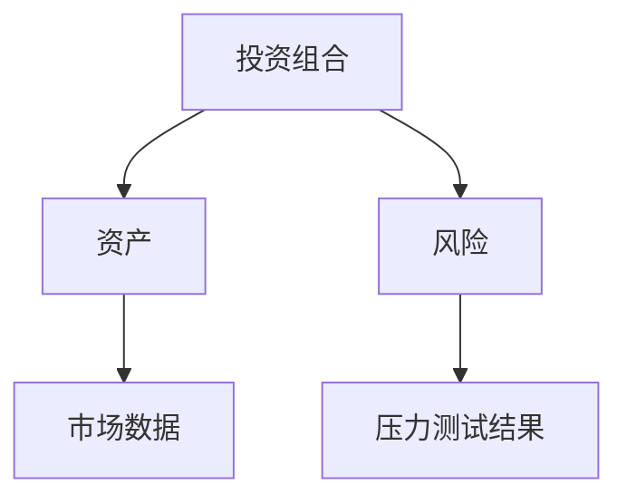
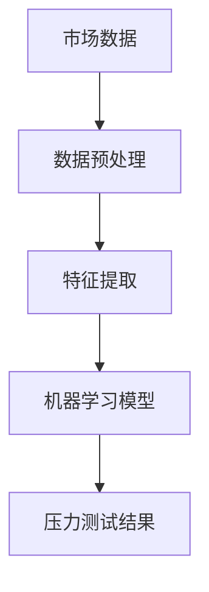
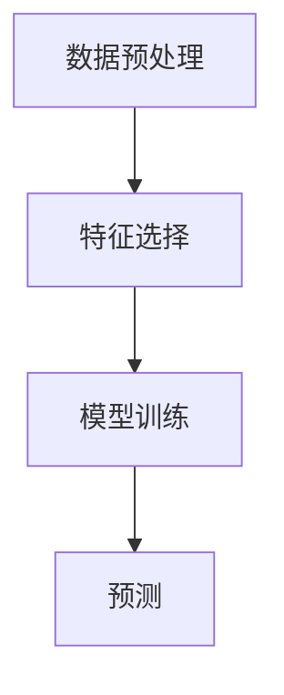
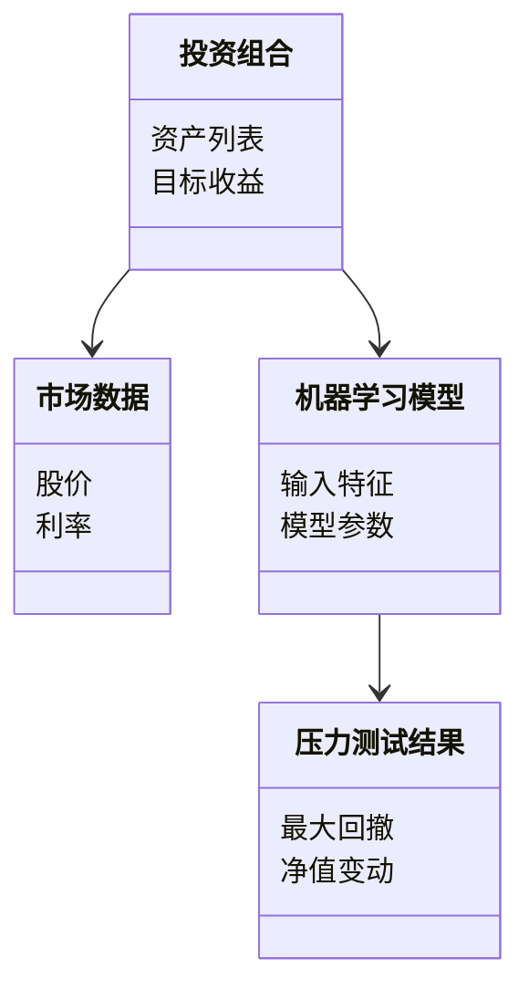
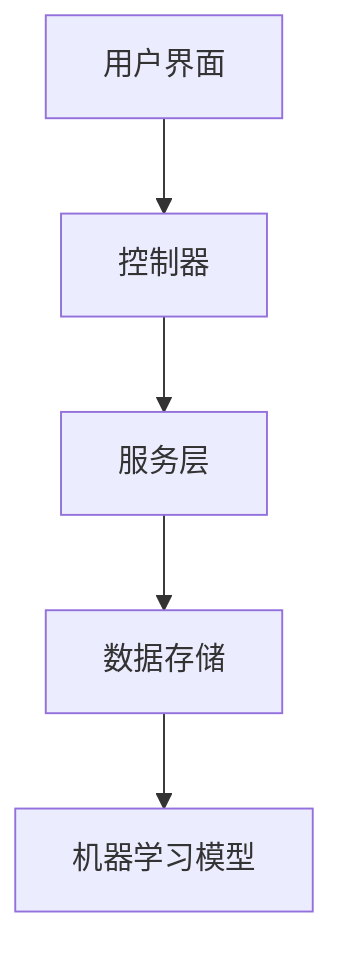
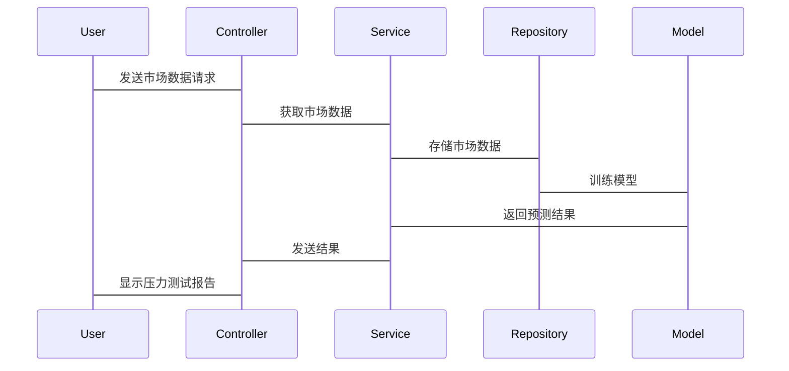

                 


# 机器学习优化投资组合压力测试

---

## 关键词：  
机器学习，投资组合，压力测试，风险评估，金融建模

---

## 摘要：  
本文探讨如何利用机器学习技术优化投资组合的压力测试。传统压力测试依赖于历史数据和情景分析，而机器学习通过分析海量数据和复杂模式，提供更精准的风险评估和优化策略。文章从背景、核心概念、算法原理到系统设计和项目实战，全面解析机器学习在压力测试中的应用，帮助读者掌握如何构建高效的投资组合优化系统。

---

# 第一部分：背景介绍

## 第1章：问题背景

### 1.1 投资组合压力测试的重要性  
投资组合压力测试用于评估在极端市场条件下，投资组合的损失承受能力。传统的压力测试方法依赖于历史数据和假设情景，存在局限性，如忽略复杂市场动态和非线性关系。  

### 1.2 传统压力测试的局限性  
- 假设情景的局限性：依赖历史数据，可能无法涵盖所有极端情况。  
- 数据驱动不足：传统方法依赖于主观假设，可能导致结果偏差。  
- 计算复杂度：随着资产数量增加，传统方法的计算复杂度急剧上升。  

### 1.3 机器学习的优势  
机器学习能够处理海量数据，发现传统方法难以捕捉的非线性关系和隐含模式。通过实时数据分析，机器学习可以提供动态压力测试结果，提升投资组合的鲁棒性。  

---

## 第2章：问题描述

### 2.1 投资组合风险的多维度性  
投资组合风险受到市场波动、资产相关性、经济周期等多种因素影响。传统方法难以同时考虑所有变量，而机器学习能够处理高维数据。  

### 2.2 机器学习在压力测试中的应用  
- **情景生成**：利用机器学习生成多种极端市场情景。  
- **风险预测**：基于历史数据和市场信号，预测潜在风险。  
- **优化策略**：根据预测结果，动态调整投资组合以降低风险。  

### 2.3 问题解决方法  
结合机器学习算法和投资组合优化理论，构建一个实时、动态的压力测试系统。  

---

# 第二部分：核心概念与联系

## 第3章：核心概念原理

### 3.1 机器学习原理  
- **监督学习**：基于标签数据进行预测，如线性回归用于回归问题。  
- **无监督学习**：发现数据中的隐藏结构，如聚类分析。  
- **强化学习**：通过试错优化策略，适合动态环境下的投资组合管理。  

### 3.2 投资组合优化原理  
- **均值-方差优化**：最小化风险（方差）同时最大化收益。  
- **现代投资组合理论**：考虑资产之间的相关性，构建最优组合。  

### 3.3 压力测试原理  
- **情景分析**：设计极端市场情景，评估投资组合在这些情景下的表现。  
- **历史模拟法**：基于历史数据模拟极端情况。  
- **方差协方差矩阵**：衡量资产之间的相关性及其波动性。  

### 3.4 核心概念对比  
| 概念          | 机器学习                | 传统压力测试            |
|---------------|-------------------------|--------------------------|
| 数据依赖      | 高度依赖大数据           | 依赖历史数据和假设情景    |
| 计算复杂度     | 低，利用并行计算          | 高，尤其在多资产情况下     |
| 模型可解释性   | 低，尤其是复杂模型        | 高，基于明确的假设情景      |
| 应用场景       | 动态、实时                | 静态、定期                |

---

## 第4章：核心概念的关系

### 4.1 ER实体关系图  


### 4.2 数据流图  


---

# 第三部分：算法原理讲解

## 第4章：机器学习算法原理

### 4.1 算法原理  
- **线性回归**：用于预测资产回报率，简单但线性假设可能限制其应用。  
- **随机森林**：基于决策树的集成方法，适合处理高维数据和非线性关系。  
- **神经网络**：通过多层网络结构捕捉复杂模式，适合处理非线性问题。  

### 4.2 算法流程图  


### 4.3 算法实现  
#### 线性回归示例  
```python
import numpy as np
from sklearn.linear_model import LinearRegression

# 示例数据
X = np.array([[1], [2], [3], [4]])
y = np.array([2, 4, 6, 8])

# 模型训练
model = LinearRegression()
model.fit(X, y)

# 预测
print(model.predict([[5]]))  # 输出：[[10]]
```

#### 随机森林示例  
```python
from sklearn.ensemble import RandomForestRegressor

# 示例数据
X = [[1], [2], [3], [4]]
y = [2, 4, 6, 8]

# 模型训练
model = RandomForestRegressor(n_estimators=100)
model.fit(X, y)

# 预测
print(model.predict([[5]]))  # 输出：[10]
```

---

## 第5章：数学模型与公式

### 5.1 线性回归模型  
$$ y = \beta_0 + \beta_1 x + \epsilon $$  

### 5.2 随机森林模型  
$$ y = \sum_{i=1}^{n} \text{Tree}(x_i) $$  

### 5.3 神经网络模型  
$$ z = \sigma(wx + b) $$  
其中，σ 表示激活函数，如ReLU或sigmoid。  

---

# 第四部分：系统分析与架构设计

## 第6章：系统架构

### 6.1 领域模型  


### 6.2 系统架构图  


---

## 第7章：系统设计

### 7.1 功能需求  
- 数据采集：从金融市场获取实时数据。  
- 特征工程：构建适合机器学习的特征。  
- 模型训练：训练压力测试模型。  
- 结果分析：生成压力测试报告。  

### 7.2 系统接口设计  
- **输入接口**：接收市场数据和用户指令。  
- **输出接口**：生成压力测试结果和报告。  

### 7.3 交互流程图  


---

# 第五部分：项目实战

## 第8章：项目实现

### 8.1 环境配置  
```bash
pip install numpy pandas scikit-learn
```

### 8.2 核心代码  
```python
import pandas as pd
from sklearn.ensemble import RandomForestRegressor

# 数据加载
data = pd.read_csv('market_data.csv')

# 特征选择
features = ['open', 'high', 'low', 'volume']
target = 'close'

# 数据分割
X = data[features]
y = data[target]

# 模型训练
model = RandomForestRegressor(n_estimators=100)
model.fit(X, y)

# 预测
new_data = pd.read_csv('new_market_data.csv')
predictions = model.predict(new_data[features])

# 结果分析
print("预测结果：", predictions)
```

---

## 第9章：结果分析

### 9.1 案例分析  
通过实际市场数据，展示模型预测的准确性。例如，预测某投资组合在极端市场条件下的表现。  

### 9.2 模型调优  
通过网格搜索优化模型参数，提升预测精度。  

### 9.3 可视化展示  
使用 matplotlib 可视化压力测试结果，帮助理解模型表现。  

---

## 第10章：最佳实践与小结

### 10.1 最佳实践  
- 数据预处理：确保数据质量，处理缺失值和异常值。  
- 特征工程：选择有意义的特征，避免维度灾难。  
- 模型选择：根据数据特性选择合适的算法。  

### 10.2 小结  
机器学习为投资组合压力测试提供了新的思路和方法，通过实时数据分析和复杂模式识别，能够更准确地评估和管理投资风险。  

---

## 第11章：注意事项与拓展

### 11.1 注意事项  
- 数据质量和数量直接影响模型性能。  
- 模型的可解释性在金融领域尤为重要。  
- 需要考虑模型的实时性和计算效率。  

### 11.2 拓展阅读  
- 《机器学习实战》  
- 《投资学原理》  

---

## 作者：AI天才研究院 & 禅与计算机程序设计艺术

