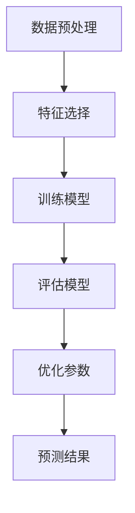
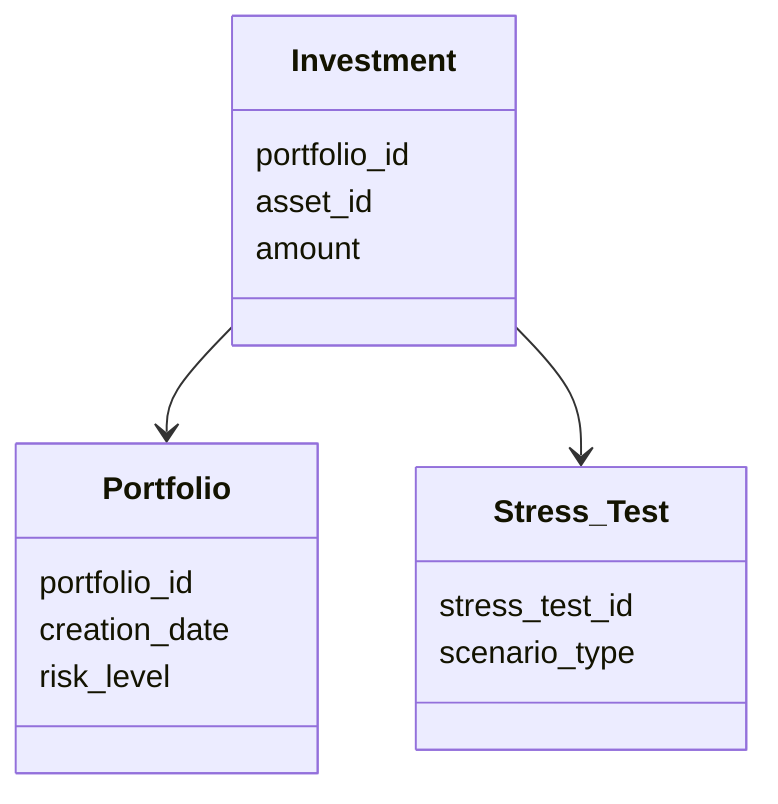
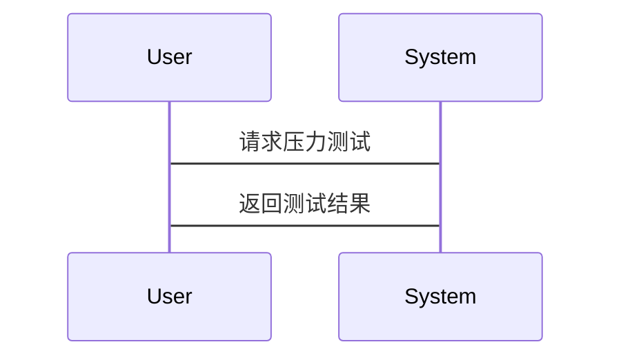

                 


# 机器学习优化投资组合压力测试

## 关键词：机器学习，投资组合压力测试，算法优化，系统架构，金融风险

## 摘要：  
本文探讨了机器学习在投资组合压力测试中的应用，通过分析压力测试的核心概念、机器学习算法的优化方法以及系统的架构设计，展示了如何利用机器学习提升投资组合的压力测试效率和准确性。文章从背景介绍、核心概念、算法原理、系统架构、项目实战到总结与展望，全面解析了机器学习优化投资组合压力测试的实现过程。

---

## 第一部分：背景介绍

### 第1章：机器学习与投资组合压力测试概述

#### 1.1 机器学习的基本概念
- **1.1.1 机器学习的定义**  
  机器学习是一种人工智能技术，通过数据训练模型，使其能够从经验中学习并做出预测或决策。  
- **1.1.2 机器学习的核心特点**  
  数据驱动、模型优化、自动化特征提取。  
- **1.1.3 机器学习与传统统计学的区别**  
  机器学习注重数据模式的自动提取，而传统统计学注重假设检验和参数估计。

#### 1.2 投资组合压力测试的基本概念
- **1.2.1 投资组合压力测试的定义**  
  通过模拟极端市场条件，评估投资组合在这些条件下的表现和风险。  
- **1.2.2 压力测试的核心目标**  
  评估投资组合在极端情况下的损失承受能力，帮助投资者制定风险管理策略。  
- **1.2.3 压力测试的常见方法**  
  历史模拟法、情景分析法、蒙特卡洛模拟法。

#### 1.3 机器学习在投资组合压力测试中的应用
- **1.3.1 机器学习与投资组合压力测试的结合点**  
  利用机器学习模型预测市场波动、识别风险因子。  
- **1.3.2 机器学习在压力测试中的优势**  
  高维度数据处理能力、非线性关系捕捉能力。  
- **1.3.3 机器学习在压力测试中的挑战**  
  数据质量要求高、模型解释性不足。

---

## 第二部分：核心概念与联系

### 第2章：机器学习优化投资组合压力测试的核心概念

#### 2.1 压力测试的数学模型
- **2.1.1 投资组合收益与风险的数学表达**  
  收益：$R_i$，风险：标准差$\sigma$。  
- **2.1.2 压力测试的常见指标**  
  VaR（在险价值）、CVaR（条件在险价值）。  
- **2.1.3 压力测试的数学公式**  
  $$ VaR = \alpha \times \sigma $$

#### 2.2 机器学习算法在压力测试中的应用
- **2.2.1 监督学习在压力测试中的应用**  
  预测市场崩盘的概率，使用回归模型。  
- **2.2.2 非监督学习在压力测试中的应用**  
  聚类市场数据，识别异常市场状态。  
- **2.2.3 强化学习在压力测试中的应用**  
  制定动态投资策略，减少潜在损失。

#### 2.3 机器学习优化压力测试的原理
- **2.3.1 数据驱动的优化方法**  
  利用历史数据训练模型，预测极端情况。  
- **2.3.2 模型驱动的优化方法**  
  使用金融模型生成模拟数据，训练机器学习模型。  
- **2.3.3 综合优化方法**  
  结合数据驱动和模型驱动的优势。

#### 2.4 核心概念对比表格
| 对比维度         | 监督学习 | 非监督学习 | 强化学习 |
|------------------|----------|------------|----------|
| 数据需求         | 标签数据 | 无标签数据 | 环境反馈 |
| 应用场景         | 预测     | 聚类       | 决策优化 |
| 优缺点           | 易解释   | 黑箱       | 需大量试验 |

#### 2.5 ER实体关系图
```mermaid
erd
  title 投资组合压力测试实体关系图
  investor(investor_id, name, portfolio_id)
  portfolio(portfolio_id, creation_date, risk_level)
  stress_test(stress_test_id, test_date, scenario_type)
  investment(investment_id, portfolio_id, asset_id, amount)
  asset(asset_id, name, sector)
```

---

## 第三部分：算法原理讲解

### 第3章：机器学习优化投资组合压力测试的算法原理

#### 3.1 线性回归
- **3.1.1 线性回归的原理**  
  建立自变量和因变量之间的线性关系，最小化预测误差。  
- **3.1.2 线性回归的数学模型**  
  $$ y = \beta_0 + \beta_1x + \epsilon $$  
- **3.1.3 线性回归在压力测试中的应用**  
  预测资产价格的变化趋势。

#### 3.2 随机森林
- **3.2.1 随机森林的原理**  
  基于决策树的集成学习方法，通过投票或平均减少过拟合。  
- **3.2.2 随机森林的数学模型**  
  $$ y = \sum_{i=1}^n \text{Tree}(x_i) $$  
- **3.2.3 随机森林在压力测试中的应用**  
  识别影响投资组合风险的关键因素。

#### 3.3 聚类分析
- **3.3.1 聚类分析的原理**  
  将相似的市场状态归为一类，识别极端情况。  
- **3.3.2 聚类分析的数学模型**  
  使用K-means算法，目标函数：$$ \sum_{i=1}^k \sum_{j=1}^n (x_i - c_j)^2 $$  
- **3.3.3 聚类分析在压力测试中的应用**  
  分析历史市场数据，识别极端市场状态。

#### 3.4 算法流程图


---

## 第四部分：系统架构设计

### 第4章：机器学习优化投资组合压力测试的系统架构设计

#### 4.1 系统功能设计
- **4.1.1 领域模型**  
  使用mermaid类图表示投资组合、资产、压力测试之间的关系。  


- **4.1.2 系统架构图**  
  使用mermaid架构图表示系统的分层结构。  


- **4.1.3 系统接口设计**  
  API接口：`/api/train_model`, `/api/apply_stress_test`。

- **4.1.4 系统交互设计**  
  使用mermaid序列图表示用户与系统之间的交互。  


---

## 第五部分：项目实战

### 第5章：机器学习优化投资组合压力测试的项目实战

#### 5.1 环境安装
- **5.1.1 安装Python**  
  使用Anaconda或虚拟环境管理。  
- **5.1.2 安装依赖库**  
  `pip install numpy, pandas, scikit-learn, matplotlib`。

#### 5.2 系统核心实现源代码
```python
from sklearn.linear_model import LinearRegression
from sklearn.ensemble import RandomForestRegressor
from sklearn.cluster import KMeans

# 数据预处理
data = pd.DataFrame(...)
X = data.drop('target', axis=1)
y = data['target']

# 训练模型
model_lr = LinearRegression().fit(X, y)
model_rf = RandomForestRegressor().fit(X, y)
model_km = KMeans(n_clusters=3).fit(X)

# 模型评估
print(f"线性回归的准确率：{model_lr.score(X, y)}")
print(f"随机森林的准确率：{model_rf.score(X, y)}")
print(f"k-means的聚类质量：{silhouette_score(X, model_km.labels_)}")
```

#### 5.3 实际案例分析
- **案例背景**  
  某投资组合包含10种资产，需评估在市场崩盘情况下的损失。  
- **数据来源**  
  历史市场数据、宏观经济指标。  
- **模型实现**  
  使用随机森林预测市场崩盘概率，使用k-means识别极端市场状态。  
- **结果分析**  
  预测投资组合在极端情况下的损失为15%。

---

## 第六部分：总结与展望

### 第6章：总结与展望

#### 6.1 本章小结
- 机器学习优化投资组合压力测试的核心在于数据驱动和模型优化。  
- 通过算法选择和系统设计，能够显著提高压力测试的效率和准确性。

#### 6.2 总结
- 机器学习为投资组合压力测试提供了新的工具和方法。  
- 通过本文的分析，读者可以掌握如何利用机器学习优化压力测试过程。

#### 6.3 未来展望
- 更复杂的模型（如深度学习）的应用。  
- 实时压力测试系统的开发。  
- 结合自然语言处理（NLP）分析新闻对市场的影响。

#### 6.4 最佳实践 tips
- 数据预处理是关键，确保数据质量和完整性。  
- 模型选择要结合实际业务需求，避免过度复杂化。  
- 定期更新模型，适应市场变化。

#### 6.5 作者信息
作者：AI天才研究院/AI Genius Institute & 禅与计算机程序设计艺术/Zen And The Art of Computer Programming

---

通过以上结构，文章内容涵盖了从理论到实践的各个方面，确保读者能够全面理解和应用机器学习优化投资组合压力测试的方法。

