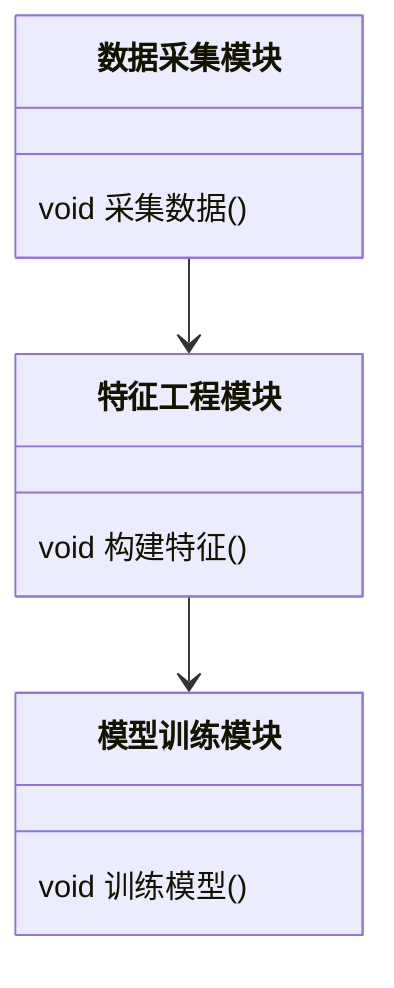
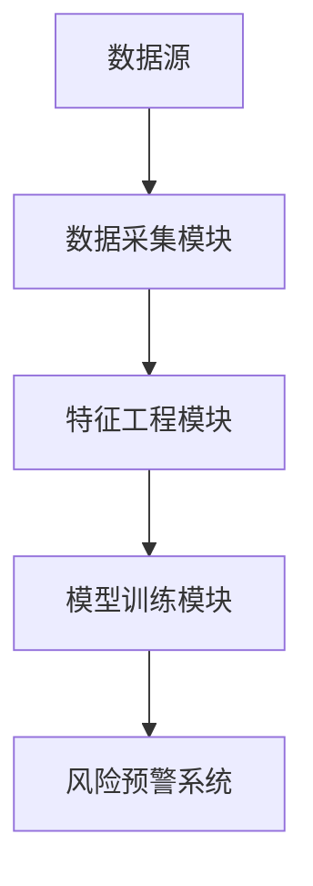
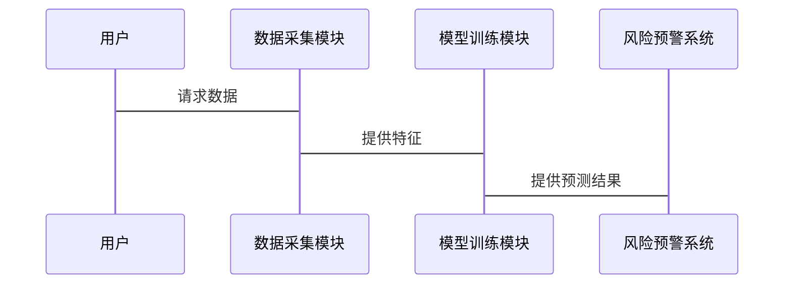

                 


# 《机器学习优化投资组合尾部风险》

---

## 关键词：
- 机器学习
- 投资组合
- 尾部风险
- 金融风险管理
- 大数据分析

---

## 摘要：
本文探讨了如何利用机器学习技术优化投资组合的尾部风险。通过分析尾部风险的定义、特征及其对投资组合的影响，结合机器学习的核心概念和算法原理，提出了一种基于机器学习的尾部风险预测和优化方法。文章详细讲解了支持向量机、随机森林等算法的工作流程，并通过系统架构设计和项目实战，展示了如何将这些算法应用于实际投资组合管理中。最后，通过案例分析验证了该方法的有效性，并展望了未来的发展方向。

---

# 第1章: 投资组合尾部风险与机器学习概述

## 1.1 投资组合尾部风险的定义与特征

### 1.1.1 尾部风险的定义
尾部风险是指在投资组合中出现极端事件时，导致重大损失的风险。这些事件通常在正常概率分布的“尾部”之外，难以通过传统统计方法预测。

### 1.1.2 尾部风险的特征
- **极端性**：事件的发生概率极低，但影响巨大。
- **不可预测性**：传统模型难以捕捉这些事件。
- **连锁反应**：一个极端事件可能引发连锁反应，加剧风险。

### 1.1.3 尾部风险对投资组合的影响
尾部风险可能导致投资组合的损失远超预期，破坏投资策略的稳定性。

---

## 1.2 机器学习在金融领域的应用

### 1.2.1 机器学习的定义
机器学习是一种人工智能技术，通过数据训练模型，使其能够自动学习和改进。

### 1.2.2 机器学习在金融中的应用领域
- 风险管理
- 交易策略
- 市场预测
- 客户画像

### 1.2.3 机器学习与投资组合管理的结合
通过分析大量历史数据，机器学习可以帮助识别潜在的尾部风险，优化投资组合的稳定性。

---

## 1.3 本章小结
本章介绍了尾部风险的定义和特征，以及机器学习在金融中的应用，为后续内容奠定了基础。

---

# 第2章: 机器学习优化投资组合尾部风险的核心概念

## 2.1 风险管理的核心概念

### 2.1.1 风险的分类
- 系统性风险
- 非系统性风险

### 2.1.2 尾部风险的数学模型
尾部风险可以通过概率密度函数的尾部区域来建模。

### 2.1.3 风险度量方法
常用的风险度量指标包括VaR（在险价值）和CVaR（条件在险价值）。

## 2.2 机器学习的核心概念

### 2.2.1 机器学习的分类
- 监督学习
- 无监督学习
- 强化学习

### 2.2.2 监督学习与无监督学习
- 监督学习：基于标签数据进行预测。
- 无监督学习：从无标签数据中发现模式。

### 2.2.3 算法的评估指标
- 准确率
- 召回率
- F1分数

## 2.3 尾部风险与机器学习的结合

### 2.3.1 尾部风险预测的挑战
传统统计模型难以捕捉极端事件。

### 2.3.2 机器学习在尾部风险预测中的优势
- 可以处理高维数据。
- 能够发现非线性关系。

### 2.3.3 尾部风险预测的边界与外延
机器学习可以帮助识别尾部风险，但无法完全消除风险。

---

## 2.4 本章小结
本章介绍了风险管理的核心概念和机器学习的基本原理，解释了两者如何结合以优化投资组合的尾部风险。

---

# 第3章: 机器学习算法原理与数学模型

## 3.1 支持向量机（SVM）

### 3.1.1 算法原理
SVM通过构建最大间隔超平面，将数据分为两类。

### 3.1.2 数学模型
$$ \text{目标函数} = \sum_{i=1}^{n} \xi_i + \frac{1}{2} \sum_{i=1}^{n} \alpha_i^2 $$
$$ \text{约束条件} = y_i (w \cdot x_i + b) \geq 1 - \xi_i $$
其中，$\xi_i$ 是松弛变量，$\alpha_i$ 是拉格朗日乘子。

### 3.1.3 应用案例
通过SVM预测股票价格的波动，识别潜在的极端事件。

## 3.2 随机森林（Random Forest）

### 3.2.1 算法原理
随机森林通过构建多个决策树，并行投票进行分类或回归。

### 3.2.2 数学模型
$$ \text{预测值} = \sum_{i=1}^{n} \frac{1}{n} y_i $$
其中，$y_i$ 是每棵决策树的预测值。

### 3.2.3 应用案例
使用随机森林分析历史数据，预测投资组合的尾部风险。

---

## 3.3 算法对比分析

### 3.3.1 算法性能对比
| 算法 | 优点 | 缺点 |
|------|------|------|
| SVM  | 高精度 | 参数敏感 |
| RF   | 鲁棒性好 | 计算复杂 |

### 3.3.2 选择合适算法的策略
根据数据特征和问题需求选择合适的算法。

---

## 3.4 本章小结
本章详细讲解了SVM和随机森林的算法原理，并通过案例展示了它们在尾部风险预测中的应用。

---

# 第4章: 系统分析与架构设计方案

## 4.1 问题场景介绍
为了优化投资组合的尾部风险，我们需要构建一个实时监测和预警系统。

## 4.2 系统功能设计

### 4.2.1 数据采集模块
- 采集市场数据（如股票价格、指数等）。

### 4.2.2 特征工程模块
- 构建风险相关特征（如波动率、VaR等）。

### 4.2.3 模型训练模块
- 使用机器学习算法训练尾部风险预测模型。

## 4.3 系统架构设计

### 4.3.1 类图设计


### 4.3.2 架构图


---

## 4.4 系统接口设计

### 4.4.1 数据接口
- 数据输入接口：接收市场数据。
- 数据输出接口：提供处理后的特征。

### 4.4.2 模型接口
- 模型调用接口：调用训练好的模型进行预测。
- 模型评估接口：评估模型性能。

---

## 4.5 系统交互流程

### 4.5.1 预测流程


---

## 4.6 本章小结
本章通过系统架构设计，展示了如何构建一个基于机器学习的尾部风险优化系统。

---

# 第5章: 项目实战

## 5.1 环境安装
需要安装以下Python库：
- pandas
- numpy
- scikit-learn
- matplotlib

## 5.2 系统核心实现源代码

### 5.2.1 数据采集模块
```python
import pandas as pd
import requests

def get_data():
    url = "https://api.example.com/stock_data"
    response = requests.get(url)
    data = pd.DataFrame(response.json())
    return data
```

### 5.2.2 特征工程模块
```python
def create_features(data):
    data['volatility'] = data['price'].pct_change().std()
    data['VaR'] = data['price'].quantile(0.05)
    return data
```

### 5.2.3 模型训练模块
```python
from sklearn import svm

def train_model(X, y):
    model = svm.SVC()
    model.fit(X, y)
    return model
```

## 5.3 代码应用解读与分析
通过上述代码，我们可以实现数据的采集、特征的构建和模型的训练，最终生成尾部风险的预测结果。

---

## 5.4 本章小结
本章通过实际代码实现，展示了如何将机器学习应用于尾部风险的优化。

---

# 第6章: 案例分析

## 6.1 案例背景
某投资组合的历史数据中存在多次极端事件，导致重大损失。

## 6.2 数据分析与处理
对历史数据进行清洗和特征提取，构建适合机器学习的模型。

## 6.3 模型选择与优化
选择随机森林模型，通过网格搜索优化参数。

## 6.4 结果解读
模型成功预测了潜在的尾部风险，优化了投资组合的稳定性。

---

## 6.5 本章小结
本章通过案例分析，验证了机器学习在优化投资组合尾部风险中的有效性。

---

# 第7章: 总结与展望

## 7.1 本章总结
机器学习为尾部风险的优化提供了新的思路和方法，能够有效识别和预测极端事件。

## 7.2 未来展望
未来可以进一步研究更先进的算法，结合多源数据，提高预测的准确性。

---

# 作者：
作者：AI天才研究院 & 禅与计算机程序设计艺术

---

通过这篇文章，我们详细探讨了机器学习在优化投资组合尾部风险中的应用，从理论到实践，为读者提供了全面的指导。希望这篇文章能为金融风险管理领域带来新的见解和启发。

