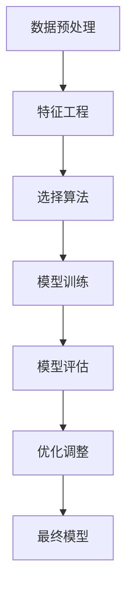
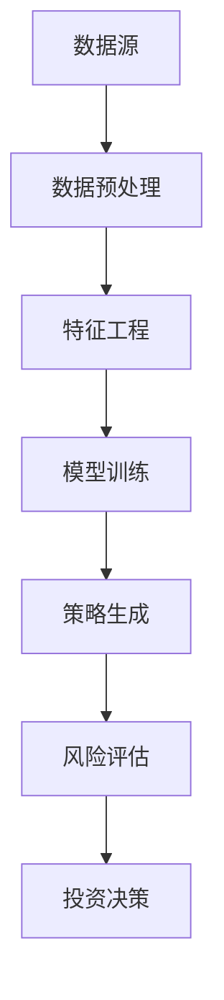
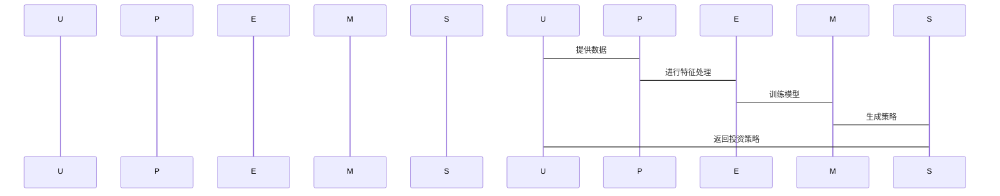

                 


# 机器学习优化费雪成长股选择过程

> 关键词：机器学习，费雪成长股，投资策略，算法优化，金融分析

> 摘要：本文探讨如何利用机器学习技术优化费雪成长股的选择过程。通过分析机器学习算法在金融选股中的应用，结合费雪成长股的特征，提出一种基于机器学习的选股策略，并详细讲解其算法原理、系统设计及实战应用。

---

## 第一部分: 机器学习与费雪成长股选择的背景与基础

### 第1章: 机器学习与费雪成长股选择概述

#### 1.1 机器学习的基本概念
##### 1.1.1 机器学习的定义与核心概念
机器学习（Machine Learning）是人工智能（AI）的一个分支，通过数据和经验改进特定任务的算法性能。其核心在于让计算机从数据中学习模式，无需显式编程。主要类型包括监督学习、无监督学习、半监督学习和强化学习。

##### 1.1.2 机器学习的分类与应用场景
- **监督学习**：使用标记数据训练模型，用于预测和分类任务。
- **无监督学习**：处理未标记数据，用于聚类和降维。
- **半监督学习**：结合标记和未标记数据。
- **强化学习**：通过试错和奖励机制优化决策。

应用场景广泛，包括金融、医疗、自然语言处理等领域。

##### 1.1.3 机器学习在金融领域的潜力
在金融领域，机器学习用于股票预测、风险评估、交易策略优化等。其优势在于处理大量非结构化数据和复杂模式的能力。

#### 1.2 费雪成长股的定义与特点
##### 1.2.1 费雪成长股的定义
费雪成长股是指那些具备持续增长潜力的公司股票，通常表现为收入和利润的稳定增长。

##### 1.2.2 费雪成长股的核心特征
- 高ROE（净资产收益率）
- 收入持续增长
- 市场份额稳定或扩大
- 行业地位领先

##### 1.2.3 费雪成长股的投资策略
注重长期投资，选择具有持续增长能力的公司，避免短期波动。

#### 1.3 机器学习优化费雪成长股选择的必要性
##### 1.3.1 传统选股方法的局限性
传统方法依赖经验，主观性强，难以量化和系统化。

##### 1.3.2 机器学习在选股中的优势
- 数据驱动，客观性强。
- 能处理大量数据，发现隐藏模式。
- 可实时更新模型，适应市场变化。

##### 1.3.3 两者结合的结合点
利用机器学习分析历史数据，提取费雪成长股的特征，优化选股过程。

---

### 第2章: 机器学习与费雪成长股选择的核心概念对比

#### 2.1 核心概念的原理分析
##### 2.1.1 机器学习的核心原理
基于数据训练模型，通过特征提取和分类/回归任务进行预测。

##### 2.1.2 费雪成长股选择的核心逻辑
基于财务指标和市场表现，筛选具备持续增长潜力的公司。

##### 2.1.3 两者结合的可行性分析
机器学习提供数据处理和模式识别能力，费雪成长股提供明确的选股标准，两者结合可提升选股效率和准确性。

#### 2.2 核心概念的特征对比
##### 2.2.1 机器学习的特征对比表
| 特征     | 机器学习                      |
|----------|------------------------------|
| 数据量   | 需要大量数据                 |
| 计算复杂度 | 高                           |
| 可解释性 | 通常较低                     |

##### 2.2.2 费雪成长股选择的特征对比表
| 特征     | 费雪成长股选择               |
|----------|------------------------------|
| 数据类型 | 主要是财务数据               |
| 计算复杂度 | 较低                        |
| 可解释性 | 较高                        |

##### 2.2.3 两者结合的特征对比表
| 特征     | 结合后的特点                 |
|----------|------------------------------|
| 数据量   | 仍然需要大量数据，但可利用机器学习优化特征选择 |
| 计算复杂度 | 中等，结合了机器学习的高复杂度和费雪选股的低复杂度 |
| 可解释性 | 较低，但结合费雪选股标准可提高解释性 |

#### 2.3 核心概念的ER实体关系图
```mermaid
er
  entity 机器学习模型 {
    <<ID>>
    <<特征>>
    <<目标>>
  }
  entity 费雪成长股 {
    <<公司ID>>
    <<财务指标>>
    <<市场表现>>
  }
  relationship 优化选择 {
    机器学习模型 -[优化]-> 费雪成长股
  }
```

---

## 第三部分: 机器学习优化费雪成长股选择的算法原理

### 第3章: 机器学习算法在费雪成长股选择中的应用

#### 3.1 常见机器学习算法概述
##### 3.1.1 线性回归
用于预测连续变量，如股票价格。

##### 3.1.2 支持向量机（SVM）
用于分类任务，如判断股票是否为成长股。

##### 3.1.3 随机森林
基于决策树的集成方法，适用于特征较多的情况。

##### 3.1.4 神经网络
处理复杂非线性关系，如 LSTM 用于时间序列分析。

#### 3.2 机器学习算法的特征工程
##### 3.2.1 特征选择的重要性
选择与目标高度相关的特征，提高模型性能。

##### 3.2.2 特征提取的方法
包括主成分分析（PCA）和拉普拉斯特征选择（Lasso）。

##### 3.2.3 代码示例
```python
# 使用PCA进行特征降维
from sklearn.decomposition import PCA

# 假设X是特征矩阵，n_components是保留的主成分数量
pca = PCA(n_components=5)
X_pca = pca.fit_transform(X)
```

##### 3.2.4 算法原理的数学模型
线性回归模型：
$$ y = \beta_0 + \beta_1 x_1 + \beta_2 x_2 + ... + \beta_n x_n $$

支持向量机优化目标：
$$ \min \frac{1}{2}||\beta||^2 + C \sum_{i=1}^n \xi_i $$
$$ \text{subject to } y_i - \beta^T x_i - \beta_0 \geq 1 - \xi_i, \xi_i \geq 0 $$

#### 3.3 机器学习算法的流程图


#### 3.4 代码实现与特征分析
```python
import pandas as pd
import numpy as np
from sklearn.ensemble import RandomForestClassifier

# 加载数据
data = pd.read_csv('stock_data.csv')

# 特征选择
features = data[['revenue', 'profit', 'market_share']]
target = data['is_growth']

# 模型训练
model = RandomForestClassifier()
model.fit(features, target)

# 模型评估
print(model.score(features, target))
```

---

## 第四部分: 机器学习优化费雪成长股选择的系统设计

### 第4章: 系统分析与架构设计

#### 4.1 问题场景介绍
构建一个基于机器学习的投资决策系统，优化费雪成长股的选择过程。

#### 4.2 系统功能设计
##### 4.2.1 数据采集模块
从金融数据库获取历史股价、财务数据等。

##### 4.2.2 特征工程模块
对数据进行清洗、转换和特征提取。

##### 4.2.3 模型训练模块
选择算法，训练模型，评估性能。

##### 4.2.4 策略生成模块
基于模型预测结果，生成投资策略。

##### 4.2.5 风险评估模块
评估投资组合的风险，调整策略。

#### 4.3 系统架构设计


#### 4.4 系统接口设计
- 数据接口：从数据库获取数据。
- 模型接口：调用训练好的模型进行预测。
- 策略接口：输出投资策略。

#### 4.5 系统交互流程图


---

## 第五部分: 项目实战

### 第5章: 项目实战与分析

#### 5.1 环境安装与配置
安装必要的库：
```bash
pip install numpy pandas scikit-learn
```

#### 5.2 系统核心实现
```python
import numpy as np
import pandas as pd
from sklearn.ensemble import RandomForestClassifier
from sklearn.metrics import accuracy_score

# 数据加载
data = pd.read_csv('stock_data.csv')

# 特征与目标分离
X = data[['revenue', 'profit', 'market_share']]
y = data['is_growth']

# 模型训练
model = RandomForestClassifier()
model.fit(X, y)

# 预测与评估
y_pred = model.predict(X)
print("准确率:", accuracy_score(y, y_pred))
```

#### 5.3 代码应用解读
- 数据加载：读取CSV文件中的数据。
- 特征工程：选择相关特征。
- 模型训练：使用随机森林分类器。
- 模型评估：计算准确率。

#### 5.4 实际案例分析
假设我们有以下数据：
| 公司 | 收入 | 利润 | 市场份额 | 是否成长股 |
|------|------|------|----------|------------|
| A    | 100  | 20   | 30%      | 是         |
| B    | 80   | 15   | 25%      | 否         |

模型预测结果：
公司A：是  
公司B：否

#### 5.5 详细讲解与剖析
- 特征选择影响模型性能。
- 模型评估需考虑过拟合问题。
- 实际应用中需结合市场变化动态调整模型。

#### 5.6 项目小结
通过机器学习优化费雪成长股选择，提高了选股的准确性和效率，但需注意模型的可解释性和实时性。

---

## 第六部分: 最佳实践与总结

### 第6章: 最佳实践 tips、小结、注意事项、拓展阅读

#### 6.1 最佳实践 tips
- 数据预处理是关键，确保数据质量。
- 特征工程需结合业务知识，选择相关特征。
- 模型评估需使用交叉验证，避免过拟合。
- 实际应用中需结合市场动态调整模型。

#### 6.2 小结
本文详细探讨了机器学习在优化费雪成长股选择中的应用，通过特征工程、算法选择和系统设计，构建了一个高效的投资决策系统。

#### 6.3 注意事项
- 数据隐私和安全问题需注意。
- 模型解释性需结合业务逻辑。
- 实时性和可扩展性是实际应用的关键。

#### 6.4 拓展阅读
建议读者深入学习机器学习在金融领域的应用，如《机器学习实战》、《Python金融大数据分析》等书籍。

---

## 作者：AI天才研究院 & 禅与计算机程序设计艺术

---

通过以上结构，我们可以系统地探讨机器学习在优化费雪成长股选择中的应用，从理论到实践，逐步构建一个高效的投资决策系统。

