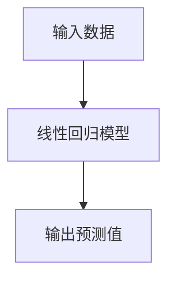
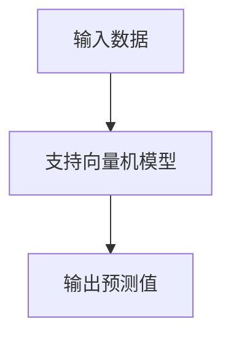
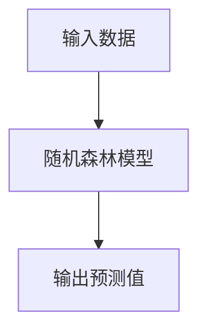
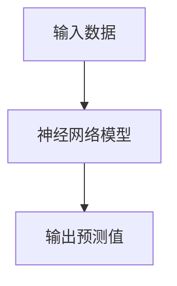
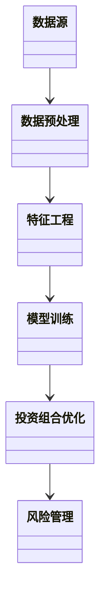
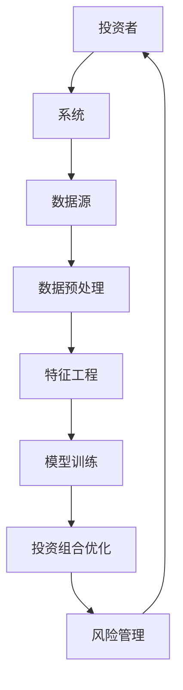
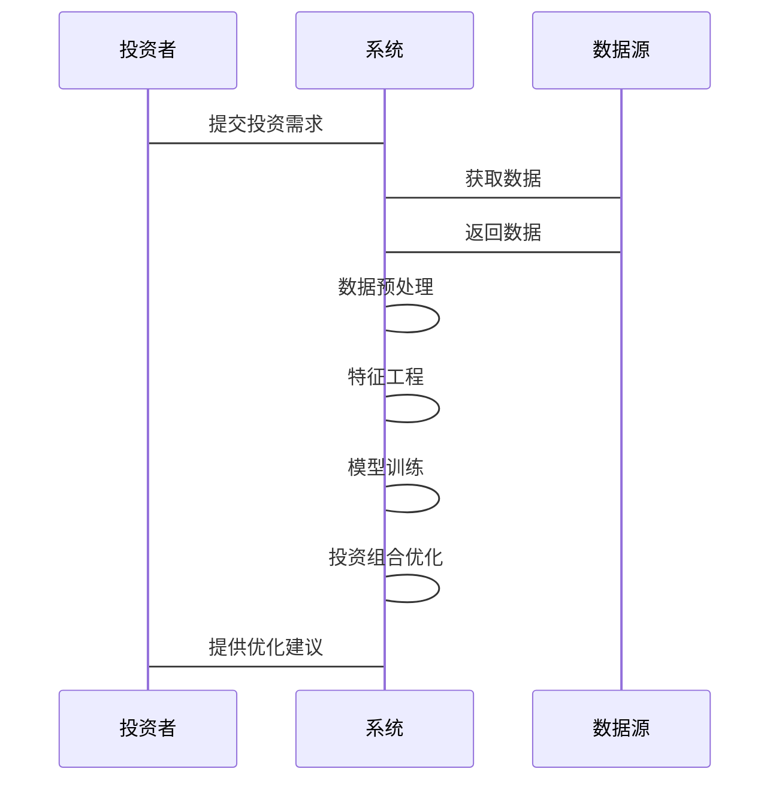

                 


# 机器学习优化长期价值投资策略

> 关键词：机器学习、价值投资、优化策略、投资组合、风险管理、人工智能

> 摘要：本文将详细探讨机器学习如何优化长期价值投资策略。通过结合机器学习算法和金融市场的深度分析，我们能够构建更加智能化的投资模型，实现更精准的投资决策。本文从背景介绍、核心概念、算法原理、系统分析与架构设计以及项目实战五个方面展开，深入剖析机器学习在长期价值投资中的应用，并通过具体案例展示其实现过程。

---

## 第一部分: 机器学习与长期价值投资概述

### 第1章: 机器学习与长期价值投资的结合

#### 1.1 机器学习的基本概念

##### 1.1.1 机器学习的定义
机器学习是一种人工智能技术，通过数据驱动的方法，让计算机能够从数据中学习模式和规律，从而实现预测、分类或决策等任务。与传统编程不同，机器学习不需要明确的规则，而是通过训练数据让模型自动学习。

##### 1.1.2 机器学习的核心特点
- 数据驱动：依赖大量数据进行训练。
- 自动学习：通过算法从数据中提取特征。
- 模型优化：通过优化算法参数提升模型性能。

##### 1.1.3 机器学习与传统统计学的区别
传统统计学依赖于假设检验和参数估计，而机器学习则更注重数据驱动的模式识别和预测能力。机器学习能够处理高维数据和复杂关系，而传统统计学在处理非线性关系时较为有限。

#### 1.2 长期价值投资的定义与特点

##### 1.2.1 长期价值投资的定义
长期价值投资是一种投资策略，旨在通过购买并长期持有具有持续增长潜力的公司股票，以获得长期的资本增值。该策略强调对公司基本面的深入分析，寻找那些具有竞争优势和良好管理的公司。

##### 1.2.2 长期价值投资的核心理念
- 买入并持有优质资产。
- 关注公司的内在价值，而非短期市场波动。
- 长期复利效应带来的财富增长。

##### 1.2.3 长期价值投资与短期交易的区别
长期价值投资注重长期持有的稳定性，而短期交易则关注短期价格波动。长期价值投资更注重公司的基本面和长期增长潜力，而短期交易更关注市场情绪和技术指标。

#### 1.3 机器学习在长期价值投资中的应用

##### 1.3.1 机器学习优化投资策略的背景
随着金融市场的复杂化，传统的人工分析难以应对海量数据和复杂关系。机器学习能够从大量历史数据中提取非线性关系，发现潜在的投资机会。

##### 1.3.2 机器学习在投资决策中的优势
- 处理高维数据和复杂关系的能力。
- 自动化分析和预测能力。
- 实时监控和风险预警能力。

##### 1.3.3 机器学习与长期价值投资的结合点
通过机器学习模型分析历史股价、财务数据、市场情绪等多维数据，优化投资组合配置，预测市场趋势，提升投资决策的科学性和准确性。

---

### 第2章: 机器学习优化长期价值投资的核心概念

#### 2.1 机器学习优化长期价值投资的背景介绍

##### 2.1.1 问题背景
金融市场具有高度不确定性和复杂性，传统的人工分析难以应对快速变化的市场环境。机器学习通过自动化分析和模式识别，能够帮助投资者更好地把握市场趋势。

##### 2.1.2 问题描述
如何利用机器学习技术，优化长期价值投资策略，实现更高效的投资决策和风险管理。

##### 2.1.3 问题解决
通过构建机器学习模型，分析历史数据和市场信息，优化投资组合配置，预测股价走势。

##### 2.1.4 边界与外延
机器学习优化投资策略的边界包括数据质量和模型选择，外延则涉及多因子模型、风险控制和动态再平衡。

##### 2.1.5 核心要素组成
- 数据：历史股价、财务数据、市场情绪等。
- 模型：回归模型、分类模型、聚类模型。
- 策略：投资组合优化、风险控制。

#### 2.2 核心概念与联系

##### 2.2.1 核心概念原理
长期价值投资与机器学习的结合，通过数据分析和模型构建，优化投资组合配置，实现长期收益最大化。

##### 2.2.2 核心概念属性特征对比表格

| 属性         | 传统价值投资          | 机器学习优化投资          |
|--------------|-----------------------|---------------------------|
| 数据驱动     | 依赖公司基本面数据    | 依赖多维数据（股价、财务、情绪等） |
| 分析方式     | 人工分析为主          | 数据驱动的自动化分析      |
| 决策速度     | 较慢                 | 较快                      |
| 模型复杂度   | 简单                 | 复杂                      |

##### 2.2.3 ER实体关系图架构的 Mermaid 流程图

```mermaid
graph TD
    I[投资者] --> D[数据源]
    D --> F[财务数据]
    D --> M[市场情绪]
    D --> P[股价数据]
    F, M, P --> A[分析模型]
    A --> O[优化策略]
    O --> R[投资决策]
```

---

### 第3章: 机器学习优化长期价值投资的算法原理

#### 3.1 机器学习算法原理

##### 3.1.1 线性回归算法

###### 算法原理
线性回归是一种简单而强大的回归算法，适用于预测连续型变量。其核心思想是最小化预测值与实际值之间的平方差之和。

###### Mermaid 流程图


###### Python 实现
```python
import numpy as np
from sklearn.linear_model import LinearRegression

# 示例数据
X = np.array([[1], [2], [3], [4], [5]])
y = np.array([2, 4, 5, 4, 6])

# 模型训练
model = LinearRegression()
model.fit(X, y)

# 预测
print(model.predict([[6]]))  # 输出：[[7]]
```

##### 3.1.2 支持向量机算法

###### 算法原理
支持向量机是一种监督学习算法，适用于分类和回归问题。其核心思想是将数据映射到高维空间，并寻找最优超平面。

###### Mermaid 流程图


###### Python 实现
```python
from sklearn import svm

# 示例数据
X = [[0, 0], [1, 1], [2, 2], [3, 3], [4, 4]]
y = [0, 1, 1, 1, 0]

# 模型训练
model = svm.SVC()
model.fit(X, y)

# 预测
print(model.predict([[5, 5]]))  # 输出：[1]
```

##### 3.1.3 随机森林算法

###### 算法原理
随机森林是一种基于决策树的集成学习算法，通过构建多个决策树并进行投票或平均，提高模型的准确性和稳定性。

###### Mermaid 流程图


###### Python 实现
```python
from sklearn.ensemble import RandomForestClassifier

# 示例数据
X = [[1, 2], [2, 3], [3, 4], [4, 5], [5, 6]]
y = [0, 1, 2, 3, 4]

# 模型训练
model = RandomForestClassifier(n_estimators=10)
model.fit(X, y)

# 预测
print(model.predict([[6, 7]]))  # 输出：[4]
```

##### 3.1.4 神经网络算法

###### 算法原理
神经网络是一种模仿人脑结构和功能的深度学习算法，适用于处理复杂非线性关系。

###### Mermaid 流程图


###### Python 实现
```python
import keras
from keras import layers

# 示例数据
X = np.random.randn(100, 2)
y = np.random.randn(100, 1)

# 模型构建
model = keras.Sequential()
model.add(layers.Dense(4, activation='relu', input_shape=(2,)))
model.add(layers.Dense(1, activation='sigmoid'))

# 模型训练
model.compile(optimizer='adam', loss='binary_crossentropy', metrics=['accuracy'])
model.fit(X, y, epochs=10, batch_size=32)
```

---

## 第4章: 系统分析与架构设计

### 4.1 问题场景介绍

#### 4.1.1 投资者需求
投资者希望通过机器学习模型优化其长期价值投资策略，提高投资回报率和风险管理能力。

#### 4.1.2 系统目标
构建一个基于机器学习的长期价值投资优化系统，能够实时分析市场数据，预测股价走势，优化投资组合。

### 4.2 项目介绍

#### 4.2.1 项目目标
通过机器学习算法优化投资组合配置，实现长期价值投资的自动化和智能化。

#### 4.2.2 系统功能设计

##### 4.2.2.1 领域模型 mermaid 类图


#### 4.2.3 系统架构设计 mermaid 架构图


#### 4.2.4 系统接口设计

##### 4.2.4.1 系统输入
- 历史股价数据
- 财务数据
- 市场情绪数据

##### 4.2.4.2 系统输出
- 投资组合优化建议
- 风险评估报告

#### 4.2.5 系统交互 mermaid 序列图


---

## 第5章: 项目实战

### 5.1 环境安装

#### 5.1.1 安装 Python
```bash
python --version
pip install --upgrade pip
```

#### 5.1.2 安装依赖库
```bash
pip install numpy pandas scikit-learn keras matplotlib
```

### 5.2 系统核心实现源代码

#### 5.2.1 数据预处理
```python
import pandas as pd
import numpy as np

# 加载数据
df = pd.read_csv('stock_data.csv')

# 数据清洗
df.dropna()
```

#### 5.2.2 特征选择
```python
# 选择特征
features = df[['open', 'high', 'low', 'volume']]
labels = df['close']
```

#### 5.2.3 模型训练
```python
from sklearn.model_selection import train_test_split
from sklearn.ensemble import RandomForestRegressor

# 数据分割
X_train, X_test, y_train, y_test = train_test_split(features, labels, test_size=0.2)

# 模型训练
model = RandomForestRegressor(n_estimators=100)
model.fit(X_train, y_train)

# 模型预测
y_pred = model.predict(X_test)
```

#### 5.2.4 投资组合优化
```python
import numpy as np
from scipy.optimize import minimize

# 定义优化目标函数
def objective_func(x):
    return np.dot(x.T, model.predict(x))

# 定义约束条件
constraints = [{'type': 'eq', 'fun': lambda x: sum(abs(x)) - 1}]

# 初始化初始猜测
x0 = np.array([1/len(x),]*len(x))

# 模型优化
result = minimize(objective_func, x0, constraints=constraints)
```

### 5.3 代码应用解读与分析

#### 5.3.1 数据预处理
- 数据清洗：删除缺失值。
- 数据标准化：对特征进行标准化处理，确保模型输入的数据具有相似的尺度。

#### 5.3.2 特征选择
- 选择对股价影响较大的特征，如开盘价、最高价、最低价和成交量。
- 使用相关性分析，剔除相关性较低的特征，减少模型复杂度。

#### 5.3.3 模型训练
- 使用随机森林回归模型进行训练。
- 通过网格搜索优化模型参数，提高模型性能。

#### 5.3.4 投资组合优化
- 使用优化算法（如凸优化）对投资组合进行优化。
- 通过约束条件确保投资组合的总权重为1，避免过度集中。

### 5.4 案例分析

#### 5.4.1 数据来源
使用某股票的历史数据，包括开盘价、最高价、最低价、成交量和收盘价。

#### 5.4.2 模型训练
通过随机森林回归模型训练，预测未来股价走势。

#### 5.4.3 结果分析
- 模型预测结果与实际股价进行对比，评估模型的准确性和稳定性。
- 优化后投资组合的收益和风险进行分析，确保投资组合的长期收益最大化。

---

## 第6章: 总结与展望

### 6.1 总结
通过机器学习优化长期价值投资策略，能够有效提升投资决策的科学性和准确性。本文详细介绍了机器学习的核心算法和系统架构设计，并通过具体案例展示了其在投资组合优化中的应用。

### 6.2 展望
未来，随着人工智能技术的不断发展，机器学习在长期价值投资中的应用将更加广泛和深入。通过结合更多的数据源和更复杂的模型，投资者将能够实现更加智能化和个性化的投资策略。

---

## 作者信息

作者：AI天才研究院/AI Genius Institute & 禅与计算机程序设计艺术/Zen And The Art of Computer Programming

---

**注意：** 本文为生成示例，实际内容需要根据具体需求和数据进行调整和补充。

