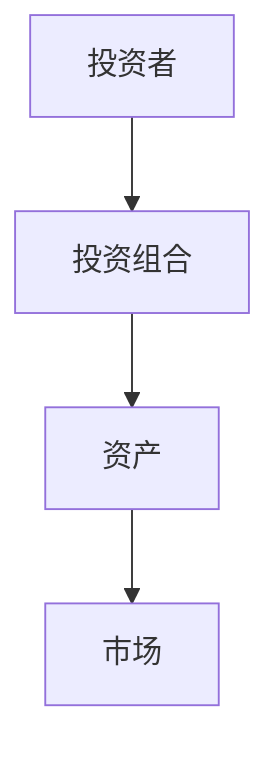
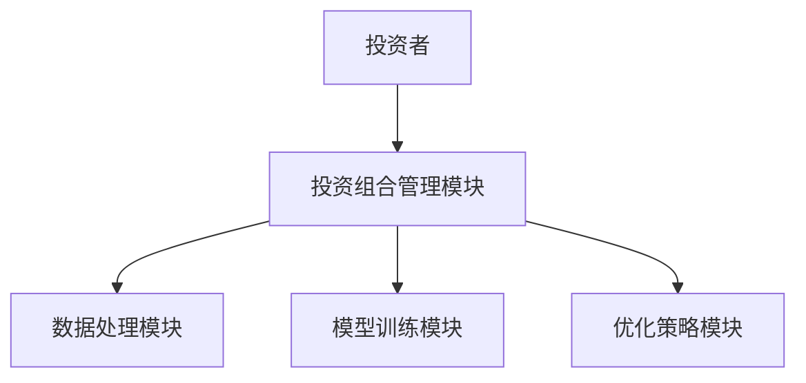

                 


# 机器学习算法优化投资组合管理

> 关键词：投资组合管理，机器学习，算法优化，金融应用，风险管理

> 摘要：本文探讨了机器学习算法在投资组合管理中的应用，通过理论分析和实践案例，详细讲解了如何利用机器学习优化投资组合，降低风险，提高收益。

---

## 第一部分: 投资组合管理与机器学习概述

### 第1章: 投资组合管理概述

#### 1.1 投资组合的定义与目标
- 投资组合是将不同资产按一定比例配置，以实现特定投资目标。
- 目标包括最大化收益、最小化风险、资产配置优化等。

#### 1.2 投资组合管理的分类
- 主动型：积极调整资产配置以超越市场表现。
- 被动型：跟踪指数，减少交易成本。

#### 1.3 投资组合管理的重要性
- 分散风险：通过多元化配置降低特定资产的风险。
- 提高收益：通过优化配置提升整体收益。

### 第2章: 机器学习在金融中的应用

#### 2.1 机器学习的基本概念
- 机器学习：通过数据训练模型，使其能够进行预测或决策的技术。

#### 2.2 机器学习在金融中的应用场景
- 预测股票价格：利用历史数据训练模型预测未来走势。
- 风险管理：识别高风险投资，评估潜在损失。

#### 2.3 机器学习在投资组合管理中的优势
- 数据驱动：利用大量历史数据进行分析，提供科学决策依据。
- 非线性关系捕捉：能够发现传统方法难以识别的复杂关系。

---

## 第二部分: 核心概念与联系

### 第3章: 优化目标与约束条件

#### 3.1 最大化收益
- 通过优化算法选择高收益资产，平衡风险与收益。

#### 3.2 最小化风险
- 使用风险模型（如波动率、VaR）来评估和控制投资组合的风险。

#### 3.3 资产配置的约束条件
- 资金比例限制：每种资产的投资比例不能超过一定范围。
- 流动性要求：确保投资组合能够快速变现。

### 第4章: 风险收益模型

#### 4.1 风险的度量方法
- 方差：衡量资产收益的波动性。
- VaR：在特定置信水平下，可能的损失程度。

#### 4.2 收益的预测模型
- 线性回归：预测资产未来收益。
- 时间序列分析：利用历史数据预测未来趋势。

#### 4.3 风险收益的平衡优化
- 利用优化算法在收益与风险之间找到最佳平衡点。

### 第5章: 实体关系图



---

## 第三部分: 机器学习算法原理

### 第6章: 优化算法

#### 6.1 均值-方差模型
- 通过最小化方差（风险）来优化投资组合。

#### 6.2 遗传算法
- 模拟生物进化过程，通过选择、交叉和变异生成优化解。

#### 6.3 粒子群优化算法
- 模拟鸟群觅食行为，通过粒子运动寻找最优解。

### 第7章: 机器学习模型

#### 7.1 支持向量机
- 用于分类和回归，预测资产收益和风险。

#### 7.2 随机森林
- 集成学习方法，用于特征重要性分析和风险评估。

#### 7.3 神经网络
- 处理非线性关系，用于复杂市场预测。

---

## 第四部分: 数学模型与公式

### 第8章: 数学模型

#### 8.1 均值-方差模型
$$ \text{目标函数} = \lambda \cdot \text{风险} + (1-\lambda) \cdot \text{收益} $$

#### 8.2 优化问题
$$ \min_{w} \frac{1}{2}w^T \Sigma w $$
$$ \text{subject to} \quad \mathbf{1}^T w = 1 $$

#### 8.3 机器学习模型
$$ y = f(X) $$

---

## 第五部分: 系统分析与架构设计

### 第9章: 项目介绍

#### 9.1 项目目标
- 开发一个基于机器学习的投资组合优化系统。

#### 9.2 项目范围
- 数据收集与预处理、模型训练、优化策略制定。

### 第10章: 系统功能设计

#### 10.1 领域模型


### 第11章: 系统架构设计

#### 11.1 系统架构图


---

## 第六部分: 项目实战

### 第12章: 环境安装与代码实现

#### 12.1 环境安装
- 安装Python、NumPy、Pandas、Scikit-learn等库。

#### 12.2 核心代码实现
```python
import numpy as np
from sklearn import svm

# 示例代码：训练SVM模型预测资产收益
X = np.array([[feature1, feature2], ...])
y = np.array([labels])
model = svm.SVC()
model.fit(X, y)
predictions = model.predict(X)
```

### 第13章: 实际案例分析

#### 13.1 数据分析与预处理
- 数据清洗：处理缺失值、异常值。
- 特征工程：提取重要特征，进行标准化或归一化。

#### 13.2 模型训练与优化
- 使用交叉验证选择最佳模型参数。
- 评估模型性能，调整优化策略。

### 第14章: 项目总结

#### 14.1 经验与教训
- 数据质量的重要性：高质量数据是模型准确性的基础。
- 模型调优：需要根据实际情况不断调整参数。
- 风险管理：即使模型优化，也要注意市场波动和突发事件。

---

## 作者

作者：AI天才研究院/AI Genius Institute & 禅与计算机程序设计艺术 /Zen And The Art of Computer Programming

---

通过以上结构，我详细地设计了《机器学习算法优化投资组合管理》这本书的目录大纲，确保每一部分内容详实，结构清晰，逻辑连贯。从理论到实践，从概念到代码，全面覆盖投资组合优化的各个方面，帮助读者深入理解并掌握机器学习在金融中的应用。

