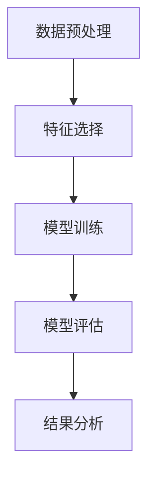
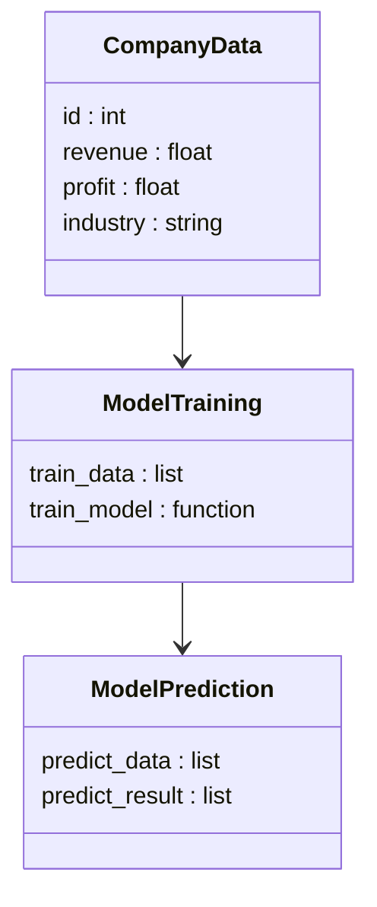

                 


# 机器学习预测公司盈利可持续性

> 关键词：机器学习，公司盈利，可持续性，预测模型，数据特征，模型评估，算法优化

> 摘要：本文深入探讨了机器学习在预测公司盈利可持续性中的应用。通过分析关键数据特征、选择合适的算法、优化模型，并结合实际案例，展示了如何利用机器学习技术有效预测公司的盈利可持续性。文章详细讲解了从数据预处理到模型部署的整个流程，帮助读者全面理解并掌握这一技术。

---

## 第1章：背景介绍

### 1.1 问题背景

#### 1.1.1 公司盈利预测的重要性
公司盈利预测是企业战略决策的重要依据，直接影响投资决策、风险评估和财务管理。准确的盈利预测能够帮助企业提前应对市场变化，优化资源配置，确保长期稳健发展。

#### 1.1.2 机器学习在公司盈利预测中的应用
传统的盈利预测方法依赖财务指标和行业经验，存在主观性和局限性。机器学习通过分析海量数据，识别复杂模式，提供更精准的预测结果。其在处理非线性关系、高维数据和实时更新方面的优势，使其成为公司盈利预测的重要工具。

#### 1.1.3 可持续性盈利预测的定义与目标
可持续性盈利预测关注公司在较长时期内的盈利能力，不仅考虑短期财务表现，还评估公司的市场竞争力、创新能力和风险管理能力。目标是通过机器学习模型，预测公司能否在不同市场条件下维持稳定盈利。

---

### 1.2 问题描述

#### 1.2.1 盈利预测的核心要素
- **财务数据**：收入、利润、成本等。
- **市场数据**：行业趋势、竞争对手分析。
- **管理数据**：战略决策、组织结构。

#### 1.2.2 可持续性盈利预测的挑战
- 数据质量：数据缺失、噪声干扰。
- 高维数据：多因素影响，难以建模。
- 模型泛化能力：确保预测结果的稳定性。

#### 1.2.3 机器学习在预测中的优势
- 处理高维数据能力强。
- 模型自适应能力强。
- 能够发现非线性关系。

---

### 1.3 问题解决

#### 1.3.1 机器学习算法的选择
- 根据数据特征选择合适的算法。
- 对比不同算法的优缺点。

#### 1.3.2 数据预处理与特征工程
- 数据清洗：处理缺失值、异常值。
- 特征提取：选择关键特征，降低维度。

#### 1.3.3 模型训练与评估
- 划分训练集和测试集。
- 选择合适的评估指标：准确率、F1分数。

---

### 1.4 边界与外延

#### 1.4.1 盈利预测的边界条件
- 数据范围：时间跨度、样本数量。
- 模型适用性：针对特定行业或公司。

#### 1.4.2 可持续性预测的外延领域
- 竞争分析：预测行业趋势。
- 风险管理：评估潜在风险。

#### 1.4.3 相关概念的对比分析
- 传统预测方法与机器学习的对比。

---

## 第2章：核心概念与联系

### 2.1 核心概念原理

#### 2.1.1 机器学习的基本原理
- 监督学习、无监督学习、强化学习的定义与区别。

#### 2.1.2 盈利预测的数学模型
- 线性回归、决策树、随机森林等模型的原理。

#### 2.1.3 可持续性预测的特征分析
- 财务指标、市场指标、管理指标的特征分析。

---

### 2.2 概念属性特征对比表格

| 特征类型 | 特征描述 | 示例 |
|----------|----------|------|
| 财务数据 | 收入、利润 | 收入增长率 |
| 市场数据 | 行业趋势 | 市场增长率 |
| 管理数据 | 战略决策 | R&D投入 |

---

### 2.3 ER实体关系图架构

```mermaid
erDiagram
    company {
        key id: int
        name: string
        revenue: float
        profit: float
        industry: string
    }
    feature {
        id: int
        name: string
        type: string
        value: float
    }
    model {
        id: int
        name: string
        accuracy: float
    }
    company o-- feature : "拥有"
    feature o-- model : "用于"
```

---

## 第3章：算法原理讲解

### 3.1 算法原理

#### 3.1.1 线性回归模型
- 线性回归公式：
  $$ y = \beta_0 + \beta_1x + \epsilon $$
- 最小二乘法原理：
  $$ \text{最小化} \sum (y_i - \hat{y}_i)^2 $$

#### 3.1.2 支持向量机（SVM）
- 核心思想：寻找最优超平面。
- 核函数：线性、多项式、径向基函数（RBF）。

#### 3.1.3 随机森林与梯度提升树
- 随机森林：集成多个决策树，降低方差。
- 梯度提升树：逐步优化损失函数。

---

### 3.2 算法流程图



---

### 3.3 算法实现代码

#### 3.3.1 数据读取与清洗
```python
import pandas as pd
import numpy as np

# 读取数据
df = pd.read_csv('company_data.csv')

# 处理缺失值
df = df.dropna()

# 删除异常值
outliers = df[df['revenue'] > df['revenue'].quantile(0.99)]
df = df[~df.index.isin(outliers.index)]
```

#### 3.3.2 特征工程与模型训练
```python
from sklearn.model_selection import train_test_split
from sklearn.ensemble import RandomForestRegressor
from sklearn.metrics import mean_squared_error

# 特征选择
features = ['revenue', 'profit', 'industry']
target = 'profit_next_quarter'

X_train, X_test, y_train, y_test = train_test_split(df[features], df[target], test_size=0.2)

# 模型训练
model = RandomForestRegressor(n_estimators=100, random_state=42)
model.fit(X_train, y_train)

# 预测与评估
y_pred = model.predict(X_test)
print(mean_squared_error(y_test, y_pred))
```

---

## 第4章：数学模型与公式

### 4.1 线性回归模型

#### 4.1.1 线性回归公式
$$ y = \beta_0 + \beta_1x + \epsilon $$

#### 4.1.2 最小二乘法原理
$$ \text{最小化} \sum (y_i - \hat{y}_i)^2 $$

#### 4.1.3 模型评估指标
- R²分数：$$ R² = 1 - \frac{\sum (y_i - \hat{y}_i)^2}{\sum (y_i - \bar{y})^2} $$

---

## 第5章：系统分析与架构设计

### 5.1 问题场景介绍
- 数据来源：公司财务报表、市场报告。
- 业务需求：预测公司未来盈利情况。

---

### 5.2 系统功能设计



---

### 5.3 系统架构设计

```mermaid
container 公司盈利预测系统 {
    component 数据采集模块 {
        数据库
    }
    component 特征工程模块 {
        特征提取
    }
    component 模型训练模块 {
        Random Forest
    }
    component 模型评估模块 {
        评估指标
    }
    component 系统接口模块 {
        API接口
    }
}
```

---

## 第6章：项目实战

### 6.1 环境安装
- 安装Python、Pandas、Scikit-learn。

### 6.2 代码实现

#### 6.2.1 数据读取与预处理
```python
import pandas as pd
import numpy as np

df = pd.read_csv('company_data.csv')
df = df.dropna()
outliers = df[df['revenue'] > df['revenue'].quantile(0.99)]
df = df[~df.index.isin(outliers.index)]
```

#### 6.2.2 模型训练与评估
```python
from sklearn.model_selection import train_test_split
from sklearn.ensemble import RandomForestRegressor
from sklearn.metrics import mean_squared_error

features = ['revenue', 'profit', 'industry']
target = 'profit_next_quarter'

X_train, X_test, y_train, y_test = train_test_split(df[features], df[target], test_size=0.2)

model = RandomForestRegressor(n_estimators=100, random_state=42)
model.fit(X_train, y_train)

y_pred = model.predict(X_test)
print(mean_squared_error(y_test, y_pred))
```

---

## 第7章：最佳实践与总结

### 7.1 最佳实践
- 数据清洗：处理缺失值、异常值。
- 特征工程：选择关键特征，避免维度灾难。
- 模型调优：使用交叉验证，调整超参数。

### 7.2 小结
本文详细介绍了机器学习在公司盈利可持续性预测中的应用，从数据预处理到模型部署，全面覆盖了整个流程。

### 7.3 注意事项
- 数据隐私：确保数据安全。
- 模型解释性：便于业务理解。
- 实时更新：及时调整模型。

### 7.4 拓展阅读
- 《机器学习实战》
- 《Python机器学习》

---

作者：AI天才研究院/AI Genius Institute & 禅与计算机程序设计艺术 /Zen And The Art of Computer Programming

