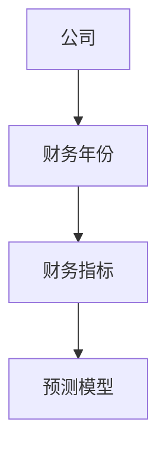
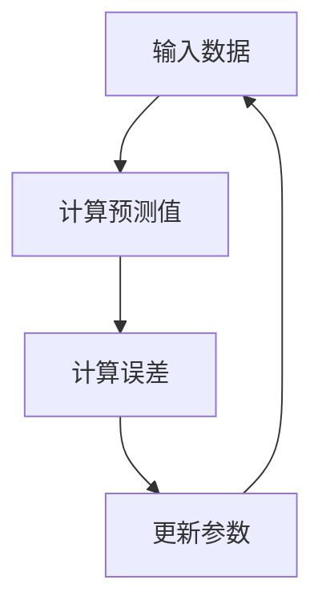
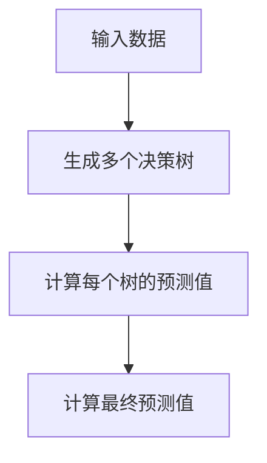
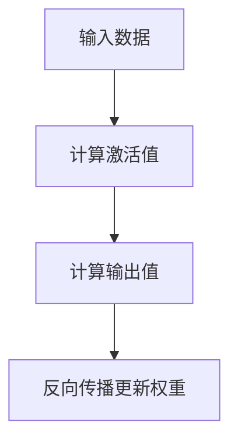
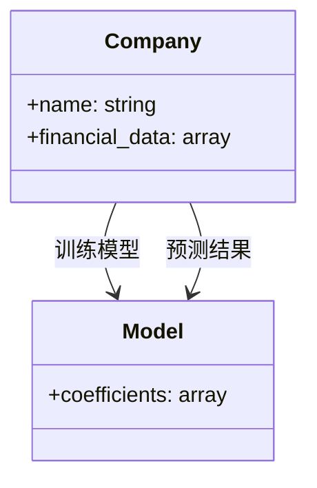
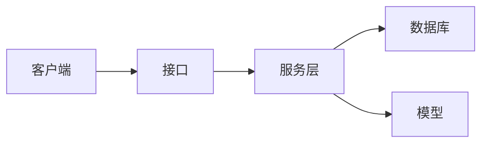

                 


# 《机器学习预测公司盈利质量变化》

> 关键词：机器学习、盈利质量、财务预测、数据预处理、算法原理、系统架构

> 摘要：本文详细探讨了如何利用机器学习技术预测公司盈利质量的变化。通过分析公司财务数据，结合机器学习算法，构建预测模型，帮助企业提前识别潜在的财务风险，优化经营策略。文章从问题背景、核心概念、算法原理到系统设计和项目实战，全面解析了机器学习在财务预测中的应用。

---

# 第一部分: 机器学习预测公司盈利质量变化的背景与核心概念

## 第1章: 问题背景与描述

### 1.1 问题背景
#### 1.1.1 公司盈利质量变化的定义
- 盈利质量：衡量公司盈利能力和可持续性的指标，包括净利润、毛利率、ROE等。
- 变化趋势：通过历史数据预测未来盈利能力的变化。

#### 1.1.2 机器学习在财务预测中的应用
- 数据驱动的预测方法：利用历史财务数据和市场数据，预测未来盈利变化。
- 算法选择：线性回归、随机森林、神经网络等。

#### 1.1.3 问题的商业价值与意义
- 提前识别风险：帮助企业及时调整经营策略。
- 优化投资决策：为投资者提供可靠的财务预测。

### 1.2 问题解决方法
#### 1.2.1 数据驱动的预测方法
- 数据收集：公司财务数据、市场数据、行业趋势等。
- 数据预处理：清洗、特征提取、标准化等。

#### 1.2.2 机器学习算法的选择
- 线性回归：适合线性关系。
- 随机森林：适合非线性关系，特征重要性分析。
- 神经网络：适合复杂关系，如时间序列预测。

#### 1.2.3 模型的评估与优化
- 评估指标：准确率、召回率、F1值。
- 超参数调优：网格搜索、随机搜索。
- 模型部署：API接口、实时监控。

---

## 第2章: 核心概念与联系

### 2.1 核心概念原理
#### 2.1.1 机器学习的基本原理
- 监督学习：输入特征，输出目标。
- 无监督学习：发现数据结构。

#### 2.1.2 盈利质量变化的指标体系
- 净利润：核心指标。
- 毛利率：产品盈利能力。
- 资产负债率：财务健康状况。

#### 2.1.3 数据特征与模型性能的关系
- 特征重要性：影响模型性能的关键因素。
- 特征工程：构建有效的特征组合。

### 2.2 核心概念对比表格
| 指标 | 定义 | 作用 | 示例 |
|------|------|------|------|
| 净利润 | 净收入减去成本和费用 | 衡量公司盈利能力 | $净利润 = 收入 - 成本 - 费用$ |
| 毛利率 | 毛利与收入的比率 | 衡量产品盈利能力 | $毛利率 = (收入 - 成本) / 收入$ |
| 资产负债率 | 负债与资产的比率 | 衡量财务风险 | $资产负债率 = 负债 / 资产$ |

### 2.3 ER实体关系图


---

# 第二部分: 机器学习算法原理与数学模型

## 第3章: 常用算法原理

### 3.1 线性回归
#### 3.1.1 线性回归的原理与公式
- 单变量线性回归：
$$ y = \beta_0 + \beta_1x + \epsilon $$

#### 3.1.2 算法流程图


### 3.2 随机森林
#### 3.2.1 随机森林的原理与公式
- 集成学习：多个决策树的预测结果取平均值。
- 模型公式：
$$ y = \frac{1}{n}\sum_{i=1}^{n} T_i(x) $$

#### 3.2.2 算法流程图


### 3.3 神经网络
#### 3.3.1 神经网络的原理与公式
- 多层感知机（MLP）：
$$ a^{(l+1)} = \sigma(w^{(l)}a^{(l)} + b^{(l)}) $$
- 损失函数：
$$ L = \frac{1}{m}\sum_{i=1}^{m}(y_i - \hat{y}_i)^2 $$

#### 3.3.2 算法流程图


---

## 第4章: 数学模型与公式

### 4.1 线性回归模型
#### 4.1.1 线性回归的损失函数
$$ L = \frac{1}{2m}\sum_{i=1}^{m}(y_i - \hat{y}_i)^2 $$

---

# 第三部分: 系统分析与架构设计

## 第4章: 系统分析与架构设计

### 4.1 项目介绍
#### 4.1.1 项目背景
- 数据来源：公司财务数据。
- 数据特征：财务指标、市场趋势、行业动态。
- 业务目标：预测公司盈利质量变化。

### 4.2 系统功能设计
#### 4.2.1 领域模型


#### 4.2.2 系统架构


#### 4.2.3 接口设计
- 输入接口：财务数据。
- 输出接口：预测结果。

#### 4.2.4 交互流程
```mermaid
graph LR
    Client --> API: 发送数据
    API --> Service: 处理请求
    Service --> Model: 训练或预测
    Model --> Service: 返回结果
    Service --> API: 返回结果
    API --> Client: 返回预测结果
```

---

## 第5章: 项目实战

### 5.1 环境安装
#### 5.1.1 安装Python
```bash
python --version
pip install --upgrade pip
```

#### 5.1.2 安装机器学习库
```bash
pip install numpy scikit-learn tensorflow
```

### 5.2 系统核心实现源代码
#### 5.2.1 数据预处理
```python
import pandas as pd
import numpy as np

data = pd.read_csv('financial_data.csv')
data = data.dropna()
data = (data - data.mean()) / data.std()
```

#### 5.2.2 线性回归模型实现
```python
from sklearn.linear_model import LinearRegression
model = LinearRegression()
model.fit(X_train, y_train)
```

#### 5.2.3 随机森林模型实现
```python
from sklearn.ensemble import RandomForestRegressor
model = RandomForestRegressor(n_estimators=100)
model.fit(X_train, y_train)
```

### 5.3 案例分析与结果解读
#### 5.3.1 数据获取与清洗
- 数据来源：公司财务数据。
- 数据清洗：处理缺失值、异常值。

#### 5.3.2 模型训练与评估
- 训练集：70%。
- 测试集：30%。
- 评估指标：准确率、F1值。

#### 5.3.3 结果可视化
```python
import matplotlib.pyplot as plt

y_pred = model.predict(X_test)
plt.scatter(y_test, y_pred)
plt.xlabel('真实值')
plt.ylabel('预测值')
plt.show()
```

---

## 第6章: 最佳实践与小结

### 6.1 最佳实践
- 数据预处理：清洗、标准化。
- 模型选择：根据数据特性选择算法。
- 模型部署：API接口、实时监控。

### 6.2 小结
- 机器学习在预测公司盈利质量变化中具有重要作用。
- 需要结合业务背景和数据特征选择合适的算法。
- 模型部署和实时监控是实际应用的关键。

### 6.3 注意事项
- 数据隐私：保护公司数据。
- 模型解释性：确保模型可解释。
- 模型更新：定期重新训练。

### 6.4 拓展阅读
- 《机器学习实战》
- 《深度学习》
- 《时间序列分析》

---

作者：AI天才研究院/AI Genius Institute & 禅与计算机程序设计艺术 /Zen And The Art of Computer Programming

